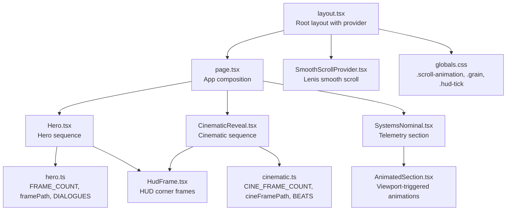
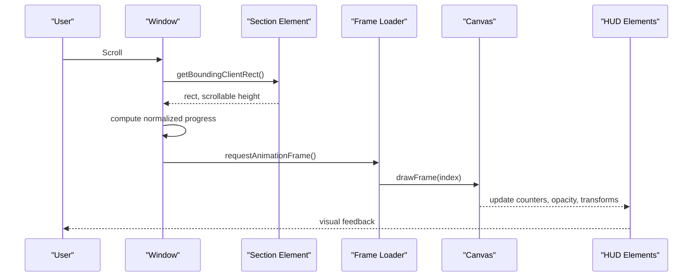
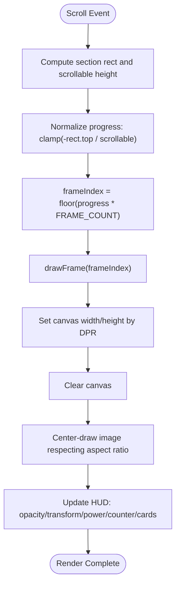
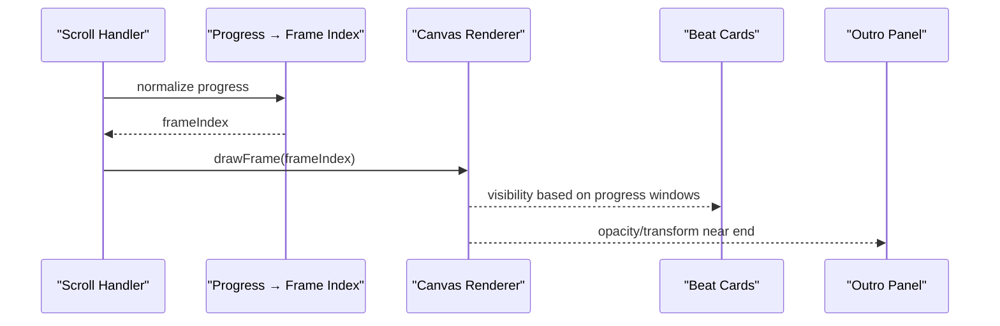
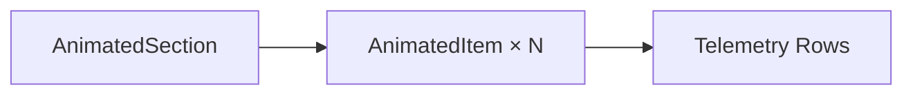
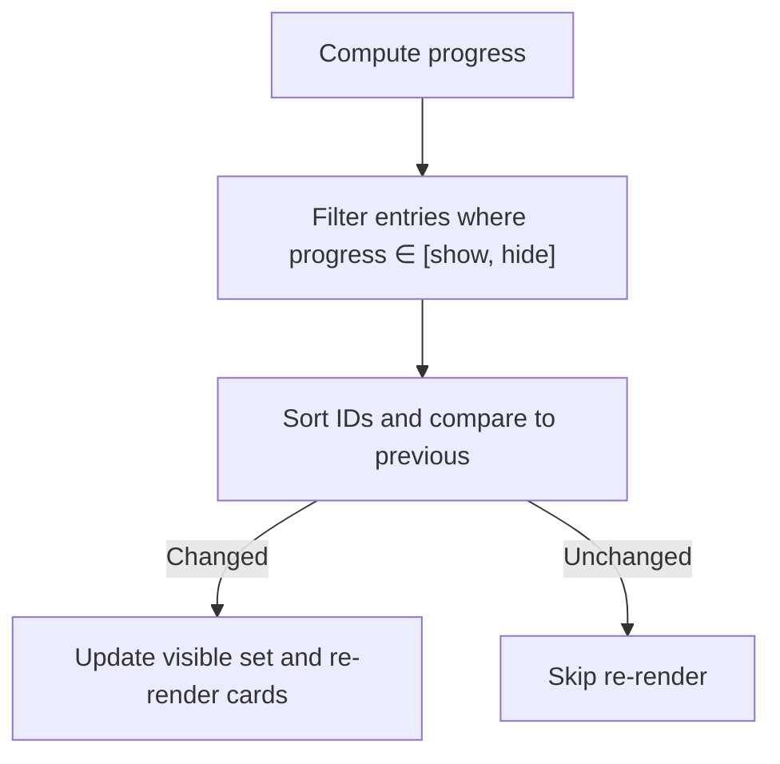
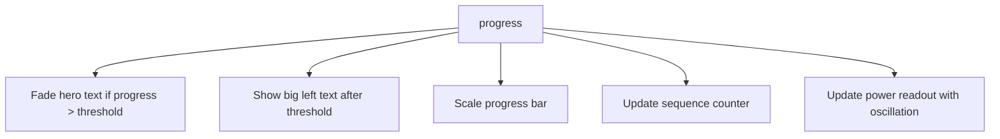
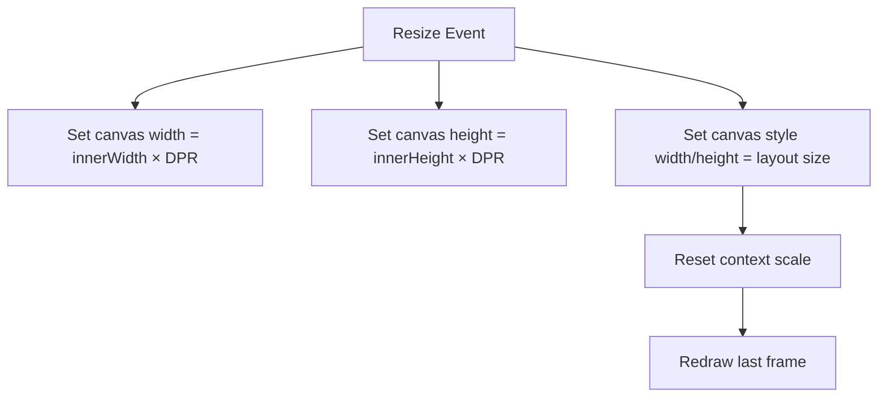
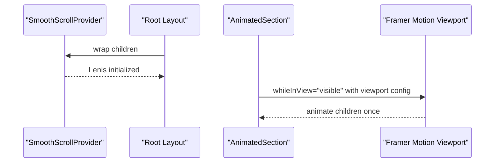
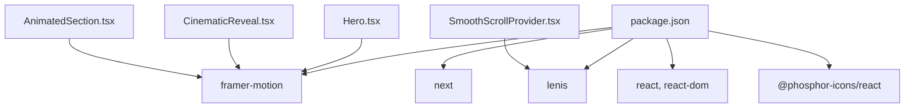

# Animation Systems

<cite>
**Referenced Files in This Document**
- [hero.ts](file://src/lib/hero.ts)
- [cinematic.ts](file://src/lib/cinematic.ts)
- [Hero.tsx](file://src/components/sections/Hero.tsx)
- [CinematicReveal.tsx](file://src/components/sections/CinematicReveal.tsx)
- [SystemsNominal.tsx](file://src/components/sections/SystemsNominal.tsx)
- [HudFrame.tsx](file://src/components/ui/HudFrame.tsx)
- [AnimatedSection.tsx](file://src/components/ui/AnimatedSection.tsx)
- [SmoothScrollProvider.tsx](file://src/components/providers/SmoothScrollProvider.tsx)
- [page.tsx](file://src/app/page.tsx)
- [layout.tsx](file://src/app/layout.tsx)
- [globals.css](file://src/app/globals.css)
- [package.json](file://package.json)
</cite>

## Table of Contents
1. [Introduction](#introduction)
2. [Project Structure](#project-structure)
3. [Core Components](#core-components)
4. [Architecture Overview](#architecture-overview)
5. [Detailed Component Analysis](#detailed-component-analysis)
6. [Dependency Analysis](#dependency-analysis)
7. [Performance Considerations](#performance-considerations)
8. [Troubleshooting Guide](#troubleshooting-guide)
9. [Conclusion](#conclusion)
10. [Appendices](#appendices)

## Introduction
This document explains the Iron Man project’s animation systems with a focus on three main sequences:
- Hero canvas animation with 169-frame sequences
- Cinematic reveal with beat markers and frame-by-frame playback
- Systems Nominal with animated telemetry data

It covers the frame loading architecture, canvas rendering techniques, device pixel ratio handling for high-DPI displays, scroll-triggered animation using Intersection Observer semantics via Framer Motion viewport detection, the dialogue/beat card system, HUD element visibility controls, and sequence counters. It also documents performance optimizations, memory management for large frame assets, animation timing calculations, and practical examples for extending the system with new sequences.

## Project Structure
The animation system is composed of:
- Libraries defining frame counts, frame paths, and metadata for dialogues/beats
- Section components implementing scroll-driven canvas animations
- UI components for HUD frames and animated content sections
- Providers enabling smooth scrolling and viewport-aware animations
- Global styles supporting high-DPI rendering and visual effects

**Diagram sources**
- [layout.tsx:23-36](file://src/app/layout.tsx#L23-L36)
- [page.tsx:7-19](file://src/app/page.tsx#L7-L19)
- [Hero.tsx:1-366](file://src/components/sections/Hero.tsx#L1-L366)
- [CinematicReveal.tsx:1-384](file://src/components/sections/CinematicReveal.tsx#L1-L384)
- [SystemsNominal.tsx:1-77](file://src/components/sections/SystemsNominal.tsx#L1-L77)
- [hero.ts:1-43](file://src/lib/hero.ts#L1-L43)
- [cinematic.ts:1-47](file://src/lib/cinematic.ts#L1-L47)
- [HudFrame.tsx:1-32](file://src/components/ui/HudFrame.tsx#L1-L32)
- [AnimatedSection.tsx:1-43](file://src/components/ui/AnimatedSection.tsx#L1-L43)
- [SmoothScrollProvider.tsx:1-37](file://src/components/providers/SmoothScrollProvider.tsx#L1-L37)
- [globals.css:48-62](file://src/app/globals.css#L48-L62)

**Section sources**
- [layout.tsx:23-36](file://src/app/layout.tsx#L23-L36)
- [page.tsx:7-19](file://src/app/page.tsx#L7-L19)
- [globals.css:48-62](file://src/app/globals.css#L48-L62)

## Core Components
- Frame metadata and paths:
  - Hero: frame count, image path builder, dialogue entries with time windows, and a fade threshold constant
  - Cinematic: frame count, image path builder, beat entries with time windows, and a fade threshold constant
- Canvas-driven sequences:
  - Hero: loads 169 frames, renders on a canvas, scales to DPR, and updates HUD/readouts based on scroll progress
  - Cinematic: loads 169 frames, renders on a canvas, scales to DPR, and updates HUD/readouts based on scroll progress
- Telemetry section:
  - Systems Nominal: static telemetry rows rendered with viewport-triggered animations
- HUD and cards:
  - HudFrame: reusable SVG corner frames
  - AnimatedSection: viewport-triggered staggered animations using Framer Motion
- Scroll orchestration:
  - SmoothScrollProvider: Lenis smooth scroll integration
  - Viewport detection: Framer Motion viewport props for AnimatedSection

**Section sources**
- [hero.ts:1-43](file://src/lib/hero.ts#L1-L43)
- [cinematic.ts:1-47](file://src/lib/cinematic.ts#L1-L47)
- [Hero.tsx:1-366](file://src/components/sections/Hero.tsx#L1-L366)
- [CinematicReveal.tsx:1-384](file://src/components/sections/CinematicReveal.tsx#L1-L384)
- [SystemsNominal.tsx:1-77](file://src/components/sections/SystemsNominal.tsx#L1-L77)
- [HudFrame.tsx:1-32](file://src/components/ui/HudFrame.tsx#L1-L32)
- [AnimatedSection.tsx:1-43](file://src/components/ui/AnimatedSection.tsx#L1-L43)
- [SmoothScrollProvider.tsx:1-37](file://src/components/providers/SmoothScrollProvider.tsx#L1-L37)

## Architecture Overview
The animation pipeline combines preloaded frame assets with scroll-driven progress to render frames on a canvas and update HUD/readouts. The sequences share a common pattern:
- Preload N frames
- On scroll, compute normalized progress over the section
- Map progress to a frame index
- Draw the frame to canvas with DPR-correct sizing
- Update HUD elements and cards based on progress windows

**Diagram sources**
- [Hero.tsx:120-182](file://src/components/sections/Hero.tsx#L120-L182)
- [CinematicReveal.tsx:119-186](file://src/components/sections/CinematicReveal.tsx#L119-L186)
- [globals.css:48-62](file://src/app/globals.css#L48-L62)

## Detailed Component Analysis

### Hero Canvas Animation
- Frame loading: 169 frames loaded sequentially with onload/onerror callbacks; progress tracked and completion flag set when all frames are ready
- Canvas rendering: DPR scaling ensures crisp rendering on high-DPI screens; images are centered within canvas respecting aspect ratios
- Scroll-driven playback: scroll progress mapped to frame index; throttled via requestAnimationFrame and a “ticking” guard
- HUD/readouts:
  - Hero text fades out as progress increases beyond a threshold
  - Big left text fades in after a progress threshold
  - Progress bar reflects normalized scroll progress
  - Power readout shows a live-like fluctuating value derived from progress
  - Dialogue cards appear/disappear based on progress windows
- Sequence counter: “SEQ 001 / 169” updates to current frame number

**Diagram sources**
- [Hero.tsx:120-182](file://src/components/sections/Hero.tsx#L120-L182)
- [Hero.tsx:61-93](file://src/components/sections/Hero.tsx#L61-L93)
- [Hero.tsx:95-106](file://src/components/sections/Hero.tsx#L95-L106)

**Section sources**
- [hero.ts:1-43](file://src/lib/hero.ts#L1-L43)
- [Hero.tsx:26-59](file://src/components/sections/Hero.tsx#L26-L59)
- [Hero.tsx:61-118](file://src/components/sections/Hero.tsx#L61-L118)
- [Hero.tsx:120-182](file://src/components/sections/Hero.tsx#L120-L182)

### Cinematic Reveal
- Frame loading: identical pattern to Hero with 169 frames
- Canvas rendering: DPR scaling and aspect-ratio-preserving centering
- Scroll-driven playback: progress-to-frame mapping identical to Hero
- HUD/readouts:
  - Two headings fade in/out at specific progress thresholds
  - Outro panel fades in near the end
  - Progress bar reflects normalized scroll progress
  - Sequence counter shows “SEQ XXX / 169”
  - Beat cards appear/disappear based on progress windows
- Sequence counter: displays current frame number padded to three digits

**Diagram sources**
- [CinematicReveal.tsx:119-186](file://src/components/sections/CinematicReveal.tsx#L119-L186)
- [CinematicReveal.tsx:62-94](file://src/components/sections/CinematicReveal.tsx#L62-L94)

**Section sources**
- [cinematic.ts:1-47](file://src/lib/cinematic.ts#L1-L47)
- [CinematicReveal.tsx:27-60](file://src/components/sections/CinematicReveal.tsx#L27-L60)
- [CinematicReveal.tsx:62-117](file://src/components/sections/CinematicReveal.tsx#L62-L117)
- [CinematicReveal.tsx:119-186](file://src/components/sections/CinematicReveal.tsx#L119-L186)

### Systems Nominal Telemetry
- Static telemetry rows rendered with viewport-triggered animations using Framer Motion
- AnimatedSection and AnimatedItem define staggered entrance animations
- No canvas rendering; focus is on content reveal and typography

**Diagram sources**
- [SystemsNominal.tsx:54-72](file://src/components/sections/SystemsNominal.tsx#L54-L72)
- [AnimatedSection.tsx:22-42](file://src/components/ui/AnimatedSection.tsx#L22-L42)

**Section sources**
- [SystemsNominal.tsx:14-77](file://src/components/sections/SystemsNominal.tsx#L14-L77)
- [AnimatedSection.tsx:1-43](file://src/components/ui/AnimatedSection.tsx#L1-L43)

### Dialogue Card System and Beat Cards
- Dialogues/Beats are defined as arrays of entries with show/hide progress windows
- During scroll, a set of currently visible IDs is computed and compared to previous to avoid unnecessary re-renders
- Cards are positioned absolutely and toggled with CSS transitions

**Diagram sources**
- [Hero.tsx:167-176](file://src/components/sections/Hero.tsx#L167-L176)
- [CinematicReveal.tsx:171-179](file://src/components/sections/CinematicReveal.tsx#L171-L179)

**Section sources**
- [hero.ts:15-40](file://src/lib/hero.ts#L15-L40)
- [cinematic.ts:16-44](file://src/lib/cinematic.ts#L16-L44)
- [Hero.tsx:288-318](file://src/components/sections/Hero.tsx#L288-L318)
- [CinematicReveal.tsx:287-321](file://src/components/sections/CinematicReveal.tsx#L287-L321)

### HUD Element Visibility Controls
- Opacity and transform transitions are applied to various HUD elements based on progress thresholds
- Progress bar scale is updated to reflect normalized scroll progress
- Sequence counters are updated to reflect current frame number

**Diagram sources**
- [Hero.tsx:146-165](file://src/components/sections/Hero.tsx#L146-L165)
- [CinematicReveal.tsx:145-169](file://src/components/sections/CinematicReveal.tsx#L145-L169)

**Section sources**
- [Hero.tsx:146-165](file://src/components/sections/Hero.tsx#L146-L165)
- [CinematicReveal.tsx:145-169](file://src/components/sections/CinematicReveal.tsx#L145-L169)

### Device Pixel Ratio Handling and Canvas Rendering
- Canvas resolution is set to width×height×devicePixelRatio; style size matches layout size
- Context scaling is reset to identity to avoid double-scaling
- Images are drawn centered within canvas respecting aspect ratios

**Diagram sources**
- [Hero.tsx:95-106](file://src/components/sections/Hero.tsx#L95-L106)
- [CinematicReveal.tsx:96-105](file://src/components/sections/CinematicReveal.tsx#L96-L105)

**Section sources**
- [Hero.tsx:95-106](file://src/components/sections/Hero.tsx#L95-L106)
- [CinematicReveal.tsx:96-105](file://src/components/sections/CinematicReveal.tsx#L96-L105)

### Scroll-Triggered Animation and Viewport Detection
- Smooth scrolling is enabled via Lenis integrated in a provider
- Sections use a tall container class to create scrollable height
- Framer Motion viewport props trigger animations once when elements come into view

**Diagram sources**
- [SmoothScrollProvider.tsx:8-33](file://src/components/providers/SmoothScrollProvider.tsx#L8-L33)
- [globals.css:48-62](file://src/app/globals.css#L48-L62)
- [AnimatedSection.tsx:22-34](file://src/components/ui/AnimatedSection.tsx#L22-L34)

**Section sources**
- [SmoothScrollProvider.tsx:1-37](file://src/components/providers/SmoothScrollProvider.tsx#L1-L37)
- [globals.css:48-62](file://src/app/globals.css#L48-L62)
- [AnimatedSection.tsx:1-43](file://src/components/ui/AnimatedSection.tsx#L1-L43)

## Dependency Analysis
External libraries and their roles:
- Framer Motion: viewport-triggered animations for content sections
- Lenis: smooth scroll engine driving scroll events
- Tailwind/Geist: typography and theme variables

**Diagram sources**
- [package.json:11-29](file://package.json#L11-L29)
- [Hero.tsx:1-366](file://src/components/sections/Hero.tsx#L1-L366)
- [CinematicReveal.tsx:1-384](file://src/components/sections/CinematicReveal.tsx#L1-L384)
- [AnimatedSection.tsx:1-43](file://src/components/ui/AnimatedSection.tsx#L1-L43)
- [SmoothScrollProvider.tsx:1-37](file://src/components/providers/SmoothScrollProvider.tsx#L1-L37)

**Section sources**
- [package.json:11-29](file://package.json#L11-L29)

## Performance Considerations
- Frame preloading: sequential Image creation with onload/onerror ensures robustness and avoids runtime errors; completion flag prevents redundant work
- Rendering efficiency:
  - Canvas redraws occur only when the frame index changes
  - requestAnimationFrame throttling prevents excessive updates
  - Clearing and drawing once per frame minimizes overhead
- High-DPI support:
  - DPR scaling prevents blurry rendering on Retina/classic high-DPI displays
  - Style width/height keep layout crisp without resampling
- Memory management:
  - Frames are stored in a ref array; consider unloading images or reusing a smaller pool if memory pressure arises
  - Cleanup handlers cancel ongoing work on unmount
- Scroll performance:
  - passive: true listener reduces scroll jank
  - will-change and transform: translateZ(0) hints improve compositing
- Content animations:
  - viewport triggers with once: true prevent repeated animations
  - staggered children reduce perceived load during initial view

[No sources needed since this section provides general guidance]

## Troubleshooting Guide
- Frames not loading:
  - Verify asset paths generated by framePath/cineFramePath match actual filenames under public/frames and public/frames2
  - Check console for network errors; ensure assets are served at runtime
- Blurry canvas on high-DPI displays:
  - Confirm DPR scaling and style width/height are both applied
  - Ensure context scaling is reset after resizing
- HUD elements not updating:
  - Confirm progress thresholds and visibility logic align with intended windows
  - Verify DOM refs are attached and elements exist
- Scroll feels choppy:
  - Ensure passive scroll listeners are active
  - Keep heavy DOM updates inside requestAnimationFrame
- Animations not triggering:
  - Check viewport margins and once behavior for AnimatedSection
  - Confirm section height class (.scroll-animation) is applied

**Section sources**
- [Hero.tsx:26-59](file://src/components/sections/Hero.tsx#L26-L59)
- [Hero.tsx:95-106](file://src/components/sections/Hero.tsx#L95-L106)
- [CinematicReveal.tsx:27-60](file://src/components/sections/CinematicReveal.tsx#L27-L60)
- [CinematicReveal.tsx:96-105](file://src/components/sections/CinematicReveal.tsx#L96-L105)
- [AnimatedSection.tsx:22-34](file://src/components/ui/AnimatedSection.tsx#L22-L34)
- [globals.css:48-62](file://src/app/globals.css#L48-L62)

## Conclusion
The Iron Man animation system leverages a consistent scroll-driven canvas pipeline with robust frame loading, DPR-aware rendering, and precise HUD/readout updates. The shared patterns across Hero and Cinematic reveal enable maintainability and extensibility. Systems Nominal complements the experience with viewport-triggered content animations. With careful attention to memory and scroll performance, the system delivers a polished, high-DPI experience.

[No sources needed since this section summarizes without analyzing specific files]

## Appendices

### Practical Examples: Extending the Animation System
- Add a new sequence with N frames:
  - Define constants and frame path in a new library similar to hero.ts or cinematic.ts
  - Create a new section component following the Hero/Cinematic pattern:
    - Preload frames and track completion
    - Implement resizeCanvas with DPR scaling
    - Compute progress and drawFrame in scroll handler
    - Update HUD/readouts and sequence counters
- Introduce a new beat/dialogue window:
  - Extend the metadata array with show/hide windows
  - Add new DOM nodes for the card and integrate visibility logic
- Optimize memory for very large frame sets:
  - Implement a small LRU cache of recently used frames
  - Unload frames outside a sliding window around the current index
- Improve smoothness:
  - Consider prefetching the next few frames after a threshold
  - Debounce resize events slightly to avoid frequent DPR recalculations

[No sources needed since this section provides general guidance]