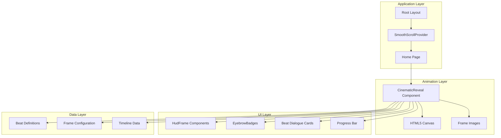
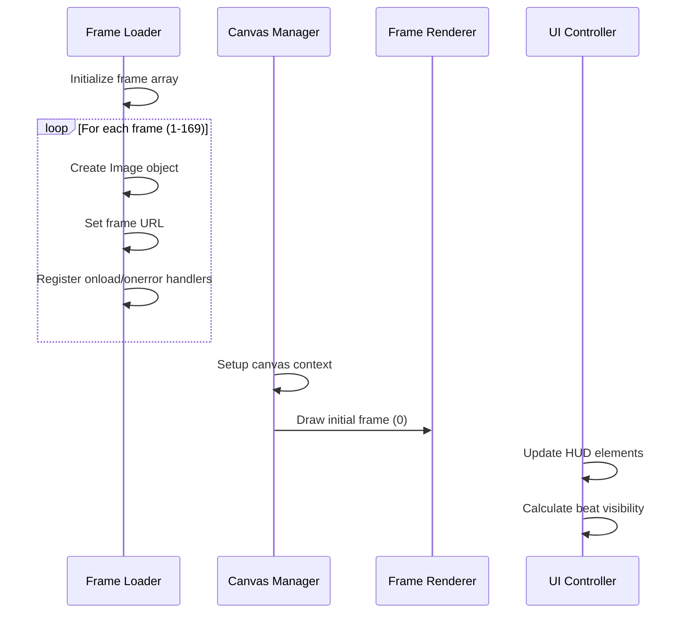
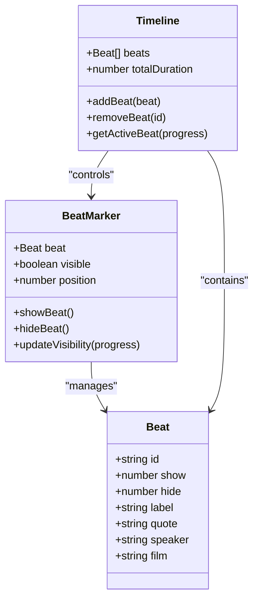
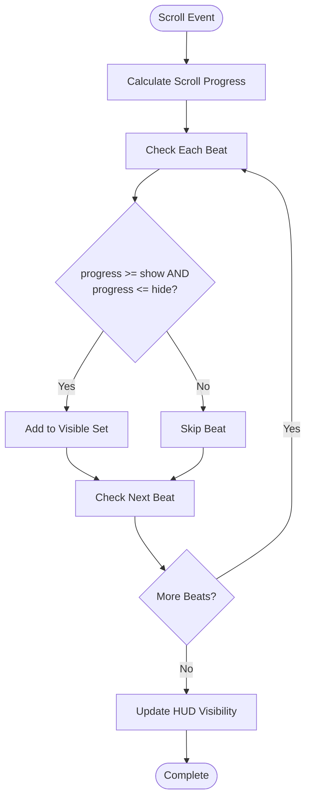
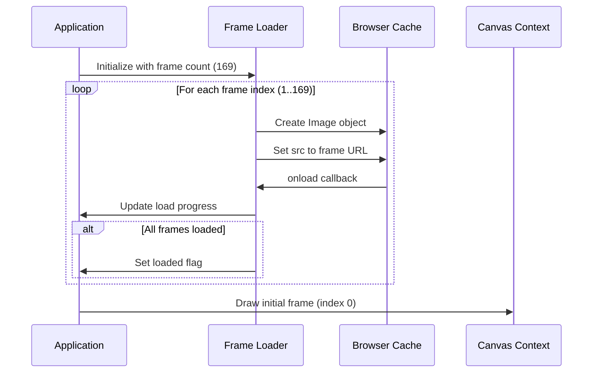
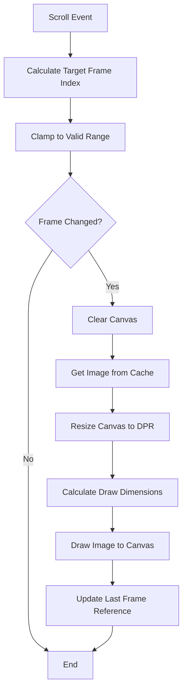
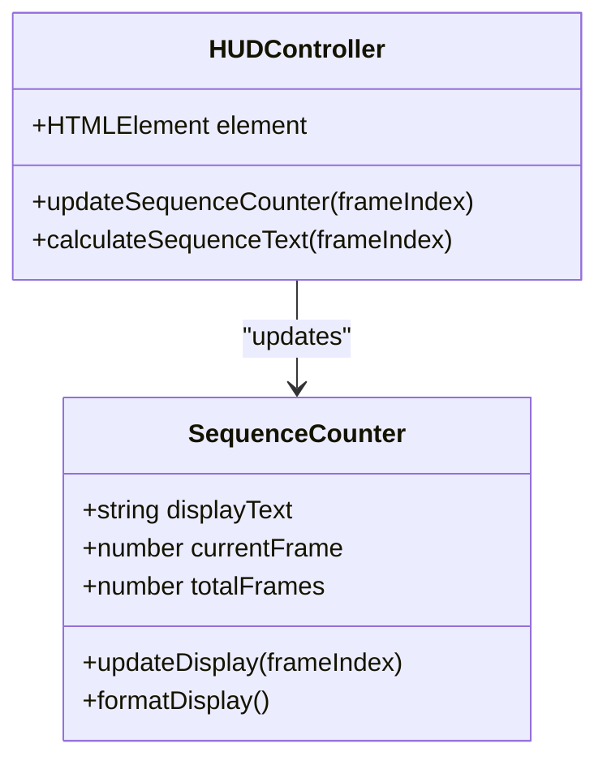
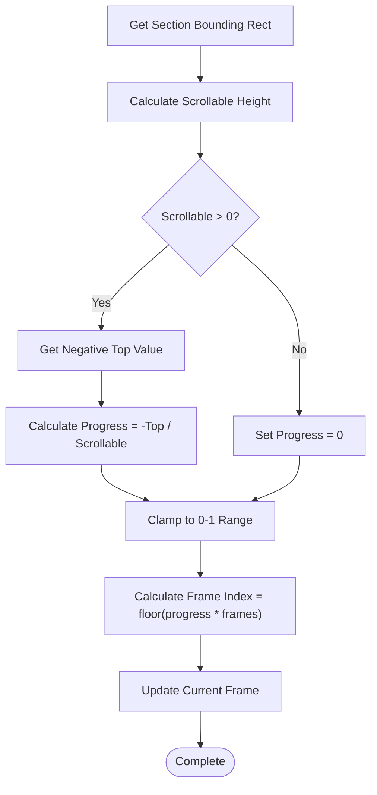
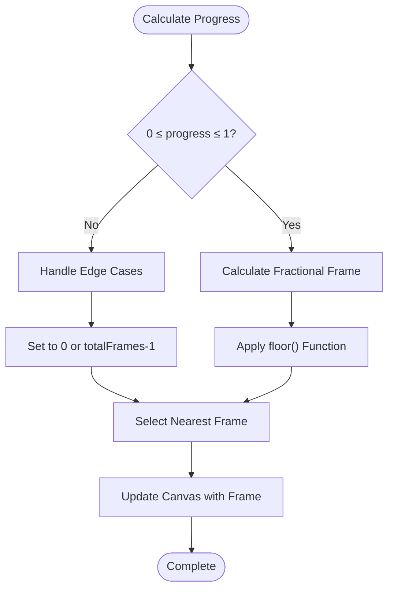
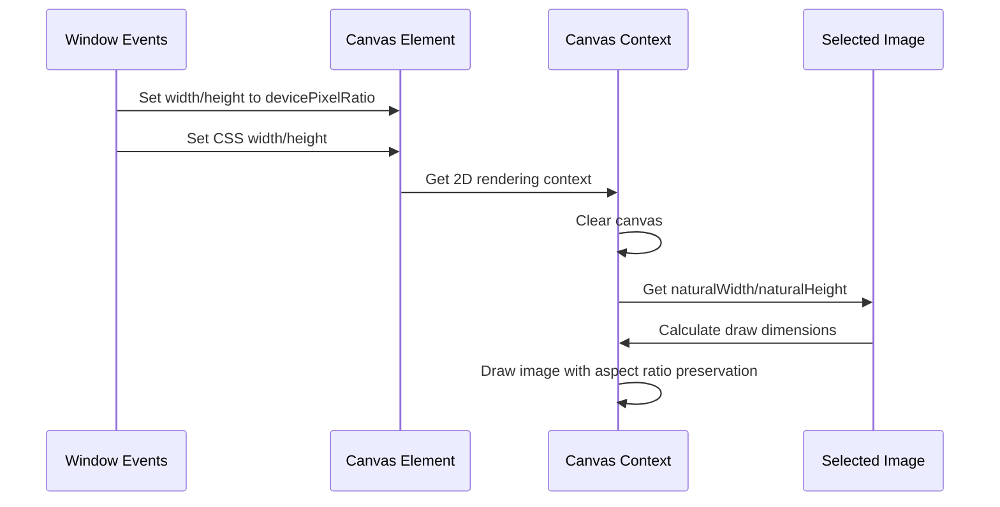

# Cinematic Reveal System

<cite>
**Referenced Files in This Document**
- [CinematicReveal.tsx](file://src/components/sections/CinematicReveal.tsx)
- [cinematic.ts](file://src/lib/cinematic.ts)
- [HudFrame.tsx](file://src/components/ui/HudFrame.tsx)
- [SmoothScrollProvider.tsx](file://src/components/providers/SmoothScrollProvider.tsx)
- [EyebrowBadge.tsx](file://src/components/ui/EyebrowBadge.tsx)
- [layout.tsx](file://src/app/layout.tsx)
- [page.tsx](file://src/app/page.tsx)
- [globals.css](file://src/app/globals.css)
- [package.json](file://package.json)
</cite>

## Table of Contents
1. [Introduction](#introduction)
2. [System Architecture](#system-architecture)
3. [Core Components](#core-components)
4. [Beat Marker System](#beat-marker-system)
5. [Frame Sequence Management](#frame-sequence-management)
6. [HUD Element Visibility Controls](#hud-element-visibility-controls)
7. [Scroll-Triggered Animation Mechanics](#scroll-triggered-animation-mechanics)
8. [Progress Calculation Algorithms](#progress-calculation-algorithms)
9. [Frame Rendering Pipeline](#frame-rendering-pipeline)
10. [Adding New Beat Segments](#adding-new-beat-segments)
11. [Customizing HUD Elements](#customizing-hud-elements)
12. [Additional Animated Telemetry Displays](#additional-animated-telemetry-displays)
13. [Performance Considerations](#performance-considerations)
14. [Troubleshooting Guide](#troubleshooting-guide)
15. [Conclusion](#conclusion)

## Introduction

The Cinematic Reveal system is a sophisticated scroll-driven animation component that creates an immersive storytelling experience through frame-by-frame playback synchronized with beat markers. This system transforms a static image sequence into a dynamic narrative, guiding users through a carefully crafted timeline of visual moments while providing contextual information through dialogue cards and telemetry displays.

The system operates on a three-beat animation architecture that segments the animation timeline into distinct phases, each representing a significant moment in the Iron Man saga. Users can experience the complete 169-frame sequence through smooth scrolling, with precise control over frame progression and visual element visibility.

## System Architecture

The Cinematic Reveal system follows a modular architecture with clear separation of concerns:



**Diagram sources**
- [layout.tsx:23-36](file://src/app/layout.tsx#L23-L36)
- [page.tsx:7-19](file://src/app/page.tsx#L7-L19)
- [CinematicReveal.tsx:8-383](file://src/components/sections/CinematicReveal.tsx#L8-L383)

The architecture consists of five primary layers:

1. **Application Layer**: Provides the foundation with smooth scrolling capabilities and global styling
2. **Animation Layer**: Handles frame loading, rendering, and scroll synchronization
3. **UI Layer**: Manages HUD elements, badges, dialogue cards, and progress indicators
4. **Data Layer**: Contains beat definitions, frame configurations, and timeline data
5. **Integration Layer**: Coordinates all components through React hooks and event listeners

**Section sources**
- [layout.tsx:23-36](file://src/app/layout.tsx#L23-L36)
- [page.tsx:7-19](file://src/app/page.tsx#L7-L19)
- [SmoothScrollProvider.tsx:8-36](file://src/components/providers/SmoothScrollProvider.tsx#L8-L36)

## Core Components

### CinematicReveal Component

The [`CinematicReveal`:8-383](file://src/components/sections/CinematicReveal.tsx#L8-L383) component serves as the central orchestrator of the entire system. It manages:

- **Frame Loading and Caching**: Preloads all 169 frames with progress tracking
- **Canvas Rendering**: Handles responsive canvas sizing and frame drawing
- **Scroll Synchronization**: Calculates frame progression based on scroll position
- **HUD Coordination**: Controls visibility and animations of all UI elements
- **Beat Marker Management**: Tracks which dialogue cards should be visible

### Frame Management System

The frame management system implements a sophisticated loading and caching mechanism:



**Diagram sources**
- [CinematicReveal.tsx:27-60](file://src/components/sections/CinematicReveal.tsx#L27-L60)
- [CinematicReveal.tsx:62-94](file://src/components/sections/CinematicReveal.tsx#L62-L94)

**Section sources**
- [CinematicReveal.tsx:8-383](file://src/components/sections/CinematicReveal.tsx#L8-L383)

### HUD Component System

The HUD system consists of four [`HudFrame`:7-31](file://src/components/ui/HudFrame.tsx#L7-L31) components positioned at each screen corner, providing visual framing elements that enhance the cinematic experience.

**Section sources**
- [HudFrame.tsx:1-32](file://src/components/ui/HudFrame.tsx#L1-L32)

## Beat Marker System

The beat marker system provides a three-beat architecture that segments the animation timeline into meaningful narrative segments:



**Diagram sources**
- [cinematic.ts:6-14](file://src/lib/cinematic.ts#L6-L14)
- [cinematic.ts:16-44](file://src/lib/cinematic.ts#L16-L44)

### Beat Configuration

Each beat defines a specific time window during which dialogue cards should be visible:

| Beat ID | Show Position | Hide Position | Label | Quote |
|---------|---------------|---------------|-------|--------|
| b1 | 0.1 | 0.3 | 01 — Ignition | "Yeah, I can fly." |
| b2 | 0.35 | 0.55 | 02 — Sync | "The suit and I are one." |
| b3 | 0.6 | 0.8 | 03 — Aftermath | "It's not about how much we lost..." |

### Beat Visibility Logic

The system calculates beat visibility using a simple but effective algorithm:



**Diagram sources**
- [CinematicReveal.tsx:171-180](file://src/components/sections/CinematicReveal.tsx#L171-L180)

**Section sources**
- [cinematic.ts:16-44](file://src/lib/cinematic.ts#L16-L44)
- [CinematicReveal.tsx:171-180](file://src/components/sections/CinematicReveal.tsx#L171-L180)

## Frame Sequence Management

The frame sequence management system handles the complete lifecycle of frame loading, caching, and rendering:

### Frame Loading Pipeline



**Diagram sources**
- [CinematicReveal.tsx:27-60](file://src/components/sections/CinematicReveal.tsx#L27-L60)
- [CinematicReveal.tsx:113-117](file://src/components/sections/CinematicReveal.tsx#L113-L117)

### Frame Rendering Engine

The rendering engine implements intelligent frame selection and canvas management:



**Diagram sources**
- [CinematicReveal.tsx:120-143](file://src/components/sections/CinematicReveal.tsx#L120-L143)
- [CinematicReveal.tsx:62-94](file://src/components/sections/CinematicReveal.tsx#L62-L94)

**Section sources**
- [CinematicReveal.tsx:27-60](file://src/components/sections/CinematicReveal.tsx#L27-L60)
- [CinematicReveal.tsx:62-94](file://src/components/sections/CinematicReveal.tsx#L62-L94)
- [CinematicReveal.tsx:113-143](file://src/components/sections/CinematicReveal.tsx#L113-L143)

## HUD Element Visibility Controls

The HUD system provides comprehensive visibility controls for all interface elements, coordinated through the scroll progress:

### Sequence Counter Implementation

The sequence counter displays the current frame progression with a clean, monospace typography:



**Diagram sources**
- [CinematicReveal.tsx:165-169](file://src/components/sections/CinematicReveal.tsx#L165-L169)

### Dynamic Element Animations

The system animates various elements based on scroll progress:

| Element | Animation Type | Trigger Condition | Effect |
|---------|----------------|-------------------|---------|
| "I am Inevitable" | Opacity Fade | progress < 0.52 | Fades out as user scrolls |
| "And I am Iron Man" | Opacity Fade | progress > 0.48 | Fades in as user approaches |
| Outro Panel | Opacity + Transform | progress > 0.86 | Appears with upward movement |
| Progress Bar | Scale Transformation | progress updates | Expands to show completion |

**Section sources**
- [CinematicReveal.tsx:145-169](file://src/components/sections/CinematicReveal.tsx#L145-L169)

## Scroll-Triggered Animation Mechanics

The scroll-triggered animation system implements a sophisticated progress calculation mechanism that synchronizes frame playback with user interaction:

### Scroll Progress Calculation



**Diagram sources**
- [CinematicReveal.tsx:129-139](file://src/components/sections/CinematicReveal.tsx#L129-L139)

### Performance Optimizations

The system implements several performance optimizations:

- **requestAnimationFrame**: Uses efficient animation frame scheduling
- **Scroll Throttling**: Prevents excessive calculations during rapid scrolling
- **Device Pixel Ratio**: Automatically adjusts canvas resolution for sharp rendering
- **Memory Management**: Efficiently manages frame image references

**Section sources**
- [CinematicReveal.tsx:120-186](file://src/components/sections/CinematicReveal.tsx#L120-L186)

## Progress Calculation Algorithms

The progress calculation algorithms form the backbone of the scroll synchronization system:

### Linear Progress Mapping

The system maps scroll position to frame indices using a linear interpolation algorithm:

```
progress = clamp(0, 1, -rect.top / (section.offsetHeight - window.innerHeight))
frameIndex = floor(progress * totalFrames)
```

### Frame Selection Logic



**Diagram sources**
- [CinematicReveal.tsx:131-139](file://src/components/sections/CinematicReveal.tsx#L131-L139)

**Section sources**
- [CinematicReveal.tsx:129-139](file://src/components/sections/CinematicReveal.tsx#L129-L139)

## Frame Rendering Pipeline

The frame rendering pipeline ensures optimal performance and visual quality:

### Canvas Management

The system implements intelligent canvas management with device pixel ratio awareness:



**Diagram sources**
- [CinematicReveal.tsx:96-105](file://src/components/sections/CinematicReveal.tsx#L96-L105)
- [CinematicReveal.tsx:62-94](file://src/components/sections/CinematicReveal.tsx#L62-L94)

### Responsive Design Implementation

The rendering system adapts to different screen sizes:

- **Desktop**: Standard aspect ratio with slight zoom enhancement
- **Mobile**: 1.3x scaling factor for improved visibility
- **High DPI**: Automatic device pixel ratio compensation

**Section sources**
- [CinematicReveal.tsx:96-105](file://src/components/sections/CinematicReveal.tsx#L96-L105)
- [CinematicReveal.tsx:62-94](file://src/components/sections/CinematicReveal.tsx#L62-L94)

## Adding New Beat Segments

To add new beat segments to the system, follow these steps:

### Step 1: Define Beat Configuration

Add a new beat object to the [`BEATS`:16-44](file://src/lib/cinematic.ts#L16-L44) array in [`cinematic.ts`](file://src/lib/cinematic.ts):

```typescript
// Example: Adding a new beat segment
{
  id: "b4",
  show: 0.85,
  hide: 0.95,
  label: "04 — Evolution",
  quote: "Every failure teaches us something valuable.",
  speaker: "Tony Stark",
  film: "IRON MAN 3 — 2013",
}
```

### Step 2: Position Beat Cards

Update the beat card positioning logic in [`CinematicReveal`:287-320](file://src/components/sections/CinematicReveal.tsx#L287-L320) to accommodate the new segment:

```typescript
// For more than 3 beats, adjust the positioning logic
const position =
  i === 0
    ? "top-[24%] left-6 md:left-12"
    : i === 1
    ? "top-1/2 -translate-y-1/2 left-6 md:left-12"
    : i === 2
    ? "bottom-24 left-6 md:bottom-28 md:left-12"
    : "bottom-24 left-6 md:bottom-28 md:left-12"; // Additional positioning
```

### Step 3: Test Timing

Verify the new beat timing by testing scroll positions:

- **Show Position**: When the beat should appear (0.0 to 1.0 scale)
- **Hide Position**: When the beat should disappear
- **Overlap Testing**: Ensure beats don't overlap unintentionally

**Section sources**
- [cinematic.ts:16-44](file://src/lib/cinematic.ts#L16-L44)
- [CinematicReveal.tsx:287-320](file://src/components/sections/CinematicReveal.tsx#L287-L320)

## Customizing HUD Elements

The HUD system offers extensive customization options:

### Customizing HUD Frames

Modify the [`HudFrame`:7-31](file://src/components/ui/HudFrame.tsx#L7-L31) component to change visual appearance:

```typescript
// Change corner positioning
const paths: Record<Props["corner"], string> = {
  tl: `M 2 ${size} L 2 2 L ${size} 2`, // Top-left corner
  tr: `M ${size - 20} 2 L ${size} 2 L ${size} ${size}`, // Top-right corner
  bl: `M 2 ${size - 20} L 2 ${size} L ${size} ${size}`, // Bottom-left corner
  br: `M ${size - 20} ${size} L ${size} ${size} L ${size} ${size - 20}`, // Bottom-right corner
};
```

### Customizing Badge Styles

Update the [`EyebrowBadge`:3-16](file://src/components/ui/EyebrowBadge.tsx#L3-L16) component for different visual treatments:

```css
/* Example: Change badge appearance */
.inline-flex.items-center.gap-2.rounded-full.border.border-white/12.bg-white/[0.04].px-3.py-1.5.font-mono.text-[10px].font-medium.uppercase.tracking-[0.22em].text-accent.backdrop-blur-md
```

**Section sources**
- [HudFrame.tsx:7-31](file://src/components/ui/HudFrame.tsx#L7-L31)
- [EyebrowBadge.tsx:3-16](file://src/components/ui/EyebrowBadge.tsx#L3-L16)

## Additional Animated Telemetry Displays

The system can accommodate additional animated telemetry displays:

### Creating Custom Telemetry Components

```typescript
// Example: Temperature gauge component
function TemperatureGauge({ value }: { value: number }) {
  return (
    <div className="flex items-center gap-2">
      <span className="font-mono text-[10px] uppercase tracking-[0.28em] text-zinc-400">
        TEMP
      </span>
      <div className="h-px w-20 bg-white/10">
        <div 
          className="h-full bg-accent transition-all duration-200"
          style={{ width: `${value}%` }}
        />
      </div>
    </div>
  );
}
```

### Integrating with Scroll Progress

Connect telemetry displays to scroll progress:

```typescript
// Example: Heart rate monitor synchronized with scroll
const heartRate = Math.min(180, 60 + progress * 120);
```

### Animation Timing Control

Control animation timing using the existing progress system:

```typescript
// Example: Pulse animation synchronized with scroll
const pulseIntensity = 0.5 + 0.5 * Math.sin(progress * Math.PI * 2);
```

**Section sources**
- [CinematicReveal.tsx:145-169](file://src/components/sections/CinematicReveal.tsx#L145-L169)

## Performance Considerations

The Cinematic Reveal system implements several performance optimizations:

### Memory Management

- **Frame Caching**: All 169 frames are cached in memory for instant access
- **Canvas Reuse**: Single canvas element reused for all frame rendering
- **Image Reference Management**: Efficient image object management prevents memory leaks

### Rendering Optimization

- **Device Pixel Ratio**: Automatic scaling for crisp rendering on high-DPI displays
- **Aspect Ratio Preservation**: Intelligent scaling maintains visual quality
- **Canvas Clearing**: Efficient canvas clearing before each frame draw

### Scroll Performance

- **requestAnimationFrame**: Uses browser-native animation frame scheduling
- **Scroll Throttling**: Prevents excessive calculations during rapid scrolling
- **Passive Event Listeners**: Optimized scroll event handling

**Section sources**
- [CinematicReveal.tsx:96-105](file://src/components/sections/CinematicReveal.tsx#L96-L105)
- [CinematicReveal.tsx:120-126](file://src/components/sections/CinematicReveal.tsx#L120-L126)

## Troubleshooting Guide

### Common Issues and Solutions

**Issue**: Frames not loading properly
- **Cause**: Network connectivity or incorrect frame paths
- **Solution**: Verify frame URLs and network connectivity

**Issue**: Canvas not rendering correctly
- **Cause**: Device pixel ratio mismatch or canvas sizing issues
- **Solution**: Check canvas resize logic and device pixel ratio handling

**Issue**: Beat cards not appearing
- **Cause**: Incorrect beat timing configuration
- **Solution**: Verify show/hide timing values and progress calculations

**Issue**: Performance degradation during scrolling
- **Cause**: Excessive re-renders or memory leaks
- **Solution**: Check scroll throttling and memory management

### Debugging Tools

Use browser developer tools to debug the system:

- **Network Tab**: Monitor frame loading progress
- **Performance Tab**: Analyze scroll performance
- **Elements Tab**: Inspect HUD element positioning
- **Console**: Check for runtime errors

**Section sources**
- [CinematicReveal.tsx:44-52](file://src/components/sections/CinematicReveal.tsx#L44-L52)
- [CinematicReveal.tsx:120-126](file://src/components/sections/CinematicReveal.tsx#L120-L126)

## Conclusion

The Cinematic Reveal system represents a sophisticated blend of performance optimization and artistic storytelling. Through its three-beat architecture, frame-by-frame playback, and intelligent HUD coordination, it creates an immersive experience that guides users through a carefully crafted narrative.

The system's modular design allows for easy extension and customization, while its performance optimizations ensure smooth operation across all devices. The beat marker system provides precise control over dialogue presentation, and the frame rendering pipeline delivers crisp, responsive visuals.

Key strengths of the system include:
- **Seamless Integration**: Clean separation of concerns with clear component boundaries
- **Performance Focus**: Multiple optimization layers prevent performance bottlenecks
- **Extensibility**: Well-structured architecture supports easy feature additions
- **Visual Quality**: High-quality rendering with responsive design considerations

Future enhancements could include dynamic beat adjustment, additional telemetry displays, and expanded frame sequences while maintaining the system's performance characteristics.