# Hero Canvas Animation

<cite>
**Referenced Files in This Document**
- [Hero.tsx](file://src/components/sections/Hero.tsx)
- [hero.ts](file://src/lib/hero.ts)
- [HudFrame.tsx](file://src/components/ui/HudFrame.tsx)
- [SmoothScrollProvider.tsx](file://src/components/providers/SmoothScrollProvider.tsx)
- [page.tsx](file://src/app/page.tsx)
- [layout.tsx](file://src/app/layout.tsx)
- [globals.css](file://src/app/globals.css)
- [package.json](file://package.json)
- [CinematicReveal.tsx](file://src/components/sections/CinematicReveal.tsx)
- [cinematic.ts](file://src/lib/cinematic.ts)
</cite>

## Table of Contents
1. [Introduction](#introduction)
2. [Project Structure](#project-structure)
3. [Core Components](#core-components)
4. [Architecture Overview](#architecture-overview)
5. [Detailed Component Analysis](#detailed-component-analysis)
6. [Dependency Analysis](#dependency-analysis)
7. [Performance Considerations](#performance-considerations)
8. [Troubleshooting Guide](#troubleshooting-guide)
9. [Conclusion](#conclusion)
10. [Appendices](#appendices)

## Introduction
This document explains the Hero canvas animation system that powers a 169-frame scroll-driven sequence. It covers frame loading with progressive indicators, device pixel ratio handling for high-DPI displays, canvas resizing strategies, scroll-triggered animation using requestAnimationFrame, progress calculation, and frame index mapping. It also documents the dialogue card system with timing-based visibility controls, text fade effects using opacity and transform animations, and HUD element integration. Finally, it describes the power readout animation, sequence counter display, and loading overlay implementation, with practical examples for extending assets, modifying timing, and customizing dialogue sequences.

## Project Structure
The Hero animation is implemented as a React client component with supporting libraries and providers. The key pieces are:
- Hero.tsx: Implements the canvas animation, frame loading, scroll handling, and UI overlays.
- hero.ts: Defines constants and dialogue data for the Hero sequence.
- HudFrame.tsx: Renders HUD corner frames used around the viewport.
- SmoothScrollProvider.tsx: Integrates a smooth scroll engine to enhance scroll performance.
- Globals and layout: Provide global styles, fonts, and the scroll container height.
- CinematicReveal.tsx and cinematic.ts: Provide a second canvas animation with a different asset set and timing for comparison.

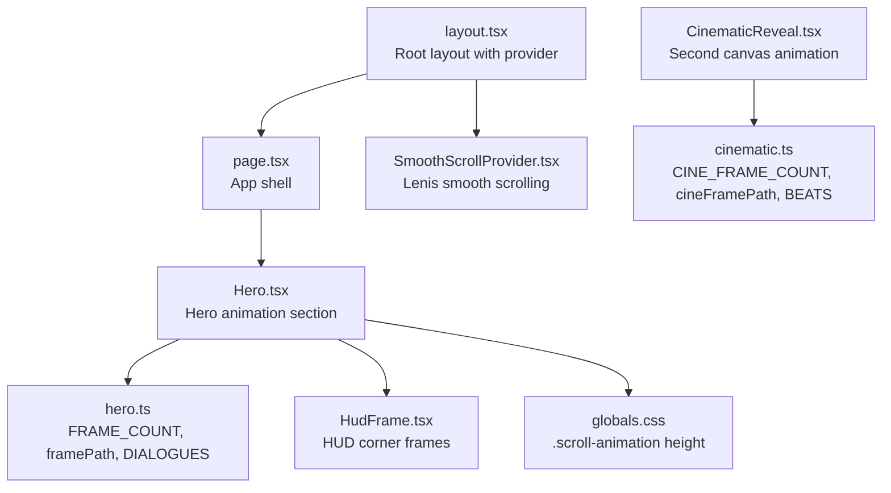

**Diagram sources**
- [layout.tsx:1-37](file://src/app/layout.tsx#L1-L37)
- [page.tsx:1-20](file://src/app/page.tsx#L1-L20)
- [Hero.tsx:1-366](file://src/components/sections/Hero.tsx#L1-L366)
- [hero.ts:1-43](file://src/lib/hero.ts#L1-L43)
- [HudFrame.tsx:1-32](file://src/components/ui/HudFrame.tsx#L1-L32)
- [SmoothScrollProvider.tsx:1-37](file://src/components/providers/SmoothScrollProvider.tsx#L1-L37)
- [globals.css:48-62](file://src/app/globals.css#L48-L62)
- [CinematicReveal.tsx:1-384](file://src/components/sections/CinematicReveal.tsx#L1-L384)
- [cinematic.ts:1-47](file://src/lib/cinematic.ts#L1-L47)

**Section sources**
- [layout.tsx:1-37](file://src/app/layout.tsx#L1-L37)
- [page.tsx:1-20](file://src/app/page.tsx#L1-L20)
- [Hero.tsx:1-366](file://src/components/sections/Hero.tsx#L1-L366)
- [globals.css:48-62](file://src/app/globals.css#L48-L62)

## Core Components
- Frame loader and canvas renderer: Loads 169 frames progressively and draws the current frame onto a canvas sized to the viewport.
- Scroll-triggered animation: Uses requestAnimationFrame to compute progress from scroll position and map it to a frame index.
- Dialogue cards: Visibility controlled by progress thresholds; fade-in/fade-out via opacity and translateY transforms.
- HUD elements: Corner HUD frames, power readout, sequence counter, and progress bar.
- Loading overlay: Shows a progress bar while frames are being fetched.
- High-DPI support: Canvas resolution scales with devicePixelRatio; drawing area remains fixed to CSS pixels.

**Section sources**
- [Hero.tsx:26-59](file://src/components/sections/Hero.tsx#L26-L59)
- [Hero.tsx:61-106](file://src/components/sections/Hero.tsx#L61-L106)
- [Hero.tsx:120-182](file://src/components/sections/Hero.tsx#L120-L182)
- [Hero.tsx:288-361](file://src/components/sections/Hero.tsx#L288-L361)
- [hero.ts:1-43](file://src/lib/hero.ts#L1-L43)

## Architecture Overview
The Hero animation relies on a sticky, full-viewport section that is taller than the screen to enable long-form scroll. The scroll position drives progress, which maps to a frame index. The canvas is redrawn each frame with proper scaling for high-DPI displays.

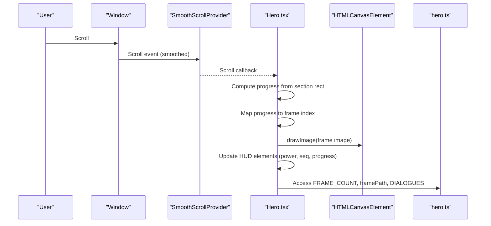

**Diagram sources**
- [SmoothScrollProvider.tsx:11-32](file://src/components/providers/SmoothScrollProvider.tsx#L11-L32)
- [Hero.tsx:120-182](file://src/components/sections/Hero.tsx#L120-L182)
- [Hero.tsx:61-106](file://src/components/sections/Hero.tsx#L61-L106)
- [hero.ts:1-43](file://src/lib/hero.ts#L1-L43)

## Detailed Component Analysis

### Frame Loading and Progressive Indicators
- Loads 169 frames in sequence using Image objects.
- Tracks load progress and flips the loaded flag when all frames are ready.
- Progress updates the width of a horizontal progress bar during the loading overlay.

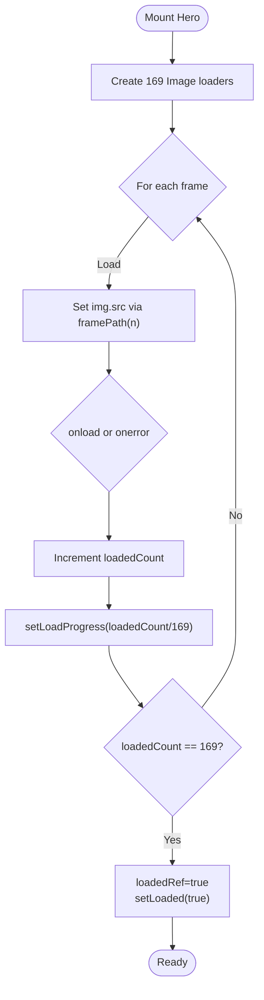

**Diagram sources**
- [Hero.tsx:26-59](file://src/components/sections/Hero.tsx#L26-L59)
- [hero.ts:3-4](file://src/lib/hero.ts#L3-L4)

**Section sources**
- [Hero.tsx:26-59](file://src/components/sections/Hero.tsx#L26-L59)
- [hero.ts:1-43](file://src/lib/hero.ts#L1-L43)

### Canvas Resizing and High-DPI Handling
- Sets canvas width/height to CSS pixel width/height multiplied by devicePixelRatio.
- Keeps CSS width/height equal to the viewport size for crisp rendering on high-DPI screens.
- Redraws the current frame after resize to reflect the new resolution.

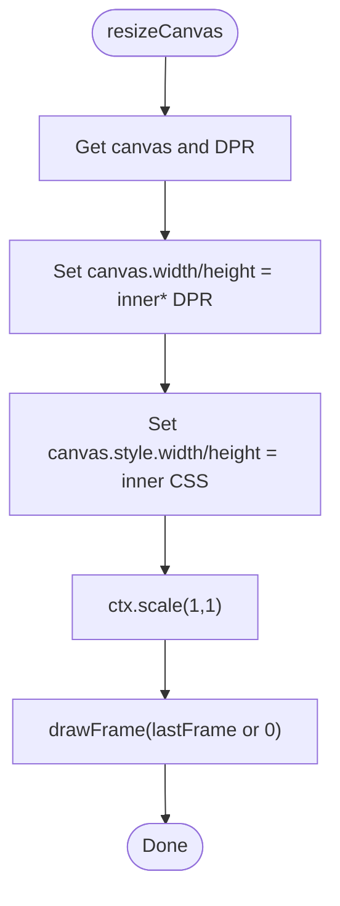

**Diagram sources**
- [Hero.tsx:95-106](file://src/components/sections/Hero.tsx#L95-L106)

**Section sources**
- [Hero.tsx:95-106](file://src/components/sections/Hero.tsx#L95-L106)

### Scroll-Triggered Animation and Frame Mapping
- Computes progress from the section’s bounding rectangle and viewport height.
- Maps progress to a frame index using the total frame count.
- Debounces scroll callbacks using requestAnimationFrame to avoid layout thrashing.
- Draws the appropriate frame and updates HUD elements.

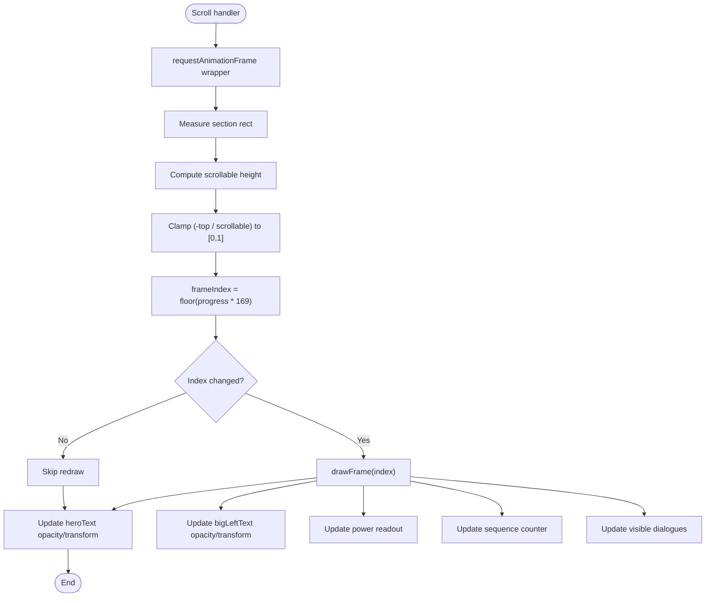

**Diagram sources**
- [Hero.tsx:120-182](file://src/components/sections/Hero.tsx#L120-L182)
- [Hero.tsx:61-93](file://src/components/sections/Hero.tsx#L61-L93)
- [hero.ts:15-40](file://src/lib/hero.ts#L15-L40)

**Section sources**
- [Hero.tsx:120-182](file://src/components/sections/Hero.tsx#L120-L182)
- [Hero.tsx:61-93](file://src/components/sections/Hero.tsx#L61-L93)
- [hero.ts:1-43](file://src/lib/hero.ts#L1-L43)

### Dialogue Card System
- Dialogue entries define show/hide progress thresholds.
- Visibility computed per frame and applied via CSS transitions.
- Cards positioned at top/middle/bottom right with responsive adjustments.

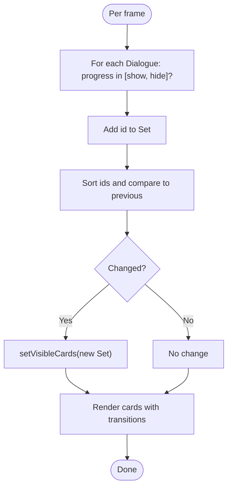

**Diagram sources**
- [Hero.tsx:167-176](file://src/components/sections/Hero.tsx#L167-L176)
- [hero.ts:6-13](file://src/lib/hero.ts#L6-L13)

**Section sources**
- [Hero.tsx:167-176](file://src/components/sections/Hero.tsx#L167-L176)
- [hero.ts:6-13](file://src/lib/hero.ts#L6-L13)

### HUD Elements and Effects
- Power readout: Sine wave centered around a baseline value with small amplitude modulation.
- Sequence counter: Shows current frame plus one out of 169.
- Progress bar: Horizontal scale representing completion fraction.
- Text fades: Hero headline and “Build with DEV” text fade using opacity and translateY transforms.

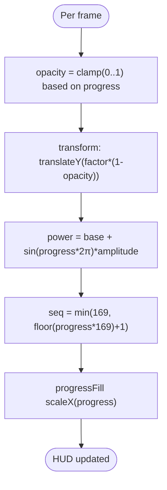

**Diagram sources**
- [Hero.tsx:146-165](file://src/components/sections/Hero.tsx#L146-L165)
- [Hero.tsx:288-318](file://src/components/sections/Hero.tsx#L288-L318)

**Section sources**
- [Hero.tsx:146-165](file://src/components/sections/Hero.tsx#L146-L165)
- [Hero.tsx:288-318](file://src/components/sections/Hero.tsx#L288-L318)

### Loading Overlay Implementation
- Shown until all frames are loaded.
- Displays a badge, progress bar, and percentage text.
- Dismissed automatically when loaded flag is true.

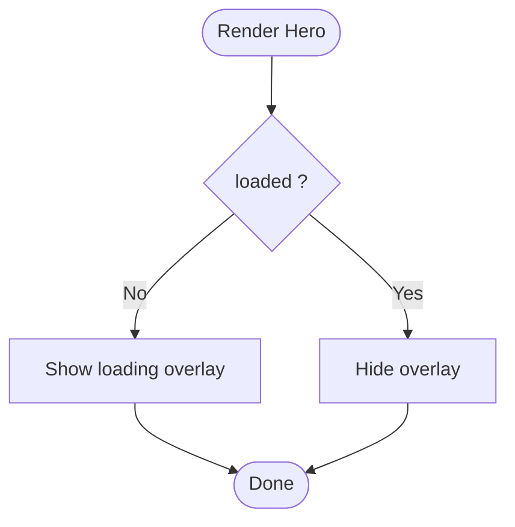

**Diagram sources**
- [Hero.tsx:348-361](file://src/components/sections/Hero.tsx#L348-L361)

**Section sources**
- [Hero.tsx:348-361](file://src/components/sections/Hero.tsx#L348-L361)

### HUD Corner Frames
- Reusable component that renders a corner frame SVG with configurable size and corner.
- Used at all four corners of the viewport for a cohesive HUD aesthetic.

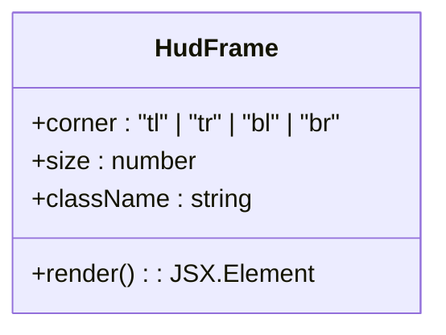

**Diagram sources**
- [HudFrame.tsx:1-32](file://src/components/ui/HudFrame.tsx#L1-L32)

**Section sources**
- [HudFrame.tsx:1-32](file://src/components/ui/HudFrame.tsx#L1-L32)

### Smooth Scrolling Integration
- The app wraps children in a provider that initializes a smoothing library and synchronizes its internal loop with requestAnimationFrame.
- This reduces jank during scroll and ensures consistent frame pacing for the Hero animation.

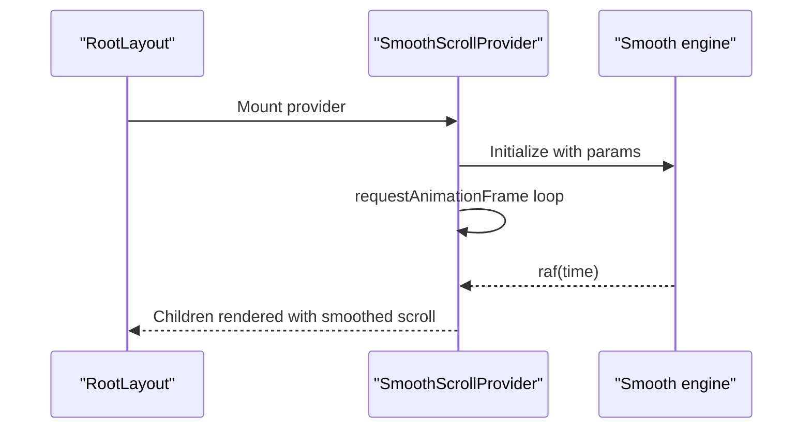

**Diagram sources**
- [layout.tsx:4-32](file://src/app/layout.tsx#L4-L32)
- [SmoothScrollProvider.tsx:11-32](file://src/components/providers/SmoothScrollProvider.tsx#L11-L32)

**Section sources**
- [layout.tsx:4-32](file://src/app/layout.tsx#L4-L32)
- [SmoothScrollProvider.tsx:11-32](file://src/components/providers/SmoothScrollProvider.tsx#L11-L32)

## Dependency Analysis
- Hero.tsx depends on hero.ts for constants and dialogue data.
- Canvas drawing depends on DOM APIs and devicePixelRatio.
- HUD elements depend on shared styles and the reusable HudFrame component.
- Smooth scrolling is optional but recommended for performance.

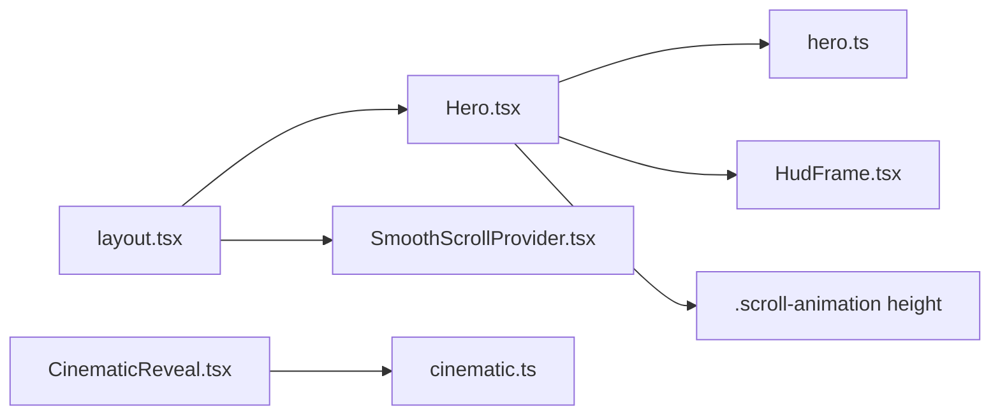

**Diagram sources**
- [Hero.tsx:6](file://src/components/sections/Hero.tsx#L6)
- [hero.ts:1-43](file://src/lib/hero.ts#L1-L43)
- [HudFrame.tsx:1-32](file://src/components/ui/HudFrame.tsx#L1-L32)
- [globals.css:48-62](file://src/app/globals.css#L48-L62)
- [layout.tsx:4](file://src/app/layout.tsx#L4)
- [SmoothScrollProvider.tsx:11-32](file://src/components/providers/SmoothScrollProvider.tsx#L11-L32)
- [CinematicReveal.tsx:6](file://src/components/sections/CinematicReveal.tsx#L6)
- [cinematic.ts:1-47](file://src/lib/cinematic.ts#L1-L47)

**Section sources**
- [Hero.tsx:6](file://src/components/sections/Hero.tsx#L6)
- [hero.ts:1-43](file://src/lib/hero.ts#L1-L43)
- [CinematicReveal.tsx:6](file://src/components/sections/CinematicReveal.tsx#L6)
- [cinematic.ts:1-47](file://src/lib/cinematic.ts#L1-L47)

## Performance Considerations
- requestAnimationFrame batching: Prevents redundant redraws and layout thrashing during scroll.
- High-DPI scaling: Ensures crisp visuals on Retina and high-resolution displays without oversampling unnecessarily.
- CSS transforms and opacity: Hardware-accelerated properties for smooth text and card animations.
- Progressive loading: Reduces perceived load time by showing a progress bar while frames stream in.
- Sticky viewport: The section is set to a very tall height to enable long-form scroll; ensure content below does not cause excessive memory usage.

[No sources needed since this section provides general guidance]

## Troubleshooting Guide
- Frames not appearing:
  - Verify that the frame assets exist at the expected paths and that the server serves them correctly.
  - Confirm that the frame count matches the number of images present.
- Canvas appears blurry on high-DPI screens:
  - Ensure devicePixelRatio is considered and canvas.width/height are scaled accordingly.
- Scroll feels choppy:
  - Confirm the smooth scroll provider is active and requestAnimationFrame is used for scroll handling.
- HUD elements not updating:
  - Check that refs are attached and progress thresholds are correctly defined.
- Loading overlay never hides:
  - Ensure onload/onerror handlers increment the loaded count and set the loaded flag.

**Section sources**
- [Hero.tsx:26-59](file://src/components/sections/Hero.tsx#L26-L59)
- [Hero.tsx:95-106](file://src/components/sections/Hero.tsx#L95-L106)
- [Hero.tsx:120-182](file://src/components/sections/Hero.tsx#L120-L182)

## Conclusion
The Hero canvas animation system combines progressive frame loading, high-DPI-aware canvas rendering, and scroll-triggered playback to deliver a polished, cinematic experience. With requestAnimationFrame-based scroll handling, precise frame mapping, and layered HUD elements, it provides a strong foundation for storytelling and performance. The modular design allows easy extension to new assets, timing modifications, and dialogue customization.

[No sources needed since this section summarizes without analyzing specific files]

## Appendices

### Practical Examples

- Extending frame assets:
  - Add new frames to the frames directory with zero-padded four-digit names.
  - Update the frame count constant to match the new total.
  - Adjust the frame path function if assets are moved to a different directory.
  - Example paths to review:
    - [hero.ts:3-4](file://src/lib/hero.ts#L3-L4)
    - [hero.ts:1](file://src/lib/hero.ts#L1)

- Modifying animation timing:
  - Adjust the progress-to-frame mapping by changing the multiplier or adding easing.
  - Example location:
    - [Hero.tsx:137-140](file://src/components/sections/Hero.tsx#L137-L140)

- Customizing dialogue sequences:
  - Add or edit dialogue entries with show/hide progress thresholds and content.
  - Example locations:
    - [hero.ts:15-40](file://src/lib/hero.ts#L15-L40)
    - [Hero.tsx:288-318](file://src/components/sections/Hero.tsx#L288-L318)

- Adjusting text fade effects:
  - Modify opacity calculations and transform timings for hero text and secondary text blocks.
  - Example locations:
    - [Hero.tsx:146-156](file://src/components/sections/Hero.tsx#L146-L156)

- Power readout customization:
  - Change the baseline value and amplitude of the sine wave for the power readout.
  - Example location:
    - [Hero.tsx:162-165](file://src/components/sections/Hero.tsx#L162-L165)

- Sequence counter display:
  - Update the sequence readout text and padding logic.
  - Example location:
    - [Hero.tsx:288-286](file://src/components/sections/Hero.tsx#L288-L286)

- HUD corner frames:
  - Customize size or corner placement for different layouts.
  - Example location:
    - [HudFrame.tsx:7-13](file://src/components/ui/HudFrame.tsx#L7-L13)

- Smooth scrolling:
  - Tune the smoothing parameters for different motion preferences.
  - Example location:
    - [SmoothScrollProvider.tsx:12-18](file://src/components/providers/SmoothScrollProvider.tsx#L12-L18)

- Global scroll container height:
  - Adjust the height of the scroll animation container to fit your layout needs.
  - Example location:
    - [globals.css:48-62](file://src/app/globals.css#L48-L62)