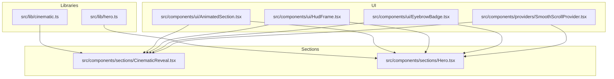
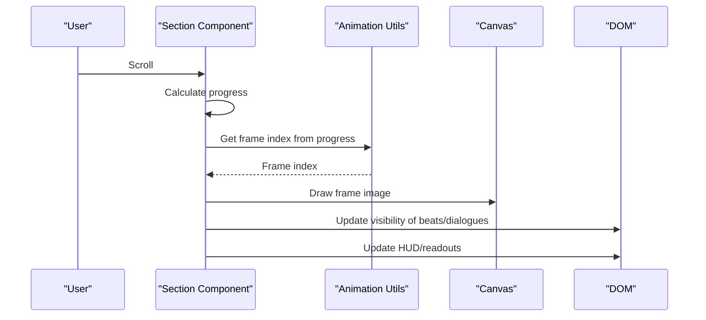
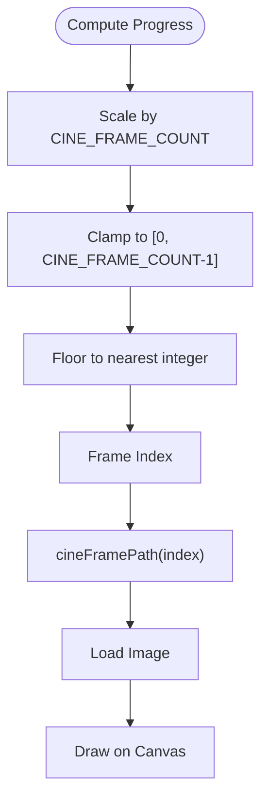
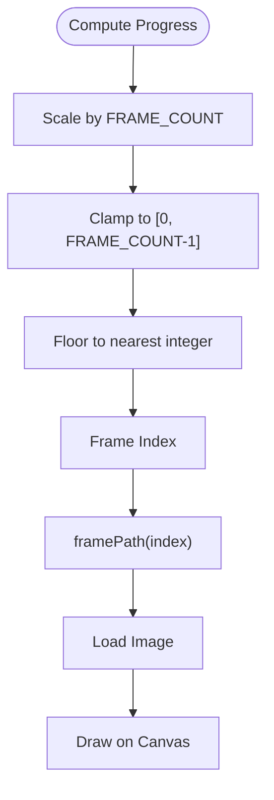
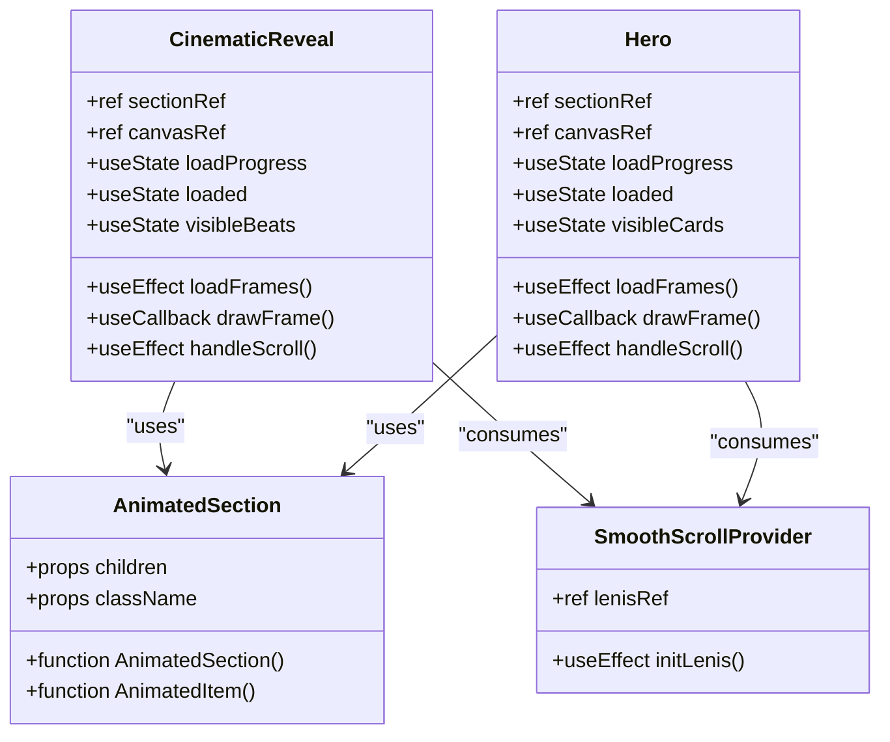
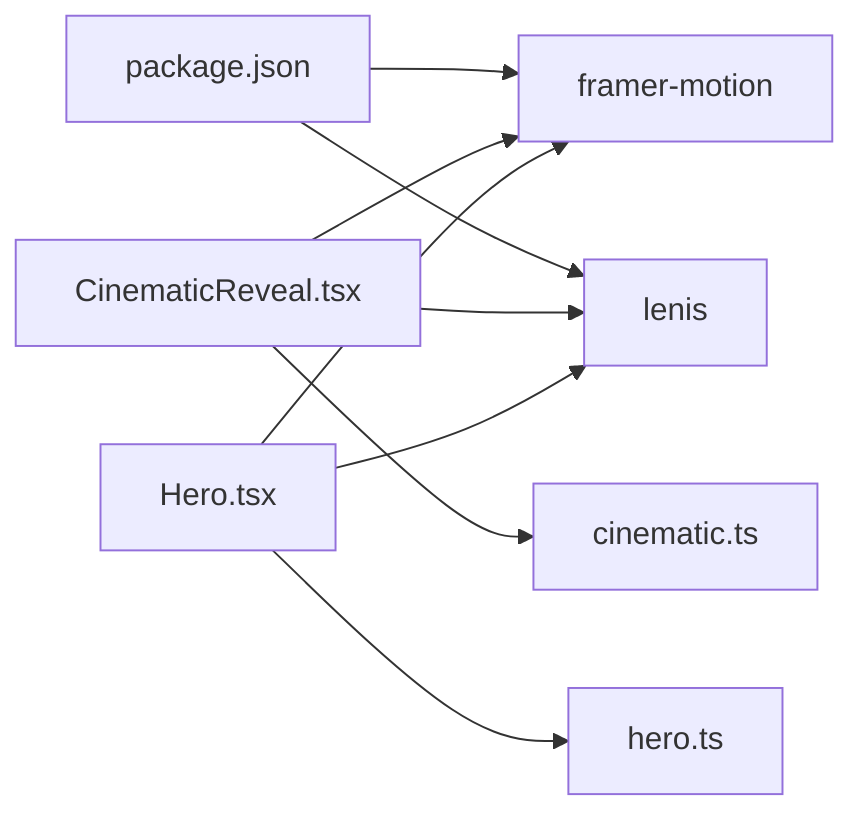

# Shared Animation Utilities

<cite>
**Referenced Files in This Document**
- [cinematic.ts](file://src/lib/cinematic.ts)
- [hero.ts](file://src/lib/hero.ts)
- [CinematicReveal.tsx](file://src/components/sections/CinematicReveal.tsx)
- [Hero.tsx](file://src/components/sections/Hero.tsx)
- [AnimatedSection.tsx](file://src/components/ui/AnimatedSection.tsx)
- [HudFrame.tsx](file://src/components/ui/HudFrame.tsx)
- [EyebrowBadge.tsx](file://src/components/ui/EyebrowBadge.tsx)
- [SmoothScrollProvider.tsx](file://src/components/providers/SmoothScrollProvider.tsx)
- [page.tsx](file://src/app/page.tsx)
- [package.json](file://package.json)
</cite>

## Table of Contents
1. [Introduction](#introduction)
2. [Project Structure](#project-structure)
3. [Core Components](#core-components)
4. [Architecture Overview](#architecture-overview)
5. [Detailed Component Analysis](#detailed-component-analysis)
6. [Dependency Analysis](#dependency-analysis)
7. [Performance Considerations](#performance-considerations)
8. [Troubleshooting Guide](#troubleshooting-guide)
9. [Conclusion](#conclusion)
10. [Appendices](#appendices)

## Introduction
This document describes the shared animation utility modules that power the scroll-driven animation sequences in the project. It focuses on:
- Frame path generation functions for image assets
- Animation constants and shared configuration objects
- Dialogue and beat data structures
- Beat marker definitions and timing constants
- Utility functions for frame asset management and progress calculations
- Animation state coordination across sections
- Practical examples for extending the utilities, adding new constants, and building reusable helpers

## Project Structure
The animation utilities are organized into two primary libraries:
- src/lib/cinematic.ts: Provides cinematic frame count, path generator, beat markers, and related constants
- src/lib/hero.ts: Provides hero frame count, path generator, dialogue markers, and related constants

These libraries are consumed by:
- src/components/sections/CinematicReveal.tsx: Uses cinematic utilities for a cinematic reveal sequence
- src/components/sections/Hero.tsx: Uses hero utilities for the hero sequence

Supporting UI utilities include:
- src/components/ui/AnimatedSection.tsx: Provides reusable animated section primitives
- src/components/ui/HudFrame.tsx and src/components/ui/EyebrowBadge.tsx: Provide visual framing and badges
- src/components/providers/SmoothScrollProvider.tsx: Provides smooth scrolling behavior

**Diagram sources**
- [cinematic.ts](file://src/lib/cinematic.ts)
- [hero.ts](file://src/lib/hero.ts)
- [CinematicReveal.tsx](file://src/components/sections/CinematicReveal.tsx)
- [Hero.tsx](file://src/components/sections/Hero.tsx)
- [AnimatedSection.tsx](file://src/components/ui/AnimatedSection.tsx)
- [HudFrame.tsx](file://src/components/ui/HudFrame.tsx)
- [EyebrowBadge.tsx](file://src/components/ui/EyebrowBadge.tsx)
- [SmoothScrollProvider.tsx](file://src/components/providers/SmoothScrollProvider.tsx)

**Section sources**
- [page.tsx](file://src/app/page.tsx)
- [package.json](file://package.json)

## Core Components
This section documents the shared animation utilities and their roles.

- Frame path generation
  - Cinematic: CINE_FRAME_COUNT and cineFramePath(n) produce the path for frame images in the cinematic sequence
  - Hero: FRAME_COUNT and framePath(n) produce the path for frame images in the hero sequence

- Dialogue and beat data structures
  - Beat: Describes a cinematic beat with id, show/hide progress thresholds, label, quote, speaker, and film
  - Dialogue: Describes a hero dialogue with id, show/hide progress thresholds, quote, speaker, and film
  - Constants: BEATS (array of Beat) and DIALOGUES (array of Dialogue)

- Timing constants
  - CINE_INTRO_FADE_END: Threshold for cinematic intro fade behavior
  - HERO_TEXT_FADE_END: Threshold for hero text fade behavior

- Progress calculation helpers
  - Both sections compute normalized scroll progress from element bounding rectangles and scrollable heights
  - Frame indices are derived from progress scaled by frame counts

- Animation state coordination
  - Sections maintain visibility sets for beats/dialogues based on current progress
  - DOM updates adjust opacity, transforms, and content based on progress and visibility sets

**Section sources**
- [cinematic.ts](file://src/lib/cinematic.ts)
- [hero.ts](file://src/lib/hero.ts)
- [CinematicReveal.tsx](file://src/components/sections/CinematicReveal.tsx)
- [Hero.tsx](file://src/components/sections/Hero.tsx)

## Architecture Overview
The animation pipeline follows a consistent pattern:
- Load frame assets via generated paths
- Compute scroll progress per section
- Map progress to frame index and draw the appropriate frame
- Show/hide beat/dialogue cards based on progress thresholds
- Update HUD elements and telemetry displays

**Diagram sources**
- [CinematicReveal.tsx](file://src/components/sections/CinematicReveal.tsx)
- [Hero.tsx](file://src/components/sections/Hero.tsx)
- [cinematic.ts](file://src/lib/cinematic.ts)
- [hero.ts](file://src/lib/hero.ts)

## Detailed Component Analysis

### Cinematic Utilities (src/lib/cinematic.ts)
- Exports:
  - CINE_FRAME_COUNT: Total number of frames in the cinematic sequence
  - cineFramePath(n): Generates the path for frame image n
  - Beat type: Defines the shape of a beat marker
  - BEATS: Array of Beat entries
  - CINE_INTRO_FADE_END: Intro fade threshold constant

- Usage in CinematicReveal:
  - Loads frames using cineFramePath
  - Computes frame index from progress
  - Updates beat visibility based on progress thresholds
  - Renders HUD elements and sequence counters

**Diagram sources**
- [CinematicReveal.tsx](file://src/components/sections/CinematicReveal.tsx)
- [cinematic.ts](file://src/lib/cinematic.ts)

**Section sources**
- [cinematic.ts](file://src/lib/cinematic.ts)
- [CinematicReveal.tsx](file://src/components/sections/CinematicReveal.tsx)

### Hero Utilities (src/lib/hero.ts)
- Exports:
  - FRAME_COUNT: Total number of frames in the hero sequence
  - framePath(n): Generates the path for frame image n
  - Dialogue type: Defines the shape of a dialogue marker
  - DIALOGUES: Array of Dialogue entries
  - HERO_TEXT_FADE_END: Text fade threshold constant

- Usage in Hero:
  - Loads frames using framePath
  - Computes frame index from progress
  - Updates dialogue visibility based on progress thresholds
  - Animates hero text and telemetry readouts

**Diagram sources**
- [Hero.tsx](file://src/components/sections/Hero.tsx)
- [hero.ts](file://src/lib/hero.ts)

**Section sources**
- [hero.ts](file://src/lib/hero.ts)
- [Hero.tsx](file://src/components/sections/Hero.tsx)

### Section Components and State Coordination
- CinematicReveal:
  - Manages loading state and draws frames onto a canvas
  - Computes progress from scroll events and resizes canvas on window changes
  - Coordinates beat visibility and HUD updates

- Hero:
  - Mirrors the cinematic pattern with its own frame assets and dialogues
  - Adds dynamic telemetry readouts and text animations

- AnimatedSection:
  - Provides reusable animated section primitives for staggered entrance animations

- SmoothScrollProvider:
  - Integrates smooth scrolling to enhance animation flow

**Diagram sources**
- [CinematicReveal.tsx](file://src/components/sections/CinematicReveal.tsx)
- [Hero.tsx](file://src/components/sections/Hero.tsx)
- [AnimatedSection.tsx](file://src/components/ui/AnimatedSection.tsx)
- [SmoothScrollProvider.tsx](file://src/components/providers/SmoothScrollProvider.tsx)

**Section sources**
- [CinematicReveal.tsx](file://src/components/sections/CinematicReveal.tsx)
- [Hero.tsx](file://src/components/sections/Hero.tsx)
- [AnimatedSection.tsx](file://src/components/ui/AnimatedSection.tsx)
- [SmoothScrollProvider.tsx](file://src/components/providers/SmoothScrollProvider.tsx)

## Dependency Analysis
- Libraries depend on no external runtime dependencies for animation logic
- Sections depend on:
  - Framer Motion for AnimatedSection primitives
  - Lenis for smooth scrolling
  - Local utility modules for frame paths and data

**Diagram sources**
- [package.json](file://package.json)
- [CinematicReveal.tsx](file://src/components/sections/CinematicReveal.tsx)
- [Hero.tsx](file://src/components/sections/Hero.tsx)
- [cinematic.ts](file://src/lib/cinematic.ts)
- [hero.ts](file://src/lib/hero.ts)

**Section sources**
- [package.json](file://package.json)

## Performance Considerations
- Frame loading
  - Preload frames during mount to avoid jank; track progress and only switch to playable state after all frames are ready
  - Use device pixel ratio scaling for crisp rendering on high-DPR screens

- Scroll handling
  - Throttle scroll events with requestAnimationFrame to minimize layout thrash
  - Avoid unnecessary re-renders by updating only changed DOM properties (opacity, transform, innerText)

- Canvas drawing
  - Clear canvas before drawing each frame
  - Compute aspect-ratio-aware draw bounds once per resize and reuse

- Visibility checks
  - Use Set-based visibility tracking to efficiently compare previous and current states

[No sources needed since this section provides general guidance]

## Troubleshooting Guide
- Frames not loading
  - Verify framePath/cineFramePath generates correct paths and that assets exist under the expected directories
  - Confirm all frames are numbered consistently and padded to four digits

- Incorrect frame sequencing
  - Ensure progress is computed from the correct element and scrollable height
  - Check that frame index clamping prevents out-of-range access

- Beats/dialogue not appearing
  - Validate show/hide thresholds do not overlap and span the intended progress range
  - Confirm visibility Set updates occur when thresholds change

- Canvas rendering issues
  - Ensure canvas resize accounts for device pixel ratio and clears the context before drawing
  - Verify image.complete and naturalWidth checks prevent drawing incomplete frames

**Section sources**
- [CinematicReveal.tsx](file://src/components/sections/CinematicReveal.tsx)
- [Hero.tsx](file://src/components/sections/Hero.tsx)
- [cinematic.ts](file://src/lib/cinematic.ts)
- [hero.ts](file://src/lib/hero.ts)

## Conclusion
The shared animation utilities provide a consistent foundation for scroll-driven sequences:
- Centralized frame path generation and constants
- Typed beat/dialogue data structures with explicit timing
- Robust progress computation and state coordination
- Reusable UI primitives for smooth animations

Extending these utilities involves adding new constants, data entries, and helper functions while maintaining the established patterns for loading, drawing, and coordinating animation state.

[No sources needed since this section summarizes without analyzing specific files]

## Appendices

### Extending the Utility Modules
- Adding new animation constants
  - Define a new constant in the appropriate library (e.g., a new threshold constant)
  - Reference it in the consuming section to control animation behavior

- Creating new data entries
  - Add a new Beat or Dialogue entry with unique id and appropriate show/hide thresholds
  - Update the relevant section to render and coordinate the new entry

- Building reusable helpers
  - Encapsulate common progress computations and visibility checks into small helper functions
  - Export them from the relevant library for reuse across sections

[No sources needed since this section provides general guidance]