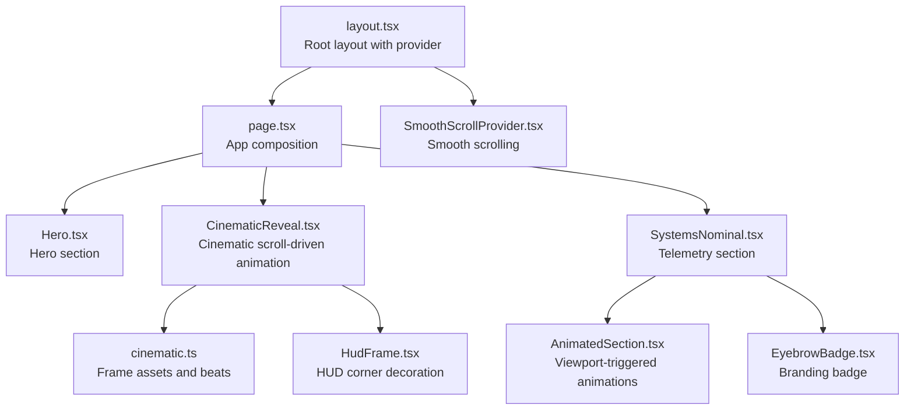
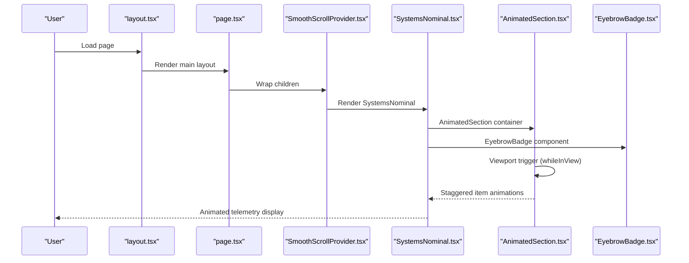
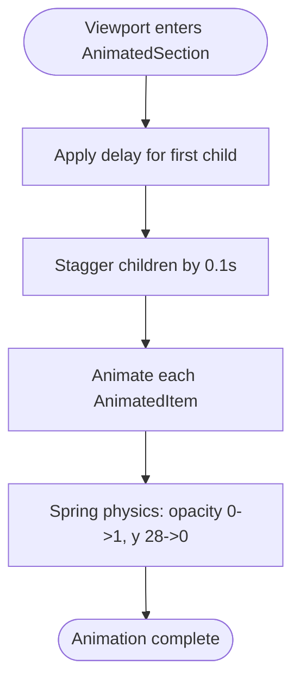
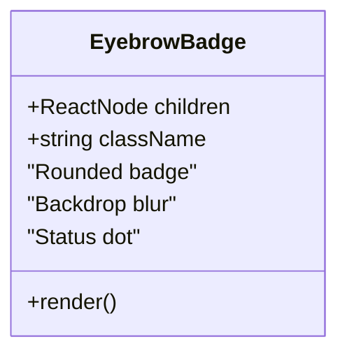
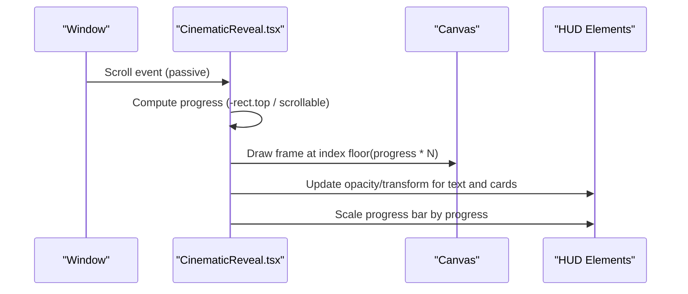
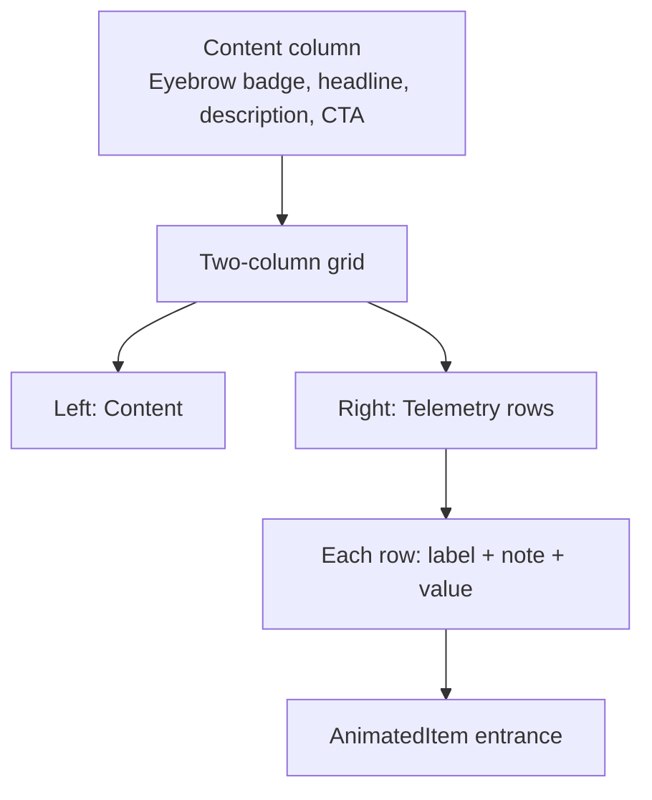
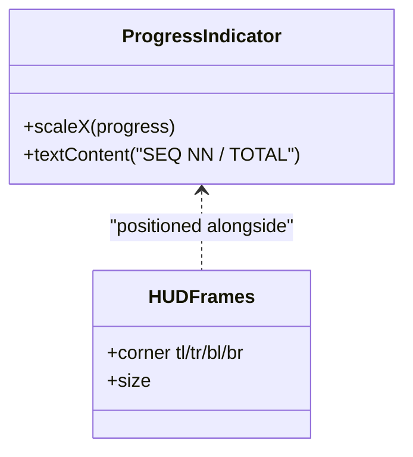
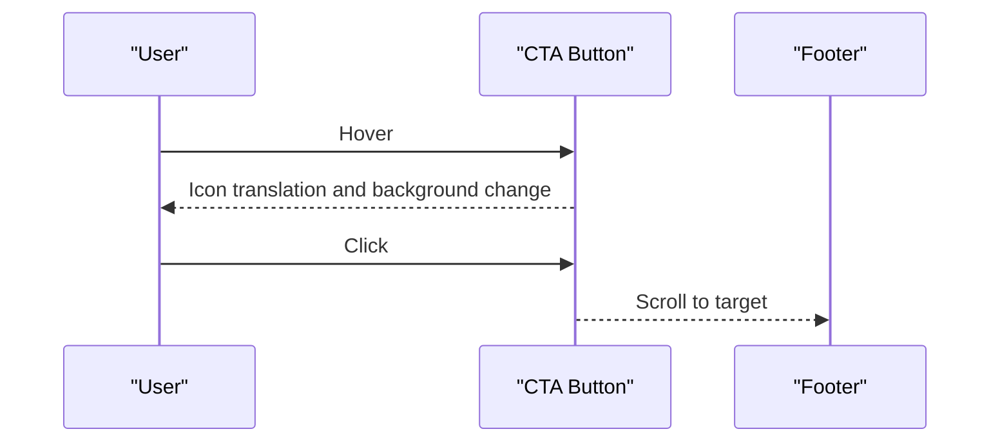
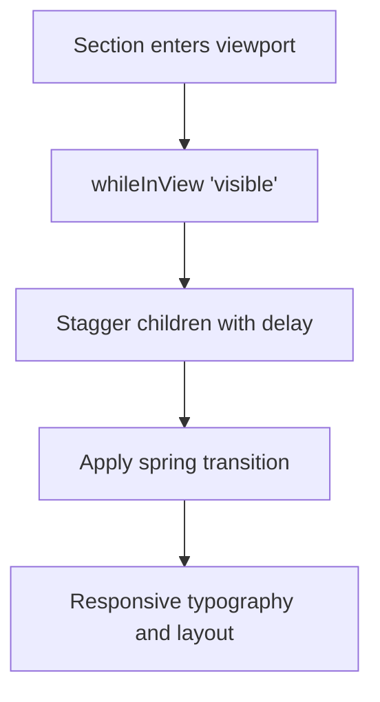
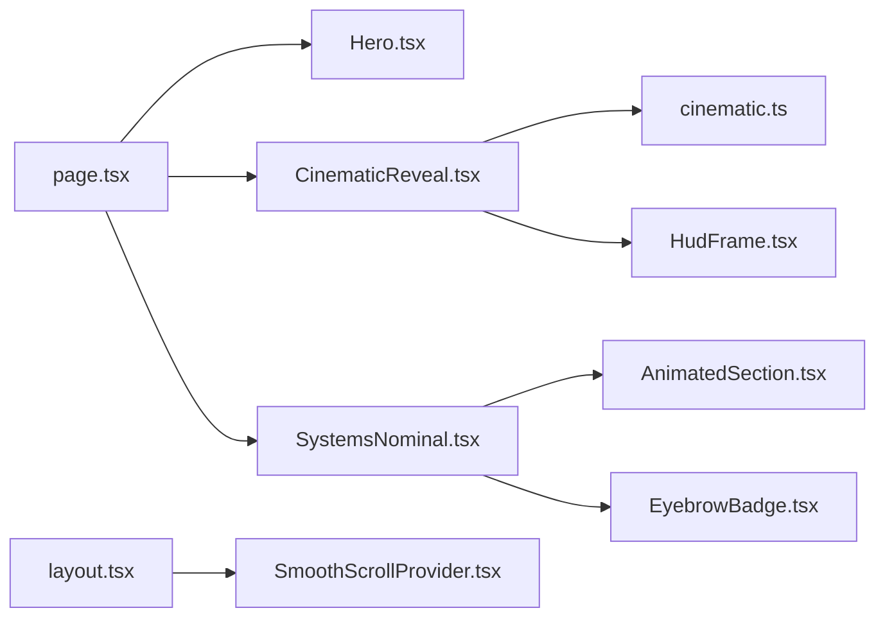

# Systems Nominal Telemetry

<cite>
**Referenced Files in This Document**
- [SystemsNominal.tsx](file://src/components/sections/SystemsNominal.tsx)
- [AnimatedSection.tsx](file://src/components/ui/AnimatedSection.tsx)
- [EyebrowBadge.tsx](file://src/components/ui/EyebrowBadge.tsx)
- [page.tsx](file://src/app/page.tsx)
- [layout.tsx](file://src/app/layout.tsx)
- [globals.css](file://src/app/globals.css)
- [SmoothScrollProvider.tsx](file://src/components/providers/SmoothScrollProvider.tsx)
- [cinematic.ts](file://src/lib/cinematic.ts)
- [CinematicReveal.tsx](file://src/components/sections/CinematicReveal.tsx)
- [HudFrame.tsx](file://src/components/ui/HudFrame.tsx)
</cite>

## Table of Contents
1. [Introduction](#introduction)
2. [Project Structure](#project-structure)
3. [Core Components](#core-components)
4. [Architecture Overview](#architecture-overview)
5. [Detailed Component Analysis](#detailed-component-analysis)
6. [Dependency Analysis](#dependency-analysis)
7. [Performance Considerations](#performance-considerations)
8. [Troubleshooting Guide](#troubleshooting-guide)
9. [Conclusion](#conclusion)

## Introduction
This document explains the animated telemetry data display system in the Systems Nominal section. It covers the animated section transitions, the eyebrow badge system, scroll-triggered animation patterns, telemetry visualization techniques, animated progress indicators, and interactive elements. It also documents the Framer Motion integration for viewport-based animations, section transition effects, and responsive design considerations. Practical guidance is included for extending the system with new telemetry sources, customizing animation timing, and implementing additional animated UI components.

## Project Structure
The Systems Nominal section is part of the main application layout and integrates with shared UI components and providers. The page composes the navigation bar, cinematic reveal, Systems Nominal section, and footer. The Systems Nominal section uses reusable animated components for staggered entrance and eyebrow badges for contextual labeling.

**Diagram sources**
- [layout.tsx:1-37](file://src/app/layout.tsx#L1-L37)
- [page.tsx:1-20](file://src/app/page.tsx#L1-L20)
- [CinematicReveal.tsx:1-384](file://src/components/sections/CinematicReveal.tsx#L1-L384)
- [SystemsNominal.tsx:1-77](file://src/components/sections/SystemsNominal.tsx#L1-L77)
- [AnimatedSection.tsx:1-43](file://src/components/ui/AnimatedSection.tsx#L1-L43)
- [EyebrowBadge.tsx:1-17](file://src/components/ui/EyebrowBadge.tsx#L1-L17)
- [SmoothScrollProvider.tsx:1-37](file://src/components/providers/SmoothScrollProvider.tsx#L1-L37)
- [cinematic.ts:1-47](file://src/lib/cinematic.ts#L1-L47)
- [HudFrame.tsx:1-32](file://src/components/ui/HudFrame.tsx#L1-L32)

**Section sources**
- [layout.tsx:1-37](file://src/app/layout.tsx#L1-L37)
- [page.tsx:1-20](file://src/app/page.tsx#L1-L20)

## Core Components
- SystemsNominal: Renders telemetry data rows with animated entrances and an eyebrow badge. It uses AnimatedSection and AnimatedItem to orchestrate staggered viewport animations and EyebrowBadge for branding.
- AnimatedSection and AnimatedItem: Provide viewport-triggered staggered animations powered by Framer Motion. AnimatedSection defines container variants and AnimatedItem defines child variants with spring physics.
- EyebrowBadge: A compact, branded indicator with a subtle glow effect and a small status dot.
- SmoothScrollProvider: Integrates Lenis smooth scrolling to enhance scroll-driven animations across sections.
- CinematicReveal: Demonstrates advanced scroll-driven animation patterns, including frame sequencing, opacity transitions, HUD overlays, and progress indicators.

**Section sources**
- [SystemsNominal.tsx:14-77](file://src/components/sections/SystemsNominal.tsx#L14-L77)
- [AnimatedSection.tsx:22-43](file://src/components/ui/AnimatedSection.tsx#L22-L43)
- [EyebrowBadge.tsx:3-16](file://src/components/ui/EyebrowBadge.tsx#L3-L16)
- [SmoothScrollProvider.tsx:8-36](file://src/components/providers/SmoothScrollProvider.tsx#L8-L36)
- [CinematicReveal.tsx:8-384](file://src/components/sections/CinematicReveal.tsx#L8-L384)

## Architecture Overview
The Systems Nominal section participates in a scroll-driven narrative. Smooth scrolling ensures fluid motion, while viewport-based animations trigger staggered entrances. Telemetry data is presented in a grid layout with a left column for content and a right column for telemetry rows. The eyebrow badge anchors the section’s identity, and the animated progress indicator communicates scroll position.

**Diagram sources**
- [layout.tsx:23-36](file://src/app/layout.tsx#L23-L36)
- [page.tsx:7-19](file://src/app/page.tsx#L7-L19)
- [SmoothScrollProvider.tsx:8-36](file://src/components/providers/SmoothScrollProvider.tsx#L8-L36)
- [SystemsNominal.tsx:14-77](file://src/components/sections/SystemsNominal.tsx#L14-L77)
- [AnimatedSection.tsx:22-34](file://src/components/ui/AnimatedSection.tsx#L22-L34)
- [EyebrowBadge.tsx:3-16](file://src/components/ui/EyebrowBadge.tsx#L3-L16)

## Detailed Component Analysis

### Animated Section Transition Components
- Container and Item Variants: The AnimatedSection component defines container variants that stagger child animations and a delay for the first child. AnimatedItem defines a spring-based entrance with opacity and vertical displacement.
- Viewport Trigger: The container uses whileInView to animate when it enters the viewport, with viewport margin and once-only execution to avoid re-triggering.
- Staggered Animation: Children animate in sequence, creating a cascading effect that draws attention to content order.

**Diagram sources**
- [AnimatedSection.tsx:6-18](file://src/components/ui/AnimatedSection.tsx#L6-L18)
- [AnimatedSection.tsx:24-33](file://src/components/ui/AnimatedSection.tsx#L24-L33)

**Section sources**
- [AnimatedSection.tsx:6-18](file://src/components/ui/AnimatedSection.tsx#L6-L18)
- [AnimatedSection.tsx:22-34](file://src/components/ui/AnimatedSection.tsx#L22-L34)

### Eyebrow Badge System Implementation
- Purpose: Provides a concise, branded indicator for section identity and status.
- Design: Uses a rounded badge with a subtle glow and a small status dot. The badge leverages theme colors and backdrop blur for depth.
- Placement: Positioned at the top of the content column in SystemsNominal to anchor the section’s identity.

**Diagram sources**
- [EyebrowBadge.tsx:1-17](file://src/components/ui/EyebrowBadge.tsx#L1-L17)

**Section sources**
- [EyebrowBadge.tsx:3-16](file://src/components/ui/EyebrowBadge.tsx#L3-L16)
- [SystemsNominal.tsx:22-24](file://src/components/sections/SystemsNominal.tsx#L22-L24)

### Scroll-Triggered Animation Patterns
- Smooth Scrolling: SmoothScrollProvider initializes Lenis with configurable easing and duration to improve scroll feel.
- Frame Sequencing: CinematicReveal demonstrates scroll-to-frame mapping, calculating a normalized progress and selecting the appropriate frame index.
- Opacity Transitions: Specific DOM nodes adjust opacity based on progress thresholds, enabling fade-ins and fade-outs synchronized with scroll.
- HUD Overlays: Corner HUD decorations and progress bars are positioned absolutely and updated via inline styles during scroll.
- Progress Indicator: A horizontal progress bar scales to reflect scroll completion, updating inside the HUD area.

**Diagram sources**
- [SmoothScrollProvider.tsx:11-26](file://src/components/providers/SmoothScrollProvider.tsx#L11-L26)
- [CinematicReveal.tsx:120-186](file://src/components/sections/CinematicReveal.tsx#L120-L186)
- [CinematicReveal.tsx:188-384](file://src/components/sections/CinematicReveal.tsx#L188-L384)

**Section sources**
- [SmoothScrollProvider.tsx:8-36](file://src/components/providers/SmoothScrollProvider.tsx#L8-L36)
- [CinematicReveal.tsx:120-186](file://src/components/sections/CinematicReveal.tsx#L120-L186)

### Telemetry Data Visualization Techniques
- Grid Layout: Two-column layout with content on the left and telemetry on the right for clear information hierarchy.
- Row Structure: Each telemetry row displays a label, a secondary note, and a prominent value with monospace typography for readability.
- Animated Entrances: Rows animate in sequence using AnimatedSection and AnimatedItem, aligning with the section’s staggered animation pattern.
- Responsive Typography: Values scale appropriately on larger screens for emphasis.

**Diagram sources**
- [SystemsNominal.tsx:20-72](file://src/components/sections/SystemsNominal.tsx#L20-L72)
- [AnimatedSection.tsx:22-43](file://src/components/ui/AnimatedSection.tsx#L22-L43)

**Section sources**
- [SystemsNominal.tsx:54-72](file://src/components/sections/SystemsNominal.tsx#L54-L72)

### Animated Progress Indicators
- Horizontal Progress Bar: A thin bar at the bottom of the viewport scales horizontally to indicate scroll progress. It updates via inline transform scaling during scroll.
- Sequence Readout: A numeric counter shows the current frame out of total frames, synchronized with the scroll progress.
- HUD Frames: Corner HUD decorations provide visual framing for the HUD elements.

**Diagram sources**
- [CinematicReveal.tsx:272-285](file://src/components/sections/CinematicReveal.tsx#L272-L285)
- [CinematicReveal.tsx:259-271](file://src/components/sections/CinematicReveal.tsx#L259-L271)
- [HudFrame.tsx:7-31](file://src/components/ui/HudFrame.tsx#L7-L31)

**Section sources**
- [CinematicReveal.tsx:272-285](file://src/components/sections/CinematicReveal.tsx#L272-L285)
- [CinematicReveal.tsx:259-271](file://src/components/sections/CinematicReveal.tsx#L259-L271)
- [HudFrame.tsx:7-31](file://src/components/ui/HudFrame.tsx#L7-L31)

### Interactive Elements
- CTA Button: A styled link with hover effects and an icon that animates on hover, linking to the footer.
- Scroll Navigation: A “Next — engage” prompt appears near the end of the cinematic section, linking to the Systems Nominal section.

**Diagram sources**
- [SystemsNominal.tsx:40-51](file://src/components/sections/SystemsNominal.tsx#L40-L51)
- [CinematicReveal.tsx:357-364](file://src/components/sections/CinematicReveal.tsx#L357-L364)

**Section sources**
- [SystemsNominal.tsx:40-51](file://src/components/sections/SystemsNominal.tsx#L40-L51)
- [CinematicReveal.tsx:357-364](file://src/components/sections/CinematicReveal.tsx#L357-L364)

### Framer Motion Integration and Responsive Design
- Viewport-Based Animations: AnimatedSection uses whileInView with viewport margin and once flag to trigger animations when the section becomes visible.
- Spring Physics: AnimatedItem applies spring-type transitions for natural motion, balancing stiffness and damping for a polished feel.
- Responsive Typography and Layout: The telemetry section adapts spacing and typography at different breakpoints to maintain readability.
- Global Scroll Height: The .scroll-animation class increases section height across breakpoints to enable long-form scroll-driven experiences.

**Diagram sources**
- [AnimatedSection.tsx:24-33](file://src/components/ui/AnimatedSection.tsx#L24-L33)
- [AnimatedSection.tsx:11-18](file://src/components/ui/AnimatedSection.tsx#L11-L18)
- [globals.css:48-62](file://src/app/globals.css#L48-L62)

**Section sources**
- [AnimatedSection.tsx:24-33](file://src/components/ui/AnimatedSection.tsx#L24-L33)
- [AnimatedSection.tsx:11-18](file://src/components/ui/AnimatedSection.tsx#L11-L18)
- [globals.css:48-62](file://src/app/globals.css#L48-L62)

## Dependency Analysis
The Systems Nominal section depends on shared UI components and providers. The page composes sections, while the layout injects the smooth scrolling provider. The cinematic section demonstrates advanced scroll-driven patterns that inform the telemetry section’s animation strategy.

**Diagram sources**
- [page.tsx:1-20](file://src/app/page.tsx#L1-L20)
- [layout.tsx:1-37](file://src/app/layout.tsx#L1-L37)
- [SystemsNominal.tsx:1-77](file://src/components/sections/SystemsNominal.tsx#L1-L77)
- [AnimatedSection.tsx:1-43](file://src/components/ui/AnimatedSection.tsx#L1-L43)
- [EyebrowBadge.tsx:1-17](file://src/components/ui/EyebrowBadge.tsx#L1-L17)
- [SmoothScrollProvider.tsx:1-37](file://src/components/providers/SmoothScrollProvider.tsx#L1-L37)
- [CinematicReveal.tsx:1-384](file://src/components/sections/CinematicReveal.tsx#L1-L384)
- [cinematic.ts:1-47](file://src/lib/cinematic.ts#L1-L47)
- [HudFrame.tsx:1-32](file://src/components/ui/HudFrame.tsx#L1-L32)

**Section sources**
- [page.tsx:1-20](file://src/app/page.tsx#L1-L20)
- [layout.tsx:1-37](file://src/app/layout.tsx#L1-L37)

## Performance Considerations
- Scroll Event Optimization: CinematicReveal debounces scroll handling using requestAnimationFrame and a ticking flag to prevent excessive recalculations.
- Canvas Rendering: Frame drawing occurs only when the frame index changes, minimizing unnecessary redraws. Device pixel ratio scaling ensures crisp rendering on high-DPI displays.
- Viewport Animations: Using viewport once and a negative margin reduces repeated triggers and improves perceived performance.
- Smooth Scrolling: Lenis’ RAF loop synchronizes with the browser’s refresh cycle, reducing jank during long scroll sequences.

[No sources needed since this section provides general guidance]

## Troubleshooting Guide
- Animations not triggering: Verify viewport configuration and ensure the section is within the viewport threshold. Confirm whileInView is applied to the container and that the once flag prevents re-triggering.
- Telemetry rows not animating: Check that AnimatedSection wraps the telemetry rows and that AnimatedItem is used for each row.
- Scroll progress not updating: Confirm scroll event listeners are attached and that progress calculations account for section height and viewport dimensions.
- HUD elements not appearing: Ensure progress thresholds match the intended scroll positions and that DOM refs are correctly assigned.
- Frame loading issues: Validate asset paths and confirm load callbacks update state consistently for both onload and onerror.

**Section sources**
- [AnimatedSection.tsx:24-33](file://src/components/ui/AnimatedSection.tsx#L24-L33)
- [CinematicReveal.tsx:120-186](file://src/components/sections/CinematicReveal.tsx#L120-L186)

## Conclusion
The Systems Nominal section’s animated telemetry display combines viewport-triggered animations, a branded eyebrow badge, and a scroll-driven narrative. Framer Motion orchestrates staggered entrances, while smooth scrolling and scroll-progress calculations deliver immersive, responsive experiences. The architecture supports extension with new telemetry sources, refined animation timing, and additional animated UI components.