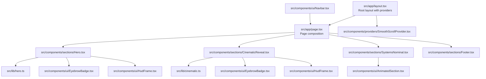
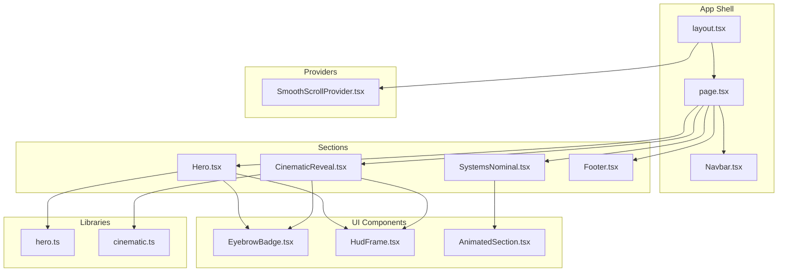
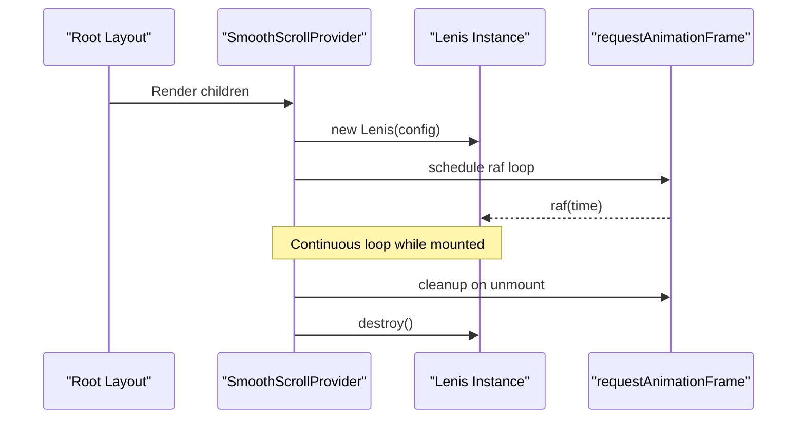
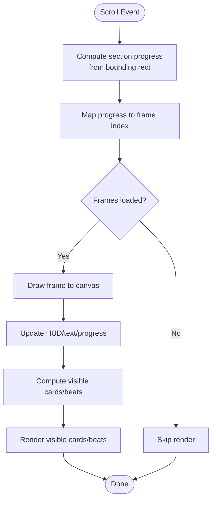
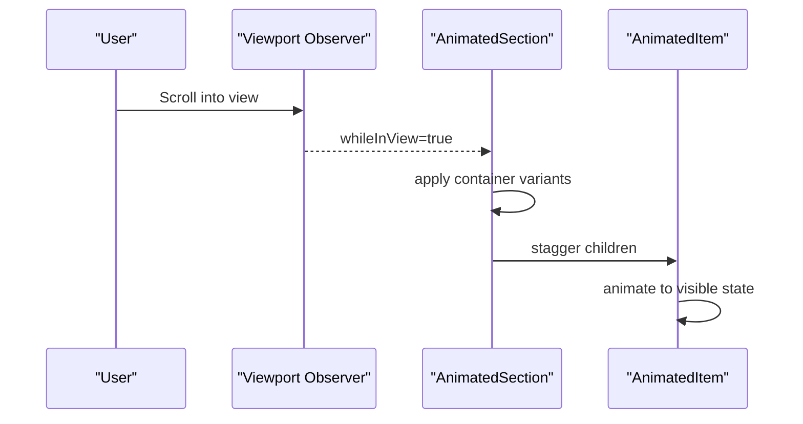
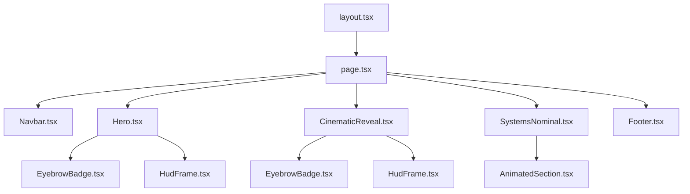
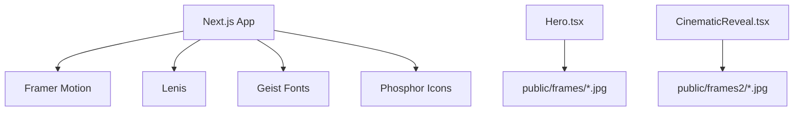

# Architecture Overview

<cite>
**Referenced Files in This Document**
- [layout.tsx](file://src/app/layout.tsx)
- [page.tsx](file://src/app/page.tsx)
- [SmoothScrollProvider.tsx](file://src/components/providers/SmoothScrollProvider.tsx)
- [Hero.tsx](file://src/components/sections/Hero.tsx)
- [CinematicReveal.tsx](file://src/components/sections/CinematicReveal.tsx)
- [SystemsNominal.tsx](file://src/components/sections/SystemsNominal.tsx)
- [AnimatedSection.tsx](file://src/components/ui/AnimatedSection.tsx)
- [EyebrowBadge.tsx](file://src/components/ui/EyebrowBadge.tsx)
- [HudFrame.tsx](file://src/components/ui/HudFrame.tsx)
- [Navbar.tsx](file://src/components/ui/Navbar.tsx)
- [Footer.tsx](file://src/components/sections/Footer.tsx)
- [hero.ts](file://src/lib/hero.ts)
- [cinematic.ts](file://src/lib/cinematic.ts)
- [package.json](file://package.json)
- [next.config.ts](file://next.config.ts)
</cite>

## Table of Contents
1. [Introduction](#introduction)
2. [Project Structure](#project-structure)
3. [Core Components](#core-components)
4. [Architecture Overview](#architecture-overview)
5. [Detailed Component Analysis](#detailed-component-analysis)
6. [Dependency Analysis](#dependency-analysis)
7. [Performance Considerations](#performance-considerations)
8. [Troubleshooting Guide](#troubleshooting-guide)
9. [Conclusion](#conclusion)

## Introduction
This document describes the architectural design of the Iron Man project, a Next.js application leveraging the App Router with page composition, a provider pattern for smooth scrolling, and a modular component organization. The site implements two primary animation systems:
- Canvas-based frame sequences for the Hero and Cinematic Reveal sections
- Framer Motion integration for scroll-triggered entrance animations in the Systems Nominal section

The architecture emphasizes:
- Provider pattern for global smooth scrolling via Lenis
- Factory-like frame loading utilities for image sequences
- Observer-like scroll event handling coordinating multiple animation systems
- Clear separation of concerns across sections, UI components, and utility libraries

## Project Structure
The project follows a Next.js App Router layout with a single page composing multiple sections. Providers wrap the application tree to inject global behaviors. Sections encapsulate animation logic and content. UI components are reusable and presentation-focused. Utility libraries define animation assets and timing data.

**Diagram sources**
- [layout.tsx:1-37](file://src/app/layout.tsx#L1-L37)
- [page.tsx:1-20](file://src/app/page.tsx#L1-L20)
- [SmoothScrollProvider.tsx:1-37](file://src/components/providers/SmoothScrollProvider.tsx#L1-L37)
- [Hero.tsx:1-366](file://src/components/sections/Hero.tsx#L1-L366)
- [CinematicReveal.tsx:1-384](file://src/components/sections/CinematicReveal.tsx#L1-L384)
- [SystemsNominal.tsx:1-77](file://src/components/sections/SystemsNominal.tsx#L1-L77)
- [Footer.tsx:1-63](file://src/components/sections/Footer.tsx#L1-L63)
- [hero.ts:1-43](file://src/lib/hero.ts#L1-L43)
- [cinematic.ts:1-47](file://src/lib/cinematic.ts#L1-L47)
- [EyebrowBadge.tsx:1-17](file://src/components/ui/EyebrowBadge.tsx#L1-L17)
- [HudFrame.tsx:1-32](file://src/components/ui/HudFrame.tsx#L1-L32)
- [AnimatedSection.tsx:1-43](file://src/components/ui/AnimatedSection.tsx#L1-L43)
- [Navbar.tsx:1-67](file://src/components/ui/Navbar.tsx#L1-L67)

**Section sources**
- [layout.tsx:1-37](file://src/app/layout.tsx#L1-L37)
- [page.tsx:1-20](file://src/app/page.tsx#L1-L20)

## Core Components
- Root layout and provider injection: The root layout wraps children with the SmoothScrollProvider to enable Lenis-powered smooth scrolling across the entire application.
- Page composition: The home page composes the Navbar, Hero, Cinematic Reveal, Systems Nominal, and Footer sections.
- SmoothScrollProvider: Initializes Lenis with configurable interpolation and wheel smoothing, runs an RAF loop, and cleans up on unmount.
- Hero section: Implements a canvas-based frame sequence synchronized to scroll progress, HUD overlays, and animated text cards.
- Cinematic Reveal section: Mirrors the Hero’s canvas animation with a distinct asset set and timing, plus beat-triggered cards.
- Systems Nominal section: Uses Framer Motion’s viewport-triggered animations via AnimatedSection/AnimatedItem wrappers.
- UI components: Reusable presentational components like EyebrowBadge, HudFrame, and Navbar.
- Utility libraries: Hero and cinematic assets define frame counts, asset paths, and dialogue/beat timing arrays.

**Section sources**
- [layout.tsx:1-37](file://src/app/layout.tsx#L1-L37)
- [page.tsx:1-20](file://src/app/page.tsx#L1-L20)
- [SmoothScrollProvider.tsx:1-37](file://src/components/providers/SmoothScrollProvider.tsx#L1-L37)
- [Hero.tsx:1-366](file://src/components/sections/Hero.tsx#L1-L366)
- [CinematicReveal.tsx:1-384](file://src/components/sections/CinematicReveal.tsx#L1-L384)
- [SystemsNominal.tsx:1-77](file://src/components/sections/SystemsNominal.tsx#L1-L77)
- [AnimatedSection.tsx:1-43](file://src/components/ui/AnimatedSection.tsx#L1-L43)
- [EyebrowBadge.tsx:1-17](file://src/components/ui/EyebrowBadge.tsx#L1-L17)
- [HudFrame.tsx:1-32](file://src/components/ui/HudFrame.tsx#L1-L32)
- [Navbar.tsx:1-67](file://src/components/ui/Navbar.tsx#L1-L67)
- [hero.ts:1-43](file://src/lib/hero.ts#L1-L43)
- [cinematic.ts:1-47](file://src/lib/cinematic.ts#L1-L47)

## Architecture Overview
The architecture centers on three pillars:
- Provider pattern: SmoothScrollProvider injects a global smooth-scroll experience powered by Lenis.
- Canvas-based animation pipeline: Hero and Cinematic Reveal sections load frame sequences, compute frame indices from scroll progress, and render frames to canvases while animating overlay elements.
- Framer Motion integration: Systems Nominal leverages viewport-triggered animations to animate content as users scroll into view.

**Diagram sources**
- [layout.tsx:1-37](file://src/app/layout.tsx#L1-L37)
- [page.tsx:1-20](file://src/app/page.tsx#L1-L20)
- [SmoothScrollProvider.tsx:1-37](file://src/components/providers/SmoothScrollProvider.tsx#L1-L37)
- [Hero.tsx:1-366](file://src/components/sections/Hero.tsx#L1-L366)
- [CinematicReveal.tsx:1-384](file://src/components/sections/CinematicReveal.tsx#L1-L384)
- [SystemsNominal.tsx:1-77](file://src/components/sections/SystemsNominal.tsx#L1-L77)
- [Footer.tsx:1-63](file://src/components/sections/Footer.tsx#L1-L63)
- [EyebrowBadge.tsx:1-17](file://src/components/ui/EyebrowBadge.tsx#L1-L17)
- [HudFrame.tsx:1-32](file://src/components/ui/HudFrame.tsx#L1-L32)
- [AnimatedSection.tsx:1-43](file://src/components/ui/AnimatedSection.tsx#L1-L43)
- [hero.ts:1-43](file://src/lib/hero.ts#L1-L43)
- [cinematic.ts:1-47](file://src/lib/cinematic.ts#L1-L47)

## Detailed Component Analysis

### Provider Pattern: SmoothScrollProvider
- Purpose: Initialize and manage Lenis smooth scrolling for the entire app.
- Implementation highlights:
  - Creates a Lenis instance with interpolation and wheel smoothing.
  - Runs a continuous RAF loop to advance Lenis updates.
  - Cleans up on unmount to prevent memory leaks.
- Integration: Wrapped around children in the root layout.

**Diagram sources**
- [layout.tsx:23-36](file://src/app/layout.tsx#L23-L36)
- [SmoothScrollProvider.tsx:8-36](file://src/components/providers/SmoothScrollProvider.tsx#L8-L36)

**Section sources**
- [layout.tsx:1-37](file://src/app/layout.tsx#L1-L37)
- [SmoothScrollProvider.tsx:1-37](file://src/components/providers/SmoothScrollProvider.tsx#L1-L37)

### Canvas-Based Animation Pipeline (Hero and Cinematic Reveal)
- Factory pattern for frame loading:
  - Libraries define frame count constants and factory-style path generators for images.
  - Sections preload frames into Image objects and track load progress.
- Scroll observer coordination:
  - Sections listen to scroll events, compute normalized progress per section, derive frame indices, and update canvas frames.
  - They also animate overlay elements (HUD, text, progress indicators) based on progress thresholds.
- Canvas rendering:
  - Resize canvas to device pixel ratio, compute draw bounds maintaining aspect ratio, and draw the current frame.

**Diagram sources**
- [Hero.tsx:120-182](file://src/components/sections/Hero.tsx#L120-L182)
- [CinematicReveal.tsx:119-186](file://src/components/sections/CinematicReveal.tsx#L119-L186)
- [hero.ts:1-43](file://src/lib/hero.ts#L1-L43)
- [cinematic.ts:1-47](file://src/lib/cinematic.ts#L1-L47)

**Section sources**
- [Hero.tsx:1-366](file://src/components/sections/Hero.tsx#L1-L366)
- [CinematicReveal.tsx:1-384](file://src/components/sections/CinematicReveal.tsx#L1-L384)
- [hero.ts:1-43](file://src/lib/hero.ts#L1-L43)
- [cinematic.ts:1-47](file://src/lib/cinematic.ts#L1-L47)

### Framer Motion Integration (Systems Nominal)
- AnimatedSection and AnimatedItem provide viewport-triggered staggered animations using Framer Motion.
- Behavior:
  - AnimatedSection defines container variants and delays children staggering.
  - AnimatedItem defines item variants with spring physics.
  - Both rely on viewport props to trigger animations once.

**Diagram sources**
- [AnimatedSection.tsx:6-34](file://src/components/ui/AnimatedSection.tsx#L6-L34)

**Section sources**
- [SystemsNominal.tsx:1-77](file://src/components/sections/SystemsNominal.tsx#L1-L77)
- [AnimatedSection.tsx:1-43](file://src/components/ui/AnimatedSection.tsx#L1-L43)

### Component Hierarchy and Relationships
- Root layout composes the page and injects the smooth-scroll provider.
- The page composes the Navbar, Hero, Cinematic Reveal, Systems Nominal, and Footer.
- Hero and Cinematic Reveal share similar structures: canvas rendering, HUD overlays, and progress-driven overlays.
- Systems Nominal uses Framer Motion for entrance animations.
- UI components are reused across sections for badges and HUD frames.

**Diagram sources**
- [layout.tsx:1-37](file://src/app/layout.tsx#L1-L37)
- [page.tsx:1-20](file://src/app/page.tsx#L1-L20)
- [Navbar.tsx:1-67](file://src/components/ui/Navbar.tsx#L1-L67)
- [Hero.tsx:1-366](file://src/components/sections/Hero.tsx#L1-L366)
- [CinematicReveal.tsx:1-384](file://src/components/sections/CinematicReveal.tsx#L1-L384)
- [SystemsNominal.tsx:1-77](file://src/components/sections/SystemsNominal.tsx#L1-L77)
- [Footer.tsx:1-63](file://src/components/sections/Footer.tsx#L1-L63)
- [EyebrowBadge.tsx:1-17](file://src/components/ui/EyebrowBadge.tsx#L1-L17)
- [HudFrame.tsx:1-32](file://src/components/ui/HudFrame.tsx#L1-L32)
- [AnimatedSection.tsx:1-43](file://src/components/ui/AnimatedSection.tsx#L1-L43)

## Dependency Analysis
External dependencies include Next.js, Framer Motion, Geist fonts, Phosphor Icons, and Lenis. These integrate as follows:
- Next.js App Router manages routing and page composition.
- Framer Motion powers viewport-triggered animations.
- Lenis provides smooth scrolling across sections.
- Geist and Phosphor Icons supply typography and icons.
- Canvas-based sections depend on image assets served under public/frames and public/frames2.

**Diagram sources**
- [package.json:11-18](file://package.json#L11-L18)
- [Hero.tsx:3-34](file://src/components/sections/Hero.tsx#L3-L34)
- [CinematicReveal.tsx:6-35](file://src/components/sections/CinematicReveal.tsx#L6-L35)

**Section sources**
- [package.json:1-31](file://package.json#L1-L31)
- [next.config.ts:1-8](file://next.config.ts#L1-L8)

## Performance Considerations
- Canvas rendering:
  - Use device pixel ratio scaling and requestAnimationFrame to minimize jank.
  - Debounce scroll handlers with a ticking flag to avoid excessive re-renders.
- Asset loading:
  - Preload frames and track progress to avoid blank canvases during transitions.
- Scroll performance:
  - Use passive listeners and Lenis’ internal RAF loop to keep scrolling smooth.
- Animations:
  - Prefer transform/opacity for GPU acceleration; avoid layout thrashing.
  - Staggered animations should be viewport-triggered to reduce initial cost.

## Troubleshooting Guide
- Canvas not updating on scroll:
  - Verify scroll handler is attached and ticking flag prevents duplicate requests.
  - Confirm section bounding rect and scrollable height calculations.
- Frames not loading:
  - Check asset paths generated by library factories and ensure assets are placed under public/frames or public/frames2.
- HUD or text not animating:
  - Ensure progress thresholds match expected ranges and DOM refs are set.
- Framer Motion animations not triggering:
  - Confirm viewport props (once, margin) and that elements enter the viewport.
- Smooth scrolling not applied:
  - Ensure provider is wrapping the app and Lenis is initialized without errors.

**Section sources**
- [Hero.tsx:120-182](file://src/components/sections/Hero.tsx#L120-L182)
- [CinematicReveal.tsx:119-186](file://src/components/sections/CinematicReveal.tsx#L119-L186)
- [AnimatedSection.tsx:24-34](file://src/components/ui/AnimatedSection.tsx#L24-L34)
- [SmoothScrollProvider.tsx:11-33](file://src/components/providers/SmoothScrollProvider.tsx#L11-L33)
- [hero.ts:3-4](file://src/lib/hero.ts#L3-L4)
- [cinematic.ts:3-4](file://src/lib/cinematic.ts#L3-L4)

## Conclusion
The Iron Man project demonstrates a cohesive architecture combining Next.js App Router page composition, a provider-driven smooth-scroll experience, and dual animation systems. Canvas-based frame sequences deliver precise, performance-sensitive animations synchronized to scroll, while Framer Motion provides lightweight, viewport-triggered entrance animations. The modular component organization and utility libraries support maintainability and extensibility across sections.