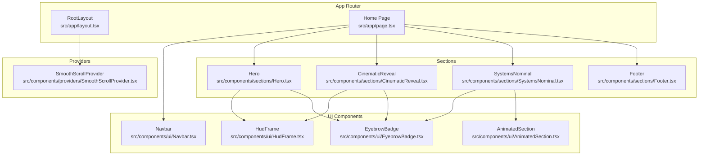
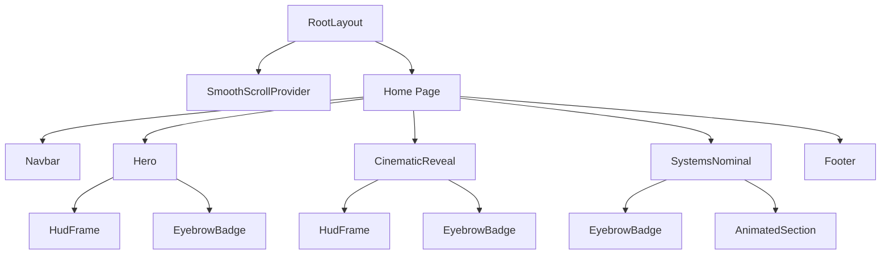
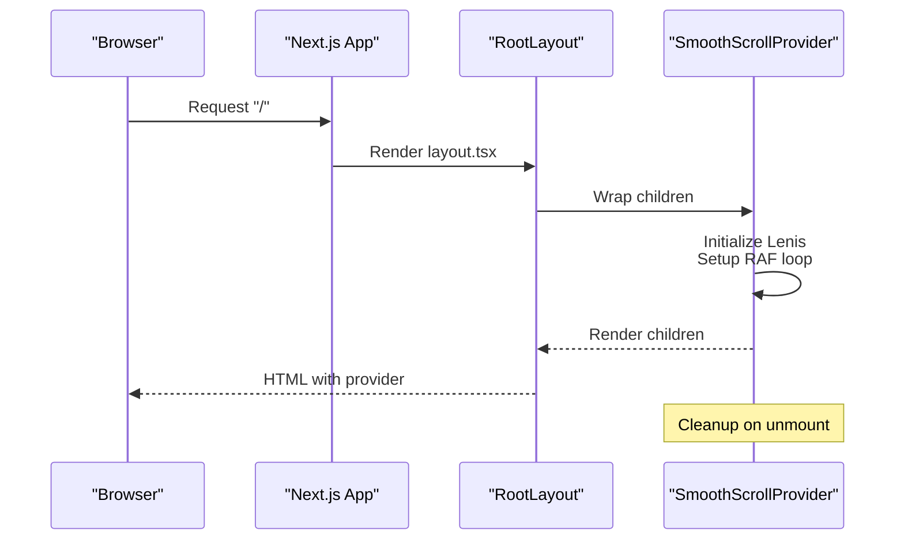
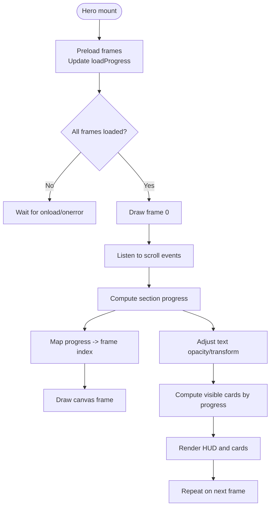
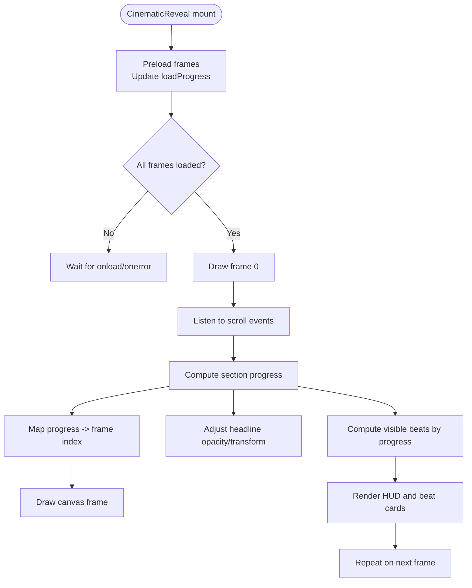
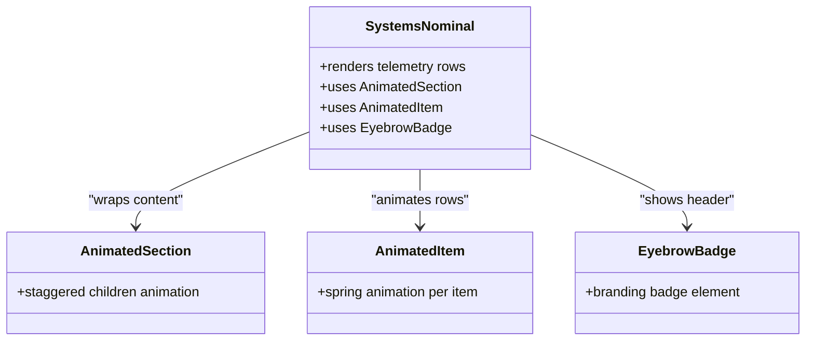
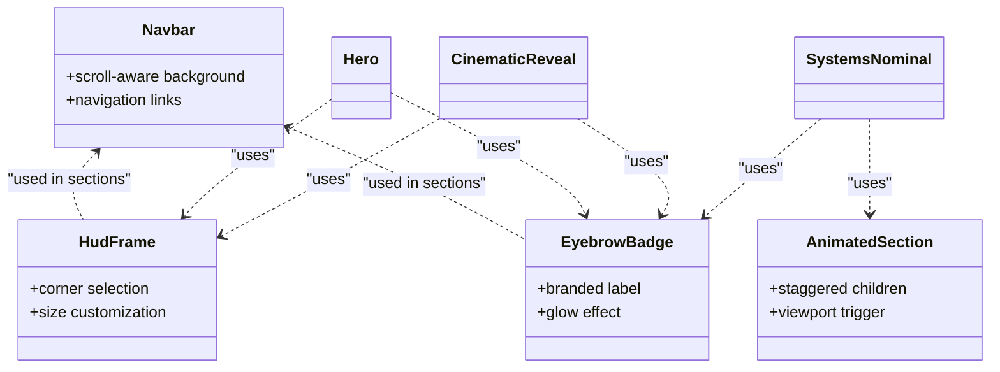
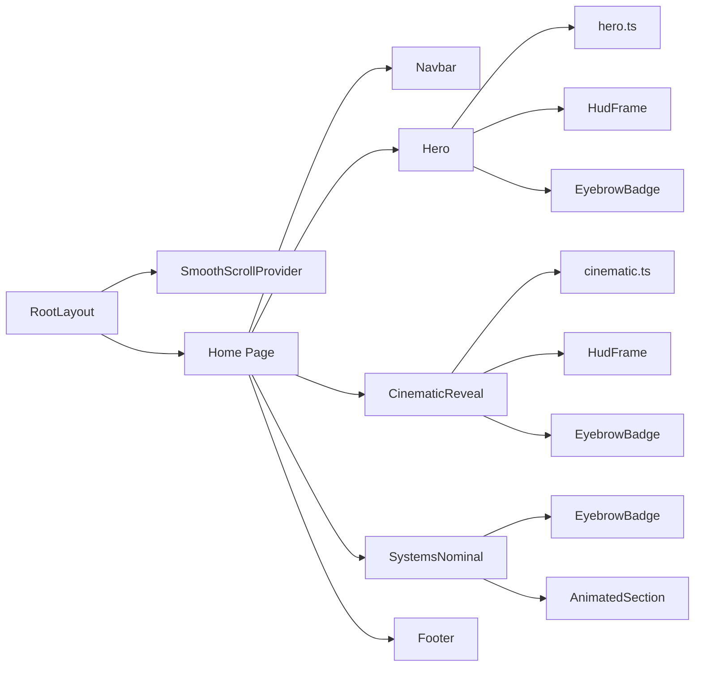

# Component Hierarchy

<cite>
**Referenced Files in This Document**
- [layout.tsx](file://src/app/layout.tsx)
- [page.tsx](file://src/app/page.tsx)
- [SmoothScrollProvider.tsx](file://src/components/providers/SmoothScrollProvider.tsx)
- [Hero.tsx](file://src/components/sections/Hero.tsx)
- [CinematicReveal.tsx](file://src/components/sections/CinematicReveal.tsx)
- [SystemsNominal.tsx](file://src/components/sections/SystemsNominal.tsx)
- [Footer.tsx](file://src/components/sections/Footer.tsx)
- [Navbar.tsx](file://src/components/ui/Navbar.tsx)
- [HudFrame.tsx](file://src/components/ui/HudFrame.tsx)
- [EyebrowBadge.tsx](file://src/components/ui/EyebrowBadge.tsx)
- [AnimatedSection.tsx](file://src/components/ui/AnimatedSection.tsx)
- [hero.ts](file://src/lib/hero.ts)
- [cinematic.ts](file://src/lib/cinematic.ts)
</cite>

## Table of Contents
1. [Introduction](#introduction)
2. [Project Structure](#project-structure)
3. [Core Components](#core-components)
4. [Architecture Overview](#architecture-overview)
5. [Detailed Component Analysis](#detailed-component-analysis)
6. [Dependency Analysis](#dependency-analysis)
7. [Performance Considerations](#performance-considerations)
8. [Troubleshooting Guide](#troubleshooting-guide)
9. [Conclusion](#conclusion)

## Introduction
This document explains the component hierarchy and organization in the Iron Man project. It focuses on the Next.js App Router structure, the global provider pattern, and the section-based composition of the home page. It also documents the UI component organization, including reusable elements such as Navbar, HudFrame, EyebrowBadge, and AnimatedSection. The document provides diagrams that illustrate parent-child relationships, prop flows, and data movement across components.

## Project Structure
The project follows a clear separation of concerns:
- App Router entry points define the root layout and the home page.
- Providers encapsulate cross-cutting concerns like smooth scrolling.
- Sections represent major viewport-height segments of the page.
- UI components are small, reusable, and composable.

**Diagram sources**
- [layout.tsx:23-36](file://src/app/layout.tsx#L23-L36)
- [page.tsx:7-19](file://src/app/page.tsx#L7-L19)
- [SmoothScrollProvider.tsx:8-36](file://src/components/providers/SmoothScrollProvider.tsx#L8-L36)
- [Hero.tsx:184-365](file://src/components/sections/Hero.tsx#L184-L365)
- [CinematicReveal.tsx:188-381](file://src/components/sections/CinematicReveal.tsx#L188-L381)
- [SystemsNominal.tsx:14-76](file://src/components/sections/SystemsNominal.tsx#L14-L76)
- [Footer.tsx:3-62](file://src/components/sections/Footer.tsx#L3-L62)
- [Navbar.tsx:7-66](file://src/components/ui/Navbar.tsx#L7-L66)
- [HudFrame.tsx:7-31](file://src/components/ui/HudFrame.tsx#L7-L31)
- [EyebrowBadge.tsx:3-16](file://src/components/ui/EyebrowBadge.tsx#L3-L16)
- [AnimatedSection.tsx:22-42](file://src/components/ui/AnimatedSection.tsx#L22-L42)

**Section sources**
- [layout.tsx:1-37](file://src/app/layout.tsx#L1-L37)
- [page.tsx:1-20](file://src/app/page.tsx#L1-L20)

## Core Components
- RootLayout: Wraps the entire application with fonts, metadata, and the global provider. It ensures the provider is mounted at the root level to enable smooth scrolling across the whole app.
- SmoothScrollProvider: Initializes and manages Lenis smooth scrolling via a ref and RAF loop. It cleans up on unmount.
- Home page: Composes the page layout by rendering Navbar, Hero, CinematicReveal, SystemsNominal, and Footer.

Key relationships:
- RootLayout depends on SmoothScrollProvider.
- Home page composes UI and section components.

**Section sources**
- [layout.tsx:23-36](file://src/app/layout.tsx#L23-L36)
- [SmoothScrollProvider.tsx:8-36](file://src/components/providers/SmoothScrollProvider.tsx#L8-L36)
- [page.tsx:7-19](file://src/app/page.tsx#L7-L19)

## Architecture Overview
The architecture is section-centric:
- Each section occupies a full viewport height and reacts to scroll to animate internal elements.
- Shared UI elements (HudFrame, EyebrowBadge) are embedded within sections.
- AnimatedSection provides a lightweight animation wrapper for content in SystemsNominal.

**Diagram sources**
- [layout.tsx:23-36](file://src/app/layout.tsx#L23-L36)
- [page.tsx:7-19](file://src/app/page.tsx#L7-L19)
- [Hero.tsx:204-215](file://src/components/sections/Hero.tsx#L204-L215)
- [Hero.tsx:222](file://src/components/sections/Hero.tsx#L222)
- [CinematicReveal.tsx:212-223](file://src/components/sections/CinematicReveal.tsx#L212-L223)
- [CinematicReveal.tsx:226](file://src/components/sections/CinematicReveal.tsx#L226)
- [SystemsNominal.tsx:21-52](file://src/components/sections/SystemsNominal.tsx#L21-L52)
- [AnimatedSection.tsx:22-34](file://src/components/ui/AnimatedSection.tsx#L22-L34)

## Detailed Component Analysis

### Root Layout and Provider
- RootLayout sets fonts, metadata, and wraps children with SmoothScrollProvider.
- SmoothScrollProvider initializes Lenis with configured parameters, runs RAF, and tears down on unmount.

**Diagram sources**
- [layout.tsx:23-36](file://src/app/layout.tsx#L23-L36)
- [SmoothScrollProvider.tsx:11-33](file://src/components/providers/SmoothScrollProvider.tsx#L11-L33)

**Section sources**
- [layout.tsx:23-36](file://src/app/layout.tsx#L23-L36)
- [SmoothScrollProvider.tsx:8-36](file://src/components/providers/SmoothScrollProvider.tsx#L8-L36)

### Hero Section
- Purpose: Full-viewport animated hero with canvas-driven frame sequencing, HUD overlays, and animated text cards.
- Data sources: Uses FRAME_COUNT and DIALOGUES from hero.ts to drive loading and visibility.
- Internal mechanics:
  - Preloads frames and tracks load progress.
  - On scroll, computes section progress and draws the appropriate frame.
  - Animates text and HUD elements based on progress.
  - Renders EyebrowBadge and multiple dialog cards conditionally based on progress windows.

**Diagram sources**
- [Hero.tsx:26-59](file://src/components/sections/Hero.tsx#L26-L59)
- [Hero.tsx:108-118](file://src/components/sections/Hero.tsx#L108-L118)
- [Hero.tsx:120-182](file://src/components/sections/Hero.tsx#L120-L182)
- [hero.ts:1-43](file://src/lib/hero.ts#L1-L43)

**Section sources**
- [Hero.tsx:8-365](file://src/components/sections/Hero.tsx#L8-L365)
- [hero.ts:1-43](file://src/lib/hero.ts#L1-L43)

### Cinematic Reveal Section
- Purpose: Full-viewport cinematic playback with frame sequencing and beat cards.
- Data sources: Uses CINE_FRAME_COUNT and BEATS from cinematic.ts.
- Internal mechanics:
  - Similar preloading and drawing pipeline as Hero.
  - Progress gates control visibility of headline texts and beat cards.
  - Displays sequence readout and HUD elements.

**Diagram sources**
- [CinematicReveal.tsx:27-60](file://src/components/sections/CinematicReveal.tsx#L27-L60)
- [CinematicReveal.tsx:107-117](file://src/components/sections/CinematicReveal.tsx#L107-L117)
- [CinematicReveal.tsx:119-186](file://src/components/sections/CinematicReveal.tsx#L119-L186)
- [cinematic.ts:1-47](file://src/lib/cinematic.ts#L1-L47)

**Section sources**
- [CinematicReveal.tsx:8-383](file://src/components/sections/CinematicReveal.tsx#L8-L383)
- [cinematic.ts:1-47](file://src/lib/cinematic.ts#L1-L47)

### Systems Nominal Section
- Purpose: Present telemetry-like data in a responsive grid with animated entrance.
- Composition:
  - Uses AnimatedSection and AnimatedItem to orchestrate staggered animations.
  - Uses EyebrowBadge for branding and AnimatedSection for content groups.
  - Provides a call-to-action link to the footer.

**Diagram sources**
- [SystemsNominal.tsx:14-76](file://src/components/sections/SystemsNominal.tsx#L14-L76)
- [AnimatedSection.tsx:22-42](file://src/components/ui/AnimatedSection.tsx#L22-L42)
- [EyebrowBadge.tsx:3-16](file://src/components/ui/EyebrowBadge.tsx#L3-L16)

**Section sources**
- [SystemsNominal.tsx:14-76](file://src/components/sections/SystemsNominal.tsx#L14-L76)
- [AnimatedSection.tsx:22-42](file://src/components/ui/AnimatedSection.tsx#L22-L42)
- [EyebrowBadge.tsx:3-16](file://src/components/ui/EyebrowBadge.tsx#L3-L16)

### UI Components
- Navbar: Fixed header that changes appearance on scroll, with navigation links and a call-to-action.
- HudFrame: SVG-based corner frame component used for HUD accents.
- EyebrowBadge: Small branded badge with a subtle glow effect.
- AnimatedSection: Motion wrapper using Framer Motion for staggered and spring animations.

**Diagram sources**
- [Navbar.tsx:7-66](file://src/components/ui/Navbar.tsx#L7-L66)
- [HudFrame.tsx:7-31](file://src/components/ui/HudFrame.tsx#L7-L31)
- [EyebrowBadge.tsx:3-16](file://src/components/ui/EyebrowBadge.tsx#L3-L16)
- [AnimatedSection.tsx:22-42](file://src/components/ui/AnimatedSection.tsx#L22-L42)
- [Hero.tsx:204-215](file://src/components/sections/Hero.tsx#L204-L215)
- [Hero.tsx:222](file://src/components/sections/Hero.tsx#L222)
- [CinematicReveal.tsx:212-223](file://src/components/sections/CinematicReveal.tsx#L212-L223)
- [CinematicReveal.tsx:226](file://src/components/sections/CinematicReveal.tsx#L226)
- [SystemsNominal.tsx:21-52](file://src/components/sections/SystemsNominal.tsx#L21-L52)

**Section sources**
- [Navbar.tsx:7-66](file://src/components/ui/Navbar.tsx#L7-L66)
- [HudFrame.tsx:7-31](file://src/components/ui/HudFrame.tsx#L7-L31)
- [EyebrowBadge.tsx:3-16](file://src/components/ui/EyebrowBadge.tsx#L3-L16)
- [AnimatedSection.tsx:22-42](file://src/components/ui/AnimatedSection.tsx#L22-L42)

## Dependency Analysis
- App Router dependencies:
  - RootLayout depends on SmoothScrollProvider.
  - Home page composes Navbar, Hero, CinematicReveal, SystemsNominal, and Footer.
- Section dependencies:
  - Hero and CinematicReveal depend on shared UI components (HudFrame, EyebrowBadge).
  - SystemsNominal depends on AnimatedSection and EyebrowBadge.
- Data dependencies:
  - Hero uses hero.ts constants and dialogue definitions.
  - CinematicReveal uses cinematic.ts constants and beat definitions.

**Diagram sources**
- [layout.tsx:23-36](file://src/app/layout.tsx#L23-L36)
- [page.tsx:7-19](file://src/app/page.tsx#L7-L19)
- [hero.ts:1-43](file://src/lib/hero.ts#L1-L43)
- [cinematic.ts:1-47](file://src/lib/cinematic.ts#L1-L47)
- [Hero.tsx:4-6](file://src/components/sections/Hero.tsx#L4-L6)
- [CinematicReveal.tsx:4-6](file://src/components/sections/CinematicReveal.tsx#L4-L6)
- [SystemsNominal.tsx:3-5](file://src/components/sections/SystemsNominal.tsx#L3-L5)

**Section sources**
- [page.tsx:7-19](file://src/app/page.tsx#L7-L19)
- [hero.ts:1-43](file://src/lib/hero.ts#L1-L43)
- [cinematic.ts:1-47](file://src/lib/cinematic.ts#L1-L47)

## Performance Considerations
- Canvas rendering:
  - Both Hero and CinematicReveal draw frames on scroll. Using requestAnimationFrame and debouncing with a ticking flag prevents excessive redraws.
  - Device pixel ratio scaling ensures crisp rendering on high-DPI displays.
- Lazy initialization:
  - Frames are preloaded with onload/onerror callbacks to avoid blocking the initial render.
- Scroll listeners:
  - Passive event listeners reduce jank during scroll.
- Motion:
  - AnimatedSection uses viewport triggers and once-only animations to minimize re-renders after initial view.

[No sources needed since this section provides general guidance]

## Troubleshooting Guide
- Smooth scrolling not working:
  - Verify SmoothScrollProvider is rendered by RootLayout and that Lenis is initialized without errors.
  - Check RAF loop teardown on unmount.
- Hero/Cinematic frames not animating:
  - Confirm all frames are preloaded and the loaded flag is true before drawing.
  - Ensure the section’s bounding rect is measured correctly and scrollable height is computed.
- HUD or text elements not appearing:
  - Check progress thresholds and fade gates in each section’s scroll handler.
  - Verify refs are attached and DOM updates occur inside requestAnimationFrame.
- AnimatedSection not triggering:
  - Ensure viewport options are configured correctly and the container is in view.
  - Confirm viewport margins and once flags match intended behavior.

**Section sources**
- [SmoothScrollProvider.tsx:11-33](file://src/components/providers/SmoothScrollProvider.tsx#L11-L33)
- [Hero.tsx:120-182](file://src/components/sections/Hero.tsx#L120-L182)
- [CinematicReveal.tsx:119-186](file://src/components/sections/CinematicReveal.tsx#L119-L186)
- [AnimatedSection.tsx:22-34](file://src/components/ui/AnimatedSection.tsx#L22-L34)

## Conclusion
The Iron Man project organizes its UI around a clean section-based structure with a global provider for smooth scrolling. The home page composes a Navbar and three major sections—Hero, CinematicReveal, and SystemsNominal—each implementing scroll-driven animations and shared UI elements. Reusable components like HudFrame, EyebrowBadge, and AnimatedSection keep the codebase modular and maintainable. The architecture balances performance with rich visual storytelling while keeping component responsibilities focused and predictable.