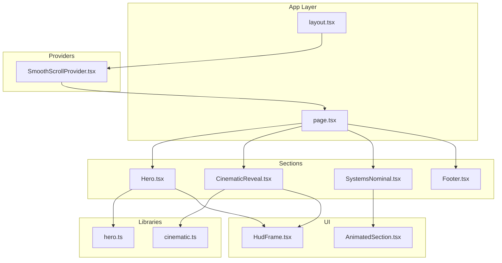
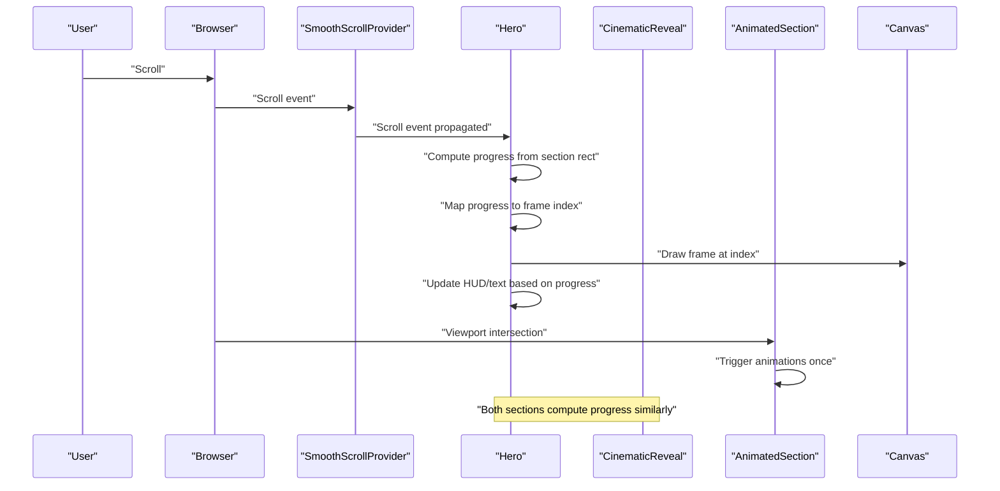
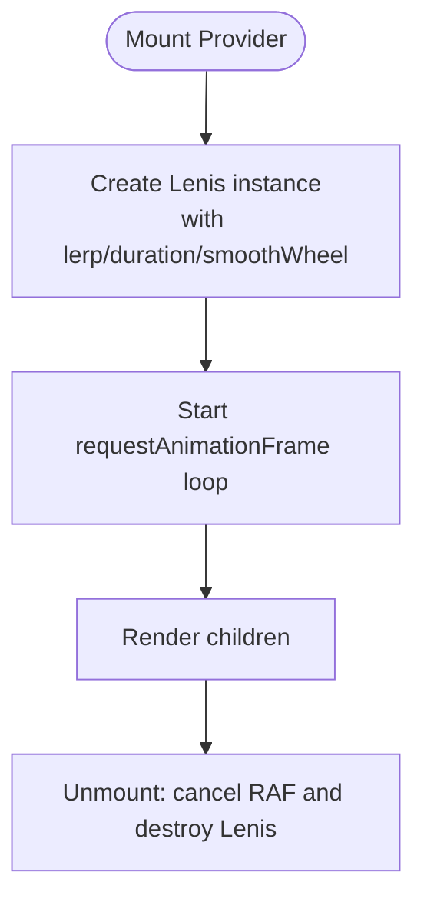
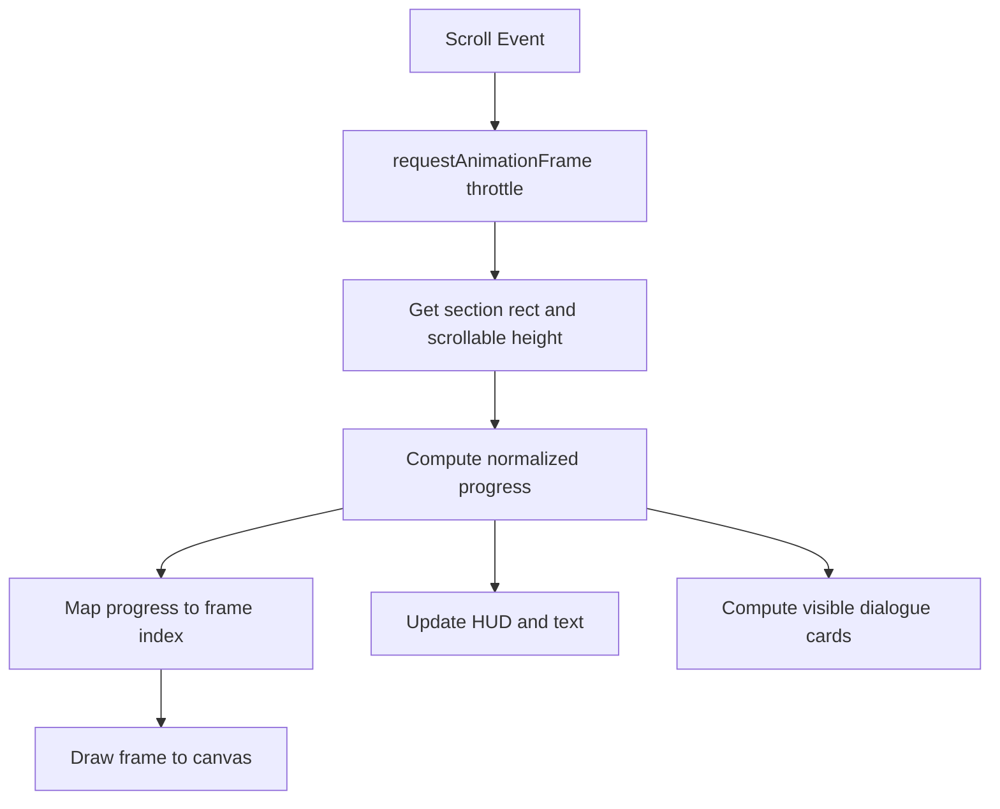
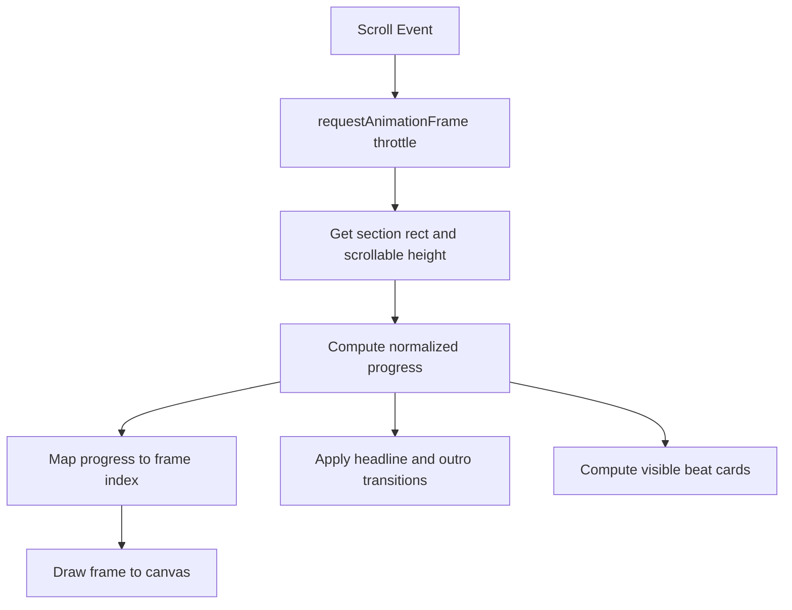
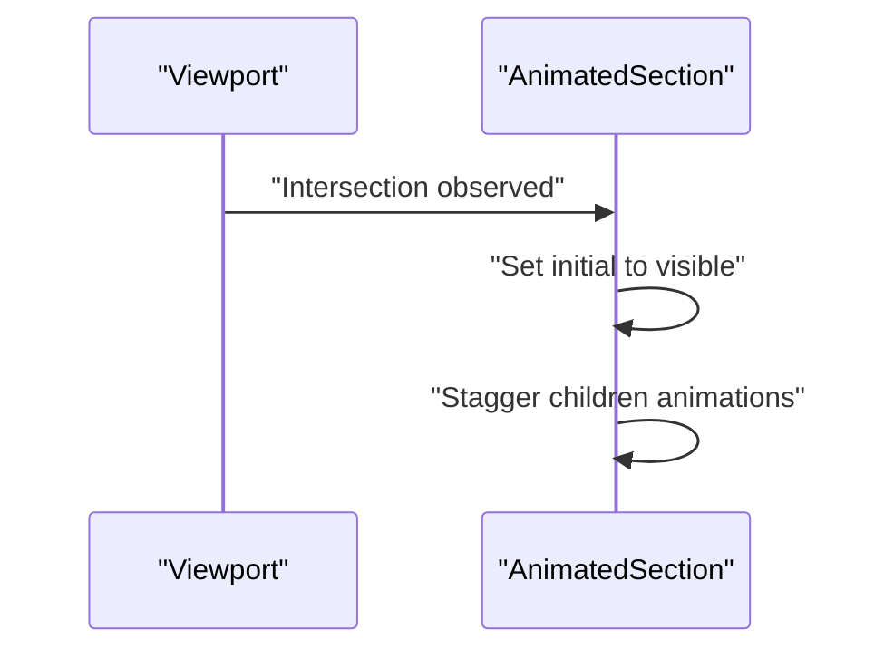
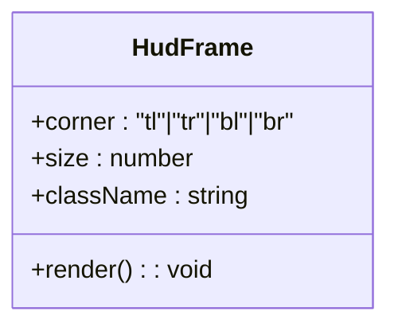
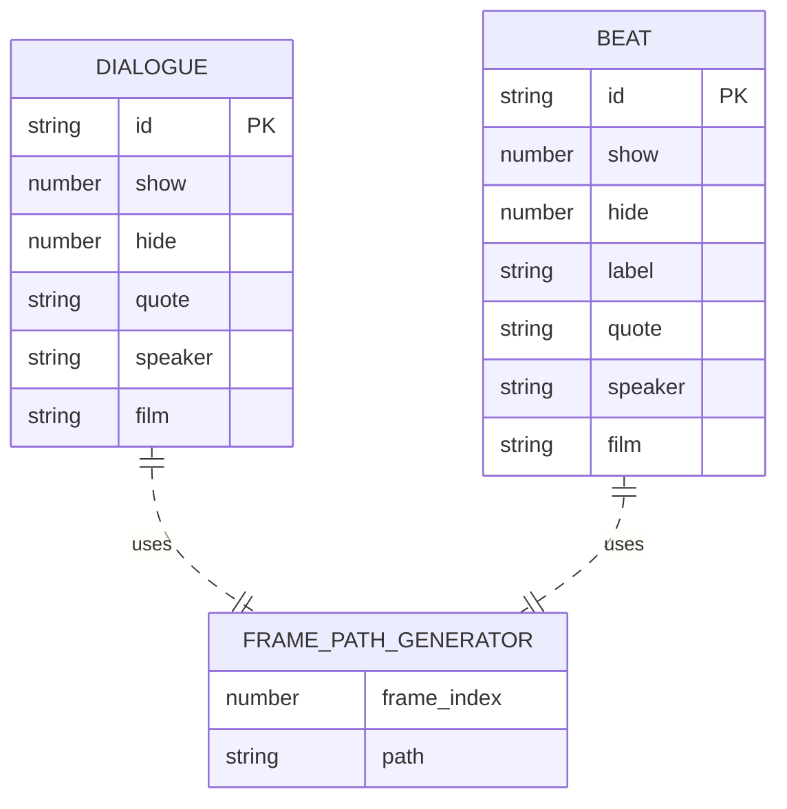
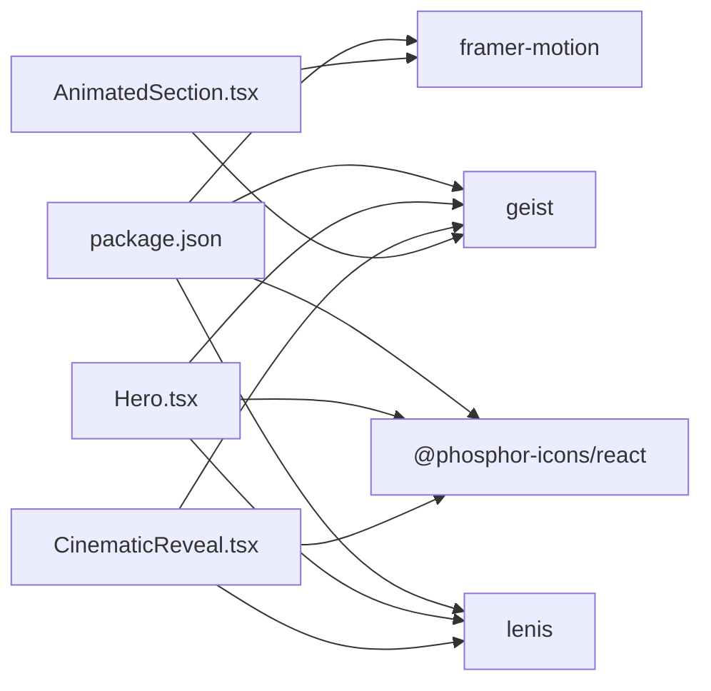

# Data Flow Patterns

<cite>
**Referenced Files in This Document**
- [SmoothScrollProvider.tsx](file://src/components/providers/SmoothScrollProvider.tsx)
- [layout.tsx](file://src/app/layout.tsx)
- [page.tsx](file://src/app/page.tsx)
- [Hero.tsx](file://src/components/sections/Hero.tsx)
- [CinematicReveal.tsx](file://src/components/sections/CinematicReveal.tsx)
- [AnimatedSection.tsx](file://src/components/ui/AnimatedSection.tsx)
- [HudFrame.tsx](file://src/components/ui/HudFrame.tsx)
- [hero.ts](file://src/lib/hero.ts)
- [cinematic.ts](file://src/lib/cinematic.ts)
- [SystemsNominal.tsx](file://src/components/sections/SystemsNominal.tsx)
- [Footer.tsx](file://src/components/sections/Footer.tsx)
- [package.json](file://package.json)
</cite>

## Table of Contents
1. [Introduction](#introduction)
2. [Project Structure](#project-structure)
3. [Core Components](#core-components)
4. [Architecture Overview](#architecture-overview)
5. [Detailed Component Analysis](#detailed-component-analysis)
6. [Dependency Analysis](#dependency-analysis)
7. [Performance Considerations](#performance-considerations)
8. [Troubleshooting Guide](#troubleshooting-guide)
9. [Conclusion](#conclusion)

## Introduction
This document explains the data flow patterns in the Iron Man animation system. It focuses on how scroll position data flows from a smooth-scroll provider to animation components, how frame indices are computed from scroll progress, and how animation states propagate through the component tree. It also documents the coordination between canvas frame loading, Framer Motion viewport detection, and HUD element visibility control, along with state management patterns for scroll-aware components, animation progress tracking, and component visibility states. Finally, it provides diagrams illustrating the end-to-end pipeline from user input (scroll events) through calculation layers to visual output (canvas rendering and motion animations), and offers performance considerations for the data flow pipeline.

## Project Structure
The application is a Next.js app with a strict separation of concerns:
- Providers: global smoothing of scroll behavior
- Pages: composition of sections
- Sections: scroll-driven animations and HUD elements
- UI: reusable components like animated sections and HUD frames
- Libraries: constants and timing data for sequences

**Diagram sources**
- [layout.tsx:23-35](file://src/app/layout.tsx#L23-L35)
- [page.tsx:7-18](file://src/app/page.tsx#L7-L18)
- [SmoothScrollProvider.tsx:8-36](file://src/components/providers/SmoothScrollProvider.tsx#L8-L36)
- [Hero.tsx:8-365](file://src/components/sections/Hero.tsx#L8-L365)
- [CinematicReveal.tsx:8-383](file://src/components/sections/CinematicReveal.tsx#L8-L383)
- [AnimatedSection.tsx:22-42](file://src/components/ui/AnimatedSection.tsx#L22-L42)
- [HudFrame.tsx:7-31](file://src/components/ui/HudFrame.tsx#L7-L31)
- [hero.ts:1-43](file://src/lib/hero.ts#L1-L43)
- [cinematic.ts:1-47](file://src/lib/cinematic.ts#L1-L47)

**Section sources**
- [layout.tsx:23-35](file://src/app/layout.tsx#L23-L35)
- [page.tsx:7-18](file://src/app/page.tsx#L7-L18)

## Core Components
- SmoothScrollProvider: Initializes and runs a Lenis instance to smooth scroll, delegating to requestAnimationFrame for consistent updates.
- Hero: Canvas-based sequence playback, scroll-progress-driven frame selection, HUD elements, and dialogue cards.
- CinematicReveal: Similar canvas sequence playback with cinematic beats and HUD elements.
- AnimatedSection: Framer Motion viewport-triggered animations using viewport detection.
- Libraries: hero.ts and cinematic.ts define frame counts, frame paths, and dialog/beat timing data.

Key state management patterns:
- Local component state for load progress, loaded flag, visible sets, and last drawn frame index.
- Refs for DOM nodes, images, and booleans to minimize re-renders and stabilize cross-frame references.
- requestAnimationFrame throttling to coalesce scroll updates.

**Section sources**
- [SmoothScrollProvider.tsx:8-36](file://src/components/providers/SmoothScrollProvider.tsx#L8-L36)
- [Hero.tsx:22-25](file://src/components/sections/Hero.tsx#L22-L25)
- [CinematicReveal.tsx:23-26](file://src/components/sections/CinematicReveal.tsx#L23-L26)
- [AnimatedSection.tsx:22-34](file://src/components/ui/AnimatedSection.tsx#L22-L34)
- [hero.ts:1-43](file://src/lib/hero.ts#L1-L43)
- [cinematic.ts:1-47](file://src/lib/cinematic.ts#L1-L47)

## Architecture Overview
The system orchestrates three primary animation streams:
- Canvas frame loading and rendering: preloads images and draws frames onto a canvas based on scroll progress.
- Scroll-aware HUD and text: adjusts opacity, transforms, and text content based on normalized scroll progress.
- Framer Motion viewport detection: triggers animations when sections enter the viewport.

**Diagram sources**
- [SmoothScrollProvider.tsx:11-33](file://src/components/providers/SmoothScrollProvider.tsx#L11-L33)
- [Hero.tsx:120-182](file://src/components/sections/Hero.tsx#L120-L182)
- [CinematicReveal.tsx:119-186](file://src/components/sections/CinematicReveal.tsx#L119-L186)
- [AnimatedSection.tsx:24-33](file://src/components/ui/AnimatedSection.tsx#L24-L33)

## Detailed Component Analysis

### SmoothScrollProvider
- Initializes Lenis with smoothing parameters and integrates with requestAnimationFrame.
- Exposes children to the rest of the app, ensuring all scroll-sensitive components receive smooth scroll deltas.
- Lifecycle cleanup cancels animation frames and destroys the Lenis instance.

**Diagram sources**
- [SmoothScrollProvider.tsx:11-33](file://src/components/providers/SmoothScrollProvider.tsx#L11-L33)

**Section sources**
- [SmoothScrollProvider.tsx:8-36](file://src/components/providers/SmoothScrollProvider.tsx#L8-L36)
- [layout.tsx:32](file://src/app/layout.tsx#L32)

### Hero Section
- Loads frames in sequence, tracks load progress, and marks completion.
- On scroll, computes normalized progress from the section’s bounding rectangle and scrollable height.
- Converts progress to a frame index and draws the corresponding frame to canvas.
- Updates HUD elements (power readout, progress bar, text opacity/transform) based on progress.
- Computes visible dialogue cards by comparing progress against dialogue timing windows.

**Diagram sources**
- [Hero.tsx:120-182](file://src/components/sections/Hero.tsx#L120-L182)
- [Hero.tsx:61-93](file://src/components/sections/Hero.tsx#L61-L93)
- [hero.ts:15-40](file://src/lib/hero.ts#L15-L40)

**Section sources**
- [Hero.tsx:26-59](file://src/components/sections/Hero.tsx#L26-L59)
- [Hero.tsx:120-182](file://src/components/sections/Hero.tsx#L120-L182)
- [Hero.tsx:184-365](file://src/components/sections/Hero.tsx#L184-L365)
- [hero.ts:1-43](file://src/lib/hero.ts#L1-L43)

### CinematicReveal Section
- Mirrors Hero’s pattern: loads frames, computes progress, maps to frame index, draws to canvas.
- Applies specific HUD and headline transitions based on progress thresholds.
- Manages visible beat cards using cinematic timing data.

**Diagram sources**
- [CinematicReveal.tsx:119-186](file://src/components/sections/CinematicReveal.tsx#L119-L186)
- [CinematicReveal.tsx:62-94](file://src/components/sections/CinematicReveal.tsx#L62-L94)
- [cinematic.ts:16-44](file://src/lib/cinematic.ts#L16-L44)

**Section sources**
- [CinematicReveal.tsx:27-60](file://src/components/sections/CinematicReveal.tsx#L27-L60)
- [CinematicReveal.tsx:119-186](file://src/components/sections/CinematicReveal.tsx#L119-L186)
- [CinematicReveal.tsx:188-383](file://src/components/sections/CinematicReveal.tsx#L188-L383)
- [cinematic.ts:1-47](file://src/lib/cinematic.ts#L1-L47)

### AnimatedSection (Framer Motion)
- Uses viewport detection to trigger animations once when the section enters the viewport.
- Provides container and item variants for staggered child animations.

**Diagram sources**
- [AnimatedSection.tsx:24-33](file://src/components/ui/AnimatedSection.tsx#L24-L33)

**Section sources**
- [AnimatedSection.tsx:22-42](file://src/components/ui/AnimatedSection.tsx#L22-L42)
- [SystemsNominal.tsx:14-76](file://src/components/sections/SystemsNominal.tsx#L14-L76)

### HUD Elements
- HudFrame renders cornered frames using SVG paths, sized dynamically.
- Used across sections to decorate HUD areas.

**Diagram sources**
- [HudFrame.tsx:7-31](file://src/components/ui/HudFrame.tsx#L7-L31)

**Section sources**
- [HudFrame.tsx:1-32](file://src/components/ui/HudFrame.tsx#L1-L32)
- [Hero.tsx:204-215](file://src/components/sections/Hero.tsx#L204-L215)
- [CinematicReveal.tsx:212-223](file://src/components/sections/CinematicReveal.tsx#L212-L223)

### Data Models and Timing
- hero.ts defines dialogue timing windows and frame count/path generator.
- cinematic.ts defines beat timing windows and frame count/path generator.
- Both libraries feed numeric thresholds and frame paths to their respective sections.

**Diagram sources**
- [hero.ts:6-13](file://src/lib/hero.ts#L6-L13)
- [hero.ts:15-40](file://src/lib/hero.ts#L15-L40)
- [cinematic.ts:6-14](file://src/lib/cinematic.ts#L6-L14)
- [cinematic.ts:16-44](file://src/lib/cinematic.ts#L16-L44)

**Section sources**
- [hero.ts:1-43](file://src/lib/hero.ts#L1-L43)
- [cinematic.ts:1-47](file://src/lib/cinematic.ts#L1-L47)

## Dependency Analysis
External dependencies:
- lenis: smooth scroll engine integrated via requestAnimationFrame
- framer-motion: viewport detection and animations
- geist fonts: typography
- phosphor-icons/react: icons

**Diagram sources**
- [package.json:11-19](file://package.json#L11-L19)
- [Hero.tsx:3-6](file://src/components/sections/Hero.tsx#L3-L6)
- [CinematicReveal.tsx:3-6](file://src/components/sections/CinematicReveal.tsx#L3-L6)
- [AnimatedSection.tsx:3](file://src/components/ui/AnimatedSection.tsx#L3)

**Section sources**
- [package.json:11-19](file://package.json#L11-L19)

## Performance Considerations
- requestAnimationFrame throttling: scroll handlers use a boolean flag and requestAnimationFrame to coalesce updates, preventing excessive redraws.
- Device pixel ratio scaling: canvases are sized to devicePixelRatio to avoid blurry rendering.
- Early exits: components skip drawing and DOM updates when not loaded or when no change in frame index occurs.
- Passive scroll listeners: scroll events are attached with passive: true to improve scroll performance.
- IntersectionObserver-based viewport detection: Framer Motion uses viewport detection to avoid unnecessary animations until sections are visible.
- Preloading frames: images are preloaded with onload/onerror callbacks to track progress and mark readiness once all frames are loaded.
- Minimal re-renders: refs are used for DOM nodes and image arrays to avoid prop churn and keep render paths stable.

[No sources needed since this section provides general guidance]

## Troubleshooting Guide
Common issues and remedies:
- Canvas not updating: ensure the section is mounted and loaded flags are true; verify drawFrame receives a valid index and canvas context.
- HUD elements not appearing: confirm progress thresholds are met and DOM refs are attached; check opacity/transform calculations.
- Dialog/beat cards not toggling: verify progress thresholds in hero.ts/cinematic.ts and compare against current progress; ensure visible sets are updated only when IDs change.
- Framer Motion not animating: check viewport margins and once flag; ensure sections are tall enough to intersect the viewport.
- Scroll feels choppy: confirm Lenis is initialized and RAF loop is running; verify passive scroll listener is enabled.

**Section sources**
- [Hero.tsx:120-182](file://src/components/sections/Hero.tsx#L120-L182)
- [CinematicReveal.tsx:119-186](file://src/components/sections/CinematicReveal.tsx#L119-L186)
- [AnimatedSection.tsx:24-33](file://src/components/ui/AnimatedSection.tsx#L24-L33)
- [SmoothScrollProvider.tsx:11-33](file://src/components/providers/SmoothScrollProvider.tsx#L11-L33)

## Conclusion
The Iron Man animation system demonstrates a cohesive data flow pipeline:
- Smooth scroll is centralized via a provider that ensures consistent scroll deltas.
- Scroll position is transformed into normalized progress per section.
- Progress maps deterministically to frame indices, driving canvas rendering and HUD/text updates.
- Visibility of dialog/beat cards is computed from progress against library-defined timing windows.
- Framer Motion complements the pipeline by triggering viewport-bound animations once.
Performance is addressed through throttling, device pixel scaling, early exits, and preloading strategies.

[No sources needed since this section summarizes without analyzing specific files]