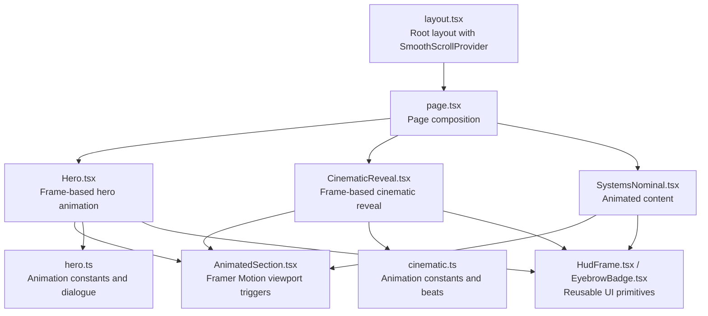
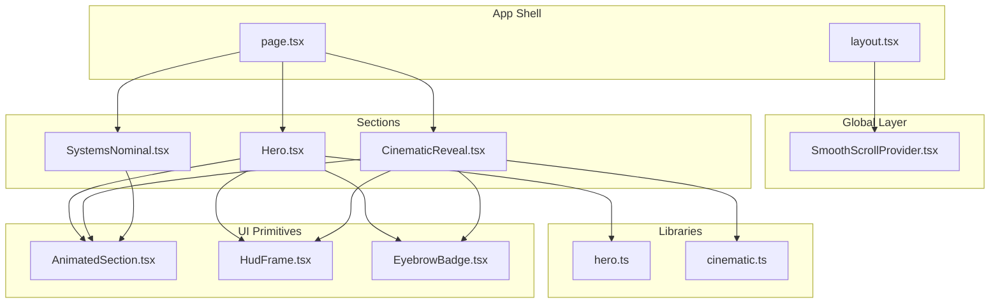
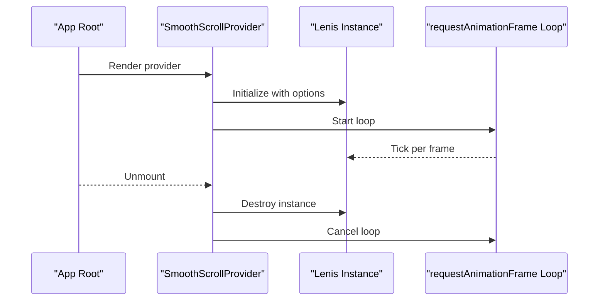
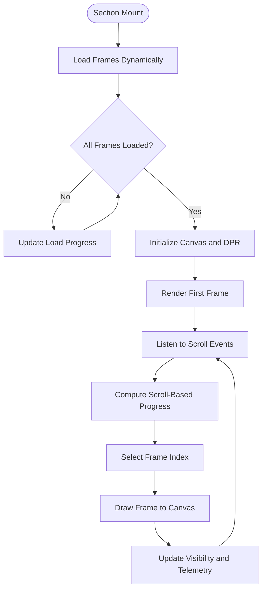
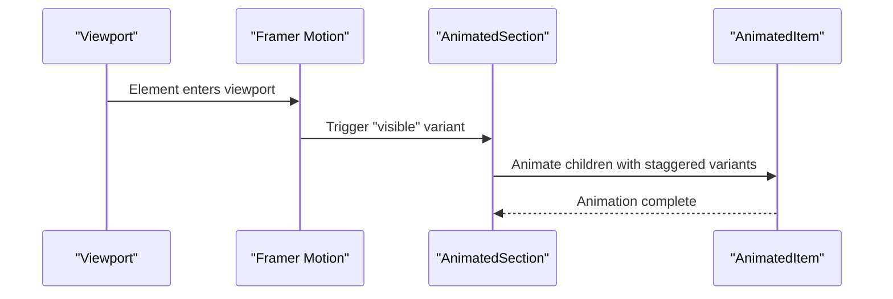
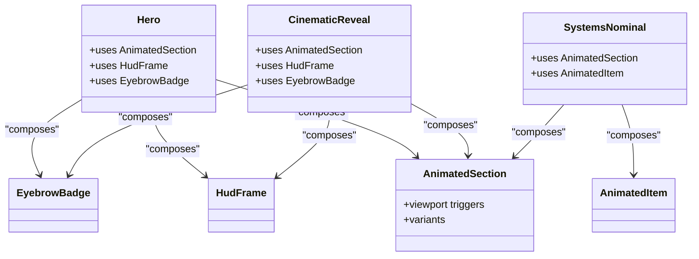
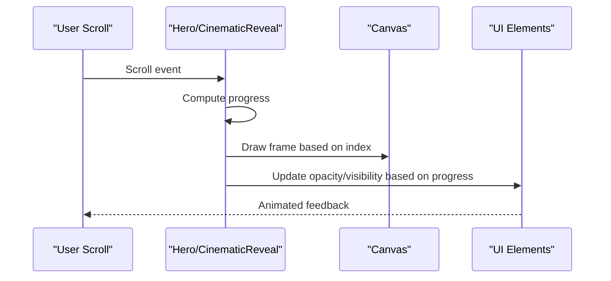
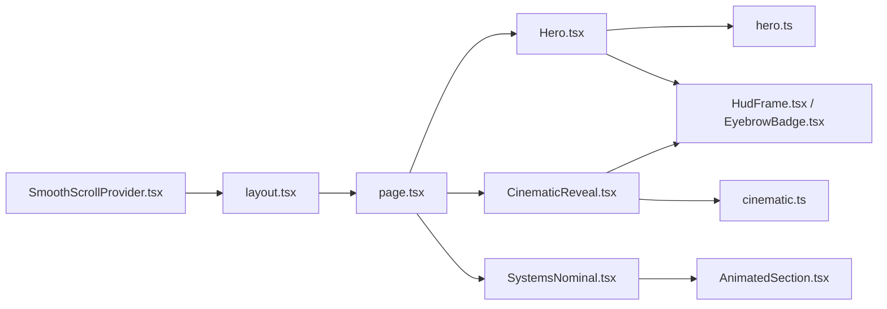

# Design Patterns

<cite>
**Referenced Files in This Document**
- [SmoothScrollProvider.tsx](file://src/components/providers/SmoothScrollProvider.tsx)
- [layout.tsx](file://src/app/layout.tsx)
- [AnimatedSection.tsx](file://src/components/ui/AnimatedSection.tsx)
- [Hero.tsx](file://src/components/sections/Hero.tsx)
- [CinematicReveal.tsx](file://src/components/sections/CinematicReveal.tsx)
- [cinematic.ts](file://src/lib/cinematic.ts)
- [hero.ts](file://src/lib/hero.ts)
- [HudFrame.tsx](file://src/components/ui/HudFrame.tsx)
- [EyebrowBadge.tsx](file://src/components/ui/EyebrowBadge.tsx)
- [SystemsNominal.tsx](file://src/components/sections/SystemsNominal.tsx)
- [page.tsx](file://src/app/page.tsx)
</cite>

## Table of Contents
1. [Introduction](#introduction)
2. [Project Structure](#project-structure)
3. [Core Components](#core-components)
4. [Architecture Overview](#architecture-overview)
5. [Detailed Component Analysis](#detailed-component-analysis)
6. [Dependency Analysis](#dependency-analysis)
7. [Performance Considerations](#performance-considerations)
8. [Troubleshooting Guide](#troubleshooting-guide)
9. [Conclusion](#conclusion)

## Introduction
This document analyzes the design patterns implemented in the Iron Man project. The site combines a smooth-scroll experience, frame-based animation sequences, viewport-triggered animations, and a component composition model to deliver an immersive scroll-driven narrative. The patterns documented here include:
- Provider pattern for global state management (smooth scrolling)
- Factory-like patterns for frame loading and animation sequences
- Observer pattern via Intersection Observer API for scroll-based triggers
- Component composition pattern for building complex UIs from small, reusable parts
- Viewport-based animation pattern integrating Framer Motion with scroll detection

## Project Structure
The project is organized around a Next.js app shell with a provider at the root, followed by page-level composition of sections and UI components. Providers encapsulate cross-cutting concerns, while sections and UI components are modular and composable.

**Diagram sources**
- [layout.tsx:23-36](file://src/app/layout.tsx#L23-L36)
- [page.tsx:7-19](file://src/app/page.tsx#L7-L19)
- [Hero.tsx:8-366](file://src/components/sections/Hero.tsx#L8-L366)
- [CinematicReveal.tsx:8-384](file://src/components/sections/CinematicReveal.tsx#L8-L384)
- [SystemsNominal.tsx:14-77](file://src/components/sections/SystemsNominal.tsx#L14-L77)
- [AnimatedSection.tsx:22-43](file://src/components/ui/AnimatedSection.tsx#L22-L43)
- [hero.ts:1-43](file://src/lib/hero.ts#L1-L43)
- [cinematic.ts:1-47](file://src/lib/cinematic.ts#L1-L47)
- [HudFrame.tsx:7-31](file://src/components/ui/HudFrame.tsx#L7-L31)
- [EyebrowBadge.tsx:3-16](file://src/components/ui/EyebrowBadge.tsx#L3-L16)

**Section sources**
- [layout.tsx:23-36](file://src/app/layout.tsx#L23-L36)
- [page.tsx:7-19](file://src/app/page.tsx#L7-L19)

## Core Components
- SmoothScrollProvider: Initializes and manages a global smooth scroll instance using Lenis, exposing a provider that wraps the entire app.
- Frame libraries: hero.ts and cinematic.ts define constants and helpers for frame-based animations, including frame paths and timing data.
- UI primitives: HudFrame and EyebrowBadge are small, focused components reused across sections.
- AnimatedSection: Provides viewport-triggered animations using Framer Motion’s in-view triggers and variants.
- Sections: Hero and CinematicReveal orchestrate frame loading, canvas rendering, scroll-driven progress calculation, and dynamic UI updates. SystemsNominal composes animated content using AnimatedSection and AnimatedItem.

**Section sources**
- [SmoothScrollProvider.tsx:8-37](file://src/components/providers/SmoothScrollProvider.tsx#L8-L37)
- [hero.ts:1-43](file://src/lib/hero.ts#L1-L43)
- [cinematic.ts:1-47](file://src/lib/cinematic.ts#L1-L47)
- [HudFrame.tsx:7-31](file://src/components/ui/HudFrame.tsx#L7-L31)
- [EyebrowBadge.tsx:3-16](file://src/components/ui/EyebrowBadge.tsx#L3-L16)
- [AnimatedSection.tsx:22-43](file://src/components/ui/AnimatedSection.tsx#L22-L43)
- [Hero.tsx:8-366](file://src/components/sections/Hero.tsx#L8-L366)
- [CinematicReveal.tsx:8-384](file://src/components/sections/CinematicReveal.tsx#L8-L384)
- [SystemsNominal.tsx:14-77](file://src/components/sections/SystemsNominal.tsx#L14-L77)

## Architecture Overview
The architecture centers on a provider-first approach for smooth scrolling, with sections that independently manage frame loading and scroll-driven rendering. Framer Motion handles viewport-based animations, while reusable UI primitives keep components cohesive and consistent.

**Diagram sources**
- [layout.tsx:23-36](file://src/app/layout.tsx#L23-L36)
- [page.tsx:7-19](file://src/app/page.tsx#L7-L19)
- [SmoothScrollProvider.tsx:8-37](file://src/components/providers/SmoothScrollProvider.tsx#L8-L37)
- [Hero.tsx:8-366](file://src/components/sections/Hero.tsx#L8-L366)
- [CinematicReveal.tsx:8-384](file://src/components/sections/CinematicReveal.tsx#L8-L384)
- [SystemsNominal.tsx:14-77](file://src/components/sections/SystemsNominal.tsx#L14-L77)
- [AnimatedSection.tsx:22-43](file://src/components/ui/AnimatedSection.tsx#L22-L43)
- [HudFrame.tsx:7-31](file://src/components/ui/HudFrame.tsx#L7-L31)
- [EyebrowBadge.tsx:3-16](file://src/components/ui/EyebrowBadge.tsx#L3-L16)
- [hero.ts:1-43](file://src/lib/hero.ts#L1-L43)
- [cinematic.ts:1-47](file://src/lib/cinematic.ts#L1-L47)

## Detailed Component Analysis

### Provider Pattern: SmoothScrollProvider
- Purpose: Centralizes smooth scrolling initialization and lifecycle management using Lenis, ensuring a single source of truth for scroll behavior across the app.
- Implementation highlights:
  - Creates a Lenis instance with configurable interpolation and wheel smoothing.
  - Runs a requestAnimationFrame loop to integrate with Lenis’ internal loop.
  - Cleans up resources on unmount to prevent memory leaks.
- Benefits:
  - Consistent scroll behavior across pages.
  - Decouples scroll logic from individual sections.
  - Simplifies teardown and avoids global state conflicts.
- Alternatives considered:
  - Native smooth scrolling APIs: limited control and browser inconsistencies.
  - Third-party libraries without RAF integration: potential jank during scroll.

**Diagram sources**
- [SmoothScrollProvider.tsx:11-33](file://src/components/providers/SmoothScrollProvider.tsx#L11-L33)
- [layout.tsx:32](file://src/app/layout.tsx#L32)

**Section sources**
- [SmoothScrollProvider.tsx:8-37](file://src/components/providers/SmoothScrollProvider.tsx#L8-L37)
- [layout.tsx:32](file://src/app/layout.tsx#L32)

### Factory Pattern: Frame Loading and Animation Sequences
- Purpose: Encapsulate the creation and management of animation frames and timing data to support frame-based sequences.
- Implementation highlights:
  - Libraries define constants and helpers for frame paths and timing windows.
  - Sections load frames dynamically, track progress, and render frames onto a canvas.
  - Timing data (dialogue/beat windows) drives visibility and UI updates.
- Benefits:
  - Separates concerns between data (timing) and presentation (rendering).
  - Enables easy reuse across sections (Hero and CinematicReveal).
  - Simplifies maintenance of frame assets and timing definitions.
- Alternatives considered:
  - Preloading entire sequences: higher memory usage and slower initial load.
  - Using video codecs: less control over per-frame manipulation and interactivity.

**Diagram sources**
- [Hero.tsx:26-59](file://src/components/sections/Hero.tsx#L26-L59)
- [Hero.tsx:120-182](file://src/components/sections/Hero.tsx#L120-L182)
- [CinematicReveal.tsx:27-60](file://src/components/sections/CinematicReveal.tsx#L27-L60)
- [CinematicReveal.tsx:119-186](file://src/components/sections/CinematicReveal.tsx#L119-L186)
- [hero.ts:1-43](file://src/lib/hero.ts#L1-L43)
- [cinematic.ts:1-47](file://src/lib/cinematic.ts#L1-L47)

**Section sources**
- [Hero.tsx:26-59](file://src/components/sections/Hero.tsx#L26-L59)
- [Hero.tsx:120-182](file://src/components/sections/Hero.tsx#L120-L182)
- [CinematicReveal.tsx:27-60](file://src/components/sections/CinematicReveal.tsx#L27-L60)
- [CinematicReveal.tsx:119-186](file://src/components/sections/CinematicReveal.tsx#L119-L186)
- [hero.ts:1-43](file://src/lib/hero.ts#L1-L43)
- [cinematic.ts:1-47](file://src/lib/cinematic.ts#L1-L47)

### Observer Pattern: Intersection Observer API for Scroll-Based Triggers
- Purpose: Drive viewport-based animations and UI transitions when elements enter or exit the viewport.
- Implementation highlights:
  - AnimatedSection uses Framer Motion’s inView trigger with viewport configuration to animate children on visibility.
  - Hero and CinematicReveal compute scroll progress and update UI elements accordingly.
- Benefits:
  - Declarative viewport triggers reduce imperative scroll handling complexity.
  - Improved performance by avoiding frequent scroll event handlers.
- Alternatives considered:
  - Direct scroll listeners: more complex and potentially janky without throttling.
  - CSS-only animations: limited control over dynamic content and timing.

**Diagram sources**
- [AnimatedSection.tsx:22-34](file://src/components/ui/AnimatedSection.tsx#L22-L34)
- [SystemsNominal.tsx:21-52](file://src/components/sections/SystemsNominal.tsx#L21-L52)

**Section sources**
- [AnimatedSection.tsx:22-34](file://src/components/ui/AnimatedSection.tsx#L22-L34)
- [SystemsNominal.tsx:21-52](file://src/components/sections/SystemsNominal.tsx#L21-L52)

### Component Composition Pattern
- Purpose: Build complex UIs by composing smaller, reusable components.
- Implementation highlights:
  - UI primitives (HudFrame, EyebrowBadge) are used across sections for consistent visuals.
  - Sections compose UI primitives and animated containers to create cohesive layouts.
  - Page composes sections to form the complete experience.
- Benefits:
  - Reusability and consistency across the app.
  - Testability and maintainability of individual components.
- Alternatives considered:
  - Monolithic components: harder to reuse and maintain.
  - Inline styles everywhere: inconsistent design and harder to refactor.

**Diagram sources**
- [Hero.tsx:8-366](file://src/components/sections/Hero.tsx#L8-L366)
- [CinematicReveal.tsx:8-384](file://src/components/sections/CinematicReveal.tsx#L8-L384)
- [SystemsNominal.tsx:14-77](file://src/components/sections/SystemsNominal.tsx#L14-L77)
- [AnimatedSection.tsx:22-43](file://src/components/ui/AnimatedSection.tsx#L22-L43)
- [HudFrame.tsx:7-31](file://src/components/ui/HudFrame.tsx#L7-L31)
- [EyebrowBadge.tsx:3-16](file://src/components/ui/EyebrowBadge.tsx#L3-L16)

**Section sources**
- [Hero.tsx:8-366](file://src/components/sections/Hero.tsx#L8-L366)
- [CinematicReveal.tsx:8-384](file://src/components/sections/CinematicReveal.tsx#L8-L384)
- [SystemsNominal.tsx:14-77](file://src/components/sections/SystemsNominal.tsx#L14-L77)
- [page.tsx:7-19](file://src/app/page.tsx#L7-L19)

### Viewport-Based Animation Pattern: Framer Motion + Scroll Detection
- Purpose: Combine viewport triggers with scroll-driven progress to create synchronized, cinematic experiences.
- Implementation highlights:
  - AnimatedSection defines container and item variants for staggered entrance.
  - Sections compute progress from scroll position and drive canvas rendering and UI opacity/transforms.
  - Timing data (dialogues/beats) controls visibility windows.
- Benefits:
  - Seamless blend of declarative animations and precise scroll control.
  - Scalable to multiple sections with shared animation primitives.
- Alternatives considered:
  - Pure CSS animations: lack dynamic control over scroll progress.
  - Timeline-based libraries: heavier for simple scroll-linked effects.

**Diagram sources**
- [AnimatedSection.tsx:22-34](file://src/components/ui/AnimatedSection.tsx#L22-L34)
- [Hero.tsx:120-182](file://src/components/sections/Hero.tsx#L120-L182)
- [CinematicReveal.tsx:119-186](file://src/components/sections/CinematicReveal.tsx#L119-L186)

**Section sources**
- [AnimatedSection.tsx:22-34](file://src/components/ui/AnimatedSection.tsx#L22-L34)
- [Hero.tsx:120-182](file://src/components/sections/Hero.tsx#L120-L182)
- [CinematicReveal.tsx:119-186](file://src/components/sections/CinematicReveal.tsx#L119-L186)

## Dependency Analysis
- Provider-to-app coupling: SmoothScrollProvider is injected at the root, minimizing coupling to individual sections.
- Section-to-library coupling: Hero and CinematicReveal depend on hero.ts and cinematic.ts respectively for constants and helpers.
- UI primitive coupling: Reusable components are used across sections, promoting cohesion and reducing duplication.
- Animation coupling: AnimatedSection is consumed by multiple sections, enabling consistent viewport-triggered animations.

**Diagram sources**
- [layout.tsx:23-36](file://src/app/layout.tsx#L23-L36)
- [page.tsx:7-19](file://src/app/page.tsx#L7-L19)
- [SmoothScrollProvider.tsx:8-37](file://src/components/providers/SmoothScrollProvider.tsx#L8-L37)
- [Hero.tsx:8-366](file://src/components/sections/Hero.tsx#L8-L366)
- [CinematicReveal.tsx:8-384](file://src/components/sections/CinematicReveal.tsx#L8-L384)
- [SystemsNominal.tsx:14-77](file://src/components/sections/SystemsNominal.tsx#L14-L77)
- [hero.ts:1-43](file://src/lib/hero.ts#L1-L43)
- [cinematic.ts:1-47](file://src/lib/cinematic.ts#L1-L47)
- [HudFrame.tsx:7-31](file://src/components/ui/HudFrame.tsx#L7-L31)
- [EyebrowBadge.tsx:3-16](file://src/components/ui/EyebrowBadge.tsx#L3-L16)
- [AnimatedSection.tsx:22-43](file://src/components/ui/AnimatedSection.tsx#L22-L43)

**Section sources**
- [layout.tsx:23-36](file://src/app/layout.tsx#L23-L36)
- [page.tsx:7-19](file://src/app/page.tsx#L7-L19)
- [SmoothScrollProvider.tsx:8-37](file://src/components/providers/SmoothScrollProvider.tsx#L8-L37)
- [Hero.tsx:8-366](file://src/components/sections/Hero.tsx#L8-L366)
- [CinematicReveal.tsx:8-384](file://src/components/sections/CinematicReveal.tsx#L8-L384)
- [SystemsNominal.tsx:14-77](file://src/components/sections/SystemsNominal.tsx#L14-L77)
- [hero.ts:1-43](file://src/lib/hero.ts#L1-L43)
- [cinematic.ts:1-47](file://src/lib/cinematic.ts#L1-L47)
- [HudFrame.tsx:7-31](file://src/components/ui/HudFrame.tsx#L7-L31)
- [EyebrowBadge.tsx:3-16](file://src/components/ui/EyebrowBadge.tsx#L3-L16)
- [AnimatedSection.tsx:22-43](file://src/components/ui/AnimatedSection.tsx#L22-L43)

## Performance Considerations
- Smooth scrolling: Using Lenis with RAF integration ensures consistent frame pacing and reduces jank.
- Frame rendering: Canvas drawing is optimized by device pixel ratio scaling and selective redraws on frame index changes.
- Scroll handling: requestAnimationFrame throttling prevents excessive re-renders; passive listeners improve scroll responsiveness.
- Viewport animations: Framer Motion’s inView triggers minimize unnecessary computations by animating only when elements are visible.
- Memory cleanup: Providers and sections clean up event listeners and animation frames on unmount to avoid leaks.

## Troubleshooting Guide
- Smooth scrolling not working:
  - Verify provider is rendered at the root and Lenis is initialized without errors.
  - Check RAF loop cancellation on unmount.
- Frames not loading:
  - Confirm frame paths generated by library helpers match asset locations.
  - Ensure onload/onerror handlers update progress consistently.
- Canvas not resizing:
  - Validate device pixel ratio scaling and canvas style sizing.
  - Confirm drawFrame is invoked after resize events.
- Animations not triggering:
  - Ensure viewport margins and once flags are configured appropriately in AnimatedSection.
  - Verify scroll progress calculations and visibility thresholds.

**Section sources**
- [SmoothScrollProvider.tsx:28-33](file://src/components/providers/SmoothScrollProvider.tsx#L28-L33)
- [Hero.tsx:95-112](file://src/components/sections/Hero.tsx#L95-L112)
- [CinematicReveal.tsx:96-111](file://src/components/sections/CinematicReveal.tsx#L96-L111)
- [AnimatedSection.tsx:22-34](file://src/components/ui/AnimatedSection.tsx#L22-L34)

## Conclusion
The Iron Man project demonstrates a cohesive application of design patterns tailored to a scroll-driven, frame-based experience. The Provider pattern centralizes smooth scrolling, Factory-like libraries encapsulate animation data, Observer-based viewport triggers unify animation logic, and component composition ensures consistency and reusability. Together, these patterns deliver a performant, maintainable, and visually compelling interface.