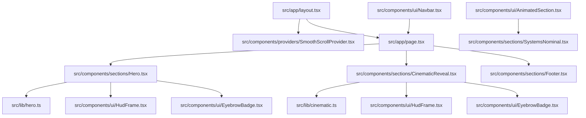
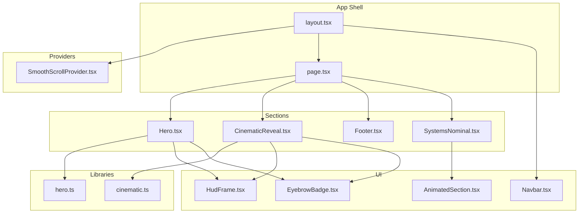
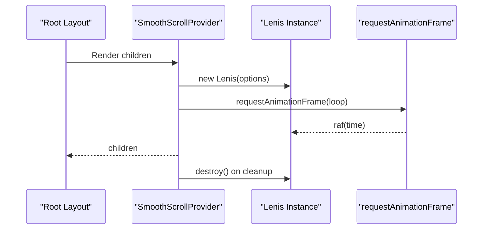
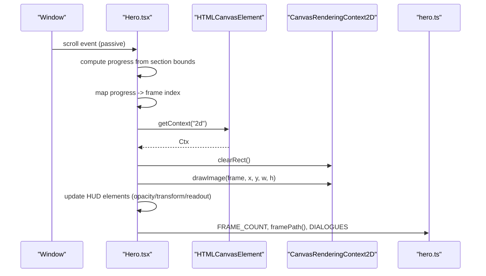
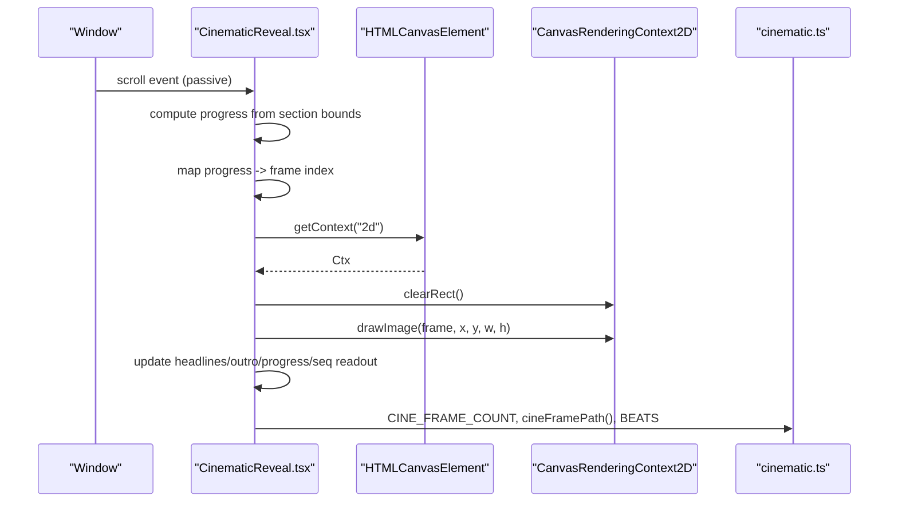
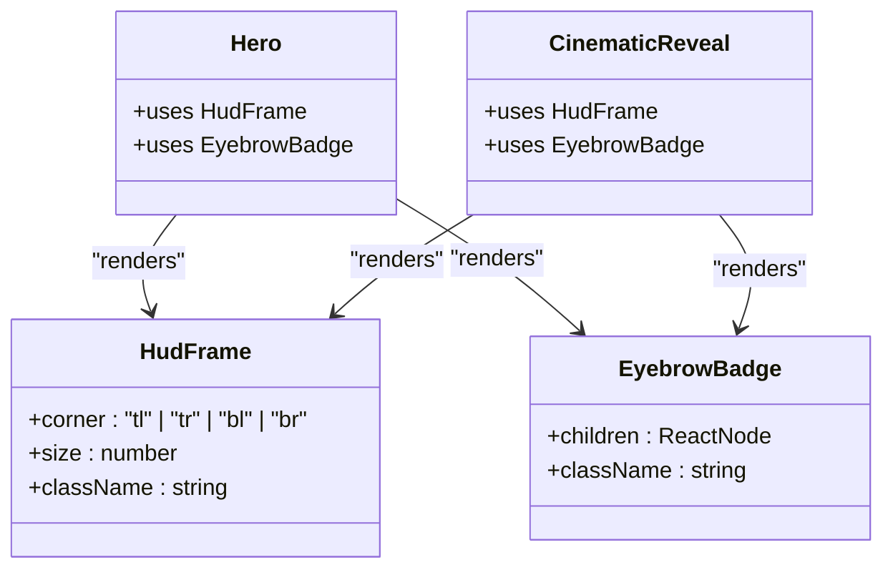
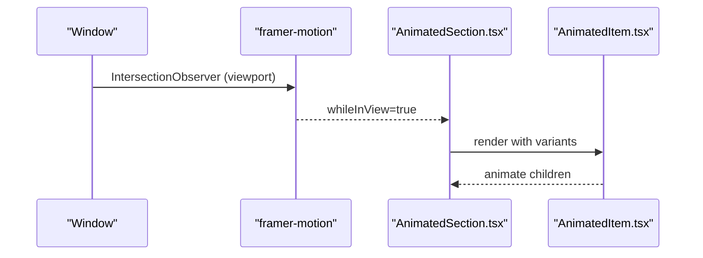
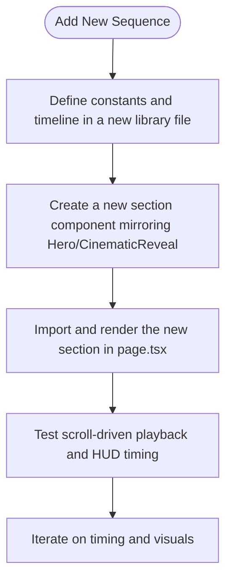
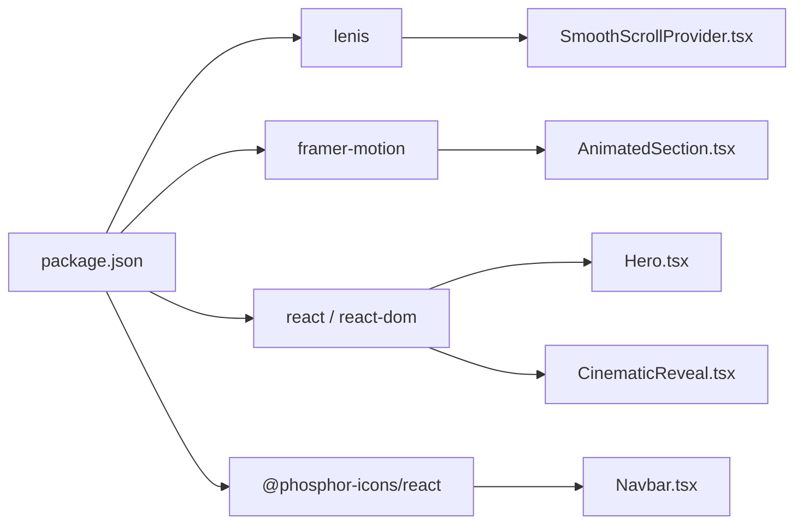

# Integration Points

<cite>
**Referenced Files in This Document**
- [README.md](file://README.md)
- [package.json](file://package.json)
- [src/app/layout.tsx](file://src/app/layout.tsx)
- [src/app/page.tsx](file://src/app/page.tsx)
- [src/components/providers/SmoothScrollProvider.tsx](file://src/components/providers/SmoothScrollProvider.tsx)
- [src/lib/hero.ts](file://src/lib/hero.ts)
- [src/lib/cinematic.ts](file://src/lib/cinematic.ts)
- [src/components/sections/Hero.tsx](file://src/components/sections/Hero.tsx)
- [src/components/sections/CinematicReveal.tsx](file://src/components/sections/CinematicReveal.tsx)
- [src/components/ui/AnimatedSection.tsx](file://src/components/ui/AnimatedSection.tsx)
- [src/components/ui/HudFrame.tsx](file://src/components/ui/HudFrame.tsx)
- [src/components/ui/EyebrowBadge.tsx](file://src/components/ui/EyebrowBadge.tsx)
- [src/components/ui/Navbar.tsx](file://src/components/ui/Navbar.tsx)
- [src/components/sections/Footer.tsx](file://src/components/sections/Footer.tsx)
- [src/components/sections/SystemsNominal.tsx](file://src/components/sections/SystemsNominal.tsx)
</cite>

## Table of Contents
1. [Introduction](#introduction)
2. [Project Structure](#project-structure)
3. [Core Components](#core-components)
4. [Architecture Overview](#architecture-overview)
5. [Detailed Component Analysis](#detailed-component-analysis)
6. [Dependency Analysis](#dependency-analysis)
7. [Performance Considerations](#performance-considerations)
8. [Troubleshooting Guide](#troubleshooting-guide)
9. [Conclusion](#conclusion)
10. [Appendices](#appendices)

## Introduction
This document describes the integration points and extension mechanisms in the Iron Man animation system. It explains how external libraries integrate with the core system—Canvas API for frame rendering, Framer Motion viewport detection, and Lenis smooth scrolling—and outlines extension points for adding new animation sequences, customizing HUD elements, and extending scroll behaviors. It also documents the integration interfaces between animation libraries and DOM manipulation, the relationship between utility libraries and animation systems, and how UI components integrate with section components. Finally, it provides guidelines for maintaining integration integrity and best practices for adding new integration points.

## Project Structure
The project is a Next.js application organized by feature and layer:
- Application shell and routing live under src/app
- Providers encapsulate cross-cutting concerns like smooth scrolling
- Sections represent major animated pages
- UI components are reusable and composable
- Libraries define constants and data for animations

**Diagram sources**
- [src/app/layout.tsx:1-37](file://src/app/layout.tsx#L1-L37)
- [src/app/page.tsx:1-20](file://src/app/page.tsx#L1-L20)
- [src/components/providers/SmoothScrollProvider.tsx:1-37](file://src/components/providers/SmoothScrollProvider.tsx#L1-L37)
- [src/lib/hero.ts:1-43](file://src/lib/hero.ts#L1-L43)
- [src/lib/cinematic.ts:1-47](file://src/lib/cinematic.ts#L1-L47)
- [src/components/sections/Hero.tsx:1-366](file://src/components/sections/Hero.tsx#L1-L366)
- [src/components/sections/CinematicReveal.tsx:1-384](file://src/components/sections/CinematicReveal.tsx#L1-L384)
- [src/components/ui/HudFrame.tsx:1-32](file://src/components/ui/HudFrame.tsx#L1-L32)
- [src/components/ui/EyebrowBadge.tsx:1-17](file://src/components/ui/EyebrowBadge.tsx#L1-L17)
- [src/components/ui/AnimatedSection.tsx:1-43](file://src/components/ui/AnimatedSection.tsx#L1-L43)
- [src/components/sections/Footer.tsx:1-63](file://src/components/sections/Footer.tsx#L1-L63)
- [src/components/sections/SystemsNominal.tsx:1-77](file://src/components/sections/SystemsNominal.tsx#L1-L77)
- [src/components/ui/Navbar.tsx:1-67](file://src/components/ui/Navbar.tsx#L1-L67)

**Section sources**
- [README.md:1-37](file://README.md#L1-L37)
- [package.json:1-31](file://package.json#L1-L31)
- [src/app/layout.tsx:1-37](file://src/app/layout.tsx#L1-L37)
- [src/app/page.tsx:1-20](file://src/app/page.tsx#L1-L20)

## Core Components
- SmoothScrollProvider: Initializes Lenis for smooth scroll behavior and integrates it with requestAnimationFrame.
- Hero and CinematicReveal: Canvas-driven frame sequences with scroll-triggered playback and HUD overlays.
- Libraries hero.ts and cinematic.ts: Define frame counts, image paths, and timed metadata (dialogue/beat timelines).
- UI components: HudFrame, EyebrowBadge, AnimatedSection, Navbar, and Footer provide shared visuals and interactions.
- SystemsNominal: Demonstrates Framer Motion viewport-triggered animations integrated with section components.

**Section sources**
- [src/components/providers/SmoothScrollProvider.tsx:1-37](file://src/components/providers/SmoothScrollProvider.tsx#L1-L37)
- [src/components/sections/Hero.tsx:1-366](file://src/components/sections/Hero.tsx#L1-L366)
- [src/components/sections/CinematicReveal.tsx:1-384](file://src/components/sections/CinematicReveal.tsx#L1-L384)
- [src/lib/hero.ts:1-43](file://src/lib/hero.ts#L1-L43)
- [src/lib/cinematic.ts:1-47](file://src/lib/cinematic.ts#L1-L47)
- [src/components/ui/HudFrame.tsx:1-32](file://src/components/ui/HudFrame.tsx#L1-L32)
- [src/components/ui/EyebrowBadge.tsx:1-17](file://src/components/ui/EyebrowBadge.tsx#L1-L17)
- [src/components/ui/AnimatedSection.tsx:1-43](file://src/components/ui/AnimatedSection.tsx#L1-L43)
- [src/components/ui/Navbar.tsx:1-67](file://src/components/ui/Navbar.tsx#L1-L67)
- [src/components/sections/Footer.tsx:1-63](file://src/components/sections/Footer.tsx#L1-L63)
- [src/components/sections/SystemsNominal.tsx:1-77](file://src/components/sections/SystemsNominal.tsx#L1-L77)

## Architecture Overview
The system integrates three primary external libraries:
- Lenis: Provides smooth scrolling via a requestAnimationFrame loop and per-frame updates.
- Framer Motion: Supplies viewport detection and animation orchestration for non-canvas sections.
- Canvas API: Renders frame sequences and overlays HUD elements for Hero and CinematicReveal.

**Diagram sources**
- [src/app/layout.tsx:1-37](file://src/app/layout.tsx#L1-L37)
- [src/app/page.tsx:1-20](file://src/app/page.tsx#L1-L20)
- [src/components/providers/SmoothScrollProvider.tsx:1-37](file://src/components/providers/SmoothScrollProvider.tsx#L1-L37)
- [src/components/sections/Hero.tsx:1-366](file://src/components/sections/Hero.tsx#L1-L366)
- [src/components/sections/CinematicReveal.tsx:1-384](file://src/components/sections/CinematicReveal.tsx#L1-L384)
- [src/components/sections/SystemsNominal.tsx:1-77](file://src/components/sections/SystemsNominal.tsx#L1-L77)
- [src/components/sections/Footer.tsx:1-63](file://src/components/sections/Footer.tsx#L1-L63)
- [src/lib/hero.ts:1-43](file://src/lib/hero.ts#L1-L43)
- [src/lib/cinematic.ts:1-47](file://src/lib/cinematic.ts#L1-L47)
- [src/components/ui/HudFrame.tsx:1-32](file://src/components/ui/HudFrame.tsx#L1-L32)
- [src/components/ui/EyebrowBadge.tsx:1-17](file://src/components/ui/EyebrowBadge.tsx#L1-L17)
- [src/components/ui/AnimatedSection.tsx:1-43](file://src/components/ui/AnimatedSection.tsx#L1-L43)
- [src/components/ui/Navbar.tsx:1-67](file://src/components/ui/Navbar.tsx#L1-L67)

## Detailed Component Analysis

### Smooth Scrolling Provider (Lenis)
- Initializes Lenis with configurable interpolation and wheel smoothing.
- Integrates Lenis with requestAnimationFrame to ensure consistent frame updates.
- Cleans up on unmount to prevent memory leaks.

**Diagram sources**
- [src/app/layout.tsx:1-37](file://src/app/layout.tsx#L1-L37)
- [src/components/providers/SmoothScrollProvider.tsx:1-37](file://src/components/providers/SmoothScrollProvider.tsx#L1-L37)

**Section sources**
- [src/components/providers/SmoothScrollProvider.tsx:1-37](file://src/components/providers/SmoothScrollProvider.tsx#L1-L37)

### Hero Section (Canvas + Scroll-Driven Animation)
- Loads frame assets and renders them onto a Canvas element.
- Computes frame index from scroll progress and draws the appropriate frame.
- Updates HUD elements (opacity, transforms, readouts) based on scroll progress.
- Uses device pixel ratio scaling and responsive sizing.

**Diagram sources**
- [src/components/sections/Hero.tsx:1-366](file://src/components/sections/Hero.tsx#L1-L366)
- [src/lib/hero.ts:1-43](file://src/lib/hero.ts#L1-L43)

**Section sources**
- [src/components/sections/Hero.tsx:1-366](file://src/components/sections/Hero.tsx#L1-L366)
- [src/lib/hero.ts:1-43](file://src/lib/hero.ts#L1-L43)

### Cinematic Reveal (Canvas + Scroll-Driven Animation)
- Mirrors Hero’s pattern with distinct frame count and metadata (BEATS).
- Animates headline transitions and an outro panel based on scroll progress.
- Updates sequence readout and progress bar.

**Diagram sources**
- [src/components/sections/CinematicReveal.tsx:1-384](file://src/components/sections/CinematicReveal.tsx#L1-L384)
- [src/lib/cinematic.ts:1-47](file://src/lib/cinematic.ts#L1-L47)

**Section sources**
- [src/components/sections/CinematicReveal.tsx:1-384](file://src/components/sections/CinematicReveal.tsx#L1-L384)
- [src/lib/cinematic.ts:1-47](file://src/lib/cinematic.ts#L1-L47)

### HUD Elements (Composition and SVG)
- HudFrame renders corner accents using SVG paths, enabling consistent HUD styling across sections.
- EyebrowBadge provides a reusable badge component with accent styling and glow effect.

**Diagram sources**
- [src/components/ui/HudFrame.tsx:1-32](file://src/components/ui/HudFrame.tsx#L1-L32)
- [src/components/ui/EyebrowBadge.tsx:1-17](file://src/components/ui/EyebrowBadge.tsx#L1-L17)
- [src/components/sections/Hero.tsx:1-366](file://src/components/sections/Hero.tsx#L1-L366)
- [src/components/sections/CinematicReveal.tsx:1-384](file://src/components/sections/CinematicReveal.tsx#L1-L384)

**Section sources**
- [src/components/ui/HudFrame.tsx:1-32](file://src/components/ui/HudFrame.tsx#L1-L32)
- [src/components/ui/EyebrowBadge.tsx:1-17](file://src/components/ui/EyebrowBadge.tsx#L1-L17)
- [src/components/sections/Hero.tsx:1-366](file://src/components/sections/Hero.tsx#L1-L366)
- [src/components/sections/CinematicReveal.tsx:1-384](file://src/components/sections/CinematicReveal.tsx#L1-L384)

### Framer Motion Viewport Detection (Systems Nominal)
- AnimatedSection wraps child content and triggers animations when the viewport detects the container.
- AnimatedItem applies spring-based animations to individual children.

**Diagram sources**
- [src/components/ui/AnimatedSection.tsx:1-43](file://src/components/ui/AnimatedSection.tsx#L1-L43)
- [src/components/sections/SystemsNominal.tsx:1-77](file://src/components/sections/SystemsNominal.tsx#L1-L77)

**Section sources**
- [src/components/ui/AnimatedSection.tsx:1-43](file://src/components/ui/AnimatedSection.tsx#L1-L43)
- [src/components/sections/SystemsNominal.tsx:1-77](file://src/components/sections/SystemsNominal.tsx#L1-L77)

### Extension Points and Integration Interfaces

#### Adding New Animation Sequences (Frame Loading System)
- Extend the library:
  - Add a new constant for frame count and a path generator similar to framePath/cineFramePath.
  - Define a timeline array (Dialogue/Beat) with show/hide windows for HUD cues.
- Create a new section:
  - Follow the Hero/CinematicReveal pattern: load images, draw on canvas, compute frame index from scroll progress, update HUD elements.
  - Use refs for DOM nodes and a single RAF loop to avoid layout thrashing.
- Integrate into the page:
  - Import and render the new section in page.tsx alongside existing sections.

**Diagram sources**
- [src/lib/hero.ts:1-43](file://src/lib/hero.ts#L1-L43)
- [src/lib/cinematic.ts:1-47](file://src/lib/cinematic.ts#L1-L47)
- [src/components/sections/Hero.tsx:1-366](file://src/components/sections/Hero.tsx#L1-L366)
- [src/components/sections/CinematicReveal.tsx:1-384](file://src/components/sections/CinematicReveal.tsx#L1-L384)
- [src/app/page.tsx:1-20](file://src/app/page.tsx#L1-L20)

**Section sources**
- [src/lib/hero.ts:1-43](file://src/lib/hero.ts#L1-L43)
- [src/lib/cinematic.ts:1-47](file://src/lib/cinematic.ts#L1-L47)
- [src/components/sections/Hero.tsx:1-366](file://src/components/sections/Hero.tsx#L1-L366)
- [src/components/sections/CinematicReveal.tsx:1-384](file://src/components/sections/CinematicReveal.tsx#L1-L384)
- [src/app/page.tsx:1-20](file://src/app/page.tsx#L1-L20)

#### Customizing HUD Elements (Component Composition)
- Replace or extend HudFrame by adjusting the SVG path mapping and sizes.
- Compose EyebrowBadge with additional indicators or dynamic content.
- Apply consistent color tokens and spacing across sections.

**Section sources**
- [src/components/ui/HudFrame.tsx:1-32](file://src/components/ui/HudFrame.tsx#L1-L32)
- [src/components/ui/EyebrowBadge.tsx:1-17](file://src/components/ui/EyebrowBadge.tsx#L1-L17)
- [src/components/sections/Hero.tsx:1-366](file://src/components/sections/Hero.tsx#L1-L366)
- [src/components/sections/CinematicReveal.tsx:1-384](file://src/components/sections/CinematicReveal.tsx#L1-L384)

#### Extending Scroll Behaviors (Provider Customization)
- Wrap the application with SmoothScrollProvider to enable Lenis globally.
- Adjust Lenis options (lerp, duration, smoothWheel) to match desired motion characteristics.
- Ensure RAF integration remains active and clean up on unmount.

**Section sources**
- [src/app/layout.tsx:1-37](file://src/app/layout.tsx#L1-L37)
- [src/components/providers/SmoothScrollProvider.tsx:1-37](file://src/components/providers/SmoothScrollProvider.tsx#L1-L37)

#### Relationship Between Utility Libraries and Animation Systems
- hero.ts and cinematic.ts act as single sources of truth for frame metadata and timing.
- Sections consume these libraries to drive both Canvas rendering and HUD visibility.

**Section sources**
- [src/lib/hero.ts:1-43](file://src/lib/hero.ts#L1-L43)
- [src/lib/cinematic.ts:1-47](file://src/lib/cinematic.ts#L1-L47)
- [src/components/sections/Hero.tsx:1-366](file://src/components/sections/Hero.tsx#L1-L366)
- [src/components/sections/CinematicReveal.tsx:1-384](file://src/components/sections/CinematicReveal.tsx#L1-L384)

#### UI Components Integration with Section Components
- Navbar reacts to scroll to change styles.
- EyebrowBadge and HudFrame are composed within sections to maintain visual consistency.
- AnimatedSection and AnimatedItem provide viewport-triggered animations for content after the hero.

**Section sources**
- [src/components/ui/Navbar.tsx:1-67](file://src/components/ui/Navbar.tsx#L1-L67)
- [src/components/ui/HudFrame.tsx:1-32](file://src/components/ui/HudFrame.tsx#L1-L32)
- [src/components/ui/EyebrowBadge.tsx:1-17](file://src/components/ui/EyebrowBadge.tsx#L1-L17)
- [src/components/sections/Hero.tsx:1-366](file://src/components/sections/Hero.tsx#L1-L366)
- [src/components/sections/CinematicReveal.tsx:1-384](file://src/components/sections/CinematicReveal.tsx#L1-L384)
- [src/components/ui/AnimatedSection.tsx:1-43](file://src/components/ui/AnimatedSection.tsx#L1-L43)
- [src/components/sections/SystemsNominal.tsx:1-77](file://src/components/sections/SystemsNominal.tsx#L1-L77)

## Dependency Analysis
External dependencies and their roles:
- lenis: Smooth scroll engine integrated via SmoothScrollProvider.
- framer-motion: Viewport detection and animation orchestration for non-canvas sections.
- react and react-dom: Core UI runtime.
- phosphor-icons/react: Icons used in UI components.

**Diagram sources**
- [package.json:1-31](file://package.json#L1-L31)
- [src/components/providers/SmoothScrollProvider.tsx:1-37](file://src/components/providers/SmoothScrollProvider.tsx#L1-L37)
- [src/components/ui/AnimatedSection.tsx:1-43](file://src/components/ui/AnimatedSection.tsx#L1-L43)
- [src/components/sections/Hero.tsx:1-366](file://src/components/sections/Hero.tsx#L1-L366)
- [src/components/sections/CinematicReveal.tsx:1-384](file://src/components/sections/CinematicReveal.tsx#L1-L384)
- [src/components/ui/Navbar.tsx:1-67](file://src/components/ui/Navbar.tsx#L1-L67)

**Section sources**
- [package.json:1-31](file://package.json#L1-L31)

## Performance Considerations
- Canvas rendering:
  - Use device pixel ratio scaling and clearRect before drawing to avoid artifacts.
  - Debounce scroll handlers with requestAnimationFrame to prevent layout thrashing.
- Asset loading:
  - Preload frames and track completion to avoid partial renders.
- HUD updates:
  - Prefer style property changes over heavy reflows; leverage transforms and opacity.
- Lenis:
  - Keep interpolation and duration tuned to reduce jank; ensure RAF loop is canceled on unmount.

[No sources needed since this section provides general guidance]

## Troubleshooting Guide
- Frames not appearing:
  - Verify frame paths and ensure assets are served from the configured public directory.
  - Confirm that onload/onerror handlers mark loading complete and trigger initial draw.
- HUD not updating:
  - Check that refs are attached and scroll handler runs inside requestAnimationFrame.
  - Validate progress calculations and ensure visibility toggles occur only on changes.
- Smooth scrolling issues:
  - Confirm Lenis is initialized and RAF loop is active; verify cleanup on unmount.
- Framer Motion animations not triggering:
  - Ensure viewport options are set appropriately and the container is in view.

**Section sources**
- [src/components/sections/Hero.tsx:1-366](file://src/components/sections/Hero.tsx#L1-L366)
- [src/components/sections/CinematicReveal.tsx:1-384](file://src/components/sections/CinematicReveal.tsx#L1-L384)
- [src/components/providers/SmoothScrollProvider.tsx:1-37](file://src/components/providers/SmoothScrollProvider.tsx#L1-L37)
- [src/components/ui/AnimatedSection.tsx:1-43](file://src/components/ui/AnimatedSection.tsx#L1-L43)

## Conclusion
The Iron Man animation system integrates Lenis for smooth scrolling, Framer Motion for viewport-triggered animations, and the Canvas API for high-performance frame playback. Extension points are clearly defined: libraries for metadata, sections for animation logic, and providers for global behavior. By following the established patterns, teams can safely add new sequences, customize HUD elements, and extend scroll behaviors while maintaining performance and visual coherence.

[No sources needed since this section summarizes without analyzing specific files]

## Appendices

### Best Practices for Adding New Integration Points
- Encapsulate external integrations behind small, testable providers or hooks.
- Keep animation logic in dedicated libraries to minimize coupling.
- Use refs and requestAnimationFrame for DOM updates to avoid layout thrashing.
- Provide fallbacks and error handling for asset loading failures.
- Document timing windows and frame indices for future maintainers.

[No sources needed since this section provides general guidance]