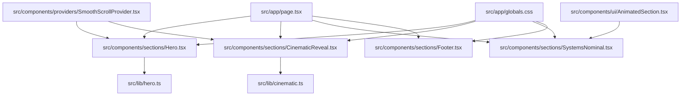
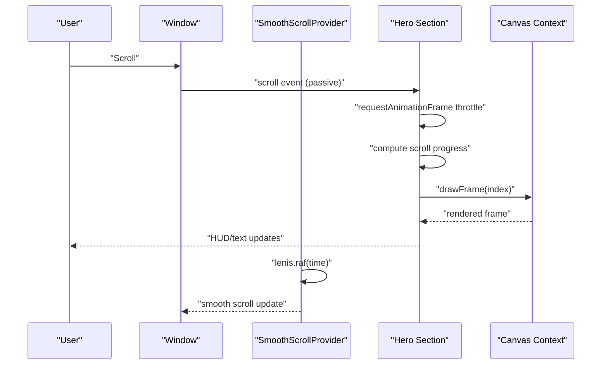
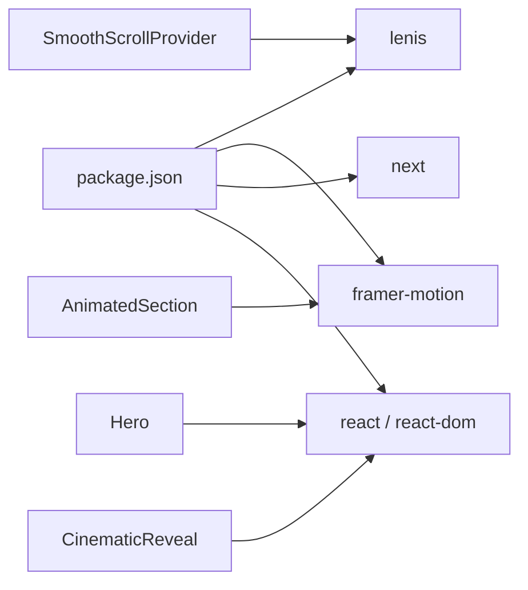

# Animation Best Practices

<cite>
**Referenced Files in This Document**
- [README.md](file://README.md)
- [package.json](file://package.json)
- [src/app/page.tsx](file://src/app/page.tsx)
- [src/app/globals.css](file://src/app/globals.css)
- [src/components/providers/SmoothScrollProvider.tsx](file://src/components/providers/SmoothScrollProvider.tsx)
- [src/lib/hero.ts](file://src/lib/hero.ts)
- [src/lib/cinematic.ts](file://src/lib/cinematic.ts)
- [src/components/sections/Hero.tsx](file://src/components/sections/Hero.tsx)
- [src/components/sections/CinematicReveal.tsx](file://src/components/sections/CinematicReveal.tsx)
- [src/components/ui/AnimatedSection.tsx](file://src/components/ui/AnimatedSection.tsx)
- [src/components/sections/SystemsNominal.tsx](file://src/components/sections/SystemsNominal.tsx)
- [src/components/sections/Footer.tsx](file://src/components/sections/Footer.tsx)
</cite>

## Table of Contents
1. [Introduction](#introduction)
2. [Project Structure](#project-structure)
3. [Core Components](#core-components)
4. [Architecture Overview](#architecture-overview)
5. [Detailed Component Analysis](#detailed-component-analysis)
6. [Dependency Analysis](#dependency-analysis)
7. [Performance Considerations](#performance-considerations)
8. [Troubleshooting Guide](#troubleshooting-guide)
9. [Conclusion](#conclusion)
10. [Appendices](#appendices)

## Introduction
This document consolidates animation best practices for the Iron Man project, focusing on canvas-based frame playback, scroll-driven animations, smooth scrolling via Lenis, and performance tuning. It synthesizes the existing implementation patterns to provide actionable guidelines for frame buffering, device pixel ratio handling, render performance, memory management, scroll event throttling, easing/timing, and debugging.

## Project Structure
The project is a Next.js application with a modern React client architecture. Animation logic is primarily implemented in dedicated sections and shared libraries:
- Scroll-driven canvas animations: Hero and CinematicReveal sections
- Smooth scrolling provider: Lenis-based implementation
- Shared animation metadata: hero and cinematic libraries
- Framer Motion animated sections: SystemsNominal and reusable AnimatedSection components
- Global styles and scroll-height scaffolding

**Diagram sources**
- [src/app/page.tsx:1-20](file://src/app/page.tsx#L1-L20)
- [src/components/sections/Hero.tsx:1-366](file://src/components/sections/Hero.tsx#L1-L366)
- [src/components/sections/CinematicReveal.tsx:1-384](file://src/components/sections/CinematicReveal.tsx#L1-L384)
- [src/components/sections/SystemsNominal.tsx:1-77](file://src/components/sections/SystemsNominal.tsx#L1-L77)
- [src/components/sections/Footer.tsx:1-63](file://src/components/sections/Footer.tsx#L1-L63)
- [src/components/providers/SmoothScrollProvider.tsx:1-37](file://src/components/providers/SmoothScrollProvider.tsx#L1-L37)
- [src/lib/hero.ts:1-43](file://src/lib/hero.ts#L1-L43)
- [src/lib/cinematic.ts:1-47](file://src/lib/cinematic.ts#L1-L47)
- [src/components/ui/AnimatedSection.tsx:1-43](file://src/components/ui/AnimatedSection.tsx#L1-L43)
- [src/app/globals.css:1-83](file://src/app/globals.css#L1-L83)

**Section sources**
- [README.md:1-37](file://README.md#L1-L37)
- [src/app/page.tsx:1-20](file://src/app/page.tsx#L1-L20)
- [src/app/globals.css:1-83](file://src/app/globals.css#L1-L83)

## Core Components
- SmoothScrollProvider: Initializes Lenis, synchronizes rAF, and cleans up on unmount.
- Hero: Canvas-based frame playback with preloading, DPR scaling, and scroll-driven rendering.
- CinematicReveal: Similar canvas pipeline with additional HUD and beat cards.
- AnimatedSection: Framer Motion-based scroll-triggered entrance animations.
- Libraries: hero.ts and cinematic.ts define frame counts, image paths, and dialogue/beat metadata.

Key implementation patterns:
- Frame preloading with Image objects and progress tracking
- Device pixel ratio-aware canvas sizing and drawing
- requestAnimationFrame throttling with a “ticking” guard
- Scroll progress calculation and frame index mapping
- DOM updates for text and HUD elements during scroll

**Section sources**
- [src/components/providers/SmoothScrollProvider.tsx:1-37](file://src/components/providers/SmoothScrollProvider.tsx#L1-L37)
- [src/components/sections/Hero.tsx:1-366](file://src/components/sections/Hero.tsx#L1-L366)
- [src/components/sections/CinematicReveal.tsx:1-384](file://src/components/sections/CinematicReveal.tsx#L1-L384)
- [src/components/ui/AnimatedSection.tsx:1-43](file://src/components/ui/AnimatedSection.tsx#L1-L43)
- [src/lib/hero.ts:1-43](file://src/lib/hero.ts#L1-L43)
- [src/lib/cinematic.ts:1-47](file://src/lib/cinematic.ts#L1-L47)

## Architecture Overview
The animation architecture combines three pillars:
- Canvas frame playback: Preloaded images drawn to a canvas sized to device pixel ratio
- Scroll-driven orchestration: Scroll position mapped to frame indices and UI state
- Smooth scrolling: Lenis-managed rAF loop decoupled from native scroll events

**Diagram sources**
- [src/components/providers/SmoothScrollProvider.tsx:11-33](file://src/components/providers/SmoothScrollProvider.tsx#L11-L33)
- [src/components/sections/Hero.tsx:120-182](file://src/components/sections/Hero.tsx#L120-L182)
- [src/components/sections/CinematicReveal.tsx:119-186](file://src/components/sections/CinematicReveal.tsx#L119-L186)

## Detailed Component Analysis

### SmoothScrollProvider (Lenis)
- Initializes Lenis with tuned parameters (lerp, duration, wheel smoothing)
- Runs lenis.raf inside requestAnimationFrame to keep scroll updates in sync with the compositor
- Cleans up rAF and destroys Lenis on unmount

Best practices:
- Keep scroll event listeners passive to avoid layout thrashing
- Centralize smooth scroll logic in a provider to avoid per-component overhead
- Destroy resources on unmount to prevent leaks

**Section sources**
- [src/components/providers/SmoothScrollProvider.tsx:1-37](file://src/components/providers/SmoothScrollProvider.tsx#L1-L37)

### Hero (Canvas Frame Playback)
- Preloads frames via Image objects and tracks load progress
- On resize, sets canvas width/height to devicePixelRatio and scales context
- On scroll, computes normalized progress and draws the corresponding frame
- Updates HUD elements (power readout, progress bar, text opacity/transform)

Optimization highlights:
- Device pixel ratio handling ensures crisp rendering on high-DPR displays
- requestAnimationFrame throttling prevents redundant work
- ClearRect + drawImage minimizes draw overhead

**Section sources**
- [src/components/sections/Hero.tsx:26-59](file://src/components/sections/Hero.tsx#L26-L59)
- [src/components/sections/Hero.tsx:61-106](file://src/components/sections/Hero.tsx#L61-L106)
- [src/components/sections/Hero.tsx:120-182](file://src/components/sections/Hero.tsx#L120-L182)
- [src/lib/hero.ts:1-43](file://src/lib/hero.ts#L1-L43)

### CinematicReveal (Canvas + HUD + Beats)
- Identical frame loading and drawing pipeline as Hero
- Adds beat cards, sequence readout, and additional text transitions
- Uses a progress threshold to toggle visibility of beat cards

**Section sources**
- [src/components/sections/CinematicReveal.tsx:27-60](file://src/components/sections/CinematicReveal.tsx#L27-L60)
- [src/components/sections/CinematicReveal.tsx:62-105](file://src/components/sections/CinematicReveal.tsx#L62-L105)
- [src/components/sections/CinematicReveal.tsx:119-186](file://src/components/sections/CinematicReveal.tsx#L119-L186)
- [src/lib/cinematic.ts:1-47](file://src/lib/cinematic.ts#L1-L47)

### Framer Motion AnimatedSection
- Provides scroll-triggered entrance animations using viewport options
- Uses spring-type transitions for natural motion
- Supports staggering child animations

**Section sources**
- [src/components/ui/AnimatedSection.tsx:1-43](file://src/components/ui/AnimatedSection.tsx#L1-L43)
- [src/components/sections/SystemsNominal.tsx:14-76](file://src/components/sections/SystemsNominal.tsx#L14-L76)

### Global Styles and Scroll Height
- The .scroll-animation class sets tall heights per breakpoint to enable long-form scroll-driven animations
- will-change and transform hints are applied to reduce layout/composite costs

**Section sources**
- [src/app/globals.css:48-62](file://src/app/globals.css#L48-L62)

## Dependency Analysis
External dependencies relevant to animation:
- lenis: Smooth scroll engine synchronized with rAF
- framer-motion: Scroll-triggered and spring-based animations
- next/react/react-dom: Rendering and lifecycle hooks

**Diagram sources**
- [package.json:11-19](file://package.json#L11-L19)
- [src/components/providers/SmoothScrollProvider.tsx:1-37](file://src/components/providers/SmoothScrollProvider.tsx#L1-L37)
- [src/components/sections/Hero.tsx:1-366](file://src/components/sections/Hero.tsx#L1-L366)
- [src/components/sections/CinematicReveal.tsx:1-384](file://src/components/sections/CinematicReveal.tsx#L1-L384)
- [src/components/ui/AnimatedSection.tsx:1-43](file://src/components/ui/AnimatedSection.tsx#L1-L43)

**Section sources**
- [package.json:11-19](file://package.json#L11-L19)

## Performance Considerations
Canvas animation optimization:
- Frame buffering
  - Preload frames using Image objects and track completion to avoid partial draws
  - Reuse the frames array reference to minimize allocations
- Device pixel ratio handling
  - Set canvas.width/height to window.innerWidth/innerHeight multiplied by devicePixelRatio
  - Scale the 2D context appropriately after resize
- Render performance tuning
  - Use requestAnimationFrame throttling with a “ticking” guard to coalesce scroll events
  - Compute frame index once per rAF and skip redraws when the index does not change
  - Clear the canvas region before drawing and use drawImage with precomputed bounds
- Memory management
  - Cancel rAF and destroy Lenis on unmount
  - Avoid closures capturing large objects in scroll handlers; keep computations minimal
  - Prefer reusing DOM nodes and updating styles/attributes rather than frequent remounts
- Scroll-driven patterns
  - Use passive listeners for scroll events to improve responsiveness
  - Compute progress once per rAF and derive frame indices and UI updates from it
- Timing and easing
  - For canvas playback, floor the frame index to maintain integer frames
  - For UI elements, leverage CSS transitions and Framer Motion easing for smoothness
- Frame rate optimization
  - Align scroll updates with display refresh rates via requestAnimationFrame
  - Minimize layout thrashing by batching DOM writes and reads

[No sources needed since this section provides general guidance]

## Troubleshooting Guide
Common issues and remedies:
- Stuttering or dropped frames
  - Verify requestAnimationFrame throttling is active and the “ticking” guard prevents overlapping work
  - Ensure drawFrame runs only after frames are loaded
  - Confirm device pixel ratio scaling is applied consistently on resize
- Memory leaks
  - Unsubscribe scroll listeners and cancel rAF in cleanup
  - Destroy Lenis instance on unmount
  - Avoid retaining references to removed DOM nodes
- Cross-browser compatibility
  - Test canvas sizing and context scaling on various DPRs
  - Validate passive event listener support and polyfill if needed
- Performance monitoring
  - Use browser DevTools Performance panel to record scroll sessions and inspect long tasks
  - Measure FPS and frame timing during playback to detect spikes
  - Profile memory growth during extended scroll sessions

**Section sources**
- [src/components/providers/SmoothScrollProvider.tsx:28-33](file://src/components/providers/SmoothScrollProvider.tsx#L28-L33)
- [src/components/sections/Hero.tsx:120-123](file://src/components/sections/Hero.tsx#L120-L123)
- [src/components/sections/CinematicReveal.tsx:120-123](file://src/components/sections/CinematicReveal.tsx#L120-L123)

## Conclusion
The Iron Man project demonstrates a robust, layered approach to animation:
- Lenis ensures buttery scroll behavior
- Canvas frame playback is optimized with preloading, DPR awareness, and rAF throttling
- Framer Motion complements scroll-driven UI with performant entrance animations
Adhering to the best practices outlined here will help maintain smooth, responsive experiences across devices and browsers.

[No sources needed since this section summarizes without analyzing specific files]

## Appendices

### Animation Timing and Easing Reference
- Canvas frame playback: Integer frame selection via flooring progress times frame count
- UI transitions: CSS transitions and Framer Motion spring/ease curves for natural motion
- HUD updates: Linear transforms and opacity adjustments synchronized with scroll progress

**Section sources**
- [src/components/sections/Hero.tsx:137-140](file://src/components/sections/Hero.tsx#L137-L140)
- [src/components/sections/CinematicReveal.tsx:136-139](file://src/components/sections/CinematicReveal.tsx#L136-L139)
- [src/components/ui/AnimatedSection.tsx:6-18](file://src/components/ui/AnimatedSection.tsx#L6-L18)