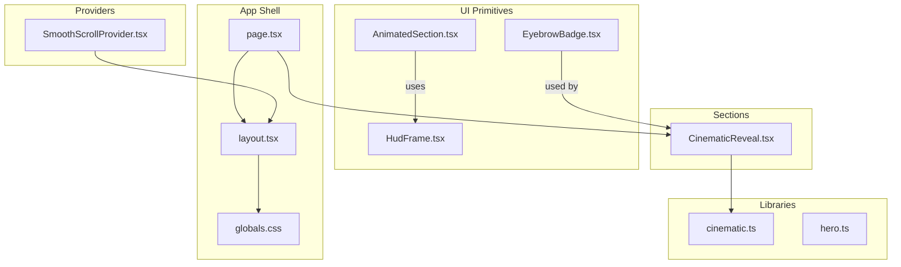
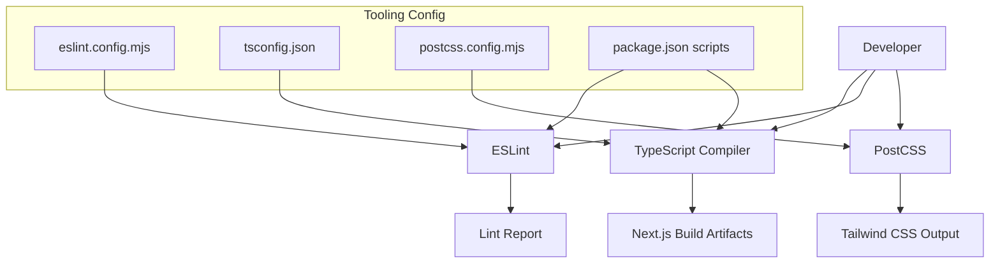
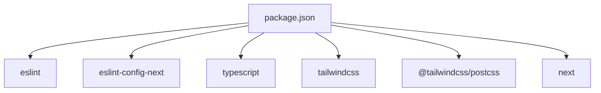

# Code Quality Standards

<cite>
**Referenced Files in This Document**
- [eslint.config.mjs](file://eslint.config.mjs)
- [tsconfig.json](file://tsconfig.json)
- [postcss.config.mjs](file://postcss.config.mjs)
- [package.json](file://package.json)
- [next.config.ts](file://next.config.ts)
- [src/app/globals.css](file://src/app/globals.css)
- [src/app/layout.tsx](file://src/app/layout.tsx)
- [src/app/page.tsx](file://src/app/page.tsx)
- [src/components/ui/AnimatedSection.tsx](file://src/components/ui/AnimatedSection.tsx)
- [src/components/ui/HudFrame.tsx](file://src/components/ui/HudFrame.tsx)
- [src/components/ui/EyebrowBadge.tsx](file://src/components/ui/EyebrowBadge.tsx)
- [src/components/providers/SmoothScrollProvider.tsx](file://src/components/providers/SmoothScrollProvider.tsx)
- [src/components/sections/CinematicReveal.tsx](file://src/components/sections/CinematicReveal.tsx)
- [src/lib/cinematic.ts](file://src/lib/cinematic.ts)
- [src/lib/hero.ts](file://src/lib/hero.ts)
</cite>

## Table of Contents
1. [Introduction](#introduction)
2. [Project Structure](#project-structure)
3. [Core Components](#core-components)
4. [Architecture Overview](#architecture-overview)
5. [Detailed Component Analysis](#detailed-component-analysis)
6. [Dependency Analysis](#dependency-analysis)
7. [Performance Considerations](#performance-considerations)
8. [Troubleshooting Guide](#troubleshooting-guide)
9. [Conclusion](#conclusion)
10. [Appendices](#appendices)

## Introduction
This document defines the code quality standards for the Iron Man project. It consolidates the current ESLint configuration, TypeScript strictness and compilation targets, PostCSS/Tailwind integration, and practical guidelines for consistent code style across animation components, UI elements, and utility modules. It also outlines recommended practices for type-safe canvas operations and animation contexts, along with suggestions for pre-commit hooks and CI/CD integration.

## Project Structure
The project follows a Next.js application layout with a clear separation of concerns:
- Application shell and global styles under src/app
- UI primitives and reusable components under src/components/ui
- Providers for cross-cutting concerns under src/components/providers
- Sections composing pages under src/components/sections
- Shared libraries and constants under src/lib

**Diagram sources**
- [src/app/layout.tsx:1-37](file://src/app/layout.tsx#L1-L37)
- [src/app/page.tsx:1-20](file://src/app/page.tsx#L1-L20)
- [src/app/globals.css:1-83](file://src/app/globals.css#L1-L83)
- [src/components/providers/SmoothScrollProvider.tsx:1-37](file://src/components/providers/SmoothScrollProvider.tsx#L1-L37)
- [src/components/ui/AnimatedSection.tsx:1-43](file://src/components/ui/AnimatedSection.tsx#L1-L43)
- [src/components/ui/HudFrame.tsx:1-32](file://src/components/ui/HudFrame.tsx#L1-L32)
- [src/components/ui/EyebrowBadge.tsx:1-17](file://src/components/ui/EyebrowBadge.tsx#L1-L17)
- [src/components/sections/CinematicReveal.tsx:1-384](file://src/components/sections/CinematicReveal.tsx#L1-L384)
- [src/lib/cinematic.ts:1-47](file://src/lib/cinematic.ts#L1-L47)
- [src/lib/hero.ts:1-43](file://src/lib/hero.ts#L1-L43)

**Section sources**
- [src/app/layout.tsx:1-37](file://src/app/layout.tsx#L1-L37)
- [src/app/page.tsx:1-20](file://src/app/page.tsx#L1-L20)
- [src/app/globals.css:1-83](file://src/app/globals.css#L1-L83)

## Core Components
This section documents the quality tooling and configuration currently in place.

- ESLint configuration
  - Uses Next.js core-web-vitals and TypeScript configs.
  - Overrides default ignores to include project-specific paths.
  - Exposes a lint script via package.json.

- TypeScript strict mode and compilation
  - Strict mode enabled.
  - ES2017 target with DOM and ESNext libs.
  - Bundler module resolution and esnext module.
  - Path aliases configured (@/* -> ./src/*).
  - Incremental builds enabled.

- PostCSS and Tailwind CSS
  - Tailwind PostCSS plugin configured.
  - Global CSS imports Tailwind and defines theme tokens.

- Next.js configuration
  - Empty NextConfig placeholder for future additions.

**Section sources**
- [eslint.config.mjs:1-19](file://eslint.config.mjs#L1-L19)
- [package.json:1-31](file://package.json#L1-L31)
- [tsconfig.json:1-35](file://tsconfig.json#L1-L35)
- [postcss.config.mjs:1-8](file://postcss.config.mjs#L1-L8)
- [next.config.ts:1-8](file://next.config.ts#L1-L8)
- [src/app/globals.css:1-83](file://src/app/globals.css#L1-L83)

## Architecture Overview
The build and quality pipeline integrates ESLint, TypeScript, and Tailwind CSS as follows:

**Diagram sources**
- [eslint.config.mjs:1-19](file://eslint.config.mjs#L1-L19)
- [tsconfig.json:1-35](file://tsconfig.json#L1-L35)
- [postcss.config.mjs:1-8](file://postcss.config.mjs#L1-L8)
- [package.json:1-31](file://package.json#L1-L31)

## Detailed Component Analysis

### Animation Components and Canvas Operations
Animation-heavy components require careful attention to type safety, performance, and maintainability. The following guidelines apply to animation components and canvas operations:

- Type-safe DOM and canvas references
  - Always initialize refs with explicit nullability and guard runtime access.
  - Verify element readiness (e.g., image.complete, naturalWidth) before drawing.
  - Use narrow contexts (e.g., getContext("2d")) and guard against null.

- Performance-sensitive loops and event handlers
  - Debounce or throttle scroll handlers using requestAnimationFrame where appropriate.
  - Avoid unnecessary re-renders by isolating heavy computations and memoizing callbacks.
  - Prefer devicePixelRatio-aware sizing and reset canvas dimensions on resize.

- State synchronization
  - Keep visible overlays and UI state derived from scroll progress to avoid stale UI.
  - Use sets for visibility tracking to simplify comparisons and updates.

- Example patterns to emulate
  - Canvas sizing and drawing logic guarded by element readiness.
  - Scroll handler using requestAnimationFrame and throttling via a ticking flag.
  - Visibility toggles computed from progress ranges.

**Section sources**
- [src/components/sections/CinematicReveal.tsx:1-384](file://src/components/sections/CinematicReveal.tsx#L1-L384)

### UI Primitives and Reusable Components
Reusable UI components should enforce strong typing and consistent props contracts:

- Props typing
  - Define explicit prop interfaces with optional defaults.
  - Use union types for constrained enums (e.g., corner positions).

- Composition and styling
  - Keep presentational components pure and style-driven.
  - Centralize shared styles in global CSS or Tailwind utilities.

- Example patterns to emulate
  - SVG-based HUD frame with corner-specific path generation.
  - Badge component with consistent typography and backdrop effects.

**Section sources**
- [src/components/ui/HudFrame.tsx:1-32](file://src/components/ui/HudFrame.tsx#L1-L32)
- [src/components/ui/EyebrowBadge.tsx:1-17](file://src/components/ui/EyebrowBadge.tsx#L1-L17)
- [src/app/globals.css:1-83](file://src/app/globals.css#L1-L83)

### Providers and Cross-Cutting Concerns
Providers encapsulate third-party integrations and global behaviors:

- Provider lifecycle
  - Initialize external libraries in effect hooks and clean up on unmount.
  - Use RAF loops carefully and cancel them on teardown.

- Example patterns to emulate
  - Lenis smooth scrolling provider with controlled initialization and cleanup.

**Section sources**
- [src/components/providers/SmoothScrollProvider.tsx:1-37](file://src/components/providers/SmoothScrollProvider.tsx#L1-L37)

### Libraries and Constants
Shared libraries centralize constants and typed data structures:

- Typed records and arrays
  - Export strongly typed records for sequences and dialogues.
  - Use numeric indices safely with bounds checks and clamping.

- Example patterns to emulate
  - Frame path builders with zero-padded indices.
  - Dialogue and beat arrays with consistent shape.

**Section sources**
- [src/lib/cinematic.ts:1-47](file://src/lib/cinematic.ts#L1-L47)
- [src/lib/hero.ts:1-43](file://src/lib/hero.ts#L1-L43)

### AnimatedSection Utility
A composable animation wrapper demonstrates Framer Motion usage with typed variants:

- Variants definition
  - Separate container and item variants for staggered animations.
  - Use viewport triggers and one-time visibility.

- Example patterns to emulate
  - Container-level stagger and item-level spring transitions.

**Section sources**
- [src/components/ui/AnimatedSection.tsx:1-43](file://src/components/ui/AnimatedSection.tsx#L1-L43)

## Dependency Analysis
Quality tooling dependencies and their roles:

**Diagram sources**
- [package.json:1-31](file://package.json#L1-L31)

**Section sources**
- [package.json:1-31](file://package.json#L1-L31)

## Performance Considerations
- Canvas rendering
  - Compute DPR-aware sizes and redraw after resize.
  - Clear canvas before drawing and minimize draw calls per frame.
  - Clamp frame indices to avoid out-of-bounds errors.

- Scroll handling
  - Throttle scroll events using requestAnimationFrame and a ticking flag.
  - Avoid synchronous layout reads in tight loops; batch DOM updates.

- Asset loading
  - Track load progress and treat load/error uniformly to mark completion.
  - Preload assets off-main-thread to reduce jank.

- Type checking
  - Keep strict mode enabled to catch unsafe operations early.
  - Use incremental builds to speed up local development.

[No sources needed since this section provides general guidance]

## Troubleshooting Guide
- ESLint failures
  - Run the lint script to surface issues quickly.
  - Review overrides in the ESLint config if default ignores conflict with project needs.

- TypeScript errors
  - Enable strict mode to catch missing null checks and unsafe casts.
  - Use bundler module resolution to align with Next.js expectations.

- Tailwind CSS not applied
  - Ensure PostCSS plugin is configured and global CSS imports Tailwind.
  - Verify theme tokens and class names match Tailwind’s expectations.

- Animation jank or incorrect timing
  - Confirm RAF usage and throttling in scroll handlers.
  - Validate canvas sizing and DPR adjustments.

**Section sources**
- [eslint.config.mjs:1-19](file://eslint.config.mjs#L1-L19)
- [tsconfig.json:1-35](file://tsconfig.json#L1-L35)
- [postcss.config.mjs:1-8](file://postcss.config.mjs#L1-L8)
- [src/app/globals.css:1-83](file://src/app/globals.css#L1-L83)
- [src/components/sections/CinematicReveal.tsx:1-384](file://src/components/sections/CinematicReveal.tsx#L1-L384)

## Conclusion
The project establishes a solid foundation for code quality through strict TypeScript, ESLint via Next’s recommended configs, and Tailwind CSS with PostCSS. To further strengthen the codebase, adopt the guidelines in this document for animation components, UI primitives, and utility modules. Extend the pipeline with pre-commit hooks and CI checks to enforce linting, type-checking, and build verification automatically.

[No sources needed since this section summarizes without analyzing specific files]

## Appendices

### Recommended Pre-commit Hooks and CI/CD Integration
- Pre-commit
  - Run lint and type-check before commits.
  - Optionally run formatting checks if a formatter is introduced.

- CI/CD
  - Lint and type-check jobs.
  - Build job to validate PostCSS and Tailwind output.
  - Optional: accessibility and visual regression checks for animation-heavy sections.

[No sources needed since this section provides general guidance]

### Code Formatting Standards
- Indentation and spacing
  - Use consistent indentation and spacing around operators and commas.
- Imports
  - Group and sort imports systematically; keep project alias imports consistent.
- Naming conventions
  - Use PascalCase for components, camelCase for props and variables, UPPER_SNAKE_CASE for constants.
- Comments and documentation
  - Add concise comments for complex animation logic and type definitions.

[No sources needed since this section provides general guidance]

### ESLint Configuration Deep Dive
- Core Web Vitals and TypeScript presets
  - Leverage Next’s curated rules for React and TypeScript.
- Ignores override
  - Adjust ignores to fit project structure and exclude generated files appropriately.

**Section sources**
- [eslint.config.mjs:1-19](file://eslint.config.mjs#L1-L19)

### TypeScript Strict Mode and Compilation Targets
- Strict mode
  - Ensures robust type safety and reduces runtime errors.
- Target and libs
  - ES2017 target with DOM and ESNext libs supports modern APIs.
- Module resolution
  - Bundler resolution aligns with Next.js and avoids Node-style resolution pitfalls.
- Path aliases
  - Simplifies imports and improves readability.

**Section sources**
- [tsconfig.json:1-35](file://tsconfig.json#L1-L35)

### PostCSS and Tailwind CSS Integration
- Tailwind PostCSS plugin
  - Integrates Tailwind directives and utilities into the build pipeline.
- Global CSS
  - Defines theme tokens and reusable class compositions.

**Section sources**
- [postcss.config.mjs:1-8](file://postcss.config.mjs#L1-L8)
- [src/app/globals.css:1-83](file://src/app/globals.css#L1-L83)

### Animation and Canvas Best Practices
- Guarded DOM access
  - Always check for null and readiness before drawing.
- Device pixel ratio awareness
  - Scale canvas dimensions by DPR and adjust style dimensions accordingly.
- Scroll-driven animations
  - Derive frame indices and opacity from scroll progress with clamping.
- Visibility management
  - Use sets for efficient visibility tracking and minimal re-renders.

**Section sources**
- [src/components/sections/CinematicReveal.tsx:1-384](file://src/components/sections/CinematicReveal.tsx#L1-L384)