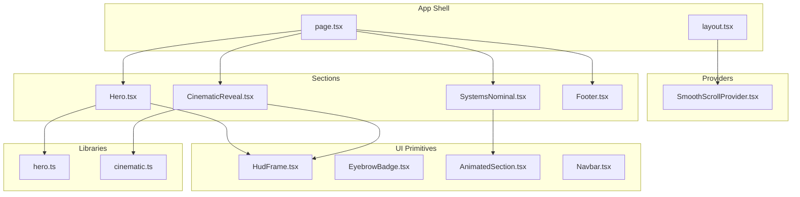
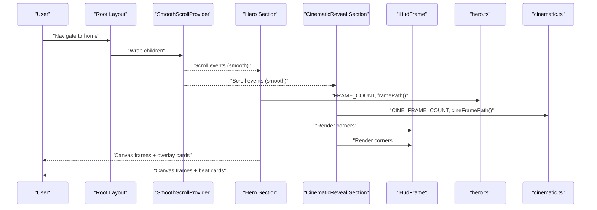
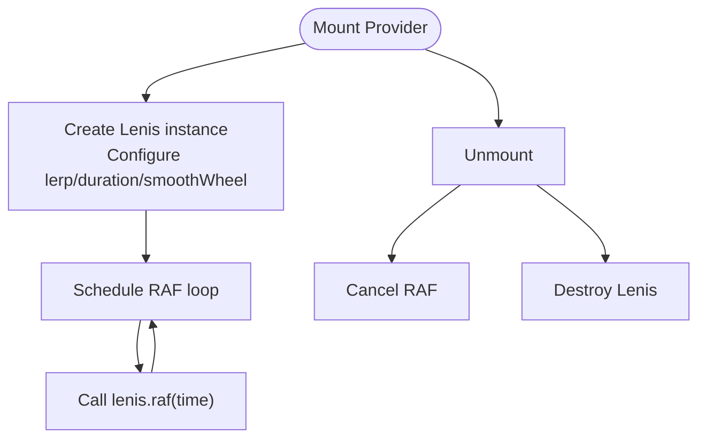
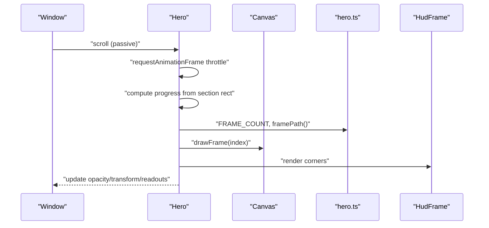
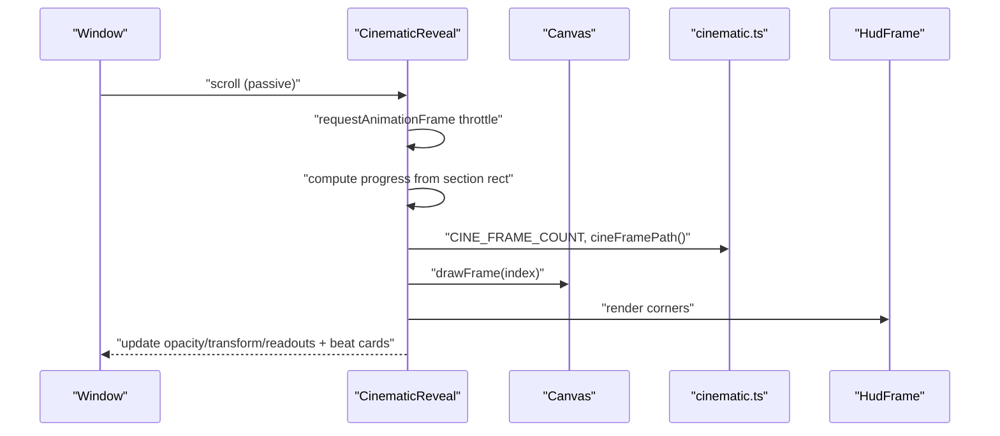
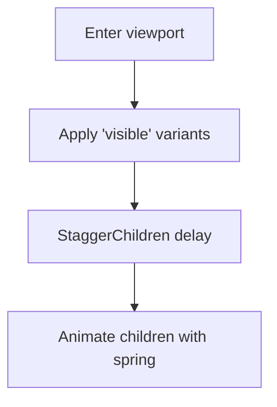
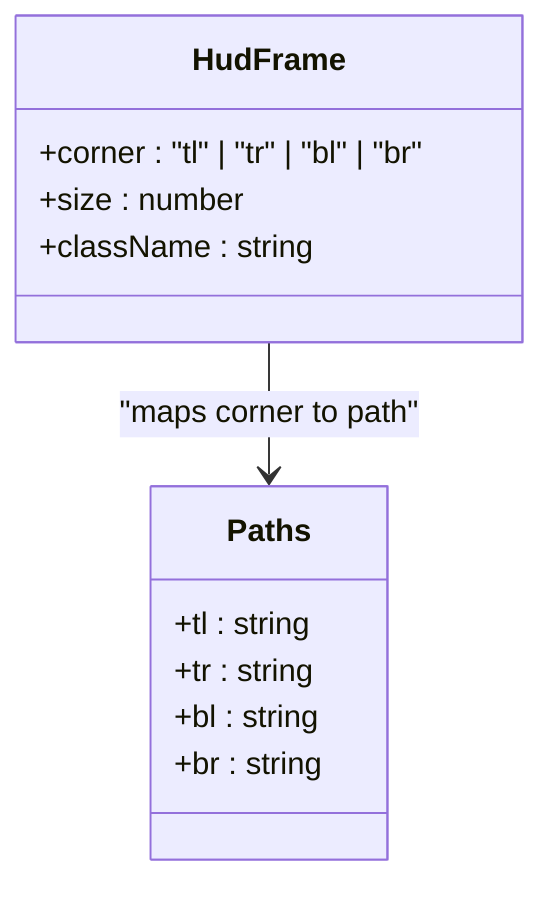
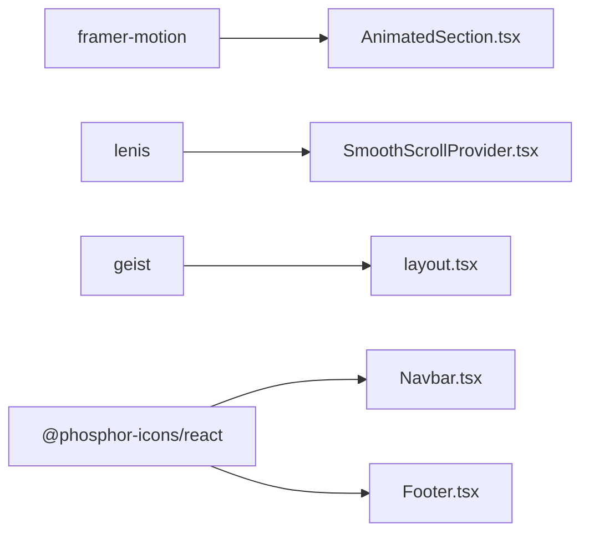

# Component Development Patterns

<cite>
**Referenced Files in This Document**
- [README.md](file://README.md)
- [package.json](file://package.json)
- [src/app/layout.tsx](file://src/app/layout.tsx)
- [src/app/page.tsx](file://src/app/page.tsx)
- [src/components/providers/SmoothScrollProvider.tsx](file://src/components/providers/SmoothScrollProvider.tsx)
- [src/components/ui/HudFrame.tsx](file://src/components/ui/HudFrame.tsx)
- [src/components/ui/EyebrowBadge.tsx](file://src/components/ui/EyebrowBadge.tsx)
- [src/components/ui/AnimatedSection.tsx](file://src/components/ui/AnimatedSection.tsx)
- [src/components/ui/Navbar.tsx](file://src/components/ui/Navbar.tsx)
- [src/components/sections/Hero.tsx](file://src/components/sections/Hero.tsx)
- [src/components/sections/CinematicReveal.tsx](file://src/components/sections/CinematicReveal.tsx)
- [src/components/sections/SystemsNominal.tsx](file://src/components/sections/SystemsNominal.tsx)
- [src/components/sections/Footer.tsx](file://src/components/sections/Footer.tsx)
- [src/lib/hero.ts](file://src/lib/hero.ts)
- [src/lib/cinematic.ts](file://src/lib/cinematic.ts)
</cite>

## Table of Contents
1. [Introduction](#introduction)
2. [Project Structure](#project-structure)
3. [Core Components](#core-components)
4. [Architecture Overview](#architecture-overview)
5. [Detailed Component Analysis](#detailed-component-analysis)
6. [Dependency Analysis](#dependency-analysis)
7. [Performance Considerations](#performance-considerations)
8. [Troubleshooting Guide](#troubleshooting-guide)
9. [Conclusion](#conclusion)
10. [Appendices](#appendices)

## Introduction
This document defines reusable component development patterns for the Iron Man project with a focus on animation-driven UI. It covers prop interface design for animation components (frame indices, timing parameters, scroll position handlers), state management for scroll-aware components and animation state machines, performance optimization techniques, component composition strategies for HUD frames, animated sections, and interactive elements, TypeScript interface guidelines for animation contexts, event handler patterns, and ref management for canvas elements. It also documents lifecycle considerations for scroll-triggered animations, cleanup procedures, and memory leak prevention, with examples of reusable component patterns and extension points for custom animation sequences.

## Project Structure
The project is a Next.js application organized by feature and layer:
- App shell and providers: layout, root page, smooth scroll provider
- UI primitives: HUD frames, eyebrow badges, animated sections, navbar
- Sections: Hero, Cinematic Reveal, Systems Nominal, Footer
- Libraries: hero and cinematic assets and metadata

**Diagram sources**
- [src/app/layout.tsx:1-37](file://src/app/layout.tsx#L1-L37)
- [src/app/page.tsx:1-20](file://src/app/page.tsx#L1-L20)
- [src/components/providers/SmoothScrollProvider.tsx:1-37](file://src/components/providers/SmoothScrollProvider.tsx#L1-L37)
- [src/components/ui/HudFrame.tsx:1-32](file://src/components/ui/HudFrame.tsx#L1-L32)
- [src/components/ui/EyebrowBadge.tsx:1-17](file://src/components/ui/EyebrowBadge.tsx#L1-L17)
- [src/components/ui/AnimatedSection.tsx:1-43](file://src/components/ui/AnimatedSection.tsx#L1-L43)
- [src/components/ui/Navbar.tsx:1-67](file://src/components/ui/Navbar.tsx#L1-L67)
- [src/components/sections/Hero.tsx:1-366](file://src/components/sections/Hero.tsx#L1-L366)
- [src/components/sections/CinematicReveal.tsx:1-384](file://src/components/sections/CinematicReveal.tsx#L1-L384)
- [src/components/sections/SystemsNominal.tsx:1-77](file://src/components/sections/SystemsNominal.tsx#L1-L77)
- [src/components/sections/Footer.tsx:1-63](file://src/components/sections/Footer.tsx#L1-L63)
- [src/lib/hero.ts:1-43](file://src/lib/hero.ts#L1-L43)
- [src/lib/cinematic.ts:1-47](file://src/lib/cinematic.ts#L1-L47)

**Section sources**
- [src/app/layout.tsx:1-37](file://src/app/layout.tsx#L1-L37)
- [src/app/page.tsx:1-20](file://src/app/page.tsx#L1-L20)

## Core Components
This section outlines the foundational patterns used across animation-heavy components.

- Prop interface design for animation components
  - Frame index calculation: derive integer frame indices from normalized scroll progress multiplied by total frame counts, clamped to valid range.
  - Timing parameters: define metadata objects with show/hide boundaries for dialogue/beat sequences; use these to toggle visibility sets.
  - Scroll position handlers: compute section bounding rectangles, scrollable height, and normalized progress; throttle updates via requestAnimationFrame and a “ticking” guard.

- State management patterns
  - Scroll-aware state: maintain refs for last drawn frame index, previous visible IDs, and loading state; update DOM nodes directly for performance-sensitive opacity/transform changes.
  - Animation state machine: encode visibility transitions as discrete states keyed by IDs; compute set differences to minimize re-renders.
  - Canvas rendering: pre-load image sequences, scale canvas by device pixel ratio, and draw centered images with aspect-ratio preservation.

- Performance optimization techniques
  - Throttled scroll handling: debounce scroll events with requestAnimationFrame and a boolean flag to avoid redundant work.
  - Device pixel ratio scaling: set canvas width/height to devicePixelRatio multiples and adjust style dimensions accordingly.
  - will-change hints: apply transform and will-change styles to encourage compositor acceleration.
  - Passive listeners: attach scroll listeners with passive: true to improve scrolling performance.

- Component composition strategies
  - HUD frames: small, pure SVG components with directional props and optional sizing; compose around edges of animated sections.
  - Animated sections: higher-level wrappers using Framer Motion’s viewport triggers to stagger child animations.
  - Interactive elements: combine refs, state, and metadata to drive contextual overlays and telemetry displays.

- TypeScript interface guidelines
  - Define explicit types for metadata entries (Dialogue, Beat) with numeric show/hide bounds and identifiers.
  - Use discriminated unions for corner positioning in HUD frames.
  - Enforce optional props with defaults to simplify consumer usage.

- Event handler patterns and ref management
  - Use refs for DOM nodes and image arrays; avoid closures capturing heavy objects in event handlers.
  - Clean up event listeners and cancel animation frames in effects to prevent leaks.

- Lifecycle and cleanup
  - Initialize resources in effect hooks; clean up in return functions (remove listeners, cancel RAF).
  - Destroy external libraries (e.g., smooth scroll instances) during cleanup.

**Section sources**
- [src/components/sections/Hero.tsx:1-366](file://src/components/sections/Hero.tsx#L1-L366)
- [src/components/sections/CinematicReveal.tsx:1-384](file://src/components/sections/CinematicReveal.tsx#L1-L384)
- [src/components/ui/HudFrame.tsx:1-32](file://src/components/ui/HudFrame.tsx#L1-L32)
- [src/components/ui/AnimatedSection.tsx:1-43](file://src/components/ui/AnimatedSection.tsx#L1-L43)
- [src/lib/hero.ts:1-43](file://src/lib/hero.ts#L1-L43)
- [src/lib/cinematic.ts:1-47](file://src/lib/cinematic.ts#L1-L47)

## Architecture Overview
The application composes a smooth-scrolling experience with scroll-triggered canvas animations and motion-driven micro-interactions.

**Diagram sources**
- [src/app/layout.tsx:1-37](file://src/app/layout.tsx#L1-L37)
- [src/components/providers/SmoothScrollProvider.tsx:1-37](file://src/components/providers/SmoothScrollProvider.tsx#L1-L37)
- [src/components/sections/Hero.tsx:1-366](file://src/components/sections/Hero.tsx#L1-L366)
- [src/components/sections/CinematicReveal.tsx:1-384](file://src/components/sections/CinematicReveal.tsx#L1-L384)
- [src/components/ui/HudFrame.tsx:1-32](file://src/components/ui/HudFrame.tsx#L1-L32)
- [src/lib/hero.ts:1-43](file://src/lib/hero.ts#L1-L43)
- [src/lib/cinematic.ts:1-47](file://src/lib/cinematic.ts#L1-L47)

## Detailed Component Analysis

### SmoothScrollProvider
- Purpose: Initializes and manages a Lenis smooth scroll instance with requestAnimationFrame loop and cleanup.
- Key patterns:
  - Ref for external instance storage
  - RAF loop scheduled with requestAnimationFrame
  - Cleanup cancels RAF and destroys Lenis instance

**Diagram sources**
- [src/components/providers/SmoothScrollProvider.tsx:1-37](file://src/components/providers/SmoothScrollProvider.tsx#L1-L37)

**Section sources**
- [src/components/providers/SmoothScrollProvider.tsx:1-37](file://src/components/providers/SmoothScrollProvider.tsx#L1-L37)

### Hero Section
- Purpose: Scroll-triggered canvas animation with dialogue cards and telemetry readouts.
- Key patterns:
  - Preloads image frames and tracks load progress
  - Draws frames onto a canvas scaled to DPR
  - Computes normalized scroll progress and maps to frame index
  - Updates DOM opacity/transform for text and HUD elements
  - Uses metadata to toggle visible dialogue cards

**Diagram sources**
- [src/components/sections/Hero.tsx:1-366](file://src/components/sections/Hero.tsx#L1-L366)
- [src/lib/hero.ts:1-43](file://src/lib/hero.ts#L1-L43)
- [src/components/ui/HudFrame.tsx:1-32](file://src/components/ui/HudFrame.tsx#L1-L32)

**Section sources**
- [src/components/sections/Hero.tsx:1-366](file://src/components/sections/Hero.tsx#L1-L366)
- [src/lib/hero.ts:1-43](file://src/lib/hero.ts#L1-L43)

### CinematicReveal Section
- Purpose: Similar to Hero but with cinematic beats and a larger frame set.
- Key patterns:
  - Loads a second frame sequence and metadata
  - Renders HUD frames and animated beat cards
  - Provides a progress bar and sequence readout

**Diagram sources**
- [src/components/sections/CinematicReveal.tsx:1-384](file://src/components/sections/CinematicReveal.tsx#L1-L384)
- [src/lib/cinematic.ts:1-47](file://src/lib/cinematic.ts#L1-L47)
- [src/components/ui/HudFrame.tsx:1-32](file://src/components/ui/HudFrame.tsx#L1-L32)

**Section sources**
- [src/components/sections/CinematicReveal.tsx:1-384](file://src/components/sections/CinematicReveal.tsx#L1-L384)
- [src/lib/cinematic.ts:1-47](file://src/lib/cinematic.ts#L1-L47)

### AnimatedSection and AnimatedItem
- Purpose: Provide viewport-triggered staggered animations using Framer Motion.
- Key patterns:
  - Container variant delays and staggers children
  - Item variant defines entrance spring
  - Viewport options configure once-only triggers and margins

**Diagram sources**
- [src/components/ui/AnimatedSection.tsx:1-43](file://src/components/ui/AnimatedSection.tsx#L1-L43)

**Section sources**
- [src/components/ui/AnimatedSection.tsx:1-43](file://src/components/ui/AnimatedSection.tsx#L1-L43)

### HUD Frame Component
- Purpose: Render corner accents using SVG paths.
- Key patterns:
  - Discriminated union for corner selection
  - Record mapping from corner to path data
  - Optional size and className props

**Diagram sources**
- [src/components/ui/HudFrame.tsx:1-32](file://src/components/ui/HudFrame.tsx#L1-L32)

**Section sources**
- [src/components/ui/HudFrame.tsx:1-32](file://src/components/ui/HudFrame.tsx#L1-L32)

### EyebrowBadge
- Purpose: Lightweight badge component with accent dot and blur effect.
- Key patterns:
  - Optional className composition
  - Inline shadow and backdrop blur for depth

**Section sources**
- [src/components/ui/EyebrowBadge.tsx:1-17](file://src/components/ui/EyebrowBadge.tsx#L1-L17)

### Navbar
- Purpose: Sticky header that reacts to scroll.
- Key patterns:
  - State toggled by scroll listener with passive option
  - Conditional styling based on scroll threshold

**Section sources**
- [src/components/ui/Navbar.tsx:1-67](file://src/components/ui/Navbar.tsx#L1-L67)

### SystemsNominal and Footer
- Purpose: Present structured content with animated entrances and static footer content.
- Key patterns:
  - Composition of AnimatedSection/AnimatedItem for staggered reveals
  - Static navigation and branding in footer

**Section sources**
- [src/components/sections/SystemsNominal.tsx:1-77](file://src/components/sections/SystemsNominal.tsx#L1-L77)
- [src/components/sections/Footer.tsx:1-63](file://src/components/sections/Footer.tsx#L1-L63)

## Dependency Analysis
External dependencies and their roles:
- framer-motion: viewport-triggered animations and variants
- lenis: smooth scroll implementation
- geist fonts: typography optimization
- phosphor-icons/react: decorative icons

**Diagram sources**
- [package.json:1-31](file://package.json#L1-L31)
- [src/components/ui/AnimatedSection.tsx:1-43](file://src/components/ui/AnimatedSection.tsx#L1-L43)
- [src/components/providers/SmoothScrollProvider.tsx:1-37](file://src/components/providers/SmoothScrollProvider.tsx#L1-L37)
- [src/app/layout.tsx:1-37](file://src/app/layout.tsx#L1-L37)
- [src/components/ui/Navbar.tsx:1-67](file://src/components/ui/Navbar.tsx#L1-L67)
- [src/components/sections/Footer.tsx:1-63](file://src/components/sections/Footer.tsx#L1-L63)

**Section sources**
- [package.json:1-31](file://package.json#L1-L31)

## Performance Considerations
- Throttle scroll updates:
  - Use requestAnimationFrame with a “ticking” guard to coalesce scroll events.
- Prefer direct DOM manipulation for frequent updates:
  - Update opacity/transform on refs rather than state for each animated element.
- Optimize canvas rendering:
  - Scale canvas by devicePixelRatio and set style width/height to match.
  - Clear and redraw only when the frame index changes.
- Leverage passive listeners:
  - Attach scroll listeners with passive: true to improve scroll performance.
- Reduce layout thrashing:
  - Apply will-change and transform hints to encourage compositing.
- Minimize re-renders:
  - Compute visible sets once per RAF tick and diff against previous IDs.
- Lazy initialization:
  - Draw the first frame after loading completes to avoid blank canvases.

[No sources needed since this section provides general guidance]

## Troubleshooting Guide
- Canvas not updating on scroll:
  - Verify RAF throttling and that the section is mounted and measured.
  - Confirm last frame index changes trigger drawFrame.
- Images fail to load:
  - Ensure frame paths resolve and handle both onload and onerror to mark loading complete.
- HUD frames not visible:
  - Check corner prop values and ensure className does not override visibility.
- Scroll jank:
  - Remove blocking operations inside scroll handlers; confirm passive listeners and will-change usage.
- Memory leaks:
  - Cancel RAF and remove event listeners in cleanup; destroy external libraries.

**Section sources**
- [src/components/sections/Hero.tsx:120-182](file://src/components/sections/Hero.tsx#L120-L182)
- [src/components/sections/CinematicReveal.tsx:119-186](file://src/components/sections/CinematicReveal.tsx#L119-L186)
- [src/components/providers/SmoothScrollProvider.tsx:28-33](file://src/components/providers/SmoothScrollProvider.tsx#L28-L33)

## Conclusion
The Iron Man project demonstrates robust patterns for scroll-triggered animations: preloading frame sequences, throttling scroll updates, drawing frames efficiently, and composing HUD and animated content. By structuring props for frame indices and timing, managing state with refs and minimal re-renders, and applying performance best practices, developers can build responsive, immersive experiences. The provided reusable components and extension points enable adding new animation sequences and interactive elements with predictable behavior.

[No sources needed since this section summarizes without analyzing specific files]

## Appendices

### TypeScript Interfaces for Animation Contexts
- Dialogue and Beat metadata:
  - Fields include identifiers, numeric show/hide boundaries, and labels/speakers/films.
- Corner positioning:
  - Discriminated union for directional HUD frames.
- Section props:
  - Optional className and children for wrappers and containers.

**Section sources**
- [src/lib/hero.ts:6-13](file://src/lib/hero.ts#L6-L13)
- [src/lib/cinematic.ts:6-14](file://src/lib/cinematic.ts#L6-L14)
- [src/components/ui/HudFrame.tsx:1-5](file://src/components/ui/HudFrame.tsx#L1-L5)
- [src/components/ui/AnimatedSection.tsx:20-20](file://src/components/ui/AnimatedSection.tsx#L20-L20)

### Event Handler Patterns and Ref Management
- Use refs for:
  - Canvas elements, DOM nodes to animate, image arrays, and external library instances.
- Event handling:
  - Attach passive listeners for scroll; detach in cleanup.
  - Throttle with requestAnimationFrame and a boolean guard.

**Section sources**
- [src/components/sections/Hero.tsx:9-25](file://src/components/sections/Hero.tsx#L9-L25)
- [src/components/sections/CinematicReveal.tsx:9-26](file://src/components/sections/CinematicReveal.tsx#L9-L26)
- [src/components/providers/SmoothScrollProvider.tsx:8-36](file://src/components/providers/SmoothScrollProvider.tsx#L8-L36)

### Lifecycle and Cleanup Procedures
- Initialization:
  - Preload frames, set initial canvas size, and draw first frame.
- Cleanup:
  - Remove scroll listeners, cancel RAF, reset external library instances.

**Section sources**
- [src/components/sections/Hero.tsx:26-59](file://src/components/sections/Hero.tsx#L26-L59)
- [src/components/sections/CinematicReveal.tsx:27-60](file://src/components/sections/CinematicReveal.tsx#L27-L60)
- [src/components/providers/SmoothScrollProvider.tsx:28-33](file://src/components/providers/SmoothScrollProvider.tsx#L28-L33)