# Development Guidelines

<cite>
**Referenced Files in This Document**
- [package.json](file://package.json)
- [tsconfig.json](file://tsconfig.json)
- [eslint.config.mjs](file://eslint.config.mjs)
- [postcss.config.mjs](file://postcss.config.mjs)
- [next.config.ts](file://next.config.ts)
- [src/app/layout.tsx](file://src/app/layout.tsx)
- [src/app/page.tsx](file://src/app/page.tsx)
- [src/components/providers/SmoothScrollProvider.tsx](file://src/components/providers/SmoothScrollProvider.tsx)
- [src/lib/hero.ts](file://src/lib/hero.ts)
- [src/lib/cinematic.ts](file://src/lib/cinematic.ts)
- [src/components/ui/AnimatedSection.tsx](file://src/components/ui/AnimatedSection.tsx)
- [src/components/ui/Navbar.tsx](file://src/components/ui/Navbar.tsx)
- [src/components/ui/HudFrame.tsx](file://src/components/ui/HudFrame.tsx)
- [src/components/sections/Hero.tsx](file://src/components/sections/Hero.tsx)
- [src/components/sections/CinematicReveal.tsx](file://src/components/sections/CinematicReveal.tsx)
- [src/components/sections/SystemsNominal.tsx](file://src/components/sections/SystemsNominal.tsx)
- [src/components/sections/Footer.tsx](file://src/components/sections/Footer.tsx)
</cite>

## Update Summary
**Changes Made**
- Updated development server configuration section to reflect Windows compatibility improvements
- Added cross-platform development experience guidance
- Enhanced tooling configuration documentation with webpack flag details

## Table of Contents
1. [Introduction](#introduction)
2. [Project Structure](#project-structure)
3. [Core Components](#core-components)
4. [Architecture Overview](#architecture-overview)
5. [Detailed Component Analysis](#detailed-component-analysis)
6. [Dependency Analysis](#dependency-analysis)
7. [Performance Considerations](#performance-considerations)
8. [Testing Strategies](#testing-strategies)
9. [Code Quality and Tooling](#code-quality-and-tooling)
10. [Development Server Configuration](#development-server-configuration)
11. [Extensibility and Maintenance](#extensibility-and-maintenance)
12. [Conclusion](#conclusion)

## Introduction
This document provides comprehensive development guidelines for the Iron Man project. It covers TypeScript configuration, ESLint rules, and PostCSS/Tailwind setup to ensure consistent code quality. It explains component development patterns, including prop interfaces, state management, and lifecycle considerations. It also documents animation best practices for canvas rendering, scroll performance optimization, and memory management. Code organization standards, file naming conventions, and component structure guidelines are included. Testing strategies for animation components, scroll behavior verification, and cross-browser compatibility are outlined. Finally, it addresses performance profiling techniques, bundle size optimization, production deployment considerations, and guidelines for extending the animation system and adding new UI components.

## Project Structure
The project follows a Next.js app directory structure with a clear separation of concerns:
- Application shell and routing live under src/app.
- Reusable UI components are organized under src/components.
- Libraries containing shared constants and types are under src/lib.
- Public assets (image sequences) are under public.

Key entry points:
- Root layout defines fonts, metadata, and wraps children in a smooth-scroll provider.
- The home page composes UI and section components.

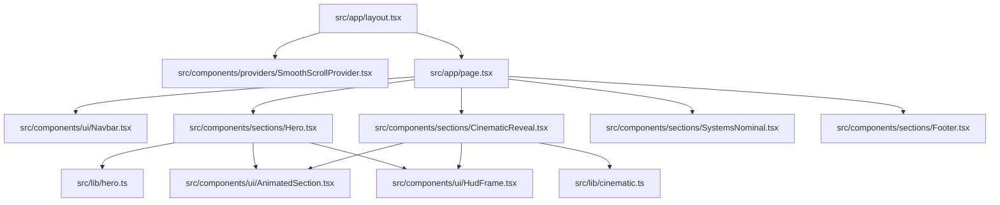

**Diagram sources**
- [src/app/layout.tsx:1-37](file://src/app/layout.tsx#L1-L37)
- [src/app/page.tsx:1-23](file://src/app/page.tsx#L1-L23)
- [src/components/providers/SmoothScrollProvider.tsx:1-37](file://src/components/providers/SmoothScrollProvider.tsx#L1-L37)
- [src/components/ui/Navbar.tsx:1-67](file://src/components/ui/Navbar.tsx#L1-L67)
- [src/components/sections/Hero.tsx:1-366](file://src/components/sections/Hero.tsx#L1-L366)
- [src/components/sections/CinematicReveal.tsx:1-384](file://src/components/sections/CinematicReveal.tsx#L1-L384)
- [src/components/sections/SystemsNominal.tsx:1-31](file://src/components/sections/SystemsNominal.tsx#L1-L31)
- [src/components/sections/Footer.tsx:1-62](file://src/components/sections/Footer.tsx#L1-L62)
- [src/lib/hero.ts:1-43](file://src/lib/hero.ts#L1-L43)
- [src/lib/cinematic.ts:1-47](file://src/lib/cinematic.ts#L1-L47)
- [src/components/ui/AnimatedSection.tsx:1-43](file://src/components/ui/AnimatedSection.tsx#L1-L43)
- [src/components/ui/HudFrame.tsx:1-32](file://src/components/ui/HudFrame.tsx#L1-L32)

**Section sources**
- [src/app/layout.tsx:1-37](file://src/app/layout.tsx#L1-L37)
- [src/app/page.tsx:1-23](file://src/app/page.tsx#L1-L23)

## Core Components
This section outlines the foundational building blocks and their roles:
- SmoothScrollProvider: Initializes Lenis for smooth scrolling and manages RAF lifecycle.
- AnimatedSection: Provides Framer Motion-based staggered animations with viewport triggers.
- Navbar: Scroll-aware header with dynamic styling.
- HUD frame component: SVG-based corner decorations for HUD elements.
- Hero and CinematicReveal: Canvas-driven scroll-linked animations with image sequences and dialogue/beat overlays.
- SystemsNominal: Telemetry display section with animated entries.
- Footer: Informational footer with navigation links.

**Section sources**
- [src/components/providers/SmoothScrollProvider.tsx:1-37](file://src/components/providers/SmoothScrollProvider.tsx#L1-L37)
- [src/components/ui/AnimatedSection.tsx:1-43](file://src/components/ui/AnimatedSection.tsx#L1-L43)
- [src/components/ui/Navbar.tsx:1-67](file://src/components/ui/Navbar.tsx#L1-L67)
- [src/components/ui/HudFrame.tsx:1-32](file://src/components/ui/HudFrame.tsx#L1-L32)
- [src/components/sections/Hero.tsx:1-366](file://src/components/sections/Hero.tsx#L1-L366)
- [src/components/sections/CinematicReveal.tsx:1-384](file://src/components/sections/CinematicReveal.tsx#L1-L384)
- [src/components/sections/SystemsNominal.tsx:1-31](file://src/components/sections/SystemsNominal.tsx#L1-L31)
- [src/components/sections/Footer.tsx:1-62](file://src/components/sections/Footer.tsx#L1-L62)

## Architecture Overview
The architecture centers around:
- Next.js app router for routing and metadata.
- Lenis for smooth scroll orchestration.
- Framer Motion for declarative animations.
- Canvas-based image sequences for high-fidelity motion graphics.
- Tailwind CSS v4 via PostCSS plugin for styling.

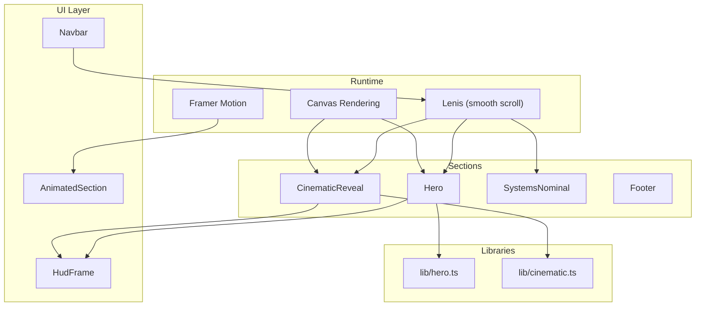

**Diagram sources**
- [src/components/providers/SmoothScrollProvider.tsx:1-37](file://src/components/providers/SmoothScrollProvider.tsx#L1-L37)
- [src/components/ui/AnimatedSection.tsx:1-43](file://src/components/ui/AnimatedSection.tsx#L1-L43)
- [src/components/ui/HudFrame.tsx:1-32](file://src/components/ui/HudFrame.tsx#L1-L32)
- [src/components/sections/Hero.tsx:1-366](file://src/components/sections/Hero.tsx#L1-L366)
- [src/components/sections/CinematicReveal.tsx:1-384](file://src/components/sections/CinematicReveal.tsx#L1-L384)
- [src/components/sections/SystemsNominal.tsx:1-31](file://src/components/sections/SystemsNominal.tsx#L1-L31)
- [src/components/sections/Footer.tsx:1-62](file://src/components/sections/Footer.tsx#L1-L62)
- [src/lib/hero.ts:1-43](file://src/lib/hero.ts#L1-L43)
- [src/lib/cinematic.ts:1-47](file://src/lib/cinematic.ts#L1-L47)

## Detailed Component Analysis

### SmoothScrollProvider
- Purpose: Initialize Lenis, synchronize RAF, and clean up on unmount.
- Lifecycle: Creates Lenis instance, starts RAF loop, and cancels on teardown.
- Memory: Stores reference to Lenis and clears RAF ID to prevent leaks.

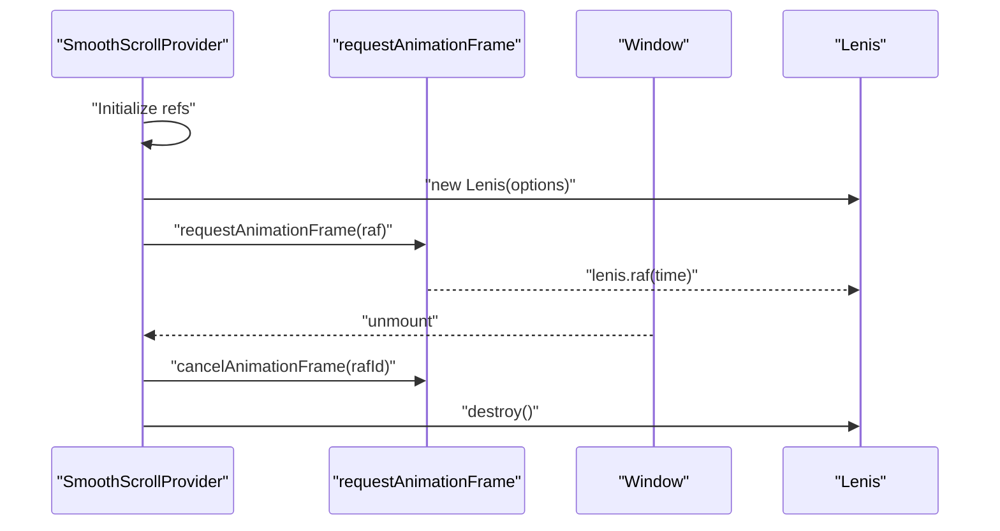

**Diagram sources**
- [src/components/providers/SmoothScrollProvider.tsx:1-37](file://src/components/providers/SmoothScrollProvider.tsx#L1-L37)

**Section sources**
- [src/components/providers/SmoothScrollProvider.tsx:1-37](file://src/components/providers/SmoothScrollProvider.tsx#L1-L37)

### AnimatedSection
- Purpose: Provide spring-based staggered animations with viewport triggers.
- Props: Accepts children and optional className.
- Behavior: Uses viewport once and negative margin to trigger earlier.

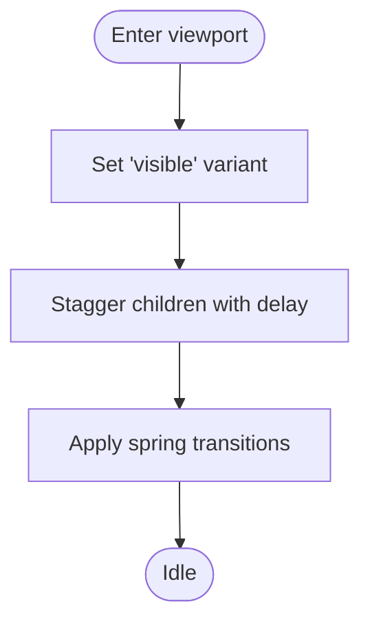

**Diagram sources**
- [src/components/ui/AnimatedSection.tsx:1-43](file://src/components/ui/AnimatedSection.tsx#L1-L43)

**Section sources**
- [src/components/ui/AnimatedSection.tsx:1-43](file://src/components/ui/AnimatedSection.tsx#L1-L43)

### Hero
- Canvas rendering: Dynamically loads image sequence, scales to fit, and draws frames on scroll.
- Scroll-linked effects: Opacity and transforms for text and HUD elements.
- State management: Tracks loading progress, visibility sets, and current frame index.
- Lifecycle: Loads images once, resizes canvas on window resize, throttles scroll updates.

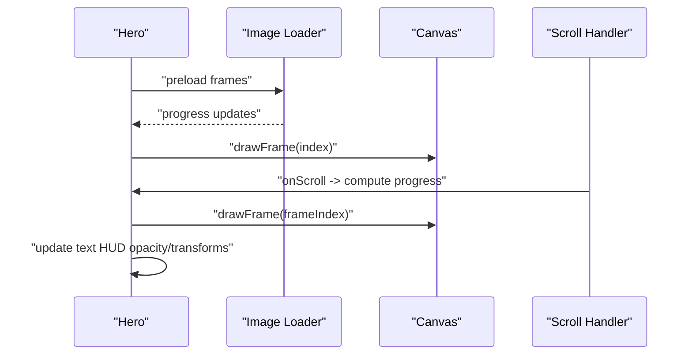

**Diagram sources**
- [src/components/sections/Hero.tsx:1-366](file://src/components/sections/Hero.tsx#L1-L366)
- [src/lib/hero.ts:1-43](file://src/lib/hero.ts#L1-L43)

**Section sources**
- [src/components/sections/Hero.tsx:1-366](file://src/components/sections/Hero.tsx#L1-L366)
- [src/lib/hero.ts:1-43](file://src/lib/hero.ts#L1-L43)

### CinematicReveal
- Similar to Hero but with a different image sequence and dialogue beats.
- Uses a fixed progress-to-frame mapping and updates HUD elements accordingly.
- Maintains separate refs for headings and outro elements.

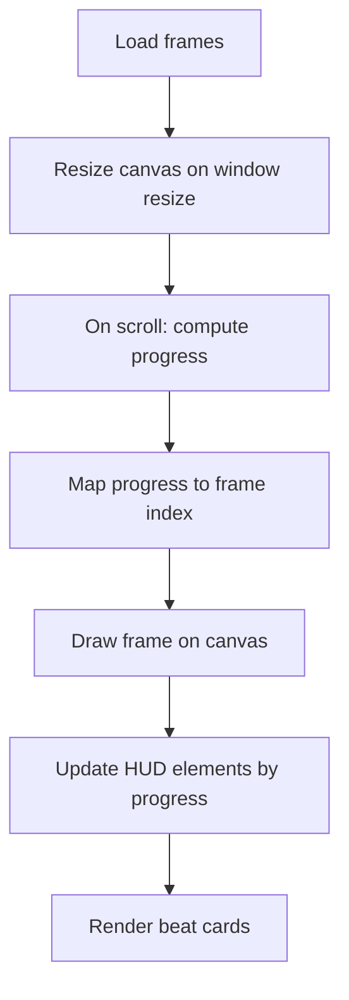

**Diagram sources**
- [src/components/sections/CinematicReveal.tsx:1-384](file://src/components/sections/CinematicReveal.tsx#L1-L384)
- [src/lib/cinematic.ts:1-47](file://src/lib/cinematic.ts#L1-L47)

**Section sources**
- [src/components/sections/CinematicReveal.tsx:1-384](file://src/components/sections/CinematicReveal.tsx#L1-L384)
- [src/lib/cinematic.ts:1-47](file://src/lib/cinematic.ts#L1-L47)

### SystemsNominal
- Telemetry display section with animated entries.
- Uses EyebrowBadge and AnimatedSection components.
- Presents system status information with nanoparticle lattice and cold-fusion details.

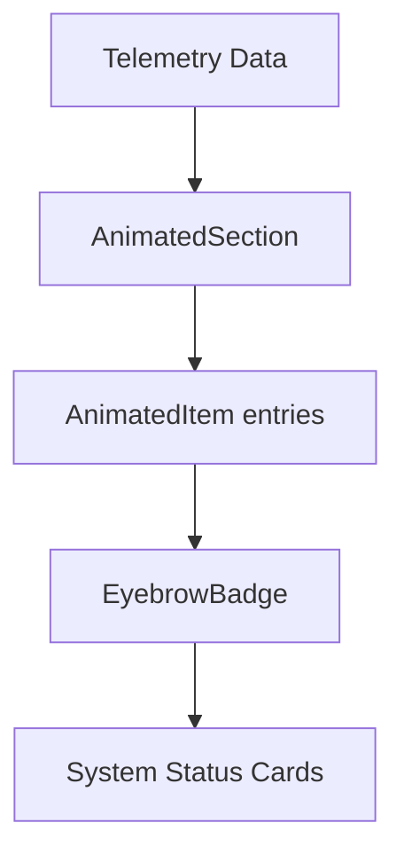

**Diagram sources**
- [src/components/sections/SystemsNominal.tsx:1-31](file://src/components/sections/SystemsNominal.tsx#L1-L31)

**Section sources**
- [src/components/sections/SystemsNominal.tsx:1-31](file://src/components/sections/SystemsNominal.tsx#L1-L31)

### Navbar
- Scroll-aware header with backdrop blur and border changes.
- Uses passive event listeners for performance.

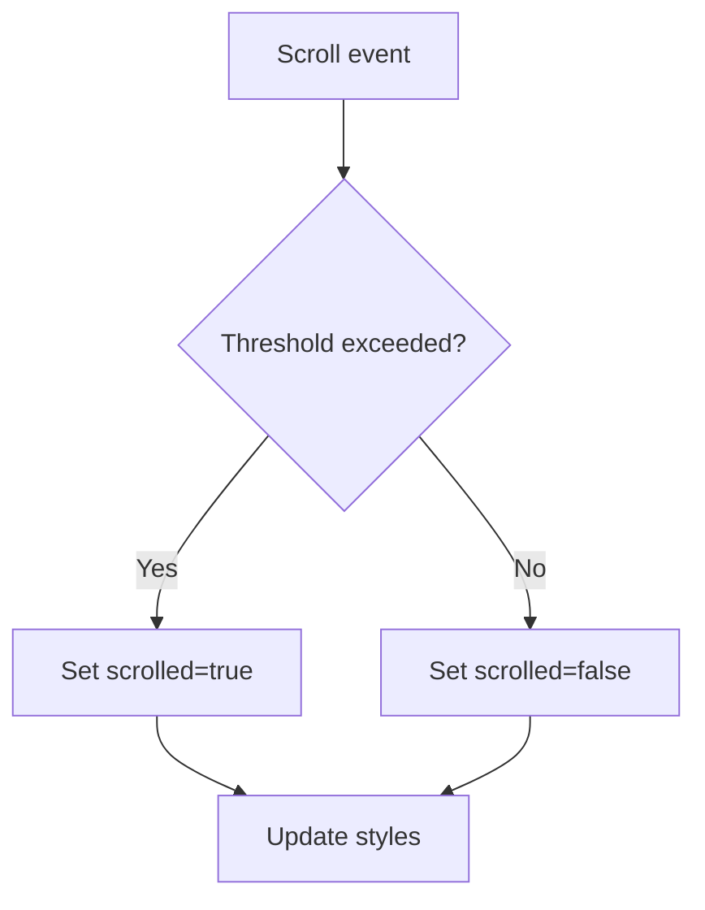

**Diagram sources**
- [src/components/ui/Navbar.tsx:1-67](file://src/components/ui/Navbar.tsx#L1-L67)

**Section sources**
- [src/components/ui/Navbar.tsx:1-67](file://src/components/ui/Navbar.tsx#L1-L67)

### HUD Frame Component
- SVG-based corner decorations with configurable size and corner.
- Props interface ensures type-safe usage.

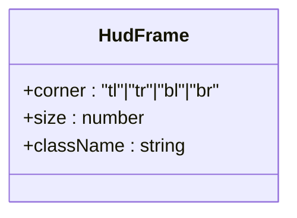

**Diagram sources**
- [src/components/ui/HudFrame.tsx:1-32](file://src/components/ui/HudFrame.tsx#L1-L32)

**Section sources**
- [src/components/ui/HudFrame.tsx:1-32](file://src/components/ui/HudFrame.tsx#L1-L32)

## Dependency Analysis
External dependencies and their roles:
- next: Framework runtime and app directory.
- react/react-dom: UI library.
- framer-motion: Declarative animations.
- lenis: Smooth scroll engine.
- geist: Font provider.
- @phosphor-icons/react: Icons.
- tailwindcss and @tailwindcss/postcss: Styling pipeline.

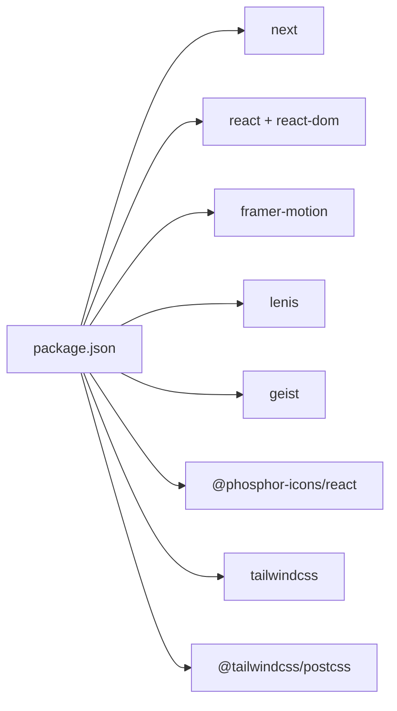

**Diagram sources**
- [package.json:1-31](file://package.json#L1-L31)

**Section sources**
- [package.json:1-31](file://package.json#L1-L31)

## Performance Considerations
Canvas rendering and scroll performance:
- Throttle scroll handlers using requestAnimationFrame and a per-frame flag to avoid redundant work.
- Resize canvas with devicePixelRatio awareness and scale the 2D context appropriately.
- Use will-change and transform: translateZ(0) to promote layers for smoother animations.
- Prefer CSS transforms and opacity over layout-affecting properties.
- Minimize DOM reads/writes inside tight loops; batch updates when possible.
- Destroy Lenis and cancel RAF on unmount to prevent leaks.

Scroll-linked animation specifics:
- Compute progress from section bounding rect and clamp to [0, 1].
- Map progress to frame indices using Math.floor(progress * N) and clamp to the frame range.
- Update only changed DOM nodes (opacity/transform) and skip drawing when the frame index has not changed.

Memory management:
- Keep references to image arrays in refs to avoid re-creating arrays on renders.
- Clear canvas before drawing to prevent artifacts.
- Avoid closures capturing large objects in frequent callbacks.

Bundle size optimization:
- Use Next.js built-in code splitting and route-based bundling.
- Lazy-load heavy components if needed.
- Keep image sequences optimized and consider WebP conversion if beneficial.

Production deployment:
- Ensure public image sequences are served efficiently.
- Verify font loading strategy and fallbacks.
- Test across devices and browsers for scroll and canvas behavior.

## Testing Strategies
Animation components:
- Unit tests for helpers: framePath, cineFramePath, and progress-to-frame mapping.
- Snapshot tests for static markup of HUD elements and card overlays.
- Mock requestAnimationFrame and scroll events to simulate progress and verify DOM updates.

Scroll behavior verification:
- Measure opacity and transform values at specific progress thresholds.
- Validate that text fades out/in at defined intervals.
- Confirm that HUD elements appear/disappear at expected progress ranges.

Cross-browser compatibility:
- Test scroll behavior differences across browsers and devices.
- Validate canvas rendering consistency and pixel scaling.
- Verify font rendering and fallbacks.

## Code Quality and Tooling
TypeScript configuration:
- Strict mode enabled with noEmit and isolatedModules for safety.
- Bundler module resolution and JSX runtime configured for Next.js.
- Path aliases (@/*) mapped to src for cleaner imports.

ESLint configuration:
- Extends Next.js recommended configs for TypeScript and web vitals.
- Ignores default Next folders except allowing linting of generated types.

PostCSS/Tailwind:
- Tailwind v4 plugin configured via PostCSS.
- Global fonts injected in the root layout; CSS variables exposed for typography.

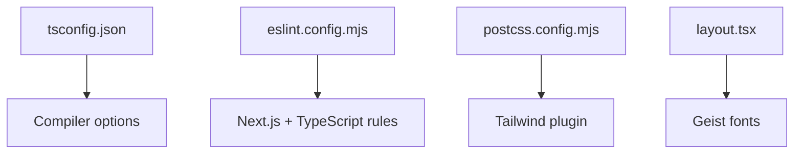

**Diagram sources**
- [tsconfig.json:1-35](file://tsconfig.json#L1-L35)
- [eslint.config.mjs:1-19](file://eslint.config.mjs#L1-L19)
- [postcss.config.mjs:1-8](file://postcss.config.mjs#L1-L8)
- [src/app/layout.tsx:1-37](file://src/app/layout.tsx#L1-L37)

**Section sources**
- [tsconfig.json:1-35](file://tsconfig.json#L1-L35)
- [eslint.config.mjs:1-19](file://eslint.config.mjs#L1-L19)
- [postcss.config.mjs:1-8](file://postcss.config.mjs#L1-L8)
- [src/app/layout.tsx:1-37](file://src/app/layout.tsx#L1-L37)

## Development Server Configuration

**Updated** Enhanced development server configuration for Windows compatibility with --webpack flag

The project now uses the `--webpack` flag in development and build scripts to improve cross-platform compatibility, particularly on Windows systems. This configuration ensures consistent behavior across different operating systems and development environments.

### Development Scripts
- `dev`: Starts the development server with webpack integration for enhanced Windows compatibility
- `build`: Builds the application with webpack support
- `start`: Runs the production server
- `lint`: Executes ESLint for code quality checks

### Cross-Platform Development Experience
The `--webpack` flag provides several benefits for cross-platform development:
- **Windows Compatibility**: Resolves path resolution and module loading issues common on Windows systems
- **Consistent Behavior**: Ensures identical development experience across macOS, Linux, and Windows
- **Improved Reliability**: Reduces platform-specific build and runtime errors
- **Enhanced Performance**: Leverages webpack's optimized module resolution and caching mechanisms

### Configuration Details
The development server configuration includes:
- Webpack integration for module resolution
- Hot module replacement support
- Source map generation for debugging
- Optimized asset handling across platforms

**Section sources**
- [package.json:5-10](file://package.json#L5-L10)

## Extensibility and Maintenance
Adding new UI components:
- Place reusable components under src/components/ui with clear props interfaces.
- Use className composition and Tailwind utilities for styling.
- Prefer functional components with explicit props and minimal internal state.

Extending the animation system:
- Define constants for frame counts and asset paths in src/lib.
- Reuse canvas drawing helpers and progress computation logic.
- Add new sections following the same pattern: preload frames, resize canvas, draw frames, and update HUD elements.

Maintaining code quality:
- Run linting regularly and fix issues before merging.
- Keep TypeScript strict mode enabled and avoid disabling it for new code.
- Use viewport-triggered animations for off-main-thread-friendly motion.

## Conclusion
By adhering to these guidelines—consistent TypeScript configuration, ESLint rules, and PostCSS/Tailwind setup—you can maintain high code quality across the project. Following the component development patterns, scroll performance best practices, and memory-conscious canvas rendering will ensure smooth, responsive experiences. The enhanced development server configuration with webpack integration provides improved cross-platform compatibility, particularly for Windows users. Organize code thoughtfully, test thoroughly, and keep dependencies lean for optimal performance and maintainability.