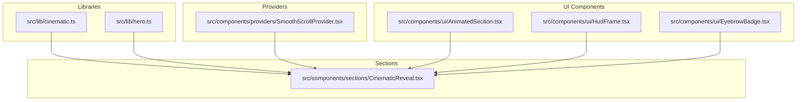
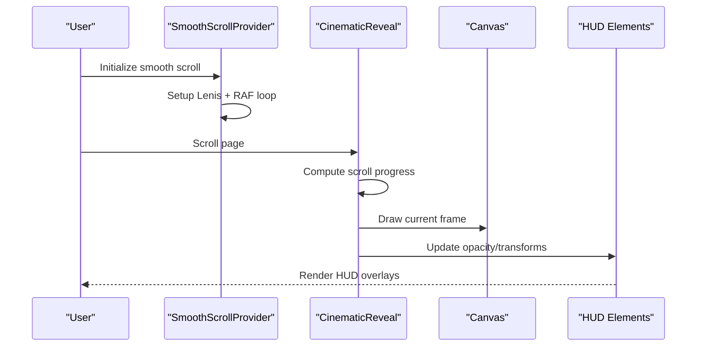
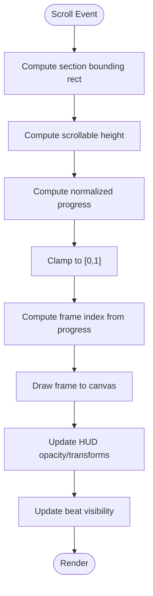
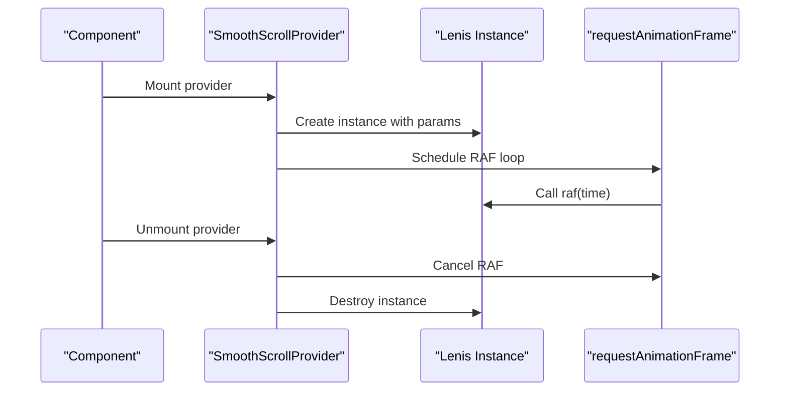
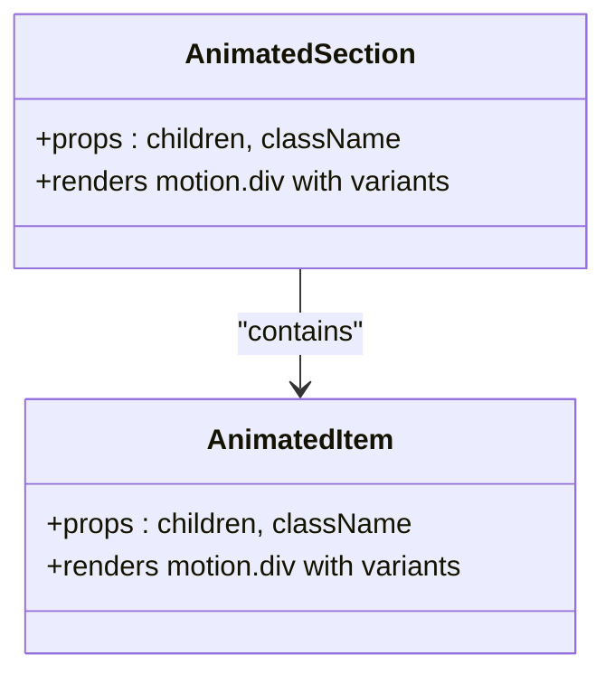
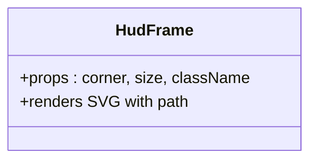
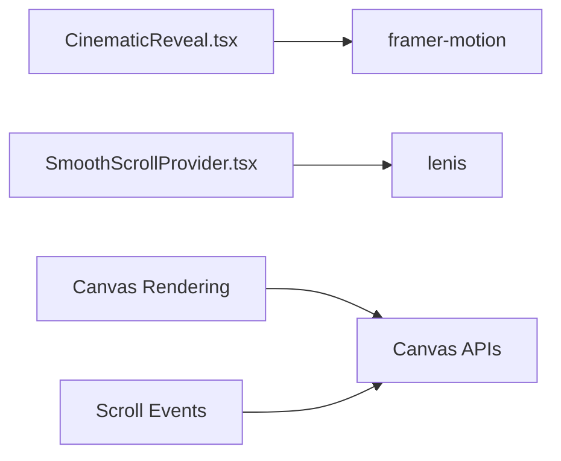

# Testing Strategies

<cite>
**Referenced Files in This Document**
- [README.md](file://README.md)
- [package.json](file://package.json)
- [next.config.ts](file://next.config.ts)
- [tsconfig.json](file://tsconfig.json)
- [src/lib/cinematic.ts](file://src/lib/cinematic.ts)
- [src/lib/hero.ts](file://src/lib/hero.ts)
- [src/components/providers/SmoothScrollProvider.tsx](file://src/components/providers/SmoothScrollProvider.tsx)
- [src/components/sections/CinematicReveal.tsx](file://src/components/sections/CinematicReveal.tsx)
- [src/components/ui/AnimatedSection.tsx](file://src/components/ui/AnimatedSection.tsx)
- [src/components/ui/HudFrame.tsx](file://src/components/ui/HudFrame.tsx)
- [src/components/ui/EyebrowBadge.tsx](file://src/components/ui/EyebrowBadge.tsx)
</cite>

## Table of Contents
1. [Introduction](#introduction)
2. [Project Structure](#project-structure)
3. [Core Components](#core-components)
4. [Architecture Overview](#architecture-overview)
5. [Detailed Component Analysis](#detailed-component-analysis)
6. [Dependency Analysis](#dependency-analysis)
7. [Performance Considerations](#performance-considerations)
8. [Troubleshooting Guide](#troubleshooting-guide)
9. [Conclusion](#conclusion)
10. [Appendices](#appendices)

## Introduction
This document outlines comprehensive testing strategies for the Iron Man project’s animation and UI components. It focuses on:
- Unit testing approaches for animation logic, frame calculation algorithms, and scroll position calculations
- Integration testing strategies for scroll-triggered animations, component composition, and state management
- Visual regression testing for animation sequences, HUD elements, and responsive layouts
- Cross-browser compatibility, mobile responsiveness, and performance benchmarking
- Mocking strategies for canvas operations, scroll events, and animation frames
- Guidelines for animation timing, sequence correctness, and user interaction patterns
- Continuous integration testing, automated performance monitoring, and QA workflows tailored for animation-heavy applications

## Project Structure
The project is a Next.js application with a clear separation of concerns:
- Libraries define constants and data structures for cinematic and hero sequences
- Providers encapsulate smooth scrolling behavior
- Sections implement scroll-triggered animations and HUD overlays
- UI components provide reusable animated elements and decorative HUD frames
- Configuration files define build-time and runtime behavior

**Diagram sources**
- [src/lib/cinematic.ts:1-47](file://src/lib/cinematic.ts#L1-L47)
- [src/lib/hero.ts:1-43](file://src/lib/hero.ts#L1-L43)
- [src/components/providers/SmoothScrollProvider.tsx:1-37](file://src/components/providers/SmoothScrollProvider.tsx#L1-L37)
- [src/components/sections/CinematicReveal.tsx:1-384](file://src/components/sections/CinematicReveal.tsx#L1-L384)
- [src/components/ui/AnimatedSection.tsx:1-43](file://src/components/ui/AnimatedSection.tsx#L1-L43)
- [src/components/ui/HudFrame.tsx:1-32](file://src/components/ui/HudFrame.tsx#L1-L32)
- [src/components/ui/EyebrowBadge.tsx:1-17](file://src/components/ui/EyebrowBadge.tsx#L1-L17)

**Section sources**
- [README.md:1-37](file://README.md#L1-L37)
- [package.json:1-31](file://package.json#L1-L31)
- [next.config.ts:1-8](file://next.config.ts#L1-L8)
- [tsconfig.json:1-35](file://tsconfig.json#L1-L35)

## Core Components
This section identifies the primary components under test and their responsibilities:
- CinematicReveal: Scroll-driven canvas animation, HUD overlays, beat visibility, and progress indicators
- SmoothScrollProvider: Lenis-based smooth scrolling with requestAnimationFrame lifecycle
- AnimatedSection: Framer Motion-based staggered entrance animations
- HudFrame: SVG-based HUD corner decorations
- EyebrowBadge: Decorative badge component
- Libraries (cinematic.ts, hero.ts): Frame metadata and dialogue/beat definitions

Key testing targets:
- Frame loading and drawing pipeline
- Scroll progress computation and frame selection
- HUD opacity and transform transitions
- Beat visibility windows
- Canvas sizing and device pixel ratio handling
- Smooth scroll behavior and RAF lifecycle
- Animation timing and sequence correctness

**Section sources**
- [src/components/sections/CinematicReveal.tsx:1-384](file://src/components/sections/CinematicReveal.tsx#L1-L384)
- [src/components/providers/SmoothScrollProvider.tsx:1-37](file://src/components/providers/SmoothScrollProvider.tsx#L1-L37)
- [src/components/ui/AnimatedSection.tsx:1-43](file://src/components/ui/AnimatedSection.tsx#L1-L43)
- [src/components/ui/HudFrame.tsx:1-32](file://src/components/ui/HudFrame.tsx#L1-L32)
- [src/components/ui/EyebrowBadge.tsx:1-17](file://src/components/ui/EyebrowBadge.tsx#L1-L17)
- [src/lib/cinematic.ts:1-47](file://src/lib/cinematic.ts#L1-L47)
- [src/lib/hero.ts:1-43](file://src/lib/hero.ts#L1-L43)

## Architecture Overview
The animation pipeline integrates libraries, providers, and UI components:
- Libraries supply constants and metadata for frame sequences and beats
- SmoothScrollProvider initializes Lenis and manages RAF lifecycle
- CinematicReveal orchestrates image loading, canvas drawing, scroll event handling, and HUD updates
- UI components render HUD frames and badges

**Diagram sources**
- [src/components/providers/SmoothScrollProvider.tsx:1-37](file://src/components/providers/SmoothScrollProvider.tsx#L1-L37)
- [src/components/sections/CinematicReveal.tsx:120-186](file://src/components/sections/CinematicReveal.tsx#L120-L186)
- [src/components/ui/HudFrame.tsx:1-32](file://src/components/ui/HudFrame.tsx#L1-L32)

## Detailed Component Analysis

### CinematicReveal: Scroll-Triggered Canvas Animation
Responsibilities:
- Preload frames and track load progress
- Resize canvas to match viewport and device pixel ratio
- Compute scroll progress and select frame index
- Draw frame to canvas with aspect-ratio-preserving scaling
- Update HUD elements (opacity, transforms, progress bar, sequence readout)
- Manage beat visibility windows

Key algorithms to test:
- Frame index calculation from scroll progress
- Aspect-ratio scaling and draw area computation
- Opacity and transform interpolation for HUD elements
- Beat visibility set computation and change detection

Mocking strategies:
- Replace canvas context with a mock to capture draw calls
- Stub window.resize and scroll events
- Simulate image loading completion
- Control device pixel ratio for rendering tests

**Diagram sources**
- [src/components/sections/CinematicReveal.tsx:120-186](file://src/components/sections/CinematicReveal.tsx#L120-L186)

**Section sources**
- [src/components/sections/CinematicReveal.tsx:1-384](file://src/components/sections/CinematicReveal.tsx#L1-L384)
- [src/lib/cinematic.ts:1-47](file://src/lib/cinematic.ts#L1-L47)

### SmoothScrollProvider: Smooth Scrolling Behavior
Responsibilities:
- Initialize Lenis with configured parameters
- Run RAF loop to advance Lenis animation
- Clean up RAF and destroy Lenis on unmount

Testing focus:
- Initialization parameters and defaults
- RAF scheduling and cancellation
- Lenis lifecycle and teardown

**Diagram sources**
- [src/components/providers/SmoothScrollProvider.tsx:11-33](file://src/components/providers/SmoothScrollProvider.tsx#L11-L33)

**Section sources**
- [src/components/providers/SmoothScrollProvider.tsx:1-37](file://src/components/providers/SmoothScrollProvider.tsx#L1-L37)

### AnimatedSection: Staggered Entrance Animations
Responsibilities:
- Provide container and item variants for Framer Motion
- Trigger animations when in view with viewport options

Testing focus:
- Viewport intersection triggers
- Staggered child animations
- Spring physics parameters

**Diagram sources**
- [src/components/ui/AnimatedSection.tsx:22-42](file://src/components/ui/AnimatedSection.tsx#L22-L42)

**Section sources**
- [src/components/ui/AnimatedSection.tsx:1-43](file://src/components/ui/AnimatedSection.tsx#L1-L43)

### HudFrame: SVG HUD Corner Decorations
Responsibilities:
- Render corner-specific SVG paths based on size and corner position

Testing focus:
- Path generation per corner
- Size scaling and viewBox alignment

**Diagram sources**
- [src/components/ui/HudFrame.tsx:1-32](file://src/components/ui/HudFrame.tsx#L1-L32)

**Section sources**
- [src/components/ui/HudFrame.tsx:1-32](file://src/components/ui/HudFrame.tsx#L1-L32)

### EyebrowBadge: Decorative Badge
Responsibilities:
- Render a stylized badge with a pulsing indicator dot

Testing focus:
- Styling and backdrop blur application
- Shadow and color effects

**Section sources**
- [src/components/ui/EyebrowBadge.tsx:1-17](file://src/components/ui/EyebrowBadge.tsx#L1-L17)

## Dependency Analysis
External dependencies relevant to testing:
- Framer Motion: animation engine for AnimatedSection
- Lenis: smooth scroll implementation for SmoothScrollProvider
- Canvas APIs: drawing and resizing for CinematicReveal
- Window APIs: resize and scroll events for CinematicReveal

**Diagram sources**
- [src/components/sections/CinematicReveal.tsx:1-384](file://src/components/sections/CinematicReveal.tsx#L1-L384)
- [src/components/providers/SmoothScrollProvider.tsx:1-37](file://src/components/providers/SmoothScrollProvider.tsx#L1-L37)
- [package.json:11-19](file://package.json#L11-L19)

**Section sources**
- [package.json:11-19](file://package.json#L11-L19)

## Performance Considerations
Guidelines for performance-focused testing:
- Frame rate stability: measure RAF cadence and dropped frames during scroll
- Rendering cost: profile draw calls and canvas resize operations
- Memory footprint: monitor image cache growth and cleanup on unmount
- Device pixel ratio impact: test rendering quality and performance across DPR values
- Intersection thresholds: tune viewport margins to balance responsiveness and CPU usage

[No sources needed since this section provides general guidance]

## Troubleshooting Guide
Common issues and remedies:
- Canvas not drawing: verify context availability and image completeness
- HUD not updating: confirm scroll event listeners and requestAnimationFrame scheduling
- Beat visibility inconsistent: validate progress clamping and visibility window checks
- Mobile responsiveness: test small screens and DPR scaling in simulated devices

**Section sources**
- [src/components/sections/CinematicReveal.tsx:62-105](file://src/components/sections/CinematicReveal.tsx#L62-L105)
- [src/components/sections/CinematicReveal.tsx:120-186](file://src/components/sections/CinematicReveal.tsx#L120-L186)

## Conclusion
The testing strategy should combine unit tests for algorithms and state transitions, integration tests for scroll-triggered animations and component composition, and visual regression tests for HUD and responsive layouts. Mocking canvas, scroll events, and animation frames enables deterministic and fast tests. Automated performance monitoring and CI workflows ensure animation-heavy applications remain stable and performant across browsers and devices.

[No sources needed since this section summarizes without analyzing specific files]

## Appendices

### Unit Testing Approaches
- Frame calculation algorithms: test progress-to-frame mapping and edge cases (min/max bounds)
- Scroll position calculations: validate progress computation with various viewport heights and section offsets
- HUD opacity/transform logic: assert computed styles for given progress values
- Beat visibility windows: verify set membership and change detection logic

**Section sources**
- [src/components/sections/CinematicReveal.tsx:120-186](file://src/components/sections/CinematicReveal.tsx#L120-L186)
- [src/lib/cinematic.ts:16-44](file://src/lib/cinematic.ts#L16-L44)

### Integration Testing Strategies
- Scroll-triggered animations: simulate scroll events and assert HUD updates and canvas draws
- Component composition: mount sections with providers and verify HUD overlays render correctly
- State management: test visibility sets and load progress updates

**Section sources**
- [src/components/sections/CinematicReveal.tsx:1-384](file://src/components/sections/CinematicReveal.tsx#L1-L384)
- [src/components/providers/SmoothScrollProvider.tsx:1-37](file://src/components/providers/SmoothScrollProvider.tsx#L1-L37)

### Visual Regression Testing
- Animation sequences: capture frames at key progress points and compare against baselines
- HUD elements: snapshot HUD overlays across breakpoints and themes
- Responsive layouts: test mobile and desktop layouts with varying viewport sizes

[No sources needed since this section provides general guidance]

### Cross-Browser Compatibility and Mobile Responsiveness
- Emulate mobile devices and low-DPR environments
- Test scroll behavior differences across browsers
- Validate canvas rendering consistency across platforms

[No sources needed since this section provides general guidance]

### Performance Benchmarking
- Measure frame times during scroll
- Track memory usage during image loading
- Monitor dropped frames and adjust throttling parameters

[No sources needed since this section provides general guidance]

### Mocking Strategies
- Canvas: mock getContext and drawImage to capture draw calls
- Scroll events: mock getBoundingClientRect and window.innerHeight
- Animation frames: mock requestAnimationFrame and cancelAnimationFrame
- Images: mock onload/onerror to simulate loading states

**Section sources**
- [src/components/sections/CinematicReveal.tsx:32-60](file://src/components/sections/CinematicReveal.tsx#L32-L60)
- [src/components/sections/CinematicReveal.tsx:96-111](file://src/components/sections/CinematicReveal.tsx#L96-L111)

### Continuous Integration and QA Workflows
- Run unit and integration tests in CI
- Snapshot visual regression tests with automated diff reporting
- Enforce performance budgets and flag regressions
- Automate cross-browser testing on headless runners

[No sources needed since this section provides general guidance]