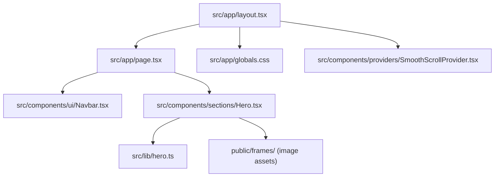
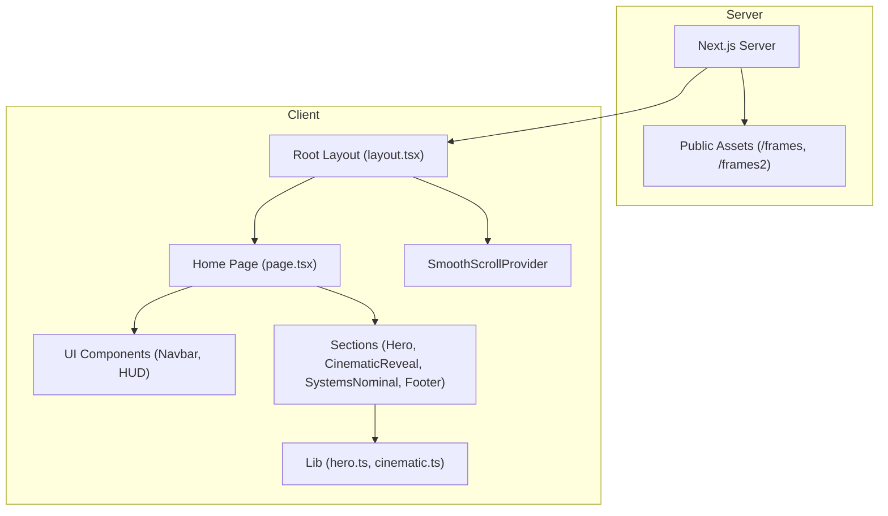
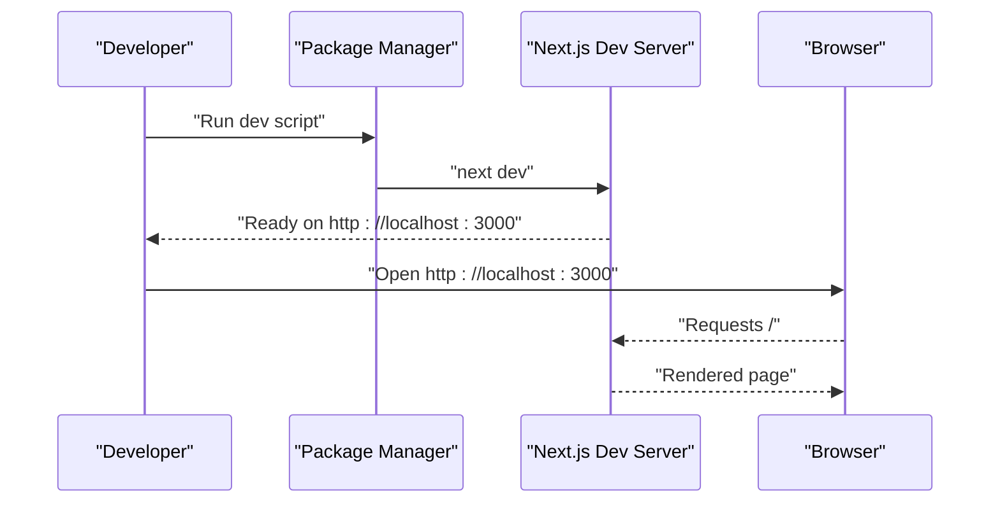
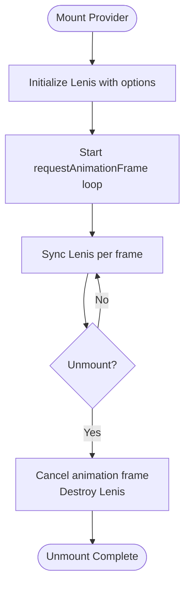
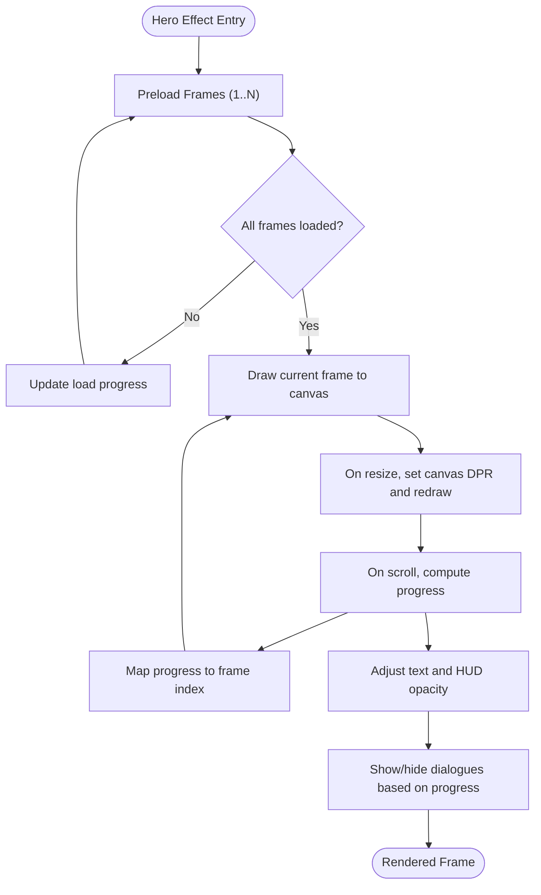
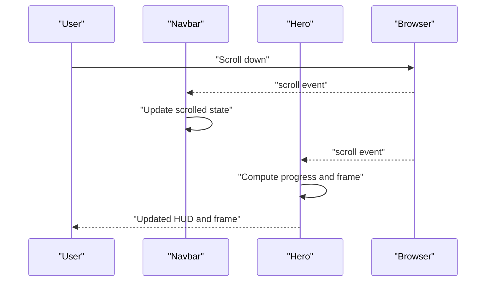
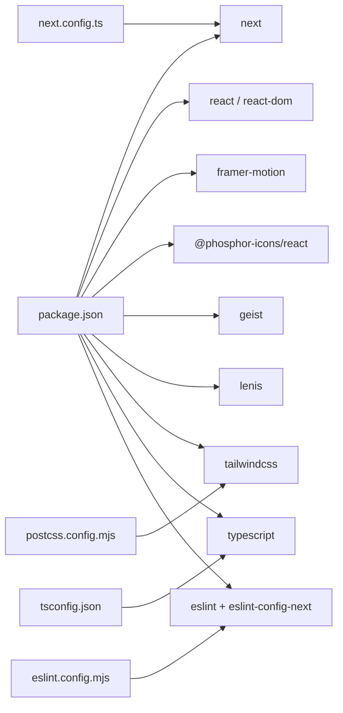

# Getting Started

<cite>
**Referenced Files in This Document**
- [README.md](file://README.md)
- [package.json](file://package.json)
- [next.config.ts](file://next.config.ts)
- [tsconfig.json](file://tsconfig.json)
- [postcss.config.mjs](file://postcss.config.mjs)
- [eslint.config.mjs](file://eslint.config.mjs)
- [src/app/layout.tsx](file://src/app/layout.tsx)
- [src/app/page.tsx](file://src/app/page.tsx)
- [src/app/globals.css](file://src/app/globals.css)
- [src/components/providers/SmoothScrollProvider.tsx](file://src/components/providers/SmoothScrollProvider.tsx)
- [src/components/ui/Navbar.tsx](file://src/components/ui/Navbar.tsx)
- [src/components/sections/Hero.tsx](file://src/components/sections/Hero.tsx)
- [src/lib/hero.ts](file://src/lib/hero.ts)
- [src/lib/cinematic.ts](file://src/lib/cinematic.ts)
</cite>

## Table of Contents
1. [Introduction](#introduction)
2. [Project Structure](#project-structure)
3. [Core Components](#core-components)
4. [Architecture Overview](#architecture-overview)
5. [Detailed Component Analysis](#detailed-component-analysis)
6. [Dependency Analysis](#dependency-analysis)
7. [Performance Considerations](#performance-considerations)
8. [Troubleshooting Guide](#troubleshooting-guide)
9. [Conclusion](#conclusion)
10. [Appendices](#appendices)

## Introduction
Welcome to the Iron Man project. This is a Next.js application featuring a cinematic hero experience with smooth scrolling, animated frames, and a modern UI built with Tailwind CSS and TypeScript. The project is designed to run locally via a development server and can be customized by editing the homepage and components.

You will learn how to install prerequisites, choose a package manager, run the development server, explore the project structure, customize the site, and resolve common setup issues.

## Project Structure
At a high level, the project follows a Next.js App Router layout:
- Application shell and global styles live under src/app
- UI components are organized under src/components
- Shared logic and assets are under src/lib
- Public assets (images) are under public

Key entry points:
- Application root layout and metadata are defined in src/app/layout.tsx
- The homepage composition is defined in src/app/page.tsx
- Global CSS and theme tokens are defined in src/app/globals.css
- Smooth scrolling behavior is provided by src/components/providers/SmoothScrollProvider.tsx

**Diagram sources**
- [src/app/layout.tsx:1-37](file://src/app/layout.tsx#L1-L37)
- [src/app/page.tsx:1-20](file://src/app/page.tsx#L1-L20)
- [src/app/globals.css:1-83](file://src/app/globals.css#L1-L83)
- [src/components/providers/SmoothScrollProvider.tsx:1-37](file://src/components/providers/SmoothScrollProvider.tsx#L1-L37)
- [src/components/ui/Navbar.tsx:1-67](file://src/components/ui/Navbar.tsx#L1-L67)
- [src/components/sections/Hero.tsx:1-366](file://src/components/sections/Hero.tsx#L1-L366)
- [src/lib/hero.ts:1-43](file://src/lib/hero.ts#L1-L43)

**Section sources**
- [src/app/layout.tsx:1-37](file://src/app/layout.tsx#L1-L37)
- [src/app/page.tsx:1-20](file://src/app/page.tsx#L1-L20)
- [src/app/globals.css:1-83](file://src/app/globals.css#L1-L83)
- [src/components/providers/SmoothScrollProvider.tsx:1-37](file://src/components/providers/SmoothScrollProvider.tsx#L1-L37)

## Core Components
- Development scripts and dependencies are defined in package.json
- Next.js configuration is minimal in next.config.ts
- TypeScript compiler options and path aliases are configured in tsconfig.json
- PostCSS/Tailwind pipeline is configured in postcss.config.mjs
- ESLint configuration is centralized in eslint.config.mjs
- Global layout, metadata, fonts, and providers are wired in src/app/layout.tsx
- Homepage composes the Navbar, Hero, and other sections in src/app/page.tsx
- Smooth scrolling is enabled via a client-side provider in src/components/providers/SmoothScrollProvider.tsx
- Hero section renders animated frames and HUD elements in src/components/sections/Hero.tsx
- Shared constants for hero animations and dialogues are in src/lib/hero.ts
- Additional cinematic assets and beats are in src/lib/cinematic.ts

**Section sources**
- [package.json:1-31](file://package.json#L1-L31)
- [next.config.ts:1-8](file://next.config.ts#L1-L8)
- [tsconfig.json:1-35](file://tsconfig.json#L1-L35)
- [postcss.config.mjs:1-8](file://postcss.config.mjs#L1-L8)
- [eslint.config.mjs:1-19](file://eslint.config.mjs#L1-L19)
- [src/app/layout.tsx:1-37](file://src/app/layout.tsx#L1-L37)
- [src/app/page.tsx:1-20](file://src/app/page.tsx#L1-L20)
- [src/components/providers/SmoothScrollProvider.tsx:1-37](file://src/components/providers/SmoothScrollProvider.tsx#L1-L37)
- [src/components/sections/Hero.tsx:1-366](file://src/components/sections/Hero.tsx#L1-L366)
- [src/lib/hero.ts:1-43](file://src/lib/hero.ts#L1-L43)
- [src/lib/cinematic.ts:1-47](file://src/lib/cinematic.ts#L1-L47)

## Architecture Overview
The runtime architecture centers on Next.js rendering, client-side interactivity, and asset delivery:
- The server serves pages and static assets
- The client hydrates interactive components (smooth scrolling, scroll-driven animations)
- Global CSS and Tailwind tokens define the theme
- Fonts are optimized via Next/font
- ESLint and TypeScript provide developer tooling

**Diagram sources**
- [src/app/layout.tsx:1-37](file://src/app/layout.tsx#L1-L37)
- [src/app/page.tsx:1-20](file://src/app/page.tsx#L1-L20)
- [src/components/providers/SmoothScrollProvider.tsx:1-37](file://src/components/providers/SmoothScrollProvider.tsx#L1-L37)
- [src/components/ui/Navbar.tsx:1-67](file://src/components/ui/Navbar.tsx#L1-L67)
- [src/components/sections/Hero.tsx:1-366](file://src/components/sections/Hero.tsx#L1-L366)
- [src/lib/hero.ts:1-43](file://src/lib/hero.ts#L1-L43)
- [src/lib/cinematic.ts:1-47](file://src/lib/cinematic.ts#L1-L47)

## Detailed Component Analysis

### Development Server and Local Environment
- Start the development server using any of the supported package managers
- Access the application at http://localhost:3000
- Edit the homepage to customize content and layout

**Diagram sources**
- [README.md:5-17](file://README.md#L5-L17)
- [package.json:5-10](file://package.json#L5-L10)

**Section sources**
- [README.md:5-17](file://README.md#L5-L17)
- [package.json:5-10](file://package.json#L5-L10)

### Smooth Scrolling Provider
The SmoothScrollProvider initializes Lenis for fluid scroll behavior and manages lifecycle hooks to avoid leaks.

**Diagram sources**
- [src/components/providers/SmoothScrollProvider.tsx:8-36](file://src/components/providers/SmoothScrollProvider.tsx#L8-L36)

**Section sources**
- [src/components/providers/SmoothScrollProvider.tsx:1-37](file://src/components/providers/SmoothScrollProvider.tsx#L1-L37)

### Hero Section and Frame Animation
The Hero component loads a sequence of images, draws them onto a canvas, and animates overlays based on scroll progress. It also computes power telemetry and dialogue visibility.

**Diagram sources**
- [src/components/sections/Hero.tsx:26-182](file://src/components/sections/Hero.tsx#L26-L182)
- [src/lib/hero.ts:1-43](file://src/lib/hero.ts#L1-L43)

**Section sources**
- [src/components/sections/Hero.tsx:1-366](file://src/components/sections/Hero.tsx#L1-L366)
- [src/lib/hero.ts:1-43](file://src/lib/hero.ts#L1-L43)

### Navigation and Basic Interaction
The Navbar responds to scroll to adjust styling and provides internal links. The Hero section includes HUD elements and telemetry readouts.

**Diagram sources**
- [src/components/ui/Navbar.tsx:10-15](file://src/components/ui/Navbar.tsx#L10-L15)
- [src/components/sections/Hero.tsx:120-182](file://src/components/sections/Hero.tsx#L120-L182)

**Section sources**
- [src/components/ui/Navbar.tsx:1-67](file://src/components/ui/Navbar.tsx#L1-L67)
- [src/components/sections/Hero.tsx:1-366](file://src/components/sections/Hero.tsx#L1-L366)

## Dependency Analysis
The project relies on Next.js, React, Tailwind CSS v4, TypeScript, and several UI/performance libraries. Scripts and tooling are defined in package.json, with linting and type checking integrated via ESLint and TypeScript configurations.

**Diagram sources**
- [package.json:11-29](file://package.json#L11-L29)
- [tsconfig.json:16-23](file://tsconfig.json#L16-L23)
- [postcss.config.mjs:1-8](file://postcss.config.mjs#L1-L8)
- [eslint.config.mjs:1-19](file://eslint.config.mjs#L1-L19)
- [next.config.ts:3-5](file://next.config.ts#L3-L5)

**Section sources**
- [package.json:1-31](file://package.json#L1-L31)
- [tsconfig.json:1-35](file://tsconfig.json#L1-L35)
- [postcss.config.mjs:1-8](file://postcss.config.mjs#L1-L8)
- [eslint.config.mjs:1-19](file://eslint.config.mjs#L1-L19)
- [next.config.ts:1-8](file://next.config.ts#L1-L8)

## Performance Considerations
- Canvas rendering and scroll-driven updates are optimized with requestAnimationFrame and throttling via a single scroll handler
- Device pixel ratio scaling ensures crisp visuals on high-DPI displays
- Lazy loading of images and minimal re-renders improve responsiveness
- Tailwind CSS v4 and Next/font reduce bundle sizes and improve render performance

[No sources needed since this section provides general guidance]

## Troubleshooting Guide
Common setup issues and resolutions:
- Port already in use
  - The development server runs on port 3000 by default. If the port is busy, stop the conflicting process or configure an alternative port in your environment
  - Verify the development command and port in the project’s scripts
- Missing dependencies after clone
  - Install dependencies using your preferred package manager (npm, yarn, pnpm, or bun)
  - Re-run the development server after installation completes
- Fonts not loading
  - Ensure network access to Google Fonts is available; Next.js fetches Geist automatically
- Tailwind utilities not applied
  - Confirm Tailwind is enabled in PostCSS and that the build pipeline runs without errors
- ESLint errors
  - Run the linter to identify and fix issues; the project enforces Next.js core-web-vitals and TypeScript rules
- Canvas or image assets not appearing
  - Verify that image sequences exist under public/frames and public/frames2 as referenced by the Hero component

**Section sources**
- [README.md:5-17](file://README.md#L5-L17)
- [package.json:5-10](file://package.json#L5-L10)
- [src/app/layout.tsx:6-14](file://src/app/layout.tsx#L6-L14)
- [src/app/globals.css:1-22](file://src/app/globals.css#L1-L22)
- [eslint.config.mjs:1-19](file://eslint.config.mjs#L1-L19)
- [src/components/sections/Hero.tsx:31-54](file://src/components/sections/Hero.tsx#L31-L54)

## Conclusion
You now have everything needed to install the project, start the development server, and explore the application at http://localhost:3000. Customize the homepage, UI components, and assets to match your vision, and refer to the troubleshooting guide if you encounter issues.

[No sources needed since this section summarizes without analyzing specific files]

## Appendices

### Installation Instructions
- Prerequisites
  - Node.js version compatible with the project’s dependencies
- Choose a package manager
  - npm, yarn, pnpm, or bun are supported for development
- Install dependencies
  - Use your chosen package manager to install dependencies
- Start the development server
  - Run the dev script to launch the Next.js development server
- Access the application
  - Open http://localhost:3000 in your browser

**Section sources**
- [README.md:5-17](file://README.md#L5-L17)
- [package.json:5-10](file://package.json#L5-L10)

### Initial Customization Options
- Edit the homepage
  - Modify the composition in src/app/page.tsx to change sections and layout
- Adjust global styles
  - Customize theme tokens and styles in src/app/globals.css
- Update metadata and fonts
  - Change metadata and font families in src/app/layout.tsx
- Tweak smooth scrolling
  - Adjust Lenis initialization options in src/components/providers/SmoothScrollProvider.tsx
- Add or modify sections
  - Extend the homepage with additional sections and integrate them in src/app/page.tsx

**Section sources**
- [src/app/page.tsx:1-20](file://src/app/page.tsx#L1-L20)
- [src/app/globals.css:1-83](file://src/app/globals.css#L1-L83)
- [src/app/layout.tsx:16-21](file://src/app/layout.tsx#L16-L21)
- [src/components/providers/SmoothScrollProvider.tsx:12-18](file://src/components/providers/SmoothScrollProvider.tsx#L12-L18)

### Basic Navigation
- Internal navigation
  - Use the Navbar to navigate to sections like “Systems” and “Archive”
- Scroll-driven engagement
  - Scroll to trigger frame animations and HUD updates in the Hero section

**Section sources**
- [src/components/ui/Navbar.tsx:37-50](file://src/components/ui/Navbar.tsx#L37-L50)
- [src/components/sections/Hero.tsx:120-182](file://src/components/sections/Hero.tsx#L120-L182)

### Browser Compatibility and Recommended Tools
- Browser compatibility
  - The project targets modern browsers; ensure your browser supports ES2017+ features and WebGL for canvas rendering
- Recommended tools
  - Use a modern editor with TypeScript and ESLint support
  - Enable Tailwind IntelliSense for CSS autocompletion

[No sources needed since this section provides general guidance]