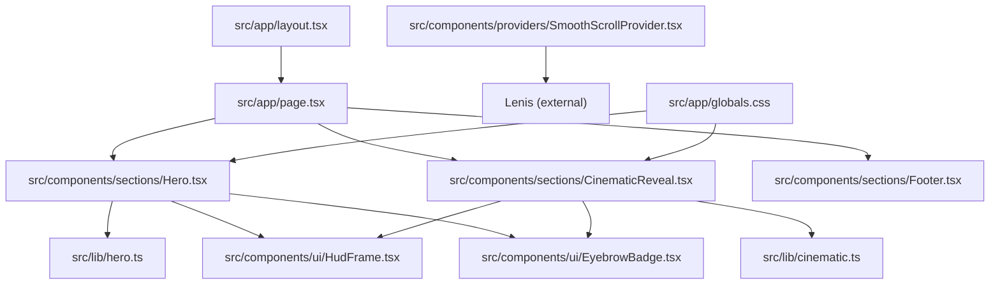
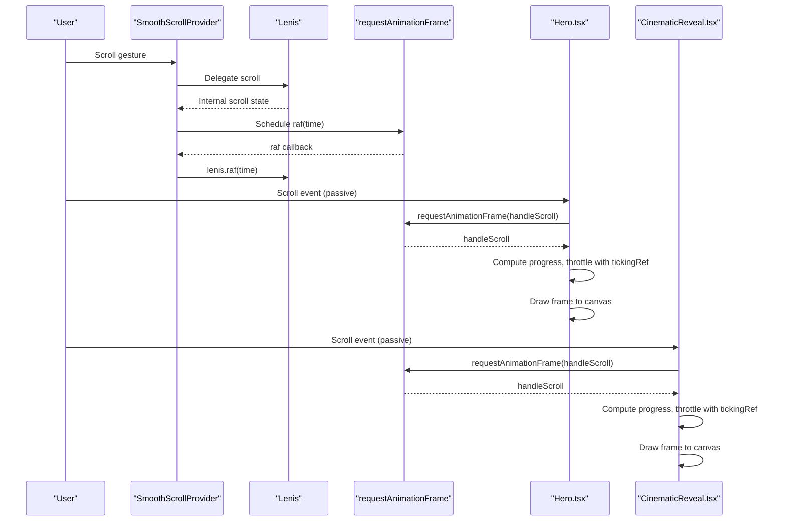
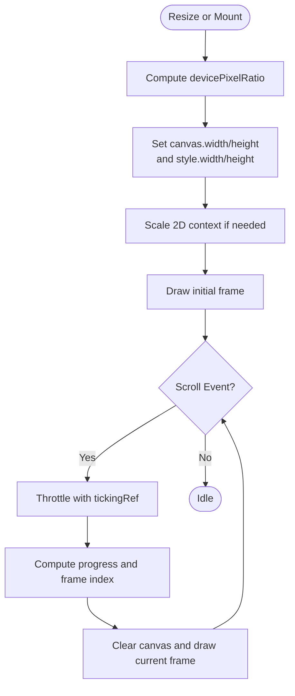
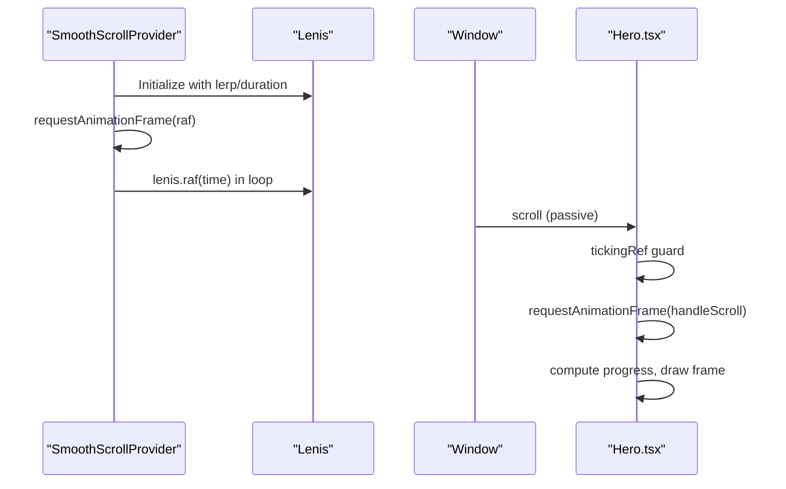
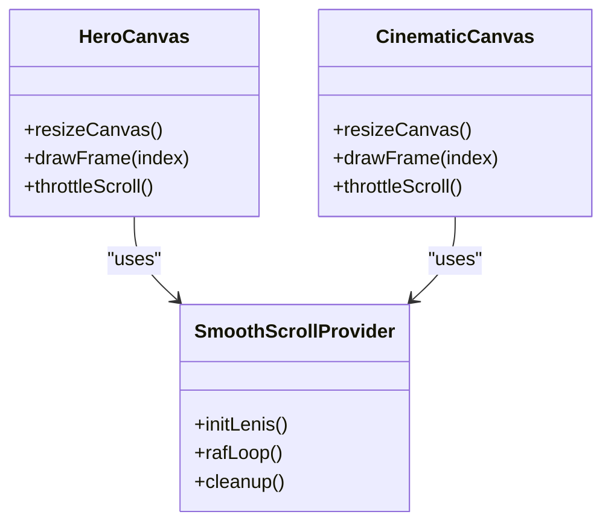
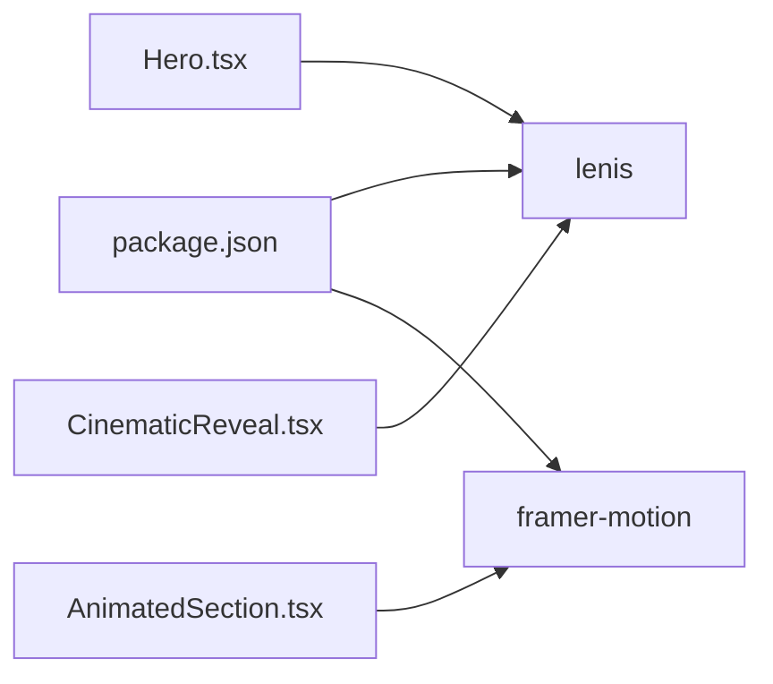

# Performance Optimization

<cite>
**Referenced Files in This Document**
- [README.md](file://README.md)
- [package.json](file://package.json)
- [next.config.ts](file://next.config.ts)
- [src/app/globals.css](file://src/app/globals.css)
- [src/app/layout.tsx](file://src/app/layout.tsx)
- [src/app/page.tsx](file://src/app/page.tsx)
- [src/components/providers/SmoothScrollProvider.tsx](file://src/components/providers/SmoothScrollProvider.tsx)
- [src/components/sections/Hero.tsx](file://src/components/sections/Hero.tsx)
- [src/components/sections/CinematicReveal.tsx](file://src/components/sections/CinematicReveal.tsx)
- [src/lib/hero.ts](file://src/lib/hero.ts)
- [src/lib/cinematic.ts](file://src/lib/cinematic.ts)
- [src/components/ui/AnimatedSection.tsx](file://src/components/ui/AnimatedSection.tsx)
- [src/components/ui/HudFrame.tsx](file://src/components/ui/HudFrame.tsx)
- [src/components/ui/EyebrowBadge.tsx](file://src/components/ui/EyebrowBadge.tsx)
</cite>

## Table of Contents
1. [Introduction](#introduction)
2. [Project Structure](#project-structure)
3. [Core Components](#core-components)
4. [Architecture Overview](#architecture-overview)
5. [Detailed Component Analysis](#detailed-component-analysis)
6. [Dependency Analysis](#dependency-analysis)
7. [Performance Considerations](#performance-considerations)
8. [Troubleshooting Guide](#troubleshooting-guide)
9. [Conclusion](#conclusion)
10. [Appendices](#appendices)

## Introduction
This document provides a comprehensive performance optimization guide for the Iron Man project. It focuses on canvas rendering optimization, scroll performance via Lenis and requestAnimationFrame, animation best practices, Next.js-specific optimizations, profiling techniques, and mobile/battery-aware strategies. Practical implementation steps and measurement approaches are included to help you identify bottlenecks, reduce memory usage, and improve frame rates across devices.

## Project Structure
The project is a Next.js 16 application using React 19. Key performance-sensitive areas include:
- Sticky scroll-driven canvas animations in Hero and CinematicReveal sections
- Lenis-based smooth scrolling provider
- Tailwind-based global styles and UI primitives
- Static generation and asset pipeline managed by Next.js

**Diagram sources**
- [src/app/layout.tsx](file://src/app/layout.tsx)
- [src/app/page.tsx](file://src/app/page.tsx)
- [src/components/sections/Hero.tsx](file://src/components/sections/Hero.tsx)
- [src/components/sections/CinematicReveal.tsx](file://src/components/sections/CinematicReveal.tsx)
- [src/components/providers/SmoothScrollProvider.tsx](file://src/components/providers/SmoothScrollProvider.tsx)
- [src/lib/hero.ts](file://src/lib/hero.ts)
- [src/lib/cinematic.ts](file://src/lib/cinematic.ts)
- [src/components/ui/HudFrame.tsx](file://src/components/ui/HudFrame.tsx)
- [src/components/ui/EyebrowBadge.tsx](file://src/components/ui/EyebrowBadge.tsx)
- [src/app/globals.css](file://src/app/globals.css)

**Section sources**
- [README.md:1-37](file://README.md#L1-L37)
- [package.json:1-31](file://package.json#L1-L31)
- [next.config.ts:1-8](file://next.config.ts#L1-L8)
- [src/app/page.tsx:1-20](file://src/app/page.tsx#L1-L20)

## Core Components
- Hero canvas animation: Loads a sequence of images, renders to canvas, scales with devicePixelRatio, and updates on scroll using requestAnimationFrame with a throttling guard.
- CinematicReveal canvas animation: Similar pattern with a larger frame count and additional HUD/overlay elements.
- SmoothScrollProvider: Integrates Lenis with a custom RAF loop to keep scroll animations smooth.
- Global styles: Tailwind CSS with theme tokens and performance-oriented CSS (e.g., will-change hints).

Key performance-relevant files:
- Canvas rendering and devicePixelRatio handling: [Hero.tsx:95-106](file://src/components/sections/Hero.tsx#L95-L106), [CinematicReveal.tsx:96-105](file://src/components/sections/CinematicReveal.tsx#L96-L105)
- Scroll handling with requestAnimationFrame throttling: [Hero.tsx:120-182](file://src/components/sections/Hero.tsx#L120-L182), [CinematicReveal.tsx:119-186](file://src/components/sections/CinematicReveal.tsx#L119-L186)
- Lenis integration and RAF lifecycle: [SmoothScrollProvider.tsx:11-33](file://src/components/providers/SmoothScrollProvider.tsx#L11-L33)
- Frame metadata and paths: [hero.ts:1-43](file://src/lib/hero.ts#L1-L43), [cinematic.ts:1-47](file://src/lib/cinematic.ts#L1-L47)

**Section sources**
- [src/components/sections/Hero.tsx:1-366](file://src/components/sections/Hero.tsx#L1-L366)
- [src/components/sections/CinematicReveal.tsx:1-384](file://src/components/sections/CinematicReveal.tsx#L1-L384)
- [src/components/providers/SmoothScrollProvider.tsx:1-37](file://src/components/providers/SmoothScrollProvider.tsx#L1-L37)
- [src/lib/hero.ts:1-43](file://src/lib/hero.ts#L1-L43)
- [src/lib/cinematic.ts:1-47](file://src/lib/cinematic.ts#L1-L47)

## Architecture Overview
The performance-critical path involves:
- Initialization: Load image sequences, set up canvases with devicePixelRatio, and render the first frame.
- Interaction: On scroll, compute progress and draw the appropriate frame using requestAnimationFrame with a per-frame guard.
- Smoothness: Lenis manages scroll input and integrates with a custom RAF loop to avoid jank.
- Rendering: Canvas drawing uses scaled contexts and optimized drawRect placement.

**Diagram sources**
- [src/components/providers/SmoothScrollProvider.tsx:11-33](file://src/components/providers/SmoothScrollProvider.tsx#L11-L33)
- [src/components/sections/Hero.tsx:120-182](file://src/components/sections/Hero.tsx#L120-L182)
- [src/components/sections/CinematicReveal.tsx:119-186](file://src/components/sections/CinematicReveal.tsx#L119-L186)

## Detailed Component Analysis

### Canvas Rendering Optimization (Device Pixel Ratio, Frame Buffer, Memory)
- DevicePixelRatio handling: Both Hero and CinematicReveal set canvas.width/height to devicePixelRatio multiples and scale the 2D context accordingly to prevent blurry rendering on high-DPR displays.
- Frame buffer management: Images are preloaded into an array and reused during playback. The canvas is cleared and redrawn each frame with optimized drawRect calculations.
- Memory cleanup: On unmount, the components cancel RAF and destroy Lenis instances to release resources.

**Diagram sources**
- [src/components/sections/Hero.tsx:95-106](file://src/components/sections/Hero.tsx#L95-L106)
- [src/components/sections/CinematicReveal.tsx:96-105](file://src/components/sections/CinematicReveal.tsx#L96-L105)
- [src/components/sections/Hero.tsx:120-182](file://src/components/sections/Hero.tsx#L120-L182)
- [src/components/sections/CinematicReveal.tsx:119-186](file://src/components/sections/CinematicReveal.tsx#L119-L186)

**Section sources**
- [src/components/sections/Hero.tsx:61-106](file://src/components/sections/Hero.tsx#L61-L106)
- [src/components/sections/CinematicReveal.tsx:62-105](file://src/components/sections/CinematicReveal.tsx#L62-L105)
- [src/components/providers/SmoothScrollProvider.tsx:28-33](file://src/components/providers/SmoothScrollProvider.tsx#L28-L33)

### Scroll Performance Optimization (Lenis, requestAnimationFrame, IntersectionObserver)
- Lenis integration: A custom RAF loop ensures Lenis updates occur at the optimal cadence, decoupled from DOM events.
- requestAnimationFrame throttling: A per-frame guard prevents overlapping work inside scroll handlers.
- Passive listeners: Scroll listeners are attached as passive to avoid main-thread blocking.
- IntersectionObserver: Not currently used; consider replacing scroll thresholds with IntersectionObserver for off-main-thread detection in future enhancements.

**Diagram sources**
- [src/components/providers/SmoothScrollProvider.tsx:11-33](file://src/components/providers/SmoothScrollProvider.tsx#L11-L33)
- [src/components/sections/Hero.tsx:120-182](file://src/components/sections/Hero.tsx#L120-L182)

**Section sources**
- [src/components/providers/SmoothScrollProvider.tsx:1-37](file://src/components/providers/SmoothScrollProvider.tsx#L1-L37)
- [src/components/sections/Hero.tsx:120-182](file://src/components/sections/Hero.tsx#L120-L182)
- [src/components/sections/CinematicReveal.tsx:119-186](file://src/components/sections/CinematicReveal.tsx#L119-L186)

### Animation Performance Best Practices (Frame Rate, GPU Acceleration, Resource Loading)
- GPU acceleration: Using transform: translateZ(0) and will-change hints on sticky containers and canvas elements encourages compositor acceleration.
- Frame rate optimization: requestAnimationFrame throttling and avoiding layout thrashing (reading/writing interleaving) improves stability.
- Resource loading: Preloading image sequences and rendering a single frame initially reduces perceived latency. Consider lazy-loading offscreen sections and deferring non-critical assets.

**Diagram sources**
- [src/components/sections/Hero.tsx:95-182](file://src/components/sections/Hero.tsx#L95-L182)
- [src/components/sections/CinematicReveal.tsx:96-186](file://src/components/sections/CinematicReveal.tsx#L96-L186)
- [src/components/providers/SmoothScrollProvider.tsx:11-33](file://src/components/providers/SmoothScrollProvider.tsx#L11-L33)

**Section sources**
- [src/components/sections/Hero.tsx:187-196](file://src/components/sections/Hero.tsx#L187-L196)
- [src/components/sections/CinematicReveal.tsx:194-202](file://src/components/sections/CinematicReveal.tsx#L194-L202)

### Next.js Specific Optimizations (Static Generation, Image Optimization, Code Splitting)
- Static generation: The app uses the pages router entry points; ensure dynamic routes leverage static generation where possible.
- Image optimization: Prefer Next.js Image for static assets; for custom canvas-driven sequences, preload and cache judiciously.
- Code splitting: Use route-based code splitting and dynamic imports for heavy sections. Lazy-load Hero/CinematicReveal when offscreen.

Practical steps:
- Add next.config.ts options for experimental features if needed.
- Use dynamic imports for heavy components and hydrate after initial paint.
- Enable static export for fully static pages where applicable.

**Section sources**
- [next.config.ts:1-8](file://next.config.ts#L1-L8)
- [src/app/page.tsx:1-20](file://src/app/page.tsx#L1-L20)

### Profiling Techniques and Measurement
- Chrome DevTools:
  - Use the Performance panel to record scroll-driven animations and inspect long tasks.
  - Use the Memory panel to snapshot allocations during canvas-heavy sequences.
- FPS meter: Add a lightweight FPS counter to measure frame drops during scroll.
- Metrics: Track First Contentful Paint (FCP), Largest Contentful Paint (LCP), and Cumulative Layout Shift (CLS) in Lighthouse.

[No sources needed since this section provides general guidance]

### Mobile Performance and Battery Impact
- Minimize CPU-intensive work on scroll; prefer GPU-friendly transforms and 2D context scaling.
- Reduce image sizes and consider WebP/JPEG2000 for lower bandwidth.
- Use reduced motion preferences and throttle animations on low-power devices.
- Avoid synchronous layout reads in scroll handlers; batch DOM writes.

[No sources needed since this section provides general guidance]

## Dependency Analysis
External libraries and their performance implications:
- lenis: Provides smooth scroll; integrated via a custom RAF loop to minimize jank.
- framer-motion: Used for animated sections; ensure viewport-based triggers and spring damping are tuned for performance.

**Diagram sources**
- [package.json:11-19](file://package.json#L11-L19)
- [src/components/sections/Hero.tsx:1-366](file://src/components/sections/Hero.tsx#L1-L366)
- [src/components/sections/CinematicReveal.tsx:1-384](file://src/components/sections/CinematicReveal.tsx#L1-L384)
- [src/components/ui/AnimatedSection.tsx:1-43](file://src/components/ui/AnimatedSection.tsx#L1-L43)

**Section sources**
- [package.json:11-19](file://package.json#L11-L19)
- [src/components/ui/AnimatedSection.tsx:1-43](file://src/components/ui/AnimatedSection.tsx#L1-L43)

## Performance Considerations
- Canvas rendering
  - Keep draw calls minimal; reuse Image objects and avoid per-frame allocations.
  - Use devicePixelRatio-aware sizing and clearRect only when necessary.
- Scroll handling
  - Always throttle with requestAnimationFrame and a per-frame guard.
  - Prefer passive listeners for scroll.
- Animations
  - Use transform and opacity for GPU acceleration; avoid layout-affecting properties.
  - Tune spring stiffness and damping to balance responsiveness and stability.
- Assets
  - Preload critical frames; consider lazy-loading offscreen sections.
  - Optimize image formats and sizes; use compression and progressive loading.

[No sources needed since this section provides general guidance]

## Troubleshooting Guide
Common issues and fixes:
- Blurry canvas on high-DPR screens: Ensure canvas.width/height are multiplied by devicePixelRatio and style.width/height match layout size.
- Jank during scroll: Verify requestAnimationFrame throttling and remove synchronous layout reads.
- Memory leaks: Cancel RAF and destroy Lenis on unmount; avoid leaking event listeners.

**Section sources**
- [src/components/sections/Hero.tsx:95-106](file://src/components/sections/Hero.tsx#L95-L106)
- [src/components/sections/CinematicReveal.tsx:96-105](file://src/components/sections/CinematicReveal.tsx#L96-L105)
- [src/components/providers/SmoothScrollProvider.tsx:28-33](file://src/components/providers/SmoothScrollProvider.tsx#L28-L33)

## Conclusion
By combining devicePixelRatio-aware canvas sizing, requestAnimationFrame throttling, Lenis integration, and GPU-friendly animations, the Iron Man project achieves smooth, responsive experiences. Adopting Next.js optimizations, profiling rigorously, and applying mobile-focused strategies will further enhance performance and battery life across diverse devices.

[No sources needed since this section summarizes without analyzing specific files]

## Appendices

### Practical Implementation Examples
- Canvas devicePixelRatio fix: [Hero.tsx:98-105](file://src/components/sections/Hero.tsx#L98-L105), [CinematicReveal.tsx:99-104](file://src/components/sections/CinematicReveal.tsx#L99-L104)
- Scroll throttling with requestAnimationFrame: [Hero.tsx:121-182](file://src/components/sections/Hero.tsx#L121-L182), [CinematicReveal.tsx:120-186](file://src/components/sections/CinematicReveal.tsx#L120-L186)
- Lenis RAF integration: [SmoothScrollProvider.tsx:21-33](file://src/components/providers/SmoothScrollProvider.tsx#L21-L33)
- GPU acceleration hints: [globals.css](file://src/app/globals.css#L196), [globals.css](file://src/app/globals.css#L201)

**Section sources**
- [src/components/sections/Hero.tsx:95-182](file://src/components/sections/Hero.tsx#L95-L182)
- [src/components/sections/CinematicReveal.tsx:96-186](file://src/components/sections/CinematicReveal.tsx#L96-L186)
- [src/components/providers/SmoothScrollProvider.tsx:11-33](file://src/components/providers/SmoothScrollProvider.tsx#L11-L33)
- [src/app/globals.css:194-202](file://src/app/globals.css#L194-L202)