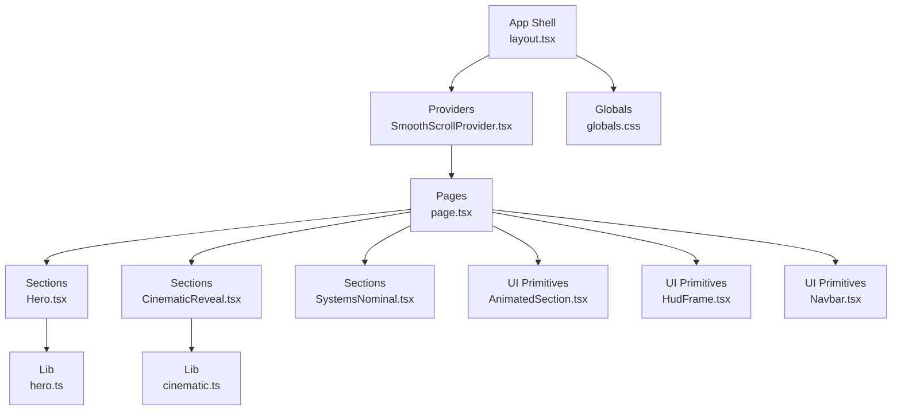
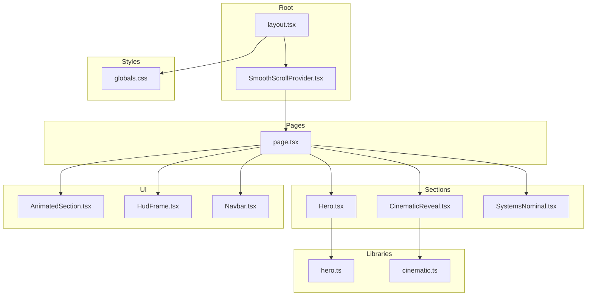
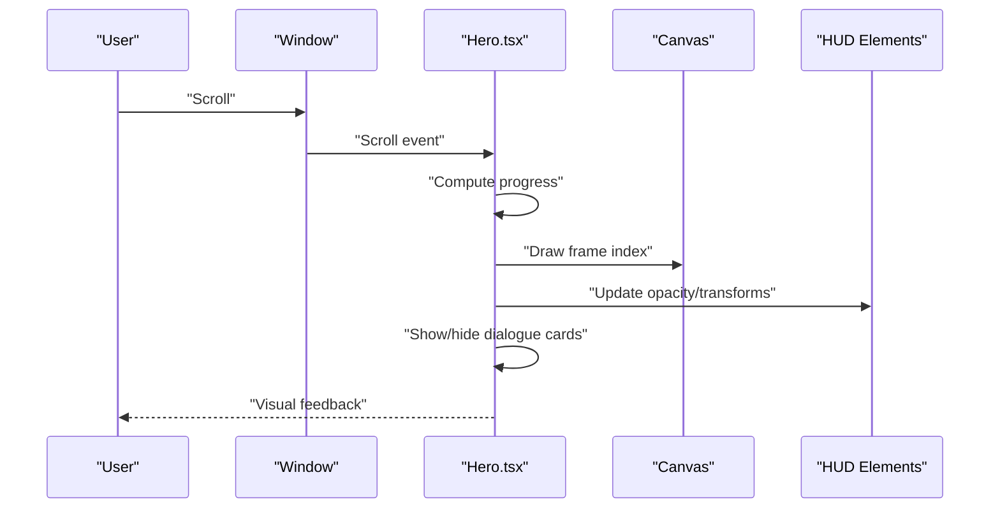
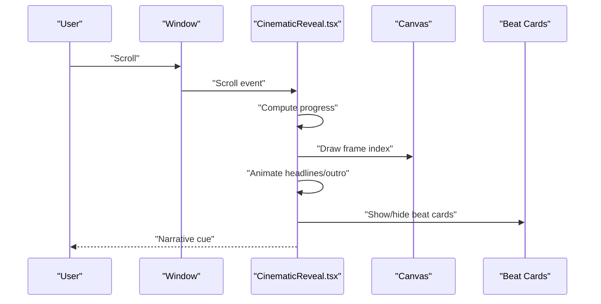
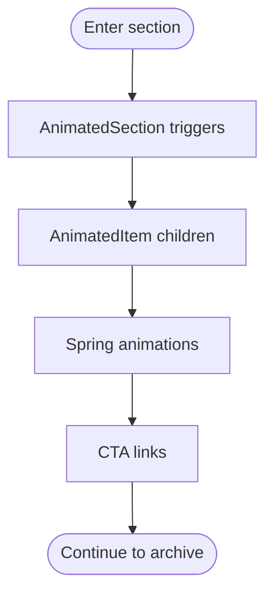
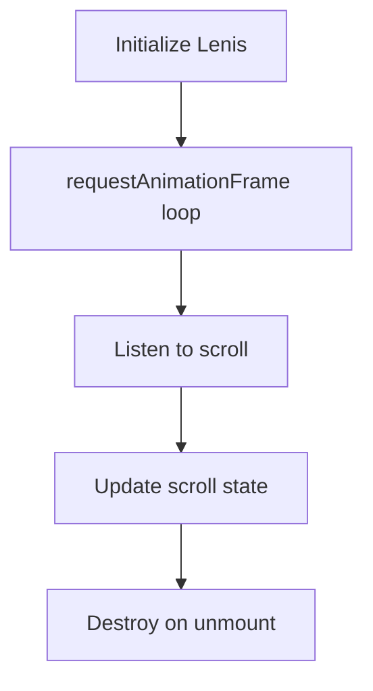
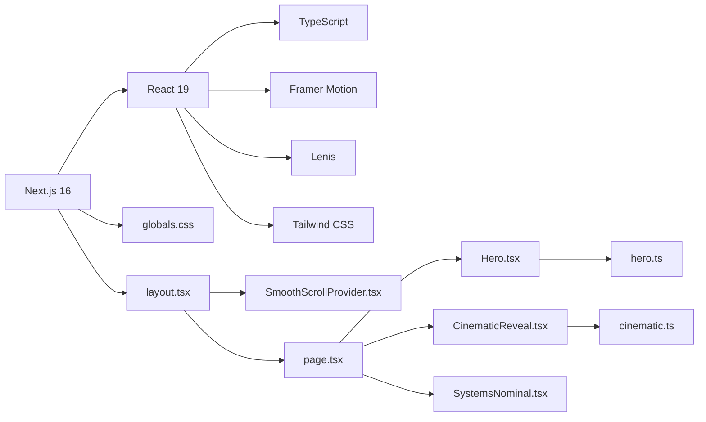

# Project Overview

<cite>
**Referenced Files in This Document**
- [README.md](file://README.md)
- [package.json](file://package.json)
- [next.config.ts](file://next.config.ts)
- [src/app/layout.tsx](file://src/app/layout.tsx)
- [src/app/page.tsx](file://src/app/page.tsx)
- [src/components/providers/SmoothScrollProvider.tsx](file://src/components/providers/SmoothScrollProvider.tsx)
- [src/components/sections/Hero.tsx](file://src/components/sections/Hero.tsx)
- [src/components/sections/CinematicReveal.tsx](file://src/components/sections/CinematicReveal.tsx)
- [src/components/sections/SystemsNominal.tsx](file://src/components/sections/SystemsNominal.tsx)
- [src/lib/hero.ts](file://src/lib/hero.ts)
- [src/lib/cinematic.ts](file://src/lib/cinematic.ts)
- [src/components/ui/AnimatedSection.tsx](file://src/components/ui/AnimatedSection.tsx)
- [src/components/ui/HudFrame.tsx](file://src/components/ui/HudFrame.tsx)
- [src/components/ui/Navbar.tsx](file://src/components/ui/Navbar.tsx)
- [src/app/globals.css](file://src/app/globals.css)
</cite>

## Table of Contents
1. [Introduction](#introduction)
2. [Project Structure](#project-structure)
3. [Core Components](#core-components)
4. [Architecture Overview](#architecture-overview)
5. [Detailed Component Analysis](#detailed-component-analysis)
6. [Dependency Analysis](#dependency-analysis)
7. [Performance Considerations](#performance-considerations)
8. [Troubleshooting Guide](#troubleshooting-guide)
9. [Conclusion](#conclusion)

## Introduction
This project is an immersive, scroll-driven cinematic experience that showcases Iron Man’s suit animations through three distinct sequences. Built with modern web technologies, it combines a smooth-scroll foundation with rich visual storytelling to create a compelling, frame-accurate narrative. The experience is designed for audiences who appreciate high-quality motion graphics, interactive storytelling, and a polished, cinematic interface.

Key goals:
- Deliver a seamless scroll-to-engage experience powered by Lenis smooth scrolling.
- Present three cinematic sequences: a 169-frame Hero sequence, a Cinematic Reveal with beat markers and dialogue cards, and a Systems Nominal section with animated telemetry data.
- Combine a component-based UI architecture with provider patterns to encapsulate cross-cutting concerns like smooth scrolling.
- Achieve strong visual storytelling through precise timing, HUD elements, and layered animations.

## Project Structure
The project follows a Next.js 16 App Router layout with a clear separation of concerns:
- Application shell and global styles live under src/app.
- UI primitives and reusable components live under src/components/ui.
- Section-level pages and experiences live under src/components/sections.
- Providers encapsulate shared behaviors like smooth scrolling.
- Libraries define constants and data for animations and dialogues.
- Global CSS defines theme tokens, typography, and visual effects.

**Diagram sources**
- [src/app/layout.tsx:1-37](file://src/app/layout.tsx#L1-L37)
- [src/app/page.tsx:1-20](file://src/app/page.tsx#L1-L20)
- [src/components/providers/SmoothScrollProvider.tsx:1-37](file://src/components/providers/SmoothScrollProvider.tsx#L1-L37)
- [src/components/sections/Hero.tsx:1-366](file://src/components/sections/Hero.tsx#L1-L366)
- [src/components/sections/CinematicReveal.tsx:1-384](file://src/components/sections/CinematicReveal.tsx#L1-L384)
- [src/components/sections/SystemsNominal.tsx:1-77](file://src/components/sections/SystemsNominal.tsx#L1-L77)
- [src/components/ui/AnimatedSection.tsx:1-43](file://src/components/ui/AnimatedSection.tsx#L1-L43)
- [src/components/ui/HudFrame.tsx:1-32](file://src/components/ui/HudFrame.tsx#L1-L32)
- [src/components/ui/Navbar.tsx:1-67](file://src/components/ui/Navbar.tsx#L1-L67)
- [src/lib/hero.ts:1-43](file://src/lib/hero.ts#L1-L43)
- [src/lib/cinematic.ts:1-47](file://src/lib/cinematic.ts#L1-L47)
- [src/app/globals.css:1-83](file://src/app/globals.css#L1-L83)

**Section sources**
- [src/app/layout.tsx:1-37](file://src/app/layout.tsx#L1-L37)
- [src/app/page.tsx:1-20](file://src/app/page.tsx#L1-L20)
- [src/app/globals.css:1-83](file://src/app/globals.css#L1-L83)

## Core Components
- SmoothScrollProvider: Initializes and manages Lenis smooth scrolling across the app, ensuring consistent scroll behavior for all sections.
- Hero: A 169-frame canvas animation synchronized to scroll, with HUD overlays, telemetry readouts, and dialogue cards triggered by timeline markers.
- CinematicReveal: A second 169-frame sequence with beat markers and dialogue cards, emphasizing narrative beats and archival footage.
- SystemsNominal: A static, animated presentation of telemetry data using Framer Motion for staggered entrance and spring-based animations.
- UI Primitives: Shared components like AnimatedSection/AnimatedItem for declarative motion, HudFrame for HUD accents, and Navbar for navigation and engagement cues.

These components work together to deliver a cohesive, immersive experience where scroll position controls frame progression, HUD elements reinforce the tech aesthetic, and motion design guides attention to key story moments.

**Section sources**
- [src/components/providers/SmoothScrollProvider.tsx:1-37](file://src/components/providers/SmoothScrollProvider.tsx#L1-L37)
- [src/components/sections/Hero.tsx:1-366](file://src/components/sections/Hero.tsx#L1-L366)
- [src/components/sections/CinematicReveal.tsx:1-384](file://src/components/sections/CinematicReveal.tsx#L1-L384)
- [src/components/sections/SystemsNominal.tsx:1-77](file://src/components/sections/SystemsNominal.tsx#L1-L77)
- [src/components/ui/AnimatedSection.tsx:1-43](file://src/components/ui/AnimatedSection.tsx#L1-L43)
- [src/components/ui/HudFrame.tsx:1-32](file://src/components/ui/HudFrame.tsx#L1-L32)
- [src/components/ui/Navbar.tsx:1-67](file://src/components/ui/Navbar.tsx#L1-L67)

## Architecture Overview
The architecture centers on a provider pattern for smooth scrolling and a component-based design for UI and animation. The app initializes Lenis at the root level and applies it to all scroll-driven sections. Each section independently manages its own canvas animation and HUD overlays, while shared UI primitives provide consistent motion and visual language.

**Diagram sources**
- [src/app/layout.tsx:1-37](file://src/app/layout.tsx#L1-L37)
- [src/components/providers/SmoothScrollProvider.tsx:1-37](file://src/components/providers/SmoothScrollProvider.tsx#L1-L37)
- [src/app/page.tsx:1-20](file://src/app/page.tsx#L1-L20)
- [src/components/sections/Hero.tsx:1-366](file://src/components/sections/Hero.tsx#L1-L366)
- [src/components/sections/CinematicReveal.tsx:1-384](file://src/components/sections/CinematicReveal.tsx#L1-L384)
- [src/components/sections/SystemsNominal.tsx:1-77](file://src/components/sections/SystemsNominal.tsx#L1-L77)
- [src/components/ui/AnimatedSection.tsx:1-43](file://src/components/ui/AnimatedSection.tsx#L1-L43)
- [src/components/ui/HudFrame.tsx:1-32](file://src/components/ui/HudFrame.tsx#L1-L32)
- [src/components/ui/Navbar.tsx:1-67](file://src/components/ui/Navbar.tsx#L1-L67)
- [src/lib/hero.ts:1-43](file://src/lib/hero.ts#L1-L43)
- [src/lib/cinematic.ts:1-47](file://src/lib/cinematic.ts#L1-L47)
- [src/app/globals.css:1-83](file://src/app/globals.css#L1-L83)

## Detailed Component Analysis

### Hero Sequence
The Hero sequence delivers a 169-frame canvas animation synchronized to scroll. It:
- Preloads frames and draws the appropriate frame based on scroll progress.
- Applies fade and transform effects to text overlays and HUD elements.
- Displays dialogue cards tied to specific scroll timelines.
- Updates a live power readout and progress indicator.

**Diagram sources**
- [src/components/sections/Hero.tsx:120-182](file://src/components/sections/Hero.tsx#L120-L182)
- [src/lib/hero.ts:1-43](file://src/lib/hero.ts#L1-L43)

**Section sources**
- [src/components/sections/Hero.tsx:1-366](file://src/components/sections/Hero.tsx#L1-L366)
- [src/lib/hero.ts:1-43](file://src/lib/hero.ts#L1-L43)

### Cinematic Reveal
Cinematic Reveal mirrors the Hero sequence with a second 169-frame animation and beat markers:
- Uses a separate set of frames and dialogue/beat definitions.
- Animates headline text transitions and an outro prompt.
- Provides a sequence counter and progress bar aligned to scroll.

**Diagram sources**
- [src/components/sections/CinematicReveal.tsx:119-186](file://src/components/sections/CinematicReveal.tsx#L119-L186)
- [src/lib/cinematic.ts:1-47](file://src/lib/cinematic.ts#L1-L47)

**Section sources**
- [src/components/sections/CinematicReveal.tsx:1-384](file://src/components/sections/CinematicReveal.tsx#L1-L384)
- [src/lib/cinematic.ts:1-47](file://src/lib/cinematic.ts#L1-L47)

### Systems Nominal
Systems Nominal presents a static, animated telemetry grid:
- Uses AnimatedSection and AnimatedItem to orchestrate staggered entrances.
- Spring-based animations provide a polished, responsive feel.
- Links guide users to archive content and continue the experience.

**Diagram sources**
- [src/components/sections/SystemsNominal.tsx:14-76](file://src/components/sections/SystemsNominal.tsx#L14-L76)
- [src/components/ui/AnimatedSection.tsx:22-42](file://src/components/ui/AnimatedSection.tsx#L22-L42)

**Section sources**
- [src/components/sections/SystemsNominal.tsx:1-77](file://src/components/sections/SystemsNominal.tsx#L1-L77)
- [src/components/ui/AnimatedSection.tsx:1-43](file://src/components/ui/AnimatedSection.tsx#L1-L43)

### Provider Pattern: SmoothScrollProvider
SmoothScrollProvider initializes Lenis at the root and ensures consistent scroll behavior across all sections. It:
- Creates a Lenis instance with tuned parameters.
- Hooks into requestAnimationFrame to integrate with Lenis.
- Cleans up on unmount to prevent memory leaks.

**Diagram sources**
- [src/components/providers/SmoothScrollProvider.tsx:11-33](file://src/components/providers/SmoothScrollProvider.tsx#L11-L33)

**Section sources**
- [src/components/providers/SmoothScrollProvider.tsx:1-37](file://src/components/providers/SmoothScrollProvider.tsx#L1-L37)

## Dependency Analysis
Technology stack and module relationships:
- Next.js 16 provides the runtime and routing.
- React and TypeScript enable type-safe UI development.
- Framer Motion powers declarative animations in UI primitives.
- Lenis supplies smooth scrolling behavior.
- Tailwind CSS and custom globals define the visual language.

**Diagram sources**
- [package.json:11-19](file://package.json#L11-L19)
- [src/app/layout.tsx:1-37](file://src/app/layout.tsx#L1-L37)
- [src/app/page.tsx:1-20](file://src/app/page.tsx#L1-L20)
- [src/components/providers/SmoothScrollProvider.tsx:1-37](file://src/components/providers/SmoothScrollProvider.tsx#L1-L37)
- [src/components/sections/Hero.tsx:1-366](file://src/components/sections/Hero.tsx#L1-L366)
- [src/components/sections/CinematicReveal.tsx:1-384](file://src/components/sections/CinematicReveal.tsx#L1-L384)
- [src/components/sections/SystemsNominal.tsx:1-77](file://src/components/sections/SystemsNominal.tsx#L1-L77)
- [src/lib/hero.ts:1-43](file://src/lib/hero.ts#L1-L43)
- [src/lib/cinematic.ts:1-47](file://src/lib/cinematic.ts#L1-L47)
- [src/app/globals.css:1-83](file://src/app/globals.css#L1-L83)

**Section sources**
- [package.json:1-31](file://package.json#L1-L31)
- [next.config.ts:1-8](file://next.config.ts#L1-L8)

## Performance Considerations
- Canvas rendering is optimized by drawing only the current frame and scaling to device pixel ratio.
- Scroll events are throttled via requestAnimationFrame to avoid layout thrashing.
- HUD overlays and progress indicators use transforms and opacity for GPU-friendly updates.
- Frame preloading ensures minimal stalls during scroll.
- Framer Motion leverages hardware acceleration for spring-based animations.
- Global CSS uses efficient backdrop filters and gradients for HUD accents.

[No sources needed since this section provides general guidance]

## Troubleshooting Guide
Common issues and resolutions:
- Scroll feels choppy: Verify Lenis is initialized and integrated with requestAnimationFrame in the provider.
- Canvas not updating: Confirm frame indices are computed from scroll progress and drawFrame is invoked after loading.
- HUD elements not animating: Ensure opacity/transform updates are applied conditionally based on progress thresholds.
- Telemetry not animating: Check AnimatedSection/AnimatedItem are used with proper viewport configuration and delays.

**Section sources**
- [src/components/providers/SmoothScrollProvider.tsx:11-33](file://src/components/providers/SmoothScrollProvider.tsx#L11-L33)
- [src/components/sections/Hero.tsx:120-182](file://src/components/sections/Hero.tsx#L120-L182)
- [src/components/sections/CinematicReveal.tsx:119-186](file://src/components/sections/CinematicReveal.tsx#L119-L186)
- [src/components/ui/AnimatedSection.tsx:22-42](file://src/components/ui/AnimatedSection.tsx#L22-L42)

## Conclusion
This project demonstrates a cohesive blend of scroll-driven storytelling, frame-accurate animation, and modern UI patterns. By structuring the app around a provider for smooth scrolling and modular sections for cinematic sequences, it achieves a polished, immersive experience. The combination of Lenis, canvas-based animations, and Framer Motion creates a visually rich environment that guides users through Iron Man’s narrative with precision and flair.

[No sources needed since this section summarizes without analyzing specific files]