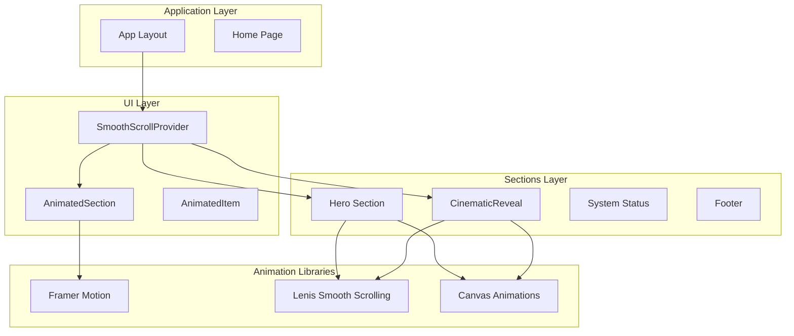
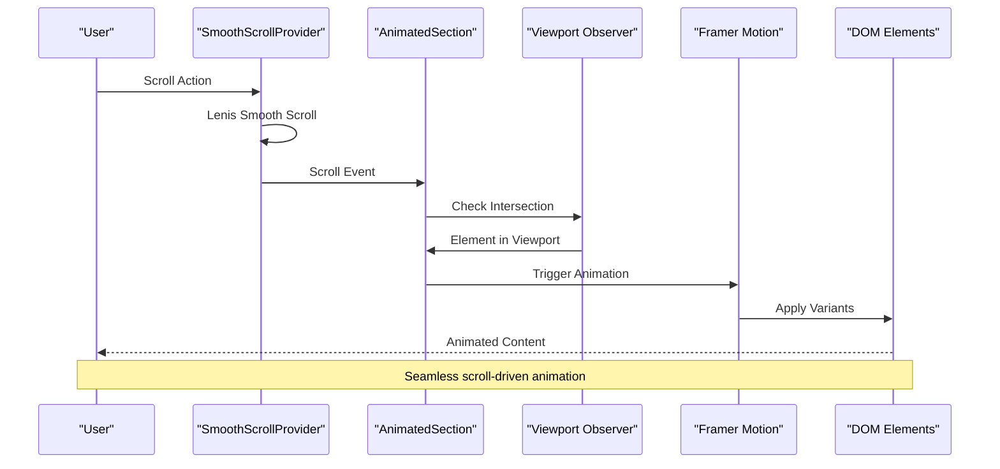
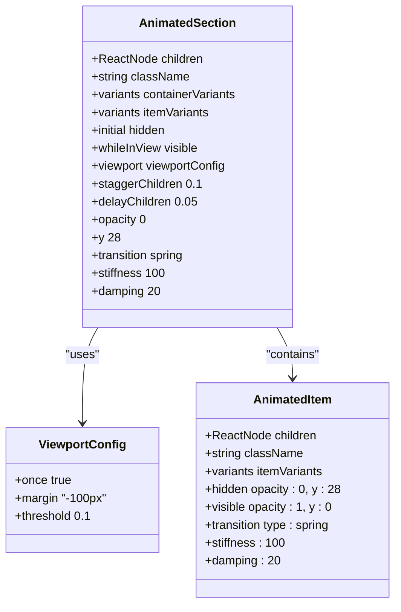
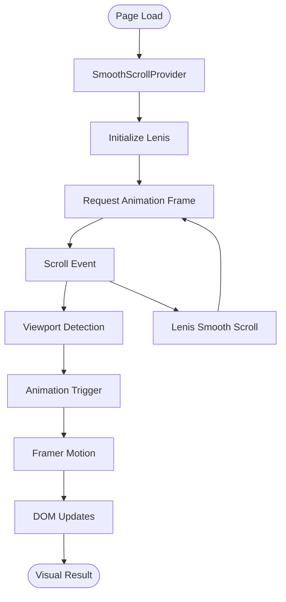
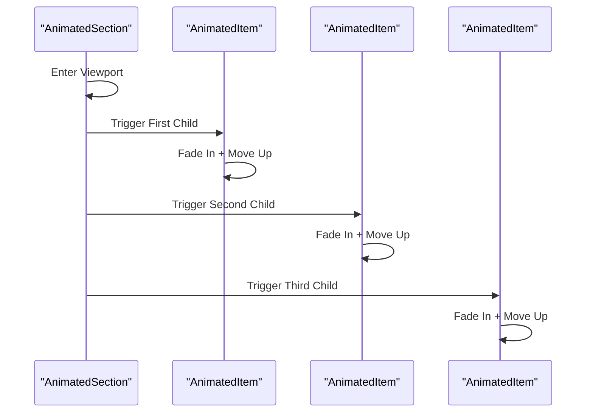
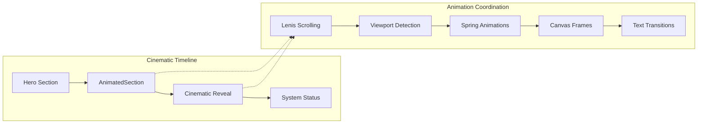
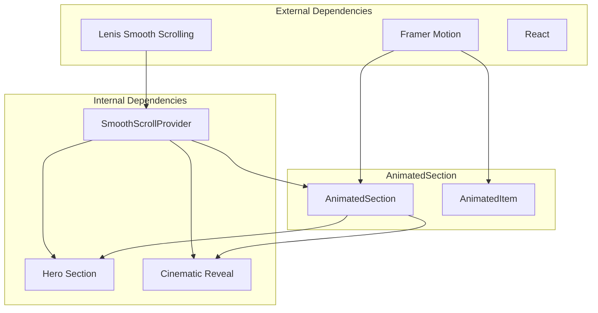

# Animated Section Component

<cite>
**Referenced Files in This Document**
- [AnimatedSection.tsx](file://src/components/ui/AnimatedSection.tsx)
- [SmoothScrollProvider.tsx](file://src/components/providers/SmoothScrollProvider.tsx)
- [layout.tsx](file://src/app/layout.tsx)
- [page.tsx](file://src/app/page.tsx)
- [Hero.tsx](file://src/components/sections/Hero.tsx)
- [CinematicReveal.tsx](file://src/components/sections/CinematicReveal.tsx)
- [hero.ts](file://src/lib/hero.ts)
- [cinematic.ts](file://src/lib/cinematic.ts)
</cite>

## Table of Contents
1. [Introduction](#introduction)
2. [Project Structure](#project-structure)
3. [Core Components](#core-components)
4. [Architecture Overview](#architecture-overview)
5. [Detailed Component Analysis](#detailed-component-analysis)
6. [Dependency Analysis](#dependency-analysis)
7. [Performance Considerations](#performance-considerations)
8. [Troubleshooting Guide](#troubleshooting-guide)
9. [Conclusion](#conclusion)
10. [Appendices](#appendices)

## Introduction
The AnimatedSection component provides scroll-triggered Framer Motion animations for the Stark Industries website. It integrates seamlessly with the smooth scrolling system to create cinematic, scroll-driven animations that enhance the user experience. The component uses viewport detection to trigger animations when sections enter the user's view, coordinating with the Lenis smooth scrolling provider to deliver buttery-smooth transitions.

## Project Structure
The AnimatedSection component is part of a larger cinematic experience that combines several key architectural elements:

**Diagram sources**
- [layout.tsx:23-36](file://src/app/layout.tsx#L23-L36)
- [SmoothScrollProvider.tsx:8-36](file://src/components/providers/SmoothScrollProvider.tsx#L8-L36)
- [AnimatedSection.tsx:22-34](file://src/components/ui/AnimatedSection.tsx#L22-L34)

**Section sources**
- [layout.tsx:1-37](file://src/app/layout.tsx#L1-L37)
- [page.tsx:1-20](file://src/app/page.tsx#L1-L20)

## Core Components
The AnimatedSection component consists of two primary exports that work together to create sophisticated scroll-triggered animations:

### AnimatedSection Container
The main AnimatedSection component serves as a wrapper that manages animation triggers and viewport detection. It uses Framer Motion's `whileInView` prop to automatically trigger animations when the component enters the viewport.

### AnimatedItem Child Component
The AnimatedItem component provides individual animation capabilities for child elements within an AnimatedSection. It defines specific animation variants for staggered child animations.

**Section sources**
- [AnimatedSection.tsx:20-42](file://src/components/ui/AnimatedSection.tsx#L20-L42)

## Architecture Overview
The AnimatedSection component operates within a sophisticated animation pipeline that combines viewport detection, smooth scrolling, and Framer Motion animations:

**Diagram sources**
- [SmoothScrollProvider.tsx:11-33](file://src/components/providers/SmoothScrollProvider.tsx#L11-L33)
- [AnimatedSection.tsx:22-34](file://src/components/ui/AnimatedSection.tsx#L22-L34)

The architecture integrates three key systems:
- **Smooth Scrolling**: Provided by Lenis for buttery-smooth scroll experiences
- **Viewport Detection**: Uses IntersectionObserver for precise animation triggering
- **Animation Engine**: Powered by Framer Motion for declarative animations

## Detailed Component Analysis

### AnimatedSection Implementation
The AnimatedSection component implements a sophisticated animation system using Framer Motion's viewport-based triggers:

**Diagram sources**
- [AnimatedSection.tsx:6-18](file://src/components/ui/AnimatedSection.tsx#L6-L18)
- [AnimatedSection.tsx:22-34](file://src/components/ui/AnimatedSection.tsx#L22-L34)

#### Animation Configuration Details
The component uses carefully tuned animation parameters:

**Container Variants:**
- Staggered child animations with 0.1-second delays
- Initial delay of 0.05 seconds for dramatic effect
- Spring-based transitions for natural movement

**Item Variants:**
- Smooth entrance from below with fade-in
- Spring physics with 100 stiffness and 20 damping
- Natural easing that feels responsive yet controlled

**Viewport Settings:**
- Single-use animations (`once: true`) for performance
- -100px margin for early triggering
- Optimized for mobile and desktop experiences

### Integration with Smooth Scrolling System
The AnimatedSection component works harmoniously with the Lenis smooth scrolling provider:

**Diagram sources**
- [SmoothScrollProvider.tsx:11-33](file://src/components/providers/SmoothScrollProvider.tsx#L11-L33)
- [AnimatedSection.tsx:28-29](file://src/components/ui/AnimatedSection.tsx#L28-L29)

**Section sources**
- [SmoothScrollProvider.tsx:1-37](file://src/components/providers/SmoothScrollProvider.tsx#L1-L37)
- [AnimatedSection.tsx:1-43](file://src/components/ui/AnimatedSection.tsx#L1-L43)

### Animation Types and Timing Configurations
The component supports multiple animation patterns suitable for different content types:

#### Text Reveal Animations

**Diagram sources**
- [AnimatedSection.tsx:6-18](file://src/components/ui/AnimatedSection.tsx#L6-L18)
- [AnimatedSection.tsx:36-42](file://src/components/ui/AnimatedSection.tsx#L36-L42)

#### Trigger Conditions
The component responds to various trigger conditions:
- **Viewport Entry**: Animations activate when the section enters the viewport
- **Single Execution**: Animations run only once per session
- **Early Triggering**: Starts animations when elements are 100px above the viewport
- **Responsive Behavior**: Adapts to different screen sizes and orientations

### Integration with Cinematic Experience
The AnimatedSection component complements the broader cinematic experience through coordinated animation timing:

**Diagram sources**
- [Hero.tsx:120-182](file://src/components/sections/Hero.tsx#L120-L182)
- [CinematicReveal.tsx:120-186](file://src/components/sections/CinematicReveal.tsx#L120-L186)
- [AnimatedSection.tsx:28-29](file://src/components/ui/AnimatedSection.tsx#L28-L29)

**Section sources**
- [Hero.tsx:1-366](file://src/components/sections/Hero.tsx#L1-L366)
- [CinematicReveal.tsx:1-384](file://src/components/sections/CinematicReveal.tsx#L1-L384)

## Dependency Analysis
The AnimatedSection component has minimal but crucial dependencies that enable its functionality:

**Diagram sources**
- [AnimatedSection.tsx:3](file://src/components/ui/AnimatedSection.tsx#L3)
- [SmoothScrollProvider.tsx:4](file://src/components/providers/SmoothScrollProvider.tsx#L4)
- [layout.tsx:4](file://src/app/layout.tsx#L4)

### Component Coupling Analysis
The AnimatedSection component demonstrates excellent separation of concerns:
- **High Cohesion**: Animation logic is encapsulated within the component
- **Low Coupling**: Minimal external dependencies reduce maintenance overhead
- **Clear Contracts**: Well-defined props and return types enable easy integration

**Section sources**
- [AnimatedSection.tsx:1-43](file://src/components/ui/AnimatedSection.tsx#L1-L43)
- [SmoothScrollProvider.tsx:1-37](file://src/components/providers/SmoothScrollProvider.tsx#L1-L37)

## Performance Considerations
The AnimatedSection component implements several performance optimization techniques:

### Intersection Observer Optimization
- **Single-use Animations**: Prevents repeated animation triggers
- **Early Triggering**: Starts animations before elements fully enter viewport
- **Optimized Margins**: -100px margin reduces perceived loading time

### Animation Performance Features
- **Hardware Acceleration**: Leverages CSS transforms for GPU acceleration
- **Efficient Transitions**: Minimal property animations reduce repaint costs
- **Staggered Animations**: Coordinated timing prevents animation thrashing

### Memory Management
- **Automatic Cleanup**: React lifecycle handles animation cleanup
- **Event Listener Management**: Proper cleanup of scroll listeners
- **Resource Optimization**: Efficient viewport detection implementation

**Section sources**
- [AnimatedSection.tsx:28-29](file://src/components/ui/AnimatedSection.tsx#L28-L29)
- [SmoothScrollProvider.tsx:28-33](file://src/components/providers/SmoothScrollProvider.tsx#L28-L33)

## Troubleshooting Guide

### Common Animation Issues
**Animations Not Triggering:**
- Verify viewport margins are appropriate for content length
- Check that parent containers have proper height and positioning
- Ensure smooth scrolling provider is properly initialized

**Animation Performance Problems:**
- Monitor for excessive re-renders in animated components
- Verify hardware acceleration is enabled for transform properties
- Check for conflicting CSS animations or transitions

**Integration Issues:**
- Confirm AnimatedSection is wrapped within SmoothScrollProvider
- Verify viewport detection is working with browser support checks
- Test animation triggers across different screen sizes and devices

### Debugging Techniques
- Use browser dev tools to inspect IntersectionObserver events
- Monitor animation performance using Chrome DevTools Performance panel
- Test animation triggers with different viewport configurations
- Verify smooth scrolling compatibility across browsers

**Section sources**
- [AnimatedSection.tsx:22-34](file://src/components/ui/AnimatedSection.tsx#L22-L34)
- [SmoothScrollProvider.tsx:11-33](file://src/components/providers/SmoothScrollProvider.tsx#L11-L33)

## Conclusion
The AnimatedSection component provides a robust foundation for scroll-triggered animations within the Stark Industries cinematic experience. Its integration with the Lenis smooth scrolling system creates seamless, high-performance animations that enhance user engagement without compromising performance. The component's modular design enables easy customization while maintaining optimal performance characteristics.

The implementation demonstrates best practices for viewport-based animations, including efficient resource management, hardware acceleration, and responsive design considerations. The component serves as an excellent example of how modern React applications can combine multiple animation technologies to create immersive user experiences.

## Appendices

### Customization Guidelines
To create custom animated sections, follow these guidelines:

**Animation Variants:**
- Modify container variants for different stagger patterns
- Adjust item variants for custom entrance effects
- Tune spring physics parameters for desired feel

**Viewport Configuration:**
- Adjust margin values for different trigger timing
- Modify once flag for repeatable animations
- Configure threshold values for partial visibility triggers

**Integration Patterns:**
- Wrap content in AnimatedSection for container animations
- Use AnimatedItem for individual element animations
- Combine with existing section components for cohesive experiences

### Best Practices
- Keep animation durations consistent across related elements
- Test animations across different device types and screen sizes
- Monitor performance metrics during development
- Use appropriate viewport margins for optimal user experience
- Ensure animations don't interfere with accessibility features