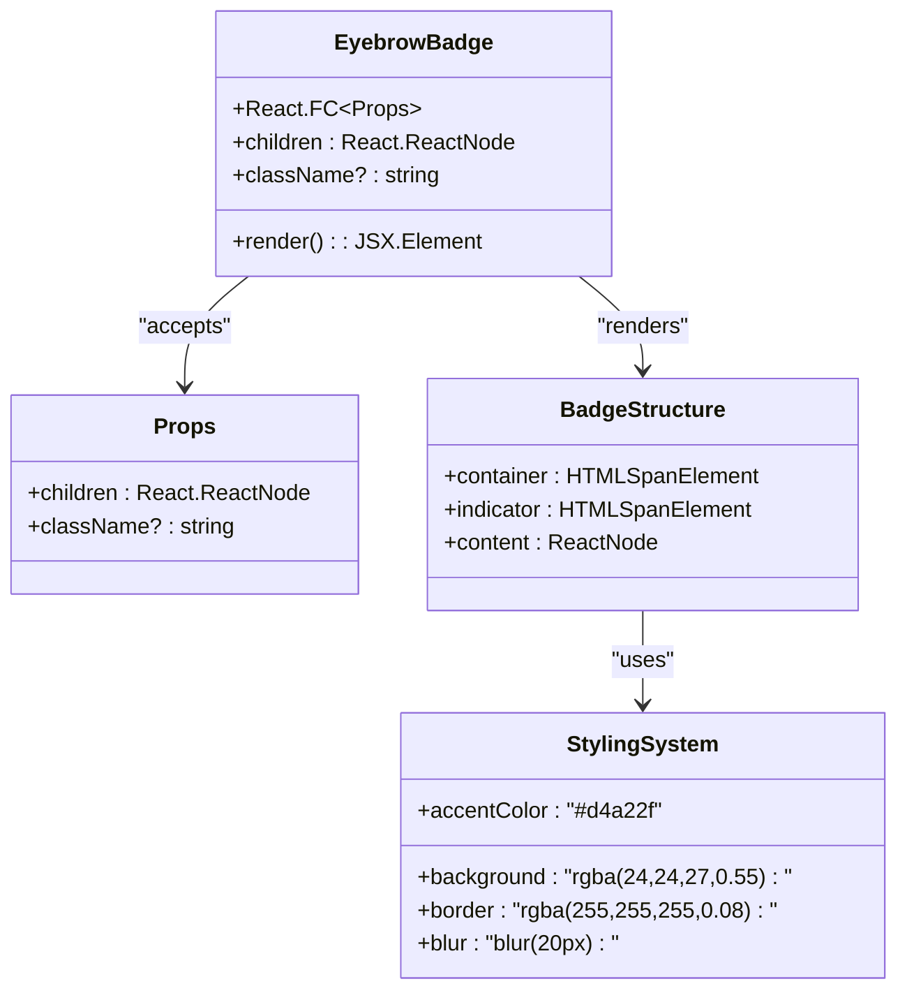
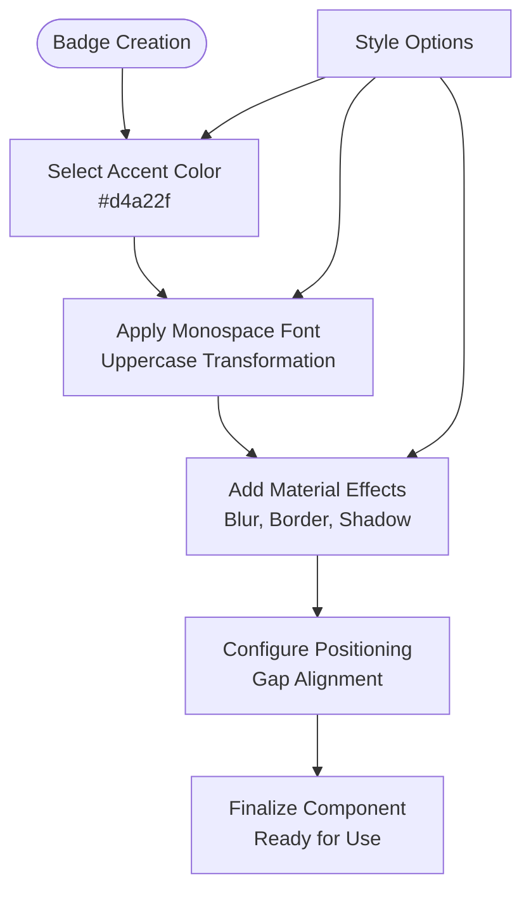
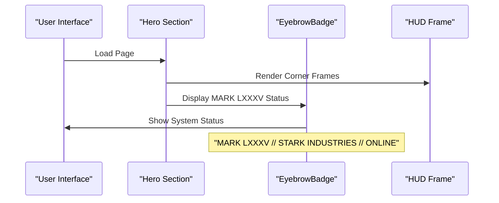
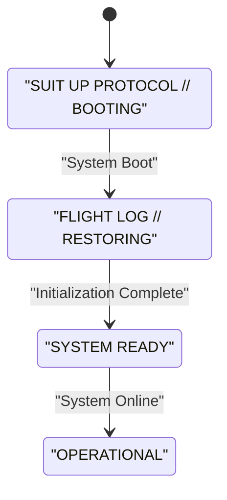
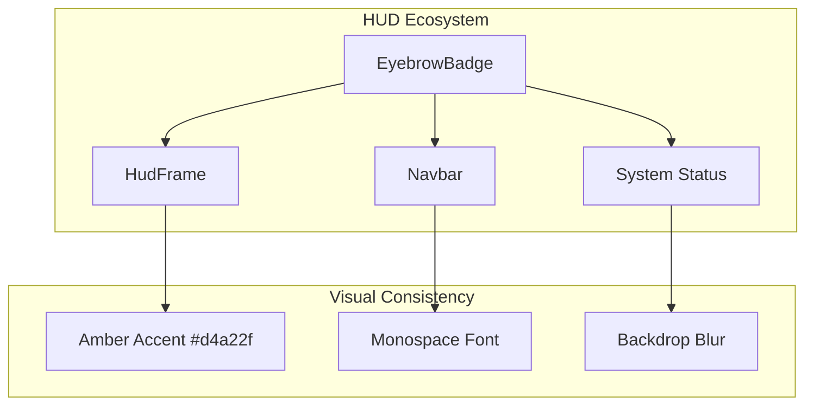
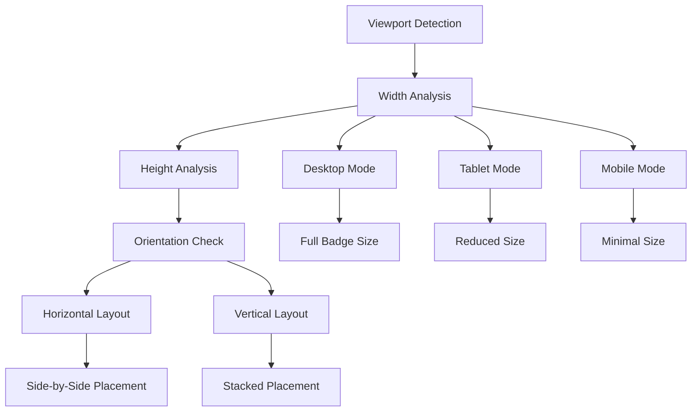

# Eyebrow Badge Component

<cite>
**Referenced Files in This Document**
- [EyebrowBadge.tsx](file://src/components/ui/EyebrowBadge.tsx)
- [Hero.tsx](file://src/components/sections/Hero.tsx)
- [CinematicReveal.tsx](file://src/components/sections/CinematicReveal.tsx)
- [globals.css](file://src/app/globals.css)
- [HudFrame.tsx](file://src/components/ui/HudFrame.tsx)
- [Navbar.tsx](file://src/components/ui/Navbar.tsx)
- [hero.ts](file://src/lib/hero.ts)
</cite>

## Table of Contents
1. [Introduction](#introduction)
2. [Component Architecture](#component-architecture)
3. [Visual Design System](#visual-design-system)
4. [Usage Patterns](#usage-patterns)
5. [Styling and Customization](#styling-and-customization)
6. [Integration with HUD Aesthetics](#integration-with-hud-aesthetics)
7. [Responsive Behavior](#responsive-behavior)
8. [Performance Considerations](#performance-considerations)
9. [Best Practices](#best-practices)
10. [Troubleshooting Guide](#troubleshooting-guide)

## Introduction

The EyebrowBadge component serves as a crucial visual element in the Iron Man interface, designed to display status indicators, labels, and contextual information throughout the user experience. Built with the distinctive HUD (Heads-Up Display) aesthetic of Tony Stark's armor, this component seamlessly integrates with the overall design system while maintaining visual consistency across different interface contexts.

The component embodies the sophisticated design language of the Iron Man universe, featuring subtle glow effects, precise typography, and the signature amber accent color (#d4a22f) that defines the Stark Industries brand identity. It functions as both a functional UI element and a stylistic anchor that reinforces the immersive experience.

## Component Architecture

The EyebrowBadge component follows a minimalist yet powerful architecture pattern that prioritizes clarity and visual impact. The component is intentionally lightweight, containing only essential elements necessary for its purpose.

**Diagram sources**
- [EyebrowBadge.tsx:1-16](file://src/components/ui/EyebrowBadge.tsx#L1-L16)

The component structure consists of three primary elements:
- **Container Span**: Provides the badge container with circular styling and backdrop effects
- **Status Indicator**: Small circular element that pulses with the signature amber glow
- **Content Area**: The main text area displaying the badge message

**Section sources**
- [EyebrowBadge.tsx:3-16](file://src/components/ui/EyebrowBadge.tsx#L3-L16)

## Visual Design System

The EyebrowBadge component operates within a carefully curated visual ecosystem that maintains consistency across all Iron Man interface elements. The design system emphasizes several key principles:

### Color Palette Integration
The component utilizes the established color scheme where the amber accent (#d4a22f) serves as the primary visual identifier. This color choice creates immediate recognition of Stark Industries branding while maintaining visual harmony with the dark background palette.

### Typography Consistency
The component employs the monospace font family (`var(--font-geist-mono)`) with precise spacing and uppercase transformation. The typography system ensures readability across various screen sizes while maintaining the technical aesthetic appropriate for a high-tech interface.

### Material Design Elements
The component incorporates advanced material design techniques including:
- **Backdrop Blur**: Creates depth and atmospheric effect
- **Subtle Borders**: Enhances definition against dark backgrounds
- **Inner Shadows**: Provides dimensional depth
- **Outer Glow**: Establishes visual prominence

**Diagram sources**
- [globals.css:3-22](file://src/app/globals.css#L3-L22)
- [EyebrowBadge.tsx:6-10](file://src/components/ui/EyebrowBadge.tsx#L6-L10)

**Section sources**
- [globals.css:3-22](file://src/app/globals.css#L3-L22)
- [EyebrowBadge.tsx:6-10](file://src/components/ui/EyebrowBadge.tsx#L6-L10)

## Usage Patterns

The EyebrowBadge component demonstrates remarkable versatility across different interface contexts within the Iron Man application. Its usage patterns reflect the component's role as a flexible status indicator and label system.

### Primary Usage Contexts

#### System Status Indicators
The component serves as the primary mechanism for displaying system status information throughout the interface. In the Hero section, it prominently displays the main system status:

**Diagram sources**
- [Hero.tsx:222](file://src/components/sections/Hero.tsx#L222)
- [HudFrame.tsx:7-31](file://src/components/ui/HudFrame.tsx#L7-L31)

#### Loading and Boot Processes
During system initialization and loading sequences, the component provides real-time feedback about system readiness and operational status. The CinematicReveal section demonstrates this usage pattern:

**Diagram sources**
- [CinematicReveal.tsx:368](file://src/components/sections/CinematicReveal.tsx#L368)
- [Hero.tsx:350](file://src/components/sections/Hero.tsx#L350)

#### Informational Displays
The component functions as an information hub, displaying contextual data about system protocols, telemetry links, and operational parameters. These displays maintain the component's signature aesthetic while conveying technical information effectively.

**Section sources**
- [Hero.tsx:222](file://src/components/sections/Hero.tsx#L222)
- [CinematicReveal.tsx:368](file://src/components/sections/CinematicReveal.tsx#L368)

## Styling and Customization

The EyebrowBadge component offers extensive customization capabilities while maintaining its core design integrity. The styling system provides flexibility for different contexts without compromising the component's visual coherence.

### Base Styling Properties

The component establishes a foundation of consistent styling properties that define its visual character:

| Property | Value | Purpose |
|----------|--------|---------|
| **Font Family** | `var(--font-geist-mono)` | Maintains technical aesthetic |
| **Font Size** | `10px` | Ensures readability at small scale |
| **Font Weight** | `500` | Provides appropriate emphasis |
| **Letter Spacing** | `0.22em` | Creates modern, tech-inspired appearance |
| **Padding** | `px-3 py-1.5` | Balanced proportions for small badges |
| **Border Radius** | `rounded-full` | Circular shape for modern feel |

### Advanced Styling Features

The component incorporates sophisticated styling techniques that enhance its visual appeal and functionality:

#### Backdrop Effects
The component utilizes advanced backdrop filtering to create depth and atmospheric effects:
- **Background Blur**: `backdrop-blur-md` creates soft focus effect
- **Background Opacity**: `bg-white/[0.04]` provides subtle translucency
- **Border Transparency**: `border-white/12` ensures subtle definition

#### Shadow System
The component implements a multi-layered shadow system that creates dimensional depth:
- **Inner Highlight**: `inset 0 1px 0 rgba(255,255,255,0.06)`
- **Outer Glow**: `0 0 24px -8px rgba(212,162,47,0.25)`
- **Indicator Glow**: `shadow-[0_0_10px_rgba(212,162,47,0.85)]`

### Customization Guidelines

When extending the component's functionality, developers should adhere to the established design principles:

#### Color Variations
While the component primarily uses the amber accent color, variations can be achieved through:
- **Text Color Override**: Using Tailwind text utilities
- **Background Modifications**: Adjusting transparency levels
- **Glow Effects**: Modifying shadow intensity

#### Size Adaptations
The component's compact nature allows for easy scaling while maintaining proportions:
- **Small Scale**: Ideal for status indicators
- **Medium Scale**: Suitable for brief labels
- **Large Scale**: Not recommended due to design constraints

**Section sources**
- [EyebrowBadge.tsx:6-10](file://src/components/ui/EyebrowBadge.tsx#L6-L10)
- [globals.css:3-22](file://src/app/globals.css#L3-L22)

## Integration with HUD Aesthetics

The EyebrowBadge component serves as a cornerstone element in the overall HUD (Heads-Up Display) aesthetic, contributing to the immersive experience that defines the Iron Man interface. Its integration extends beyond individual usage to become part of a cohesive design language.

### HUD Design Philosophy

The component embodies several key principles of HUD design that enhance user experience:

#### Information Hierarchy
The badge system establishes clear information hierarchy through:
- **Status Priority**: Critical system information takes precedence
- **Contextual Placement**: Strategic positioning enhances usability
- **Visual Weight**: Proper sizing and emphasis guide user attention

#### Immersive Experience
The component contributes to the overall immersive quality through:
- **Consistent Visual Language**: Unified design across all interface elements
- **Technical Authenticity**: Realistic simulation of advanced technology
- **Brand Recognition**: Immediate association with Stark Industries

### Cross-Component Coordination

The EyebrowBadge works in concert with other interface elements to create a unified experience:

**Diagram sources**
- [Hero.tsx:204-215](file://src/components/sections/Hero.tsx#L204-L215)
- [Navbar.tsx:26-35](file://src/components/ui/Navbar.tsx#L26-L35)

**Section sources**
- [Hero.tsx:204-215](file://src/components/sections/Hero.tsx#L204-L215)
- [Navbar.tsx:26-35](file://src/components/ui/Navbar.tsx#L26-L35)

## Responsive Behavior

The EyebrowBadge component demonstrates sophisticated responsive behavior that ensures optimal display across all device types and screen sizes. This responsiveness is crucial for maintaining the immersive experience across desktop, tablet, and mobile platforms.

### Breakpoint Adaptations

The component responds appropriately to different viewport sizes through strategic adjustments:

#### Desktop Optimization
On larger screens, the component maintains its full visual fidelity:
- **Enhanced Spacing**: Increased padding for better touch targets
- **Improved Readability**: Slight font size adjustments for optimal legibility
- **Extended Layout**: Full-width display capabilities

#### Mobile Adaptations
On smaller screens, the component adapts while preserving core functionality:
- **Compact Proportions**: Maintained circular shape despite reduced size
- **Touch-Friendly Sizing**: Ensures accessibility across devices
- **Strategic Positioning**: Optimized placement for mobile navigation

### Dynamic Scaling Mechanisms

The component incorporates dynamic scaling mechanisms that respond to environmental factors:

**Diagram sources**
- [Hero.tsx:83-86](file://src/components/sections/Hero.tsx#L83-L86)
- [Hero.tsx:108-112](file://src/components/sections/Hero.tsx#L108-L112)

**Section sources**
- [Hero.tsx:83-86](file://src/components/sections/Hero.tsx#L83-L86)
- [Hero.tsx:108-112](file://src/components/sections/Hero.tsx#L108-L112)

## Performance Considerations

The EyebrowBadge component is designed with performance optimization in mind, ensuring smooth operation across all supported devices and browsers. Several performance-critical aspects contribute to the component's efficiency.

### Rendering Optimization

The component employs several rendering optimization strategies:

#### Minimal DOM Structure
The component maintains a streamlined DOM structure with only essential elements:
- **Single Container Element**: Reduces DOM complexity
- **Efficient Child Elements**: Minimal child nodes for optimal traversal
- **Direct Styling**: Inline styles minimize CSS cascade overhead

#### Efficient Styling Approach
The component utilizes efficient styling techniques:
- **CSS Variables**: Centralized color and effect management
- **Tailwind Utilities**: Pre-compiled utility classes for fast rendering
- **Hardware Acceleration**: Optimized for GPU rendering where possible

### Memory Management

The component demonstrates responsible memory management practices:

#### Lightweight Implementation
The component's minimal code footprint ensures efficient memory usage:
- **Small Bundle Size**: Minimal JavaScript overhead
- **Static Styles**: Reduced runtime style calculations
- **Reusable Elements**: Shared styling across multiple instances

#### Event Handling Efficiency
The component avoids unnecessary event listeners:
- **Static Content**: No interactive elements requiring event handlers
- **Pure Component**: Stateless design reduces re-render triggers

**Section sources**
- [EyebrowBadge.tsx:3-16](file://src/components/ui/EyebrowBadge.tsx#L3-L16)

## Best Practices

Developers working with the EyebrowBadge component should adhere to established best practices that ensure consistent usage and maintain the component's effectiveness across different contexts.

### Design Consistency Guidelines

#### Visual Cohesion
Maintain visual consistency through:
- **Color Harmony**: Always use the established amber accent color
- **Typography Standards**: Preserve the monospace font and uppercase transformation
- **Spacing Proportions**: Follow the established gap and padding ratios

#### Contextual Appropriateness
Use the component appropriately for different contexts:
- **Status Indicators**: Reserve for system status and operational information
- **Labels**: Use for brief, contextual information display
- **Notifications**: Limit to critical or high-priority information

### Implementation Standards

#### Component Usage Patterns
Follow established usage patterns:
- **Consistent Placement**: Position badges strategically for optimal visibility
- **Proper Sizing**: Use appropriate badge sizes for different contexts
- **Accessibility Compliance**: Ensure adequate contrast and readable text

#### Performance Optimization
Implement performance-conscious development practices:
- **Avoid Unnecessary Re-renders**: Use memoization where appropriate
- **Optimize Updates**: Minimize style recalculations during animations
- **Resource Efficiency**: Consider lazy loading for heavy content

### Integration Guidelines

#### Cross-Component Coordination
Coordinate with other interface elements:
- **HUD Consistency**: Align with other HUD elements in design and placement
- **Layout Integration**: Comply with established layout patterns
- **Animation Synchronization**: Coordinate with page-wide animations

#### Theme Compatibility
Ensure compatibility with the overall theme system:
- **Color Scheme**: Adhere to the established color palette
- **Material Design**: Follow the established material design principles
- **Typography System**: Maintain consistency with the font hierarchy

**Section sources**
- [globals.css:3-22](file://src/app/globals.css#L3-L22)
- [Hero.tsx:222](file://src/components/sections/Hero.tsx#L222)

## Troubleshooting Guide

Common issues and solutions when working with the EyebrowBadge component, along with diagnostic approaches for resolving problems.

### Visual Issues

#### Color Rendering Problems
**Problem**: Badge appears with incorrect colors or poor visibility
**Solutions**:
- Verify CSS variable definitions are properly loaded
- Check for conflicting style overrides
- Ensure proper contrast ratios for accessibility

#### Layout Distortions
**Problem**: Badge appears stretched, compressed, or misaligned
**Solutions**:
- Confirm proper use of `inline-flex` container
- Verify gap spacing is maintained correctly
- Check for conflicting CSS properties affecting layout

### Performance Issues

#### Slow Rendering
**Problem**: Badge causes page slowdown or jank
**Solutions**:
- Verify hardware acceleration is enabled
- Check for excessive reflows or repaints
- Ensure proper use of CSS transforms over layout changes

#### Memory Leaks
**Problem**: Component consumes excessive memory over time
**Solutions**:
- Verify no unnecessary event listeners are attached
- Check for proper cleanup of external resources
- Ensure component is properly unmounted when removed

### Integration Problems

#### Styling Conflicts
**Problem**: Badge styles conflict with surrounding elements
**Solutions**:
- Use the provided `className` prop for customization
- Avoid overriding core styling properties
- Check for specificity conflicts in CSS cascade

#### Responsiveness Issues
**Problem**: Badge does not adapt properly to different screen sizes
**Solutions**:
- Verify media query breakpoints are functioning
- Check for proper viewport meta tag configuration
- Ensure adequate testing across device types

**Section sources**
- [globals.css:3-22](file://src/app/globals.css#L3-L22)
- [EyebrowBadge.tsx:6-10](file://src/components/ui/EyebrowBadge.tsx#L6-L10)