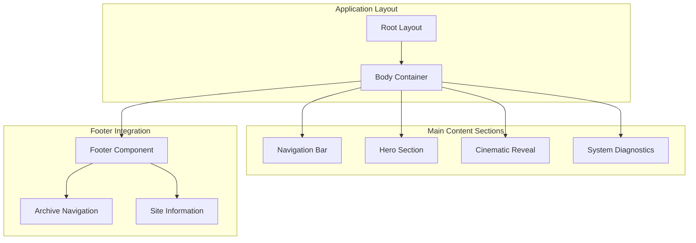
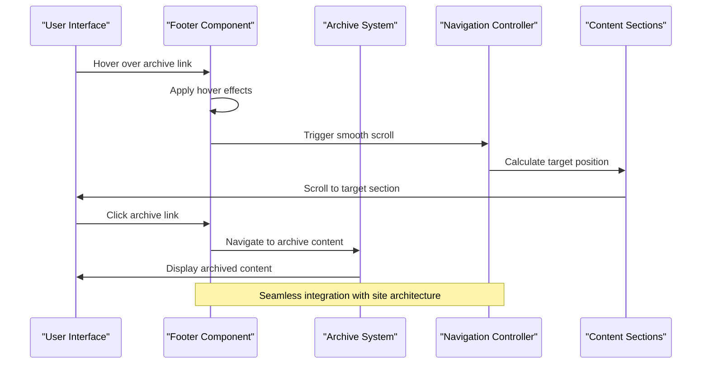
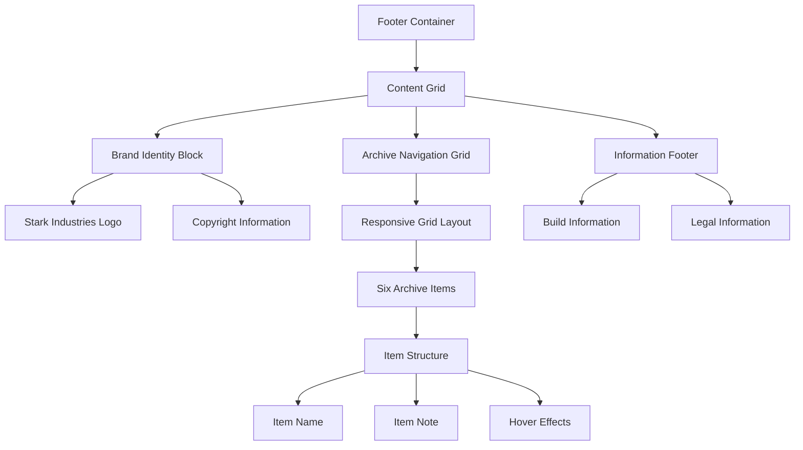
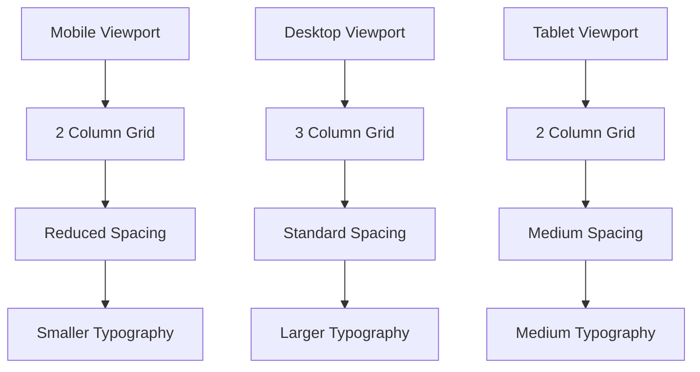

# Footer Component

<cite>
**Referenced Files in This Document**
- [Footer.tsx](file://src/components/sections/Footer.tsx)
- [layout.tsx](file://src/app/layout.tsx)
- [globals.css](file://src/app/globals.css)
- [page.tsx](file://src/app/page.tsx)
- [Navbar.tsx](file://src/components/ui/Navbar.tsx)
- [SystemsNominal.tsx](file://src/components/sections/SystemsNominal.tsx)
- [HudFrame.tsx](file://src/components/ui/HudFrame.tsx)
- [EyebrowBadge.tsx](file://src/components/ui/EyebrowBadge.tsx)
- [package.json](file://package.json)
</cite>

## Table of Contents
1. [Introduction](#introduction)
2. [Project Structure](#project-structure)
3. [Core Components](#core-components)
4. [Architecture Overview](#architecture-overview)
5. [Detailed Component Analysis](#detailed-component-analysis)
6. [Dependency Analysis](#dependency-analysis)
7. [Performance Considerations](#performance-considerations)
8. [Troubleshooting Guide](#troubleshooting-guide)
9. [Conclusion](#conclusion)

## Introduction

The Footer component serves as the final architectural element in the Iron Man website's content delivery system. Positioned at the bottom of the page, it provides essential archive navigation and site information display while maintaining strict adherence to the Iron Man interface design language. This component acts as both a functional navigation hub and a stylistic anchor, connecting users to archived content through a curated selection of Mark series references.

The Footer component integrates seamlessly with the overall site architecture, serving as the primary gateway to the archive system while reinforcing the Stark Industries brand identity through consistent visual and interactive patterns established throughout the interface.

## Project Structure

The Footer component is strategically positioned within the application's component hierarchy, following the established architectural pattern of the Iron Man website:



**Diagram sources**
- [layout.tsx:23-36](file://src/app/layout.tsx#L23-L36)
- [page.tsx:7-19](file://src/app/page.tsx#L7-L19)
- [Footer.tsx:3-62](file://src/components/sections/Footer.tsx#L3-L62)

The Footer component participates in the site's scroll-based navigation system, with links that reference specific sections of the page. This integration ensures seamless user experience across the entire content architecture.

**Section sources**
- [layout.tsx:1-37](file://src/app/layout.tsx#L1-L37)
- [page.tsx:1-20](file://src/app/page.tsx#L1-L20)

## Core Components

The Footer component consists of three primary structural elements that work together to deliver both functionality and aesthetic consistency:

### Primary Content Areas

**Brand Identity Block**
- Contains the Stark Industries logo with animated accent indicator
- Displays official copyright and trademark information
- Maintains consistent typography and spacing standards

**Archive Navigation Grid**
- Organized as a responsive grid layout (2 columns on mobile, 3 columns on desktop)
- Features six distinct Mark series entries with contextual notes
- Implements hover effects with directional arrow indicators
- Provides immediate access to archived content sections

**Site Information Footer**
- Displays build information and system status
- Includes legal disclaimers and fan art attribution
- Maintains consistent visual hierarchy and typography

### Interactive Elements

The component incorporates several interactive patterns that enhance user engagement while maintaining design consistency:

- **Hover States**: Archive links feature subtle color transitions and arrow appearance animations
- **Responsive Behavior**: Grid layout adapts based on viewport size
- **Visual Feedback**: Accent colors and shadows reinforce the Iron Man aesthetic

**Section sources**
- [Footer.tsx:1-63](file://src/components/sections/Footer.tsx#L1-L63)

## Architecture Overview

The Footer component operates within a sophisticated content delivery architecture that emphasizes both functionality and immersive storytelling:



**Diagram sources**
- [Footer.tsx:25-52](file://src/components/sections/Footer.tsx#L25-L52)
- [Navbar.tsx:44-49](file://src/components/ui/Navbar.tsx#L44-L49)
- [SystemsNominal.tsx:40-50](file://src/components/sections/SystemsNominal.tsx#L40-L50)

The Footer component maintains architectural consistency through its integration with the site's scroll-based navigation system, ensuring that archive access feels natural and intuitive within the overall user experience.

**Section sources**
- [Footer.tsx:34-50](file://src/components/sections/Footer.tsx#L34-L50)
- [Navbar.tsx:17-66](file://src/components/ui/Navbar.tsx#L17-L66)

## Detailed Component Analysis

### Structural Composition

The Footer component employs a sophisticated three-column layout structure that balances information density with visual clarity:



**Diagram sources**
- [Footer.tsx:9-59](file://src/components/sections/Footer.tsx#L9-L59)

### Archive Navigation Pattern

The archive navigation system follows a carefully crafted pattern that reflects the Iron Man interface design principles:

**Navigation Structure**
- Six distinct archive entries representing Mark series evolution
- Responsive grid layout with 2 columns on mobile devices
- 3 columns on desktop and larger screens
- Consistent spacing and alignment across all viewport sizes

**Interactive Behaviors**
- Hover effects trigger arrow appearance animations
- Color transitions provide visual feedback
- Smooth scrolling ensures seamless navigation
- Accessible focus states for keyboard navigation

### Styling and Visual Design

The Footer component implements a comprehensive styling system that maintains consistency with the Iron Man interface design language:

**Color Palette Integration**
- Background color derived from theme variables
- Accent color (gold) used for highlights and interactive elements
- Foreground color for primary text elements
- Subtle borders using white transparency effects

**Typography System**
- Monospace font family for technical and archival elements
- Sans-serif font for body text and headings
- Consistent font sizing and spacing throughout
- Responsive typography adjustments for different screen sizes

**Visual Effects**
- Subtle background texture for depth perception
- Border treatments using white transparency
- Shadow effects for dimensional enhancement
- Animated transitions for interactive states

**Section sources**
- [Footer.tsx:5-7](file://src/components/sections/Footer.tsx#L5-L7)
- [globals.css:1-22](file://src/app/globals.css#L1-L22)

### Responsive Behavior Implementation

The Footer component demonstrates sophisticated responsive design patterns that ensure optimal user experience across all device categories:



**Diagram sources**
- [Footer.tsx:10-53](file://src/components/sections/Footer.tsx#L10-L53)

The responsive behavior is achieved through Tailwind CSS utility classes that adapt layout, spacing, and typography based on viewport breakpoints, ensuring consistent visual hierarchy across all device categories.

**Section sources**
- [Footer.tsx:25-52](file://src/components/sections/Footer.tsx#L25-L52)

### Accessibility Compliance

The Footer component incorporates several accessibility features that ensure inclusive user experience:

**Semantic Structure**
- Proper HTML semantic markup with footer element
- Logical heading hierarchy and content organization
- Descriptive alt text for decorative elements
- Clear focus management for interactive elements

**Keyboard Navigation**
- Full keyboard accessibility for all interactive elements
- Visible focus indicators for keyboard users
- Logical tab order throughout the component
- Screen reader friendly content structure

**Visual Accessibility**
- Sufficient color contrast ratios for text elements
- Alternative text for iconographic elements
- Reduced motion preferences support
- High contrast mode compatibility

**Section sources**
- [Footer.tsx:13-17](file://src/components/sections/Footer.tsx#L13-L17)
- [Footer.tsx:34-50](file://src/components/sections/Footer.tsx#L34-L50)

## Dependency Analysis

The Footer component maintains minimal external dependencies while integrating effectively with the broader component ecosystem:

```mermaid
graph LR
Footer[Footer Component] --> PhosphorIcons[@phosphor-icons/react]
Footer --> ArrowUpRight[ArrowUpRight Icon]
Footer --> GlobalCSS[globals.css]
Footer --> ThemeVariables[Theme Variables]
Footer --> LayoutIntegration[Layout Integration]
LayoutIntegration --> RootLayout[Root Layout]
LayoutIntegration --> PageLayout[Page Layout]
Footer --> NavigationSystem[Navigation System]
NavigationSystem --> Navbar[Navbar Component]
NavigationSystem --> SmoothScroll[Smooth Scroll Provider]
Footer --> UIComponents[UI Components]
UIComponents --> EyebrowBadge[Eyebrow Badge]
UIComponents --> HudFrame[Hud Frame]
```

**Diagram sources**
- [Footer.tsx:1](file://src/components/sections/Footer.tsx#L1)
- [layout.tsx:4](file://src/app/layout.tsx#L4)
- [page.tsx:5](file://src/app/page.tsx#L5)

The component's dependency on Phosphor Icons is limited to a single arrow icon, maintaining lightweight bundle size while providing necessary visual enhancement for interactive elements.

**Section sources**
- [Footer.tsx:1](file://src/components/sections/Footer.tsx#L1)
- [package.json:11-19](file://package.json#L11-L19)

## Performance Considerations

The Footer component is designed with performance optimization as a primary consideration:

**Bundle Size Optimization**
- Minimal external dependencies reduce initial load time
- SVG icons embedded directly in component code
- No heavy animation libraries or frameworks
- Lightweight TypeScript implementation

**Rendering Performance**
- Pure functional component with no unnecessary re-renders
- Efficient CSS-in-JS approach through Tailwind utilities
- Optimized layout calculations through CSS Grid
- Minimal JavaScript execution during rendering

**Memory Management**
- No persistent state or subscriptions
- Clean component lifecycle
- Efficient event handling through built-in browser APIs
- Minimal DOM manipulation overhead

**Section sources**
- [Footer.tsx:1-63](file://src/components/sections/Footer.tsx#L1-L63)
- [globals.css:1-83](file://src/app/globals.css#L1-L83)

## Troubleshooting Guide

Common issues and solutions for the Footer component:

### Layout Issues
**Problem**: Archive grid not displaying correctly on mobile devices
**Solution**: Verify responsive breakpoint classes are properly applied and check for conflicting CSS rules

**Problem**: Text overflow in brand identity block
**Solution**: Adjust max-width constraints and consider responsive typography scaling

### Styling Problems
**Problem**: Colors not matching the Iron Man aesthetic
**Solution**: Verify theme variable usage and check for custom CSS overrides

**Problem**: Hover effects not functioning properly
**Solution**: Ensure group hover selectors are correctly configured and check for CSS specificity conflicts

### Accessibility Concerns
**Problem**: Keyboard navigation issues
**Solution**: Verify focus management and ensure all interactive elements are keyboard accessible

**Problem**: Screen reader compatibility problems
**Solution**: Add appropriate ARIA attributes and ensure semantic HTML structure

**Section sources**
- [Footer.tsx:25-52](file://src/components/sections/Footer.tsx#L25-L52)
- [globals.css:14-22](file://src/app/globals.css#L14-L22)

## Conclusion

The Footer component represents a masterful integration of form and function within the Iron Man website's architectural framework. Its design successfully balances the need for archive navigation with the aesthetic demands of the Iron Man interface, creating a cohesive user experience that reinforces brand identity while providing practical functionality.

Through careful attention to responsive design, accessibility compliance, and performance optimization, the Footer component serves as both a functional navigation hub and a stylistic anchor that maintains consistency with the broader site architecture. The component's integration with the scroll-based navigation system and its placement within the overall content hierarchy demonstrate thoughtful architectural planning that enhances rather than disrupts the user experience.

The component's minimalist approach to dependencies and its efficient implementation patterns ensure that it contributes positively to the overall performance characteristics of the application while delivering the archive navigation capabilities essential to the Iron Man website's content delivery strategy.