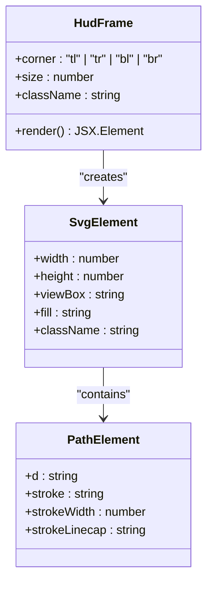
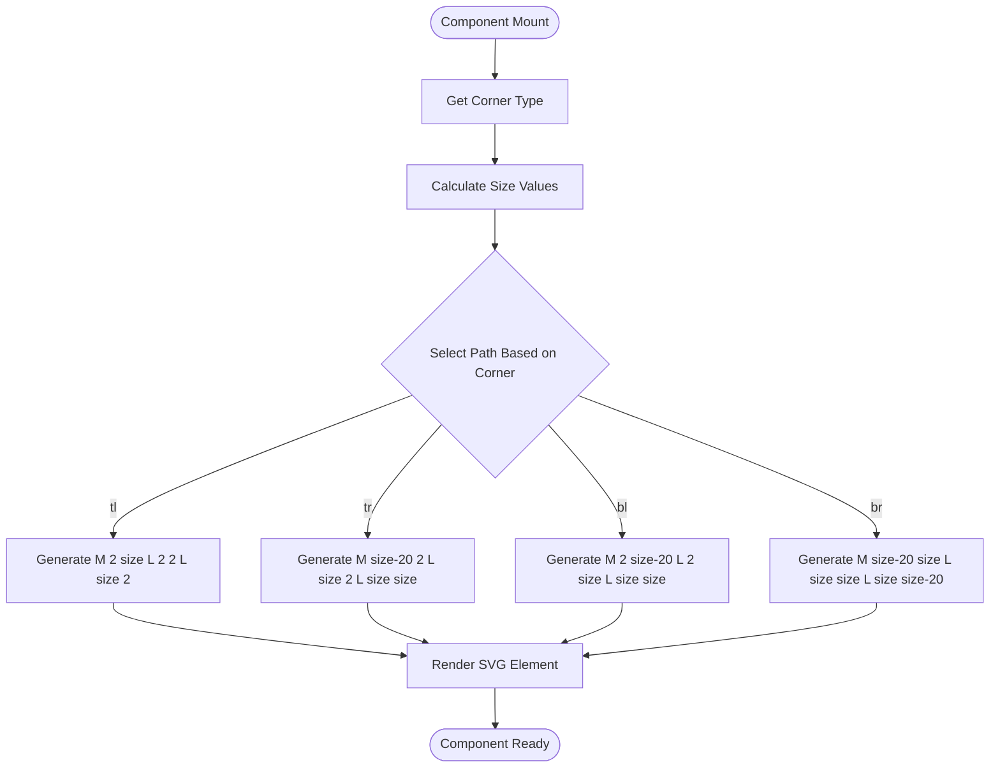

# HUD Frame Component

<cite>
**Referenced Files in This Document**
- [HudFrame.tsx](file://src/components/ui/HudFrame.tsx)
- [CinematicReveal.tsx](file://src/components/sections/CinematicReveal.tsx)
- [Hero.tsx](file://src/components/sections/Hero.tsx)
- [globals.css](file://src/app/globals.css)
</cite>

## Table of Contents
1. [Introduction](#introduction)
2. [Component Overview](#component-overview)
3. [Props Reference](#props-reference)
4. [SVG Path Generation Logic](#svg-path-generation-logic)
5. [Integration Examples](#integration-examples)
6. [Styling and Theming](#styling-and-theming)
7. [Responsive Behavior](#responsive-behavior)
8. [Accessibility Considerations](#accessibility-considerations)
9. [Customization Guidelines](#customization-guidelines)
10. [Performance Considerations](#performance-considerations)
11. [Troubleshooting Guide](#troubleshooting-guide)
12. [Conclusion](#conclusion)

## Introduction

The HudFrame component is a specialized React component designed to render custom SVG HUD corner frames for the Iron Man interface. It creates precise geometric corner elements that enhance the futuristic aesthetic of the application's user interface. The component generates SVG paths programmatically based on corner positioning and size parameters, allowing for flexible integration into various UI contexts while maintaining consistent visual styling.

This component serves as a crucial element in the overall Iron Man interface design, providing distinctive corner accents that complement the high-tech theme and create visual continuity across different sections of the application.

## Component Overview

The HudFrame component is a pure functional React component that renders an SVG element containing a single path. It accepts three primary props: corner positioning, size customization, and className for styling integration. The component uses programmatic SVG path generation to create four distinct corner types (top-left, top-right, bottom-left, bottom-right) with precise geometric coordinates.



**Diagram sources**
- [HudFrame.tsx:7-31](file://src/components/ui/HudFrame.tsx#L7-L31)

**Section sources**
- [HudFrame.tsx:1-32](file://src/components/ui/HudFrame.tsx#L1-L32)

## Props Reference

The HudFrame component accepts three props with the following specifications:

### corner (required)
- **Type**: `"tl" | "tr" | "bl" | "br"`
- **Description**: Specifies which corner type to render
- **Values**: 
  - `"tl"` - Top-left corner
  - `"tr"` - Top-right corner  
  - `"bl"` - Bottom-left corner
  - `"br"` - Bottom-right corner

### size (optional)
- **Type**: `number`
- **Default**: `22`
- **Description**: Controls the overall size of the SVG element in pixels
- **Range**: Flexible (based on SVG viewBox calculations)
- **Impact**: Affects all coordinate calculations and visual proportions

### className (optional)
- **Type**: `string`
- **Default**: `""`
- **Description**: Additional CSS classes to apply to the SVG element
- **Usage**: Enables integration with Tailwind CSS utility classes

**Section sources**
- [HudFrame.tsx:1-5](file://src/components/ui/HudFrame.tsx#L1-L5)

## SVG Path Generation Logic

The component uses a sophisticated coordinate system to generate precise SVG paths for each corner type. The path generation follows a mathematical approach that maintains consistent visual proportions regardless of the size parameter.

### Coordinate System and Calculations

The component employs a 2D coordinate system where:
- Origin (0,0) is at the top-left corner of the SVG viewBox
- Positive X-axis extends to the right
- Positive Y-axis extends downward
- All coordinates are calculated relative to the `size` prop

### Corner-Specific Path Generation

Each corner type uses a unique path definition:

#### Top-Left Corner (`tl`)
- **Path**: `M 2 ${size} L 2 2 L ${size} 2`
- **Coordinates**: Creates a right-angled shape with the right angle at the top-left
- **Visual Effect**: Forms a corner pointing inward toward the center

#### Top-Right Corner (`tr`)  
- **Path**: `M ${size - 20} 2 L ${size} 2 L ${size} ${size}`
- **Coordinates**: Starts near the right edge, moves to top-right, then down
- **Visual Effect**: Creates a corner pointing inward toward the center

#### Bottom-Left Corner (`bl`)
- **Path**: `M 2 ${size - 20} L 2 ${size} L ${size} ${size}`
- **Coordinates**: Starts near the left edge, moves to bottom-left, then right
- **Visual Effect**: Creates a corner pointing inward toward the center

#### Bottom-Right Corner (`br`)
- **Path**: `M ${size - 20} ${size} L ${size} ${size} L ${size} ${size - 20}`
- **Coordinates**: Starts near the bottom-right, moves to bottom-right, then up
- **Visual Effect**: Creates a corner pointing inward toward the center



**Diagram sources**
- [HudFrame.tsx:7-13](file://src/components/ui/HudFrame.tsx#L7-L13)

**Section sources**
- [HudFrame.tsx:7-13](file://src/components/ui/HudFrame.tsx#L7-L13)

## Integration Examples

The HudFrame component is seamlessly integrated throughout the Iron Man interface design. Here are the primary integration patterns demonstrated in the codebase:

### Basic Integration Pattern

The component is typically wrapped in a container div with specific positioning and styling classes:

```typescript
// Example integration pattern from the codebase
<div className="pointer-events-none absolute left-6 top-24 text-accent md:left-10 md:top-28">
  <HudFrame corner="tl" size={26} />
</div>
```

### Responsive Positioning

The component integrates with responsive design patterns using Tailwind CSS breakpoints:

- **Mobile**: Uses smaller spacing (`left-6`, `top-24`, `bottom-14`)
- **Desktop**: Uses larger spacing (`md:left-10`, `md:top-28`, `md:bottom-16`)
- **Large Screens**: Uses extra-large spacing (`lg:bottom-16`)

### Complete Corner Set Integration

The typical implementation places four corners around the viewport:

```typescript
// Top-left corner
<div className="pointer-events-none absolute left-6 top-24 text-accent md:left-10 md:top-28">
  <HudFrame corner="tl" size={26} />
</div>

// Top-right corner  
<div className="pointer-events-none absolute right-6 top-24 text-accent md:right-10 md:top-28">
  <HudFrame corner="tr" size={26} />
</div>

// Bottom-left corner
<div className="pointer-events-none absolute bottom-14 left-6 text-accent md:bottom-16 md:left-10">
  <HudFrame corner="bl" size={26} />
</div>

// Bottom-right corner
<div className="pointer-events-none absolute bottom-14 right-6 text-accent md:bottom-16 md:right-10">
  <HudFrame corner="br" size={26} />
</div>
```

**Section sources**
- [CinematicReveal.tsx:212-223](file://src/components/sections/CinematicReveal.tsx#L212-L223)
- [Hero.tsx:204-215](file://src/components/sections/Hero.tsx#L204-L215)

## Styling and Theming

The component integrates deeply with the application's theming system through several mechanisms:

### CSS Variable Integration

The component relies on CSS variables defined in the global stylesheet:

```css
:root {
  --background: #0a0a0b;
  --foreground: #e4e4e7;
  --muted: #71717a;
  --accent: #d4a22f;
  --accent-soft: rgba(212, 162, 47, 0.14);
  --card-bg: rgba(24, 24, 27, 0.55);
  --card-border: rgba(255, 255, 255, 0.08);
  --hud-line: rgba(255, 255, 255, 0.1);
}
```

### Current Color Integration

The component uses `stroke="currentColor"` which allows it to inherit the current text color from the CSS cascade:

```typescript
// The stroke inherits from the parent element's color
stroke="currentColor"
```

### Tailwind CSS Integration

The component works seamlessly with Tailwind CSS utility classes:

- **Color Classes**: `text-accent` applies the accent color from CSS variables
- **Positioning**: `absolute`, `fixed`, `relative` positioning utilities
- **Spacing**: `left-6`, `top-24`, `bottom-14`, `right-6` spacing utilities
- **Responsive**: `md:` and `lg:` breakpoint prefixes

**Section sources**
- [globals.css:3-12](file://src/app/globals.css#L3-L12)
- [globals.css:14-22](file://src/app/globals.css#L14-L22)
- [HudFrame.tsx:25](file://src/components/ui/HudFrame.tsx#L25)

## Responsive Behavior

The component exhibits sophisticated responsive behavior through its integration with Tailwind CSS breakpoints:

### Mobile-First Design

The component follows mobile-first responsive principles:

- **Base Sizes**: Uses smaller spacing values for mobile devices
- **Breakpoint Transitions**: Gradually increases spacing at larger screen sizes
- **Viewport Adaptation**: Maintains proportional spacing across different viewport sizes

### Breakpoint-Specific Adjustments

```typescript
// Mobile (default)
<div className="absolute left-6 top-24 ...">
  <HudFrame corner="tl" size={26} />
</div>

// Desktop (md: breakpoint)
<div className="absolute left-10 top-28 ...">
  <HudFrame corner="tl" size={26} />
</div>

// Large screens (lg: breakpoint)
<div className="absolute bottom-16 ...">
  <HudFrame corner="bl" size={26} />
</div>
```

### Aspect Ratio Preservation

The component maintains its aspect ratio through:
- Square SVG viewBox (`0 0 ${size} ${size}`)
- Proportional coordinate calculations
- Consistent stroke width scaling

**Section sources**
- [CinematicReveal.tsx:212-223](file://src/components/sections/CinematicReveal.tsx#L212-L223)
- [Hero.tsx:204-215](file://src/components/sections/Hero.tsx#L204-L215)

## Accessibility Considerations

The component incorporates several accessibility best practices:

### Semantic Markup

```typescript
aria-hidden="true"
```

The component sets `aria-hidden="true"` because it serves as decorative visual element rather than functional interface element. This prevents screen readers from announcing the HUD frames during navigation.

### Focus Management

```typescript
pointer-events-none
```

The wrapper containers use `pointer-events-none` to ensure the HUD frames don't interfere with user interactions with underlying interface elements.

### Color Contrast

The component inherits its color from the `text-accent` class, which ensures adequate contrast against the dark background theme established in the CSS variables.

### Screen Reader Compatibility

Since the component is purely decorative, it doesn't expose any interactive elements that would require additional ARIA attributes or keyboard navigation support.

**Section sources**
- [HudFrame.tsx:16](file://src/components/ui/HudFrame.tsx#L16)
- [CinematicReveal.tsx:212-223](file://src/components/sections/CinematicReveal.tsx#L212-L223)

## Customization Guidelines

### Size Customization

The component offers flexible size control through the `size` prop:

- **Small Frames**: `size={16}` for subtle accents
- **Medium Frames**: `size={22}` for standard HUD elements  
- **Large Frames**: `size={32}` for prominent interface elements
- **Extra Large**: `size={48}` for dramatic visual impact

### Corner Positioning Strategy

Choose corner types based on layout requirements:
- **Top Corners**: Use for header areas and navigation elements
- **Bottom Corners**: Use for footer areas and status indicators
- **Symmetrical Placement**: Use pairs (e.g., top-left + bottom-right) for balanced composition

### Styling Integration Patterns

Common styling approaches:

```typescript
// Accent Color Integration
<div className="text-accent">
  <HudFrame corner="tl" size={26} />
</div>

// Custom Color Override
<div className="text-blue-400">
  <HudFrame corner="tr" size={26} />
</div>

// Dark Theme Integration
<div className="bg-gray-900 text-yellow-400">
  <HudFrame corner="bl" size={26} />
</div>
```

### CSS Class Extension

The `className` prop enables advanced styling:

```typescript
// Combine with Tailwind utilities
<HudFrame corner="br" size={26} className="opacity-75 blur-sm" />

// Animation integration
<HudFrame corner="tl" size={26} className="animate-pulse" />

// Theme-specific styling
<HudFrame corner="tr" size={26} className="drop-shadow-[0_0_8px_rgba(212,162,47,0.6)]" />
```

**Section sources**
- [HudFrame.tsx:3](file://src/components/ui/HudFrame.tsx#L3)
- [HudFrame.tsx:4](file://src/components/ui/HudFrame.tsx#L4)

## Performance Considerations

### SVG Rendering Efficiency

The component is optimized for efficient rendering:

- **Minimal DOM Nodes**: Single SVG element with single path child
- **Static Paths**: Pre-calculated path strings prevent runtime computation
- **CSS Variables**: Leverages browser CSS variable caching
- **Pointer Events Disabled**: Prevents unnecessary event handling overhead

### Memory Usage

- **No State**: Pure functional component with no internal state
- **No Effects**: No side effects or subscriptions
- **Reusable Paths**: Path strings are computed once per render

### Browser Optimization

- **Hardware Acceleration**: SVG elements benefit from GPU acceleration
- **Vector Graphics**: Scalable without quality loss or memory overhead
- **CSS Transform**: Uses efficient CSS transforms for positioning

## Troubleshooting Guide

### Common Issues and Solutions

#### Issue: Frame Not Visible
**Symptoms**: Component appears invisible on screen
**Causes**: 
- Incorrect color inheritance from parent element
- Insufficient contrast against background
- Wrong positioning causing off-screen placement

**Solutions**:
- Verify parent element has proper color classes
- Check positioning classes (left/right/top/bottom)
- Confirm size parameter is appropriate for viewport

#### Issue: Incorrect Corner Orientation  
**Symptoms**: Frame appears rotated or mirrored incorrectly
**Causes**:
- Wrong corner prop value
- CSS transform conflicts
- Viewport scaling issues

**Solutions**:
- Verify corner prop matches intended position
- Check for conflicting CSS transforms
- Test on different viewport sizes

#### Issue: Poor Quality on High-DPI Displays
**Symptoms**: Frame appears blurry on high-resolution screens
**Causes**:
- Suboptimal stroke width scaling
- ViewBox coordinate precision issues

**Solutions**:
- Increase stroke width proportionally
- Use higher precision coordinate calculations
- Consider CSS `image-rendering: pixelated` for crisp edges

#### Issue: Performance Problems
**Symptoms**: Slow rendering or animation stutter
**Causes**:
- Excessive component instances
- Complex parent layouts
- CSS animations affecting SVG

**Solutions**:
- Limit concurrent frame instances
- Optimize parent container layout
- Remove heavy CSS filters on frame elements

**Section sources**
- [HudFrame.tsx:25](file://src/components/ui/HudFrame.tsx#L25)

## Conclusion

The HudFrame component represents a sophisticated yet elegant solution for creating custom SVG HUD corner frames in the Iron Man interface. Its design balances flexibility with performance, offering developers precise control over corner positioning, sizing, and styling while maintaining excellent responsiveness and accessibility standards.

The component's integration with the existing theming system ensures consistent visual identity across the application, while its programmatic SVG generation provides the flexibility needed for dynamic UI scenarios. The successful implementation in both the Hero and CinematicReveal sections demonstrates its versatility and effectiveness in real-world applications.

Key strengths of the component include its clean API design, efficient rendering approach, comprehensive responsive behavior, and seamless integration with modern CSS frameworks. These characteristics make it an excellent foundation for extending the Iron Man interface with additional HUD elements and maintaining the distinctive visual language of the application.