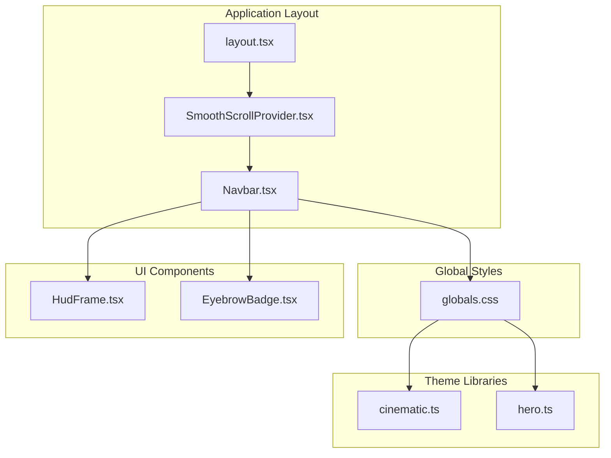
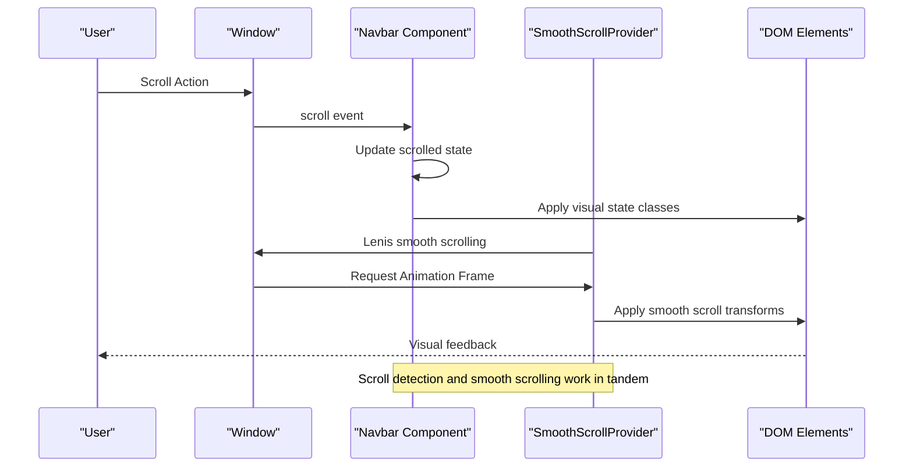
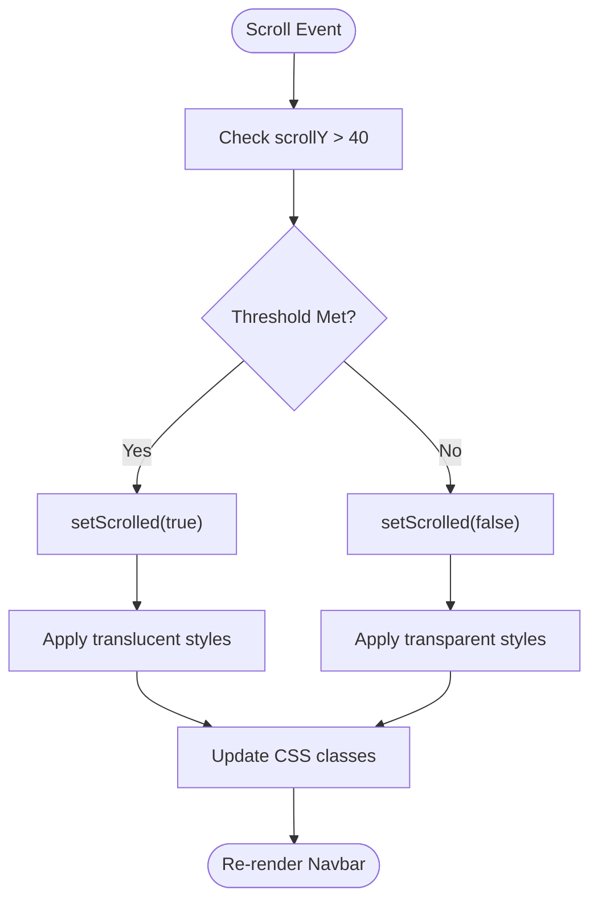
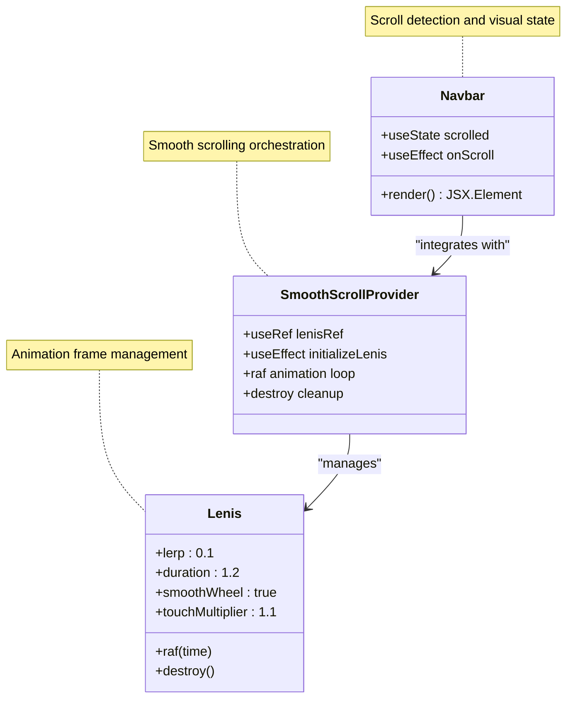
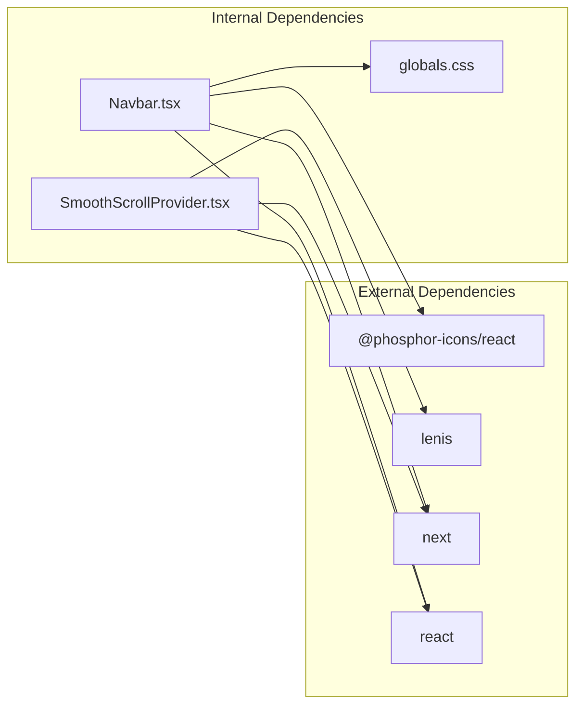

# Navigation Bar Component

<cite>
**Referenced Files in This Document**
- [Navbar.tsx](file://src/components/ui/Navbar.tsx)
- [SmoothScrollProvider.tsx](file://src/components/providers/SmoothScrollProvider.tsx)
- [layout.tsx](file://src/app/layout.tsx)
- [globals.css](file://src/app/globals.css)
- [Hero.tsx](file://src/components/sections/Hero.tsx)
- [HudFrame.tsx](file://src/components/ui/HudFrame.tsx)
- [EyebrowBadge.tsx](file://src/components/ui/EyebrowBadge.tsx)
- [cinematic.ts](file://src/lib/cinematic.ts)
- [hero.ts](file://src/lib/hero.ts)
- [package.json](file://package.json)
</cite>

## Table of Contents
1. [Introduction](#introduction)
2. [Project Structure](#project-structure)
3. [Core Components](#core-components)
4. [Architecture Overview](#architecture-overview)
5. [Detailed Component Analysis](#detailed-component-analysis)
6. [Dependency Analysis](#dependency-analysis)
7. [Performance Considerations](#performance-considerations)
8. [Troubleshooting Guide](#troubleshooting-guide)
9. [Conclusion](#conclusion)
10. [Appendices](#appendices)

## Introduction
The Navbar component serves as the primary navigation interface for the Stark Industries website, implementing scroll-aware styling that transforms the header as users navigate the page. Built with Next.js and React, the component integrates seamlessly with the smooth scrolling system powered by Lenis to deliver a cinematic experience aligned with the Iron Man theme. This documentation covers the component's responsive design implementation, scroll detection mechanisms, visual state changes, integration with smooth scrolling, and maintenance of visual consistency with the Iron Man aesthetic.

## Project Structure
The Navbar component resides within the UI components directory and is integrated into the application layout. The smooth scrolling system is provided by a dedicated provider that wraps the application content. Global styles define the color palette and typography that support the Iron Man visual identity.

**Diagram sources**
- [layout.tsx:23-36](file://src/app/layout.tsx#L23-L36)
- [SmoothScrollProvider.tsx:8-36](file://src/components/providers/SmoothScrollProvider.tsx#L8-L36)
- [Navbar.tsx:7-66](file://src/components/ui/Navbar.tsx#L7-L66)
- [globals.css:1-83](file://src/app/globals.css#L1-L83)

**Section sources**
- [layout.tsx:1-37](file://src/app/layout.tsx#L1-L37)
- [globals.css:1-83](file://src/app/globals.css#L1-L83)

## Core Components
The Navbar component consists of several key elements that work together to provide a cohesive navigation experience:

### Scroll Detection Mechanism
The component implements a scroll-aware state using React hooks to detect when the user has scrolled beyond a threshold of 40 pixels. This triggers visual transformations that enhance the user experience during navigation.

### Responsive Design Implementation
The navbar adapts its layout and spacing across different screen sizes using Tailwind CSS responsive utilities. Mobile-first design principles ensure optimal usability on all devices.

### Visual State Management
The component manages multiple visual states through conditional class application, transitioning between transparent and translucent backgrounds as users scroll.

**Section sources**
- [Navbar.tsx:8-15](file://src/components/ui/Navbar.tsx#L8-L15)
- [Navbar.tsx:25-26](file://src/components/ui/Navbar.tsx#L25-L26)

## Architecture Overview
The Navbar component operates within a larger architectural framework that emphasizes smooth scrolling and cinematic presentation. The integration with the smooth scrolling provider ensures seamless navigation transitions that complement the Iron Man theme.

**Diagram sources**
- [Navbar.tsx:10-15](file://src/components/ui/Navbar.tsx#L10-L15)
- [SmoothScrollProvider.tsx:11-33](file://src/components/providers/SmoothScrollProvider.tsx#L11-L33)

## Detailed Component Analysis

### Scroll-Aware Styling Implementation
The Navbar component implements scroll detection through a sophisticated state management system that responds to user scrolling actions with immediate visual feedback.

**Diagram sources**
- [Navbar.tsx:10-15](file://src/components/ui/Navbar.tsx#L10-L15)
- [Navbar.tsx:19-23](file://src/components/ui/Navbar.tsx#L19-L23)

### Responsive Navigation Patterns
The component employs a mobile-first responsive design that adapts navigation elements across different viewport sizes:

#### Desktop Navigation
- Hidden navigation links become visible on medium screens and above
- Navigation items use monospace typography with precise tracking
- Hover states provide subtle color transitions for enhanced interactivity

#### Mobile Adaptation
- Navigation collapses to a minimal form on smaller screens
- Touch-friendly sizing ensures comfortable interaction
- Priority-based content scaling maintains readability

**Section sources**
- [Navbar.tsx:37-50](file://src/components/ui/Navbar.tsx#L37-L50)
- [Navbar.tsx:25-26](file://src/components/ui/Navbar.tsx#L25-L26)

### Visual State Transitions
The Navbar implements sophisticated visual transformations that enhance the cinematic experience:

#### Background Transformations
- Transparent state: No background or border for unobtrusive presence
- Translucent state: Black background with backdrop blur and saturation effects
- Border transitions: Subtle white border with transparency for depth perception

#### Typography Consistency
- Monospace font family maintains technical aesthetic alignment
- Precise letter spacing and uppercase treatment for futuristic feel
- Color transitions from muted gray to foreground for emphasis

**Section sources**
- [Navbar.tsx:19-23](file://src/components/ui/Navbar.tsx#L19-L23)
- [Navbar.tsx:28-35](file://src/components/ui/Navbar.tsx#L28-L35)

### Integration with Smooth Scrolling System
The Navbar component works in harmony with the Lenis smooth scrolling provider to create seamless navigation experiences:

**Diagram sources**
- [Navbar.tsx:7-15](file://src/components/ui/Navbar.tsx#L7-L15)
- [SmoothScrollProvider.tsx:8-36](file://src/components/providers/SmoothScrollProvider.tsx#L8-L36)

**Section sources**
- [SmoothScrollProvider.tsx:11-33](file://src/components/providers/SmoothScrollProvider.tsx#L11-L33)
- [layout.tsx:31-32](file://src/app/layout.tsx#L31-L32)

### Theme Integration and Visual Consistency
The Navbar maintains strict adherence to the Iron Man visual language through careful attention to color palettes, typography, and design elements:

#### Color Palette Integration
- Accent color (#d4a22f) used for status indicators and highlights
- Background transitions utilize black with transparency for stealth effect
- Foreground colors maintain readability across states

#### Typography Alignment
- Monospace font selection reinforces technical sophistication
- Letter spacing and tracking optimized for futuristic aesthetic
- Size scaling ensures hierarchy and readability across breakpoints

#### Iconography and Visual Elements
- Phosphor Icons provide modern, clean visual language
- Status dots use glow effects matching the arc reactor theme
- Interactive elements include hover animations for tactile feedback

**Section sources**
- [globals.css:3-12](file://src/app/globals.css#L3-L12)
- [Navbar.tsx:30-33](file://src/components/ui/Navbar.tsx#L30-L33)
- [Navbar.tsx:57-62](file://src/components/ui/Navbar.tsx#L57-L62)

## Dependency Analysis
The Navbar component relies on several external libraries and internal dependencies to achieve its functionality and visual design:

**Diagram sources**
- [package.json:11-19](file://package.json#L11-L19)
- [Navbar.tsx:3-5](file://src/components/ui/Navbar.tsx#L3-L5)
- [SmoothScrollProvider.tsx:4](file://src/components/providers/SmoothScrollProvider.tsx#L4)

### External Library Integration
The component integrates with several key libraries:

- **Phosphor Icons**: Provides the upward-right arrow icon for interactive elements
- **Lenis**: Enables smooth scrolling animations throughout the application
- **Next.js**: Framework providing routing and SSR capabilities
- **React**: Core library for component rendering and state management

### Internal Component Relationships
The Navbar interacts with several internal components that contribute to the overall visual experience:

- **HudFrame**: Provides decorative corner elements that align with the HUD aesthetic
- **EyebrowBadge**: Demonstrates consistent badge styling patterns
- **SmoothScrollProvider**: Ensures navigation transitions integrate with page scrolling

**Section sources**
- [package.json:11-19](file://package.json#L11-L19)
- [HudFrame.tsx:7-31](file://src/components/ui/HudFrame.tsx#L7-L31)
- [EyebrowBadge.tsx:3-16](file://src/components/ui/EyebrowBadge.tsx#L3-L16)

## Performance Considerations
The Navbar component is designed with performance optimization in mind, utilizing efficient scroll handling and minimal re-renders:

### Scroll Event Optimization
- Uses passive event listeners to prevent unnecessary blocking
- Implements debounced state updates through requestAnimationFrame
- Minimizes DOM manipulation by focusing on class name toggling

### Memory Management
- Proper cleanup of event listeners prevents memory leaks
- Reference-based cleanup ensures smooth component unmounting
- Efficient state updates reduce render overhead

### Rendering Efficiency
- Conditional class application avoids expensive style recalculations
- Fixed positioning reduces layout thrashing during scroll
- Minimal DOM tree structure reduces paint operations

**Section sources**
- [Navbar.tsx:13-15](file://src/components/ui/Navbar.tsx#L13-L15)
- [SmoothScrollProvider.tsx:28-33](file://src/components/providers/SmoothScrollProvider.tsx#L28-L33)

## Troubleshooting Guide
Common issues and solutions for the Navbar component:

### Scroll Detection Not Working
- Verify scroll threshold value (currently 40px) meets design requirements
- Check for conflicting CSS that might interfere with fixed positioning
- Ensure event listener cleanup occurs properly on component unmount

### Visual State Issues
- Confirm CSS class names match Tailwind configuration
- Verify color variables are properly defined in global styles
- Check for z-index conflicts with other fixed-position elements

### Responsive Behavior Problems
- Test breakpoint values against design specifications
- Validate media query ordering in CSS
- Ensure mobile-first approach accommodates all viewport sizes

### Smooth Scrolling Integration
- Verify Lenis initialization occurs before scroll events
- Check animation frame cleanup on component unmount
- Ensure provider wraps the application layout correctly

**Section sources**
- [Navbar.tsx:10-15](file://src/components/ui/Navbar.tsx#L10-L15)
- [SmoothScrollProvider.tsx:11-33](file://src/components/providers/SmoothScrollProvider.tsx#L11-L33)

## Conclusion
The Navbar component successfully implements a scroll-aware navigation system that enhances the user experience while maintaining strict adherence to the Iron Man visual design language. Through careful integration with the smooth scrolling provider, responsive design patterns, and theme-consistent styling, the component delivers a seamless navigation experience that complements the cinematic presentation of the Stark Industries website.

The component's architecture demonstrates best practices in React development, including efficient scroll handling, proper memory management, and performance optimization. Its modular design allows for easy customization while preserving the core visual identity and functionality.

## Appendices

### Customization Guidelines
When customizing the Navbar component, follow these guidelines to maintain visual consistency:

#### Adding New Navigation Items
- Use the existing monospace typography system
- Maintain consistent letter spacing and uppercase treatment
- Follow the established hover state patterns
- Ensure proper spacing and alignment with existing items

#### Modifying Visual States
- Preserve the 40px scroll threshold or adjust thoughtfully
- Maintain the backdrop blur and saturation effects
- Keep color transitions subtle and purposeful
- Ensure accessibility compliance with contrast ratios

#### Responsive Adjustments
- Test all breakpoints thoroughly
- Maintain visual hierarchy across screen sizes
- Ensure touch targets remain appropriately sized
- Validate typography scaling and readability

### Accessibility Features
The Navbar incorporates several accessibility considerations:

- Semantic HTML structure with proper heading hierarchy
- Sufficient color contrast for text and interactive elements
- Focus management for keyboard navigation
- Screen reader friendly labels and descriptions
- Reduced motion preferences support through CSS

### Integration Examples
The Navbar integrates with various parts of the application:

- **Hero Section**: Coordinates with scroll-based animations
- **Footer Navigation**: Maintains consistent visual language
- **Content Sections**: Provides stable navigation anchor points
- **Interactive Elements**: Supports hover and focus states