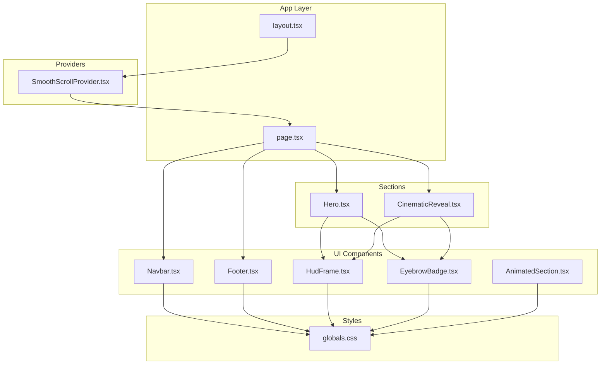
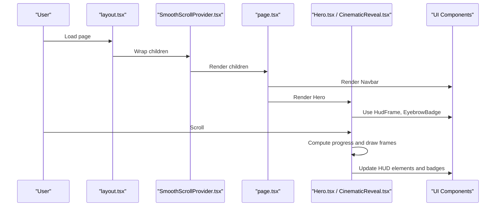
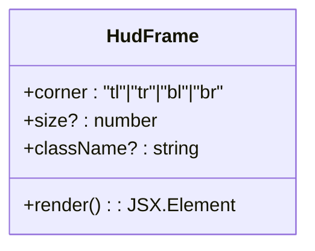
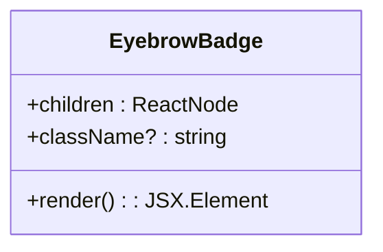
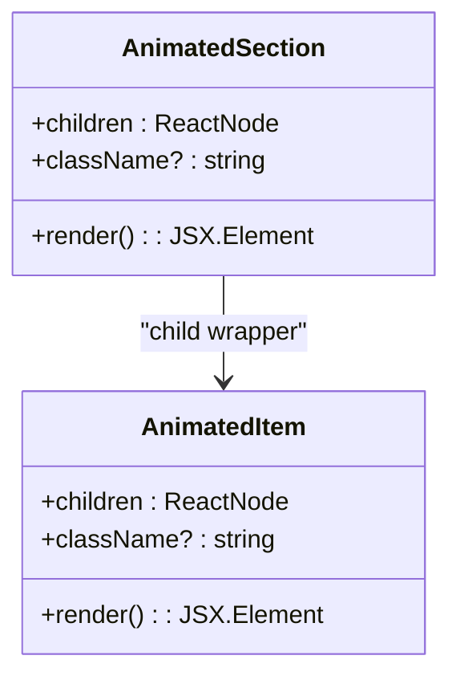
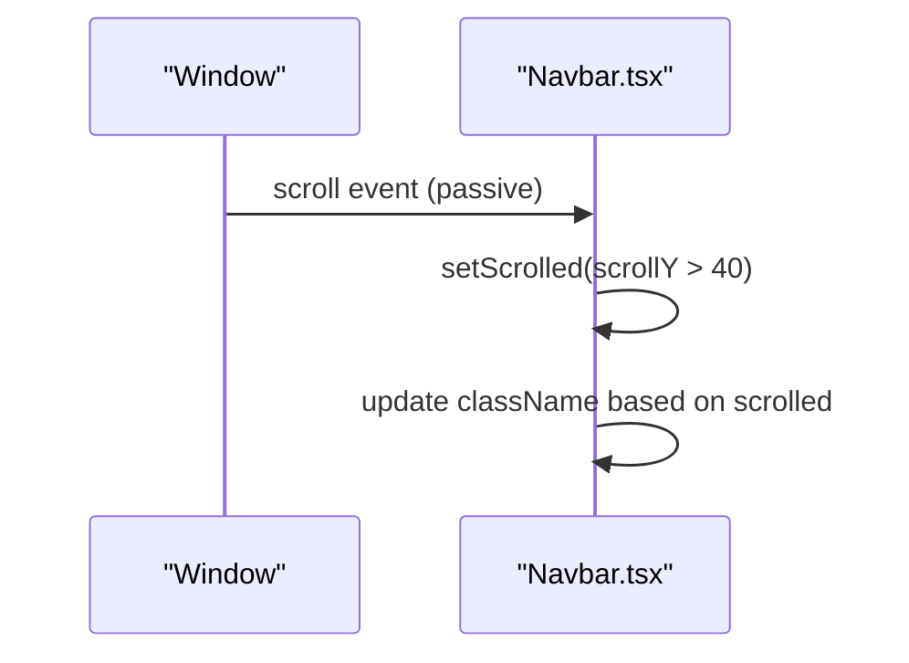
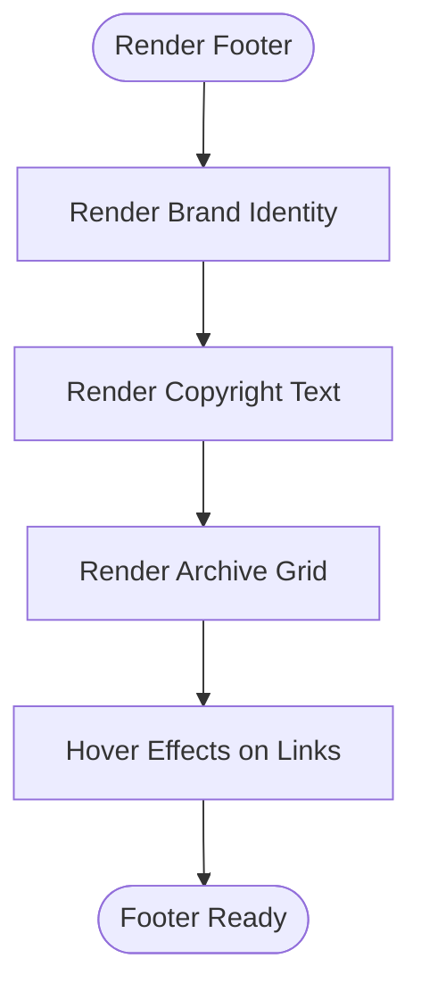
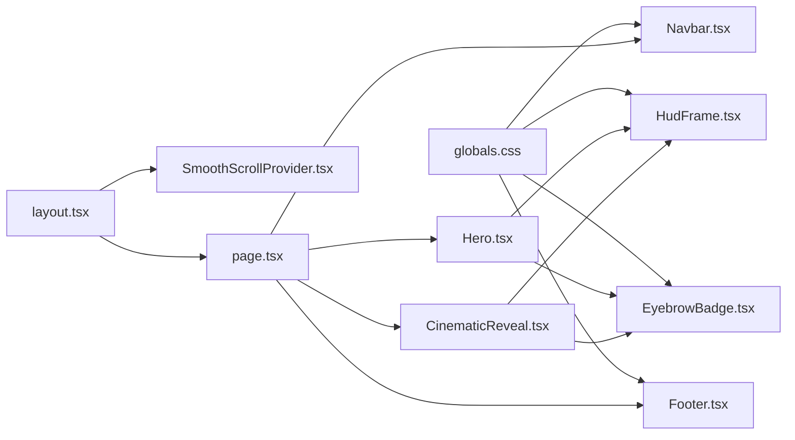

# UI Components

<cite>
**Referenced Files in This Document**
- [HudFrame.tsx](file://src/components/ui/HudFrame.tsx)
- [EyebrowBadge.tsx](file://src/components/ui/EyebrowBadge.tsx)
- [AnimatedSection.tsx](file://src/components/ui/AnimatedSection.tsx)
- [Navbar.tsx](file://src/components/ui/Navbar.tsx)
- [Footer.tsx](file://src/components/sections/Footer.tsx)
- [Hero.tsx](file://src/components/sections/Hero.tsx)
- [CinematicReveal.tsx](file://src/components/sections/CinematicReveal.tsx)
- [globals.css](file://src/app/globals.css)
- [layout.tsx](file://src/app/layout.tsx)
- [page.tsx](file://src/app/page.tsx)
- [SmoothScrollProvider.tsx](file://src/components/providers/SmoothScrollProvider.tsx)
- [hero.ts](file://src/lib/hero.ts)
- [cinematic.ts](file://src/lib/cinematic.ts)
- [package.json](file://package.json)
</cite>

## Table of Contents
1. [Introduction](#introduction)
2. [Project Structure](#project-structure)
3. [Core Components](#core-components)
4. [Architecture Overview](#architecture-overview)
5. [Detailed Component Analysis](#detailed-component-analysis)
6. [Dependency Analysis](#dependency-analysis)
7. [Performance Considerations](#performance-considerations)
8. [Accessibility Compliance](#accessibility-compliance)
9. [Cross-Browser Compatibility](#cross-browser-compatibility)
10. [Troubleshooting Guide](#troubleshooting-guide)
11. [Extending Components](#extending-components)
12. [Conclusion](#conclusion)

## Introduction
This document describes the UI component library used in the Iron Man project. It focuses on five reusable components: HudFrame for custom SVG HUD corners, EyebrowBadge for status indicators, AnimatedSection for scroll-triggered Framer Motion effects, Navbar for navigation with scroll awareness, and Footer for archive navigation. For each component, we explain visual appearance, behavior, user interaction patterns, props/attributes, customization options, integration patterns, and best practices for composition, state management, and responsive design. We also address accessibility, cross-browser compatibility, performance optimization, and guidelines for extending components while maintaining the project's design language.

## Project Structure
The UI components live under src/components/ui and are integrated into pages and sections. The design system is driven by Tailwind CSS and CSS variables defined in globals.css, with a custom SmoothScrollProvider offering smooth scrolling via Lenis.

**Diagram sources**
- [layout.tsx:1-37](file://src/app/layout.tsx#L1-L37)
- [page.tsx:1-20](file://src/app/page.tsx#L1-L20)
- [SmoothScrollProvider.tsx:1-37](file://src/components/providers/SmoothScrollProvider.tsx#L1-L37)
- [Hero.tsx:1-366](file://src/components/sections/Hero.tsx#L1-L366)
- [CinematicReveal.tsx:1-384](file://src/components/sections/CinematicReveal.tsx#L1-L384)
- [globals.css:1-83](file://src/app/globals.css#L1-L83)

**Section sources**
- [layout.tsx:1-37](file://src/app/layout.tsx#L1-L37)
- [page.tsx:1-20](file://src/app/page.tsx#L1-L20)
- [globals.css:1-83](file://src/app/globals.css#L1-L83)

## Core Components
This section documents each component's purpose, props, behavior, and integration patterns.

### HudFrame
- Purpose: Renders a stylized SVG corner element for HUD framing.
- Props:
  - corner: "tl" | "tr" | "bl" | "br" — selects which corner to render.
  - size?: number — controls the square SVG canvas size (default 22).
  - className?: string — additional CSS classes.
- Behavior:
  - Uses a record mapping corner to a path string to draw a minimal corner shape.
  - CurrentColor is used for stroke, inheriting text/accent color.
  - aria-hidden=true to avoid screen reader duplication.
- Visual appearance:
  - Thin, squared-off stroke forming a sharp corner.
  - Responsive sizing via size prop; color inherits from parent.
- Accessibility:
  - Hidden from assistive tech; intended for decorative framing.
- Integration:
  - Used in Hero and CinematicReveal sections to place HUD corners around the viewport.
- Customization:
  - Adjust size for different contexts.
  - Apply className to align with layout and theme.

**Section sources**
- [HudFrame.tsx:1-32](file://src/components/ui/HudFrame.tsx#L1-L32)
- [Hero.tsx:204-215](file://src/components/sections/Hero.tsx#L204-L215)
- [CinematicReveal.tsx:212-223](file://src/components/sections/CinematicReveal.tsx#L212-L223)

### EyebrowBadge
- Purpose: Displays small status or metadata badges with a subtle glow effect.
- Props:
  - children: ReactNode — badge content.
  - className?: string — additional CSS classes.
- Behavior:
  - Renders a rounded badge with a small pulsing dot and subtle backdrop blur.
  - Uses CSS variables for background, border, and accent colors.
- Visual appearance:
  - Monospace typography, uppercase letter spacing, small dot indicator.
  - Subtle inset and outer shadows for depth.
- Accessibility:
  - Screen-reader friendly; dot is aria-hidden to prevent redundant announcements.
- Integration:
  - Used in Hero and CinematicReveal sections for telemetry and status labels.
- Customization:
  - Extend className to adjust padding, colors, or typography.

**Section sources**
- [EyebrowBadge.tsx:1-17](file://src/components/ui/EyebrowBadge.tsx#L1-L17)
- [Hero.tsx:222](file://src/components/sections/Hero.tsx#L222)
- [Hero.tsx:350](file://src/components/sections/Hero.tsx#L350)
- [CinematicReveal.tsx:226](file://src/components/sections/CinematicReveal.tsx#L226)

### AnimatedSection
- Purpose: Provides scroll-triggered entrance animations using Framer Motion.
- Props:
  - children: ReactNode — animated content.
  - className?: string — additional CSS classes.
- Behavior:
  - AnimatedSection wraps children and triggers animations when they come into view.
  - Uses viewport options to trigger once and with a negative margin to start earlier.
  - AnimatedItem is a convenience child wrapper with spring-based animation.
- Visual appearance:
  - Staggered fade-in and upward movement for child items.
- Accessibility:
  - Animations are disabled when prefers-reduced-motion is enabled by default in Framer Motion.
- Integration:
  - Used in sections to animate content as the user scrolls.
- Customization:
  - Pass className to apply layout or spacing.
  - Use AnimatedItem for individual child elements requiring consistent animation.

**Section sources**
- [AnimatedSection.tsx:1-43](file://src/components/ui/AnimatedSection.tsx#L1-L43)

### Navbar
- Purpose: Navigation header with scroll-aware background and interactive elements.
- Props: None (no props).
- Behavior:
  - Tracks scroll position and toggles a scrolled class when scrollY > 40.
  - Uses passive listeners for performance.
  - Provides links to internal sections and an engagement call-to-action.
- Visual appearance:
  - Fixed position at the top with backdrop blur and border transitions.
  - Monospace typography, accent glow on branding and interactive elements.
- Accessibility:
  - Links use proper semantics; interactive elements have hover/focus affordances.
- Integration:
  - Rendered at the top of the page in layout.
- Customization:
  - Modify className and text content to adapt to different projects.

**Section sources**
- [Navbar.tsx:1-67](file://src/components/ui/Navbar.tsx#L1-L67)
- [layout.tsx:23-36](file://src/app/layout.tsx#L23-L36)

### Footer
- Purpose: Archive navigation and legal information footer.
- Props: None (no props).
- Behavior:
  - Displays brand identity, copyright, and a grid of archive links.
  - Uses hover effects with icon transitions and subtle opacity changes.
- Visual appearance:
  - Grid layout with monospace and sans-serif typography.
  - Accent color for highlights and subtle borders.
- Accessibility:
  - Links are keyboard focusable; hover states complement focus states.
- Integration:
  - Rendered at the bottom of the page in layout.
- Customization:
  - Extend the navigation array to add or modify archive entries.

**Section sources**
- [Footer.tsx:1-63](file://src/components/sections/Footer.tsx#L1-L63)
- [page.tsx:1-20](file://src/app/page.tsx#L1-L20)

## Architecture Overview
The UI components are composed within sections that manage scroll-driven animations and canvas rendering. The design system relies on CSS variables and Tailwind utilities for consistent theming and responsive behavior. Smooth scrolling is provided by a dedicated provider.

**Diagram sources**
- [layout.tsx:1-37](file://src/app/layout.tsx#L1-L37)
- [SmoothScrollProvider.tsx:1-37](file://src/components/providers/SmoothScrollProvider.tsx#L1-L37)
- [page.tsx:1-20](file://src/app/page.tsx#L1-L20)
- [Hero.tsx:1-366](file://src/components/sections/Hero.tsx#L1-L366)
- [CinematicReveal.tsx:1-384](file://src/components/sections/CinematicReveal.tsx#L1-L384)

## Detailed Component Analysis

### HudFrame Analysis
HudFrame renders a minimal SVG corner using a path string mapped by corner selection. It accepts size and className props and applies currentColor for stroke.

**Diagram sources**
- [HudFrame.tsx:1-32](file://src/components/ui/HudFrame.tsx#L1-L32)

**Section sources**
- [HudFrame.tsx:1-32](file://src/components/ui/HudFrame.tsx#L1-L32)

### EyebrowBadge Analysis
EyebrowBadge composes a small badge with a pulsing dot and backdrop blur. It uses CSS variables for colors and typography.

**Diagram sources**
- [EyebrowBadge.tsx:1-17](file://src/components/ui/EyebrowBadge.tsx#L1-L17)

**Section sources**
- [EyebrowBadge.tsx:1-17](file://src/components/ui/EyebrowBadge.tsx#L1-L17)

### AnimatedSection Analysis
AnimatedSection uses Framer Motion to animate containers and items on viewport entry. It exports two components: AnimatedSection for containers and AnimatedItem for children.

**Diagram sources**
- [AnimatedSection.tsx:1-43](file://src/components/ui/AnimatedSection.tsx#L1-L43)

**Section sources**
- [AnimatedSection.tsx:1-43](file://src/components/ui/AnimatedSection.tsx#L1-L43)

### Navbar Analysis
Navbar manages scroll state and updates its appearance accordingly. It includes branding, navigation links, and a call-to-action button.

**Diagram sources**
- [Navbar.tsx:10-15](file://src/components/ui/Navbar.tsx#L10-L15)

**Section sources**
- [Navbar.tsx:1-67](file://src/components/ui/Navbar.tsx#L1-L67)

### Footer Analysis
Footer renders a structured footer with brand identity, copyright, and archive navigation grid. It uses hover transitions for interactive elements.

**Diagram sources**
- [Footer.tsx:3-62](file://src/components/sections/Footer.tsx#L3-L62)

**Section sources**
- [Footer.tsx:1-63](file://src/components/sections/Footer.tsx#L1-L63)

## Dependency Analysis
The UI components depend on shared design tokens and utilities. Hero and CinematicReveal import UI components and use them for HUD framing and status badges. The design system is centralized in globals.css with CSS variables and Tailwind utilities.

**Diagram sources**
- [globals.css:1-83](file://src/app/globals.css#L1-L83)
- [Hero.tsx:1-366](file://src/components/sections/Hero.tsx#L1-L366)
- [CinematicReveal.tsx:1-384](file://src/components/sections/CinematicReveal.tsx#L1-L384)
- [layout.tsx:1-37](file://src/app/layout.tsx#L1-L37)
- [SmoothScrollProvider.tsx:1-37](file://src/components/providers/SmoothScrollProvider.tsx#L1-L37)
- [page.tsx:1-20](file://src/app/page.tsx#L1-L20)

**Section sources**
- [globals.css:1-83](file://src/app/globals.css#L1-L83)
- [Hero.tsx:1-366](file://src/components/sections/Hero.tsx#L1-L366)
- [CinematicReveal.tsx:1-384](file://src/components/sections/CinematicReveal.tsx#L1-L384)
- [layout.tsx:1-37](file://src/app/layout.tsx#L1-L37)
- [SmoothScrollProvider.tsx:1-37](file://src/components/providers/SmoothScrollProvider.tsx#L1-L37)
- [page.tsx:1-20](file://src/app/page.tsx#L1-L20)

## Performance Considerations
- Passive scroll listeners: Navbar uses passive: true to avoid layout thrashing.
- requestAnimationFrame: Hero and CinematicReveal throttle scroll handlers to reduce reflows.
- will-change and transform: Hero sections apply will-change and translateZ(0) to leverage GPU acceleration.
- Canvas rendering: Both Hero and CinematicReveal use canvas for efficient frame rendering and scaling.
- Lazy loading images: Both sections pre-load frames and track progress to improve perceived performance.
- CSS variables: Centralized theming reduces style recalculation and improves responsiveness.
- Framer Motion viewport triggers: AnimatedSection uses viewport options to minimize unnecessary animations.

[No sources needed since this section provides general guidance]

## Accessibility Compliance
- Semantic markup: Links and buttons use native elements with proper roles.
- Focus management: Interactive elements support keyboard navigation.
- Reduced motion: Framer Motion respects reduced motion preferences by default.
- Screen reader hints: Decorative elements use aria-hidden; essential text remains accessible.
- Color contrast: CSS variables define foreground/background/accent colors to maintain contrast ratios.
- Iconography: Icons are accompanied by text or aria-hidden to avoid redundancy.

[No sources needed since this section provides general guidance]

## Cross-Browser Compatibility
- CSS variables: Supported across modern browsers; fallbacks are implicit via Tailwind.
- Tailwind v4: Utility-first approach ensures consistent rendering across browsers.
- Framer Motion: Tested on major browsers; viewport options are widely supported.
- Canvas APIs: Used for frame rendering; fallbacks are handled by checking completeness.
- Passive listeners: Available in modern browsers; scroll performance is optimized.

[No sources needed since this section provides general guidance]

## Troubleshooting Guide
- HUD corners not visible:
  - Verify size prop and accent color context.
  - Ensure className does not override stroke or visibility.
- EyebrowBadge not styled:
  - Confirm CSS variables are defined and Tailwind is processing utilities.
  - Check className overrides that may remove backdrop blur or shadows.
- Navbar background not updating:
  - Ensure scroll listener is attached and passive option is respected.
  - Verify className concatenation logic for scrolled state.
- AnimatedSection not animating:
  - Confirm viewport options and that elements enter the viewport.
  - Check that Framer Motion is installed and imported correctly.
- Footer links not interactive:
  - Verify anchor hrefs and hover state classes.
  - Ensure grid layout classes are applied for responsive behavior.

**Section sources**
- [HudFrame.tsx:1-32](file://src/components/ui/HudFrame.tsx#L1-L32)
- [EyebrowBadge.tsx:1-17](file://src/components/ui/EyebrowBadge.tsx#L1-L17)
- [Navbar.tsx:10-15](file://src/components/ui/Navbar.tsx#L10-L15)
- [AnimatedSection.tsx:22-34](file://src/components/ui/AnimatedSection.tsx#L22-L34)
- [Footer.tsx:25-52](file://src/components/sections/Footer.tsx#L25-L52)

## Extending Components
Guidelines for adding new UI elements that follow the project's design language:
- Theming:
  - Define new CSS variables in globals.css if needed.
  - Use existing variables for colors, fonts, and spacing.
- Typography:
  - Prefer Geist Sans/Mono variables for consistent font stack.
- Spacing and layout:
  - Use Tailwind utilities for responsive breakpoints and gaps.
- Interactions:
  - Leverage Framer Motion for micro-interactions and scroll-triggered animations.
  - Use passive listeners for scroll events to maintain performance.
- Composition:
  - Compose existing components (HudFrame, EyebrowBadge) for consistency.
  - Keep props minimal and focused on behavior or presentation.
- Accessibility:
  - Include aria attributes where appropriate.
  - Ensure keyboard navigability and focus outlines.
- Performance:
  - Avoid layout thrashing; use requestAnimationFrame for scroll handlers.
  - Use will-change and transform for GPU acceleration where beneficial.
- Integration:
  - Place new components under src/components/ui or sections as appropriate.
  - Export default components and keep imports explicit.

[No sources needed since this section provides general guidance]

## Conclusion
The Iron Man UI component library emphasizes a cohesive design language built on CSS variables, Tailwind utilities, and scroll-driven interactions. HudFrame and EyebrowBadge provide consistent visual accents, AnimatedSection delivers engaging entrance animations, Navbar offers a responsive and accessible navigation surface, and Footer organizes archive navigation effectively. By following the established patterns—theming via CSS variables, performance-conscious scroll handling, and compositional reuse—you can extend the library while maintaining visual and behavioral consistency.